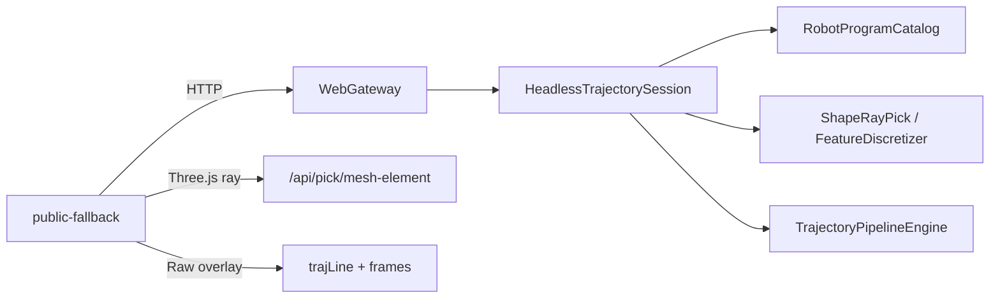

# DESIGN — 网页端轨迹对等

## 架构

## 分层
| 层 | 职责 |
|----|------|
| Host | `HeadlessTrajectorySession`：绑定、门闩、拾取、离散、管线、模板、草稿 undo |
| Gateway | GUI 线程转发；路由见 API_网页端.md P6 |
| Frontend | 轨迹生成/编辑页签；射线拾取；Raw 预览与指令轴互斥 |

## 关键数据流
1. 创建/绑定 PathPlan → begin-edit
2. 射线命中 → 特征表 → discretize → pathPlanRaws + RawReady
3. 配方/算子 → preview → apply → LINE 组 + Applied
