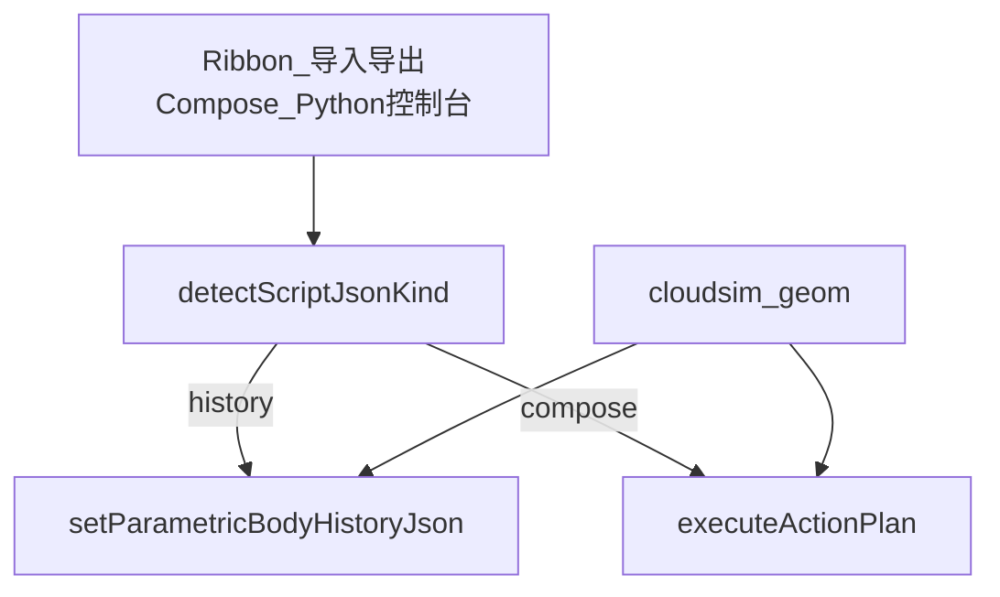

# DESIGN — 脚本建模

## 格式判别

| 条件 | 种类 |
|------|------|
| `domain == "feature.compose"` | compose |
| 有 `features` 数组，或有 `parametricHistory` | history（后者先 unwrap） |
| 其它 | 报错 |

## 模块

| 模块 | 职责 |
|------|------|
| `ScriptModelIo` | 读文件、判别、unwrap |
| Plugin handlers | 文件对话框 + Host 调用 + Undo |
| `CloudSimGeomPython` | 初始化解释器、注册模块、控制台 |

## 异常

- JSON 解析失败 / rebuild 失败：`hostLogError`，不静默
- Python 未就绪：控制台提示 SDK `python311` 路径
