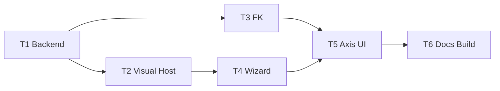

# TASK — 自定义设备

## 依赖图

| ID | 输入 | 输出 | 验收 |
|----|------|------|------|
| T1 | BackendTypeIds 模式 | CustomDeviceBackendData + builtins | 工厂可 create |
| T2 | T1 | Visual + ProjectIo + registerAdopted | 场景可见轴、工程可加载 |
| T3 | T1 | CustomDeviceKinematics | q 驱动 worldMatrix |
| T4 | T2 | DevicePage + 向导 | 可创建并挂子件、设运动 |
| T5 | T3/T4 | 轴控目标切换 | 滑条预览；切回机器人正常 |
| T6 | 全部 | DEVELOPER_GUIDE + 双配置编译 | Debug+Release 通过 |
