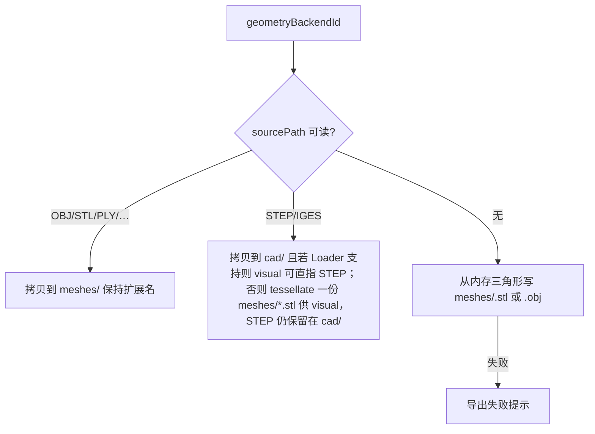
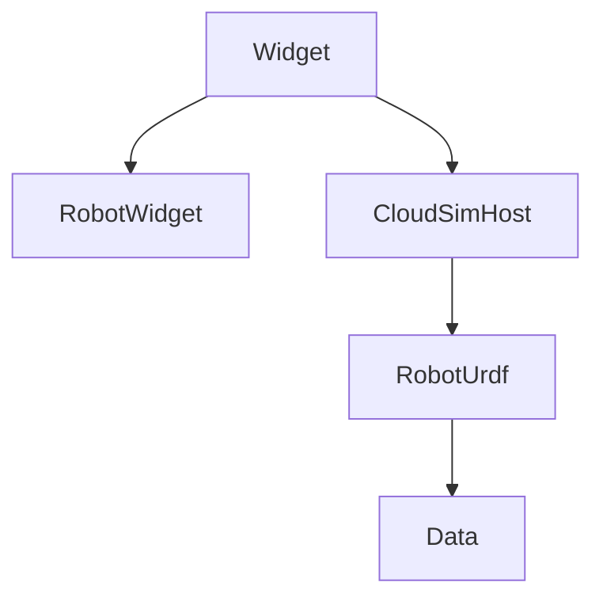

# DESIGN — 自定义设备导出 URDF

## 整体架构

```mermaid
flowchart LR
  UI[DevicePage / AssemblyDialog] --> HostAPI[Host exportCustomDeviceUrdfPackage]
  HostAPI --> Exp[CustomDeviceUrdfExporter]
  Exp --> Dev[CustomDeviceBackendData]
  Exp --> BM[BackendDataManager]
  Exp --> FS[package.xml + urdf/ + meshes|cad/]
  FS -->|用户导入| Imp[importUrdfRobot / UrdfRobotLoader]
```

## 分层

| 层 | 职责 |
|----|------|
| UI | 选设备/当前组装设备、选输出目录、进度/错误提示 |
| Host | 文档上下文、路径、调用 Exporter、可选打开文件夹 |
| RobotUrdf Exporter | 图校验、单位换算、写 XML、落盘几何、写 package.xml |
| Data | 只读 links/joints/geometryBackendId；不改设备 JSON 模式 |

## 包目录约定

```text
<pkgName>/
  package.xml
  urdf/<pkgName>.urdf
  meshes/   # 网格：优先源 OBJ；否则写出的 stl/obj
  cad/      # 源 STEP/IGES 拷贝（若 URDF visual 引用网格，STEP 作额外资产；visual 优先可加载格式）
```

**回灌约束：** 现有 Loader 经 `MeshBackendData::loadFromFile` 吃 STEP/OBJ/STL 等；`<mesh filename="package://pkg/…">` 须解析到导出包内相对路径（导入时以 urdf 文件目录 / package 根为基准，与现网 `resolveMeshFilename` 一致）。

## 映射契约

### Link

| 设备 | URDF |
|------|------|
| `id`（清洗） | `<link name>` |
| `geometryBackendId` | `<visual><geometry><mesh>`（及可选 `<collision>` 同 mesh） |
| `fixed==true` 根 | 作为树根；可对 `world`/`base_footprint` 加 `fixed` 关节（若导入需要显式根） |

### Joint

| 设备 | URDF |
|------|------|
| revolute / prismatic | `type` 同名 |
| `parentToChildRest` | `<origin xyz rpy>`（**文件米** = 矩阵平移 mm/1000；rpy 自旋转） |
| `motion.axis` | `<axis xyz>`（单位向量，不缩放） |
| lower/upper/home | `<limit lower upper effort velocity>`；prismatic 限位 **米**；revolute **rad**（若内部现为度，导出时换算 — 实现前核对 `CustomDeviceAxisConfig` 实际单位） |
| 无运动的父子（仅结构） | `fixed` |

### 单位（方案 B）

- 内部 / 网格顶点：**mm**
- `.urdf` origin xyz、prismatic limit：**m**（÷1000）
- 与 `UrdfRobotLoader` 中 `kUrdfOriginXyzMetersToInternalMm` 对拍

## 几何落盘策略



「保留 OBJ / 源 STEP」= 源文件进入包内；**visual 引用**优先选导入器已支持且能回灌的路径（STEP 可直引则直引；否则 visual→网格 + cad 保留源）。

## 异常

| 情况 | 行为 |
|------|------|
| 无 joints/links | 拒绝 |
| 多根 / 环 | 拒绝（与组装约束一致） |
| 子件无几何 | 该 link 可空 visual 或整包失败（建议整包失败，免回灌缺件） |
| 包名非法 | 清洗；空则 `custom_device` |

## 模块依赖



Exporter 放在 `RobotUrdf`，避免 Widget 直接拼 XML。
