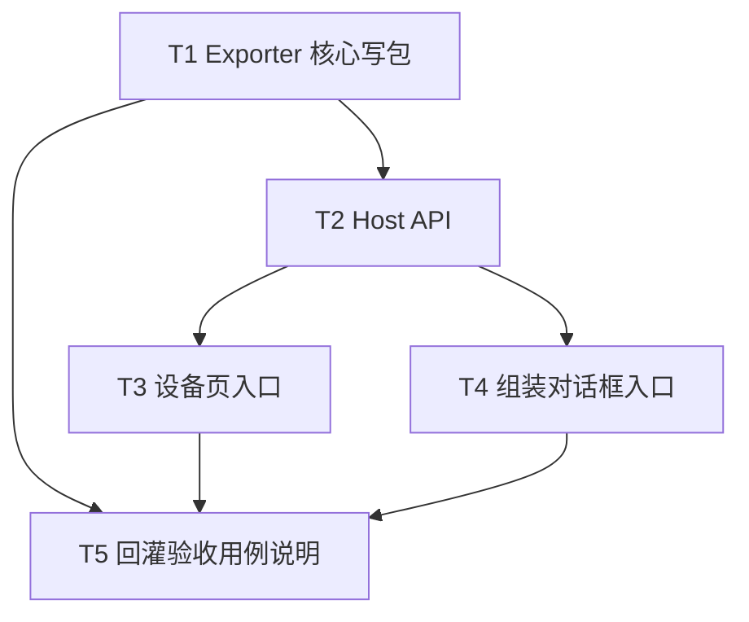

# TASK — 自定义设备导出 URDF

## 依赖图

## T1 — Exporter 核心

**输入：** `CustomDeviceBackendData`、`BackendDataManager`、输出根目录、包名  
**输出：** 目录包（`package.xml` + `urdf/` + `meshes|cad/`）；失败时错误串  
**约束：** 单位方案 B；几何优先源 OBJ/STEP；合法 URDF 名清洗  
**验收：** 单测或手工：给定内存图写出文件，XML 含 link/joint/mesh；无半包

## T2 — Host API

**输入：** DocumentHost + deviceId + 输出路径  
**输出：** bool + err；封装 T1  
**验收：** Widget 可只调 Host，不碰 XML 细节

## T3 — 设备页 UI

**输入：** 选中/点选自定义设备  
**输出：** 「导出 URDF…」→ 目录对话框 → 调 T2  
**验收：** 中文提示成功路径 / 失败原因

## T4 — 组装对话框 UI

**输入：** 当前正在编辑的设备（已 register）  
**输出：** 同导出；未 Apply 的纯草稿若无 device id 则提示先应用或仅导出已挂接设备（实现时与 UI 状态对齐，优先「已存在 backend 的设备」）  
**验收：** 与 T3 同一导出后端

## T5 — 回灌验收

**输入：** T1 产出包  
**输出：** ACCEPTANCE 记录步骤；手工：导入 URDF → 轴控  
**验收：** CONSENSUS 验收标准 2–3

## 并行

- T3 / T4 在 T2 后可并行
- T5 依赖至少一条 UI 或直接调 T2
