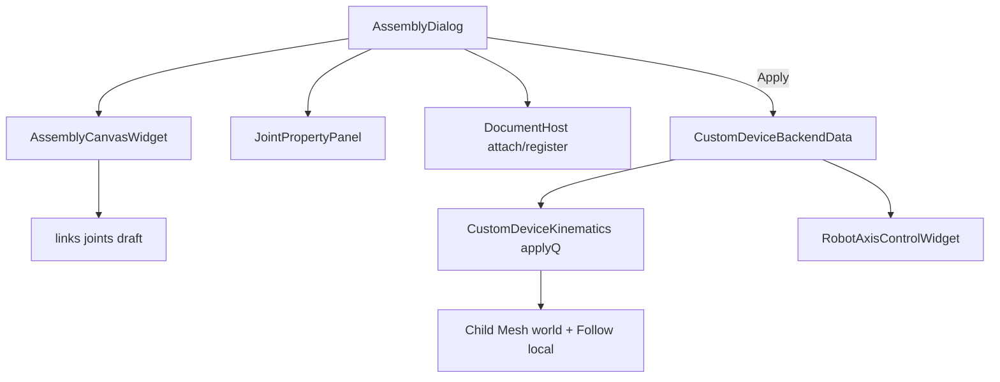

# DESIGN — 自定义设备画布组装

## 架构

## 数据

| 类型 | 字段 |
|------|------|
| Link | id, displayName, geometryBackendId, fixed, canvasX/Y |
| Joint | id, parentLinkId, childLinkId, motion(同 AxisConfig), parentToChildRest[16] |

`axes`/`q` 由 joints 同步，供轴控与旧指令兼容。

## FK

1. 固定 Link：世界 = 捕获 Rest（相对设备 W0）
2. 子 Link：`W_p * Motion(q_i) * Rest_i`
3. 写 geometry `setWorldMatrix` + `FollowAttachmentComponent::recomputeLocalFromCurrentWorld`

## 画布

ProcessFlow 同款自研：网格、块、端口连线、选边改属性；确认前草稿，Apply 再 register/attach。
