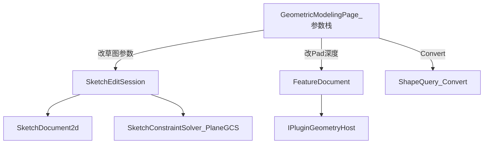

# DESIGN — 草图硬化

## 架构

## 模块

| 模块 | 职责 |
|------|------|
| A0 参数页 | `SideToolPanel::Params`；选中实体/特征绑参数编辑器 |
| A1 | Solver 椭圆；`MajorRadius`/`MinorRadius` 约束；尺寸工具扩椭圆 |
| A2 | ShapeQuery 周期 mid + 满圆容差；Convert 分类计数 |
| A3 | `SkSplineMode`、controlPts、overlay/拖拽 |

## 异常

- Solve 失败：保留旧几何，日志提示
- Convert 折线：warn，不中断已转换边
- 旧样条 JSON：默认 ThroughPoints

## 依赖

GeometricModelingPlugin；A2 另需 GeometryAlgorithm。无 Host ABI bump。
