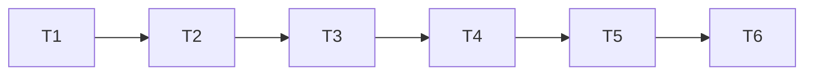

# TASK — 草图硬化

## T1 文档骨架

- 输入：CONSENSUS
- 输出：本目录 ALIGNMENT/CONSENSUS/DESIGN/TASK
- 验收：四文件存在

## T2 A0 命名参数面

- 输入：Page 侧栏、Feature 树选中、草图选中 API
- 输出：参数栈页；圆/线/椭圆/Pad 可编
- 验收：改参可见更新

## T3 A1 椭圆 GCS

- 输入：SkEllipse、Solver、sync
- 输出：椭圆进求解；长短轴约束
- 验收：尺寸驱动椭圆

## T4 A2 Convert 保型

- 输入：ShapeQuery、onConvertEntities
- 输出：硬化识别 + 日志
- 验收：圆/弧优先于折线

## T5 A3 样条双模式

- 输入：SkSpline JSON
- 输出：mode + controlPts + 拖拽
- 验收：兼容旧档；Pad 可出体

## T6 ROADMAP 锁定 + 编译

- 输出：ROADMAP/FEATURES 更新；ACCEPTANCE/FINAL/TODO；双配置编译

