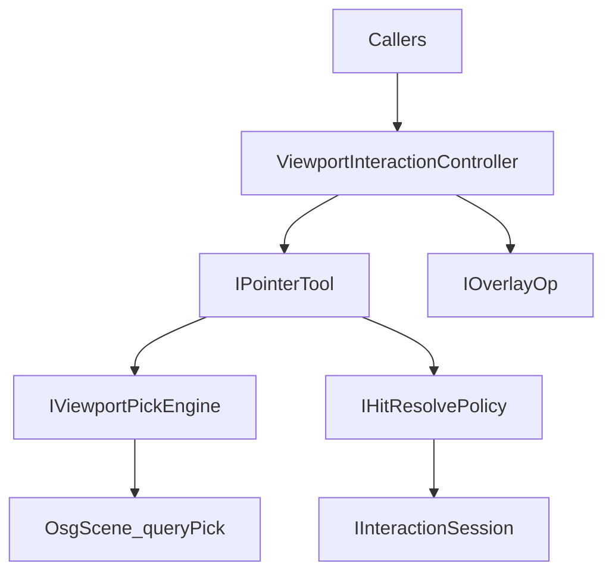

# DESIGN — 视口拾取重构

## 分层

## 事件优先级

1. Sketch / ViewCube  
2. Esc → cancel Session + clearTool  
3. Overlay：TCP → Section → ObjectTransform  
4. activeTool  
5. 相机

## 关键类型

| 类型 | 职责 |
|------|------|
| `ViewportHit` | raw/resolved id、PickResult、Hover/Commit |
| `IViewportPickEngine` | query + highlight |
| `IPointerTool` / `IOverlayOp` | 手势 / 罗盘拖拽 |
| `IHitResolvePolicy` | 语义归并 |
| `IInteractionSession` | 业务生命周期 |
| `ViewportInteractionController` | 单一 activeTool + overlays |
