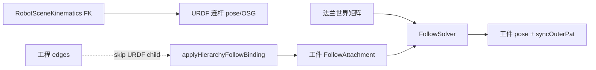

# DESIGN — 跟随对象框架隔离

## 架构

## 核心 API

- `DocumentHost::isKinematicsOwnedBackend(id)`
- `DocumentHost::stripKinematicsOwnedFollowAttachments()`

## 数据流（绑定工件）

1. 用户设 `follow.targetId` → `recomputeLocalFromCurrentWorld`（常相对 L）
2. `markFollowAttachmentDirtyFromBackendMove`（工件及下游）
3. 帧循环 `runBackendFollowSolveAndSync`：strip URDF Follow → 仅解自由物体 → sync

## 异常

- 若属性面板仍给 URDF 写 follow.*：`afterFollowPropertyEdited` 卸组件并 return。
