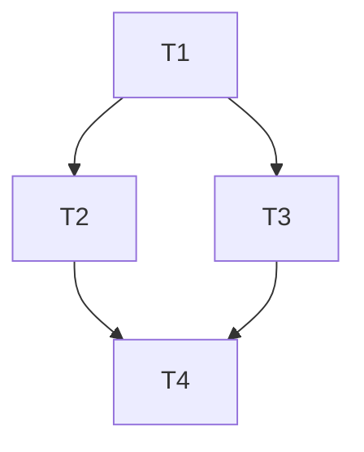

# TASK — 跟随对象框架隔离

## T1 DocumentHost 所有权 API

- 输入：`backendSourceType`
- 输出：`isKinematicsOwnedBackend` / `stripKinematicsOwnedFollowAttachments`
- 验收：URDF id 返回 true；strip 后无 Follow 组件

## T2 绑定路径跳过 URDF

- 改：`BackendHierarchyFollow`、`BackendProjectObjectIo`
- 验收：edges 不对 URDF child 装 Follow

## T3 求解路径隔离 + 绑定不再 forced

- 改：`BackendFollowSolve`
- 验收：forced/脏解均不写 URDF；属性绑定只用脏集

## T4 文档

- `DEVELOPER_GUIDE` 位姿所有权说明

