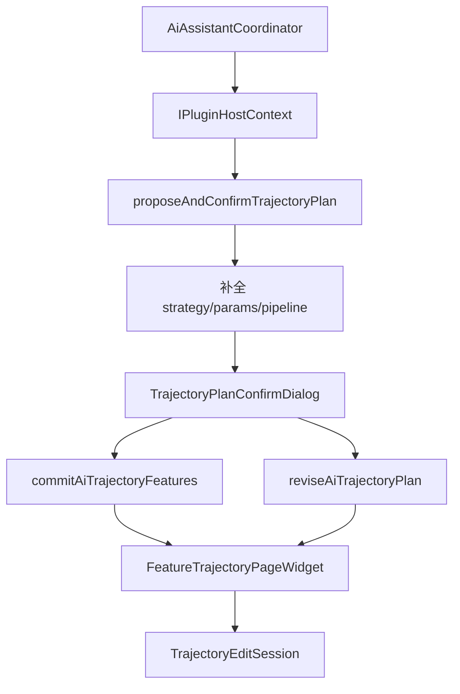

# DESIGN — 轨迹离散 AI 确认对话框

## 架构

## 组件

| 组件 | 职责 |
|------|------|
| `TrajectoryPlanConfirmDialog` | 策略+离散参数+算子列表/参数；OK 出 merged JSON |
| `proposeAndConfirmTrajectoryPlan` | enrich → exec 对话框 → planOut |
| `commitFeaturePlanFromAi` | features → 离散 → `setPipeline(pipeline[])` 或 recipe 回退 |
| `loadBoundTrajectoryPlanForAi` | 读绑定 PathPlan 特征+ops |
| `reviseAiTrajectoryPlan` | 写回表 → 重离散 → `updatePipelineOps` |

## 数据流

1. **Commit**：选特征 → enrich plan → 对话框 → `commitAiTrajectoryFeatures(merged)`
2. **Revise**：关键词 → `loadBound` → 对话框 → `reviseAiTrajectoryPlan(merged)`

## 异常

- 对话框 Cancel：不写 session；Coordinator 保持可重新识别。
- 缺 geometry 索引：commit/revise 失败并返回错误文案。
- 无绑定 PathPlan：`loadBound` 失败提示先离散。
