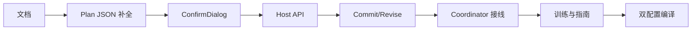

# TASK — 轨迹离散 AI 确认对话框

## 依赖图

| ID | 任务 | 验收 |
|----|------|------|
| T1 | 6A 文档 | ALIGNMENT/CONSENSUS/DESIGN/TASK 存在 |
| T2 | enrich plan：defaults + recipe→pipeline | 无硬编码 stepMm=5 |
| T3 | TrajectoryPlanConfirmDialog | 可改策略/参数/算子并 dump JSON |
| T4 | Host 三 API + 版本 bump | PluginHost 末尾虚函数 |
| T5 | commit 用 pipeline；revise 重离散 | 行为符合 CONSENSUS |
| T6 | Coordinator 单次模态；路径 B 关键词 | 无双弹窗 |
| T7 | dataset/README/DEVELOPER_GUIDE | schema 同步 |
| T8 | Debug+Release x64 | msbuild 通过 |
