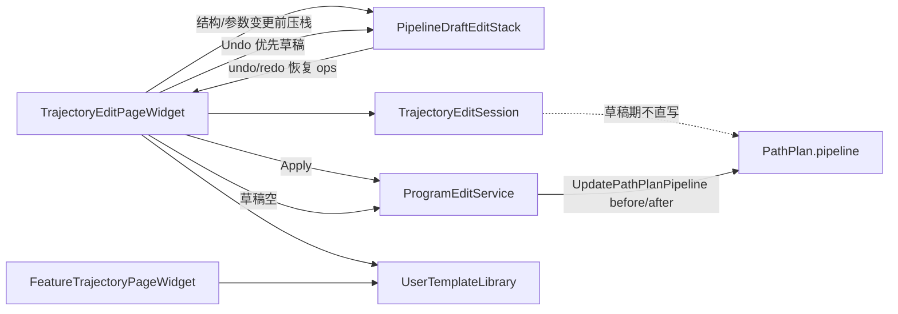

# DESIGN · 轨迹编辑模板与撤销

## 整体架构



## 核心组件

| 组件 | 职责 |
|------|------|
| `PipelineDraftEditStack` | 快照 ops + selectedIndex；参数防抖合并 |
| `UserTemplateLibrary` | 命名模板 CRUD + 导入导出 + 旧槽迁移 |
| `TrajectoryEditSession` | 草稿 `m_ops`；Apply 时写 PathPlan Command |
| 页 Undo/Redo | `draft.canUndo` 优先，否则 `ProgramEditService` |

## 模板 JSON

流水线文件：

```json
{ "version": 1, "id": "...", "name": "...", "updatedAt": "...", "pipeline": [ /* op descriptors */ ] }
```

离散文件：

```json
{ "version": 1, "id": "...", "name": "...", "updatedAt": "...", "strategyId": "FaceSection", "params": { } }
```

目录：`AppDataLocation/CloudSim/templates/{pipeline|discretize}/` + `index.json`。

## 异常

- 模板读写失败：`QMessageBox` 或状态提示，不静默 return
- 导入非法 JSON：拒绝并提示
- Apply 失败：不清理草稿栈
