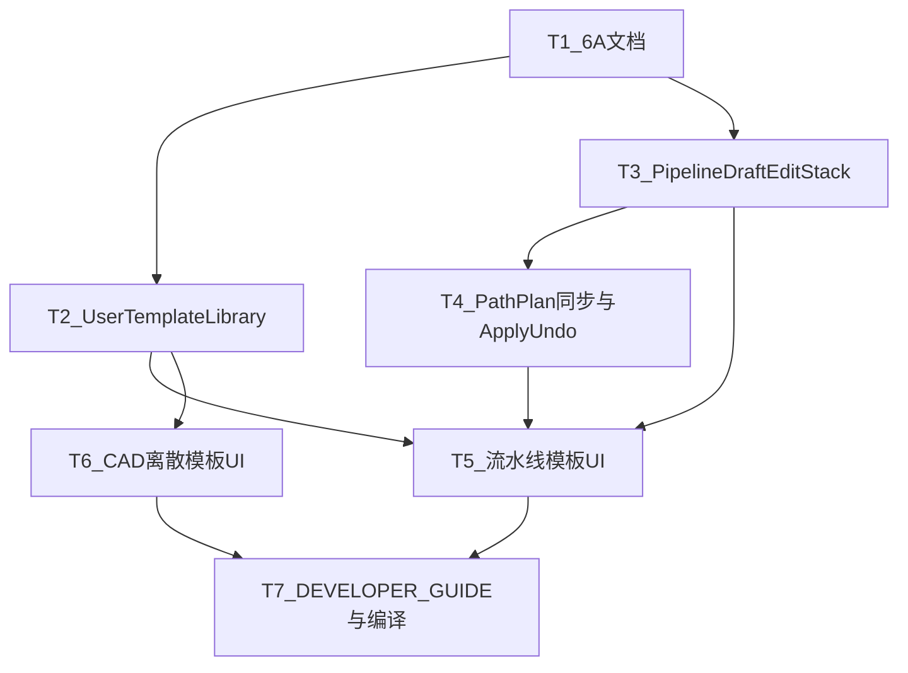

# TASK · 轨迹编辑模板与撤销

## 依赖图

## T1 · 6A 文档

- 输出：ALIGNMENT / CONSENSUS / DESIGN / TASK
- 验收：目录存在且边界无歧义

## T2 · UserTemplateLibrary

- 输入：无
- 输出：`UserTemplateLibrary.h/.cpp`，vcxproj 注册
- 验收：list/save/load/remove/import/export；迁移旧 `pipelineJson`

## T3 · PipelineDraftEditStack

- 输出：`PipelineDraftEditStack.h/.cpp`
- 验收：push/undo/redo/clear；参数 coalesce

## T4 · PathPlan 同步

- 改：`TrajectoryEditSession` 去掉草稿直写；Apply 用 catalog 当前 pipeline 作 before；`syncBoundPathPlanFromSession` 写回 session；`setRawTrajectory` Composite
- 验收：Apply Undo 后 session/UI/raw/phase 一致

## T5 · 流水线模板 UI + 双栈 Undo

- 改：`TrajectoryEditPageWidget`
- 验收：命名下拉 + 保存/删除/导入/导出；Undo 优先草稿

## T6 · CAD 离散模板 UI

- 改：`FeatureTrajectoryPageWidget`
- 验收：加载策略+参数并触发重离散

## T7 · 文档与编译

- 更新 `DEVELOPER_GUIDE.md`；Debug+Release x64
