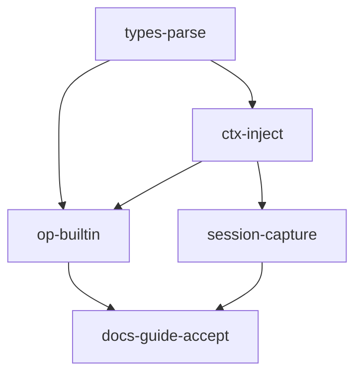

# TASK — 转换工件型轨迹算子

1. 类型与 ParamsParse → 依赖无
2. ExecutionContext + PipelineEngine 注入 → 依赖 1
3. TrajectoryEditSession 捕获 TCP → 依赖 2
4. Builtins 四件套 + JSON + 注册 + vcxproj → 依赖 1,2
5. DEVELOPER_GUIDE + ACCEPTANCE/FINAL/TODO → 依赖 4

