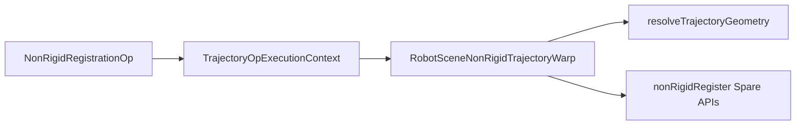

# DESIGN — 非刚性配准轨迹算子

## 模块

| 模块 | 职责 |
|------|------|
| `INonRigidTrajectoryWarp` | TrajectoryAlgorithm 抽象 |
| `TrajectoryNonRigidWarp.cpp` | 绑定 + SPARE 分发 + 写回 |
| `NonRigidRegistrationOp` | validate / processPath |
