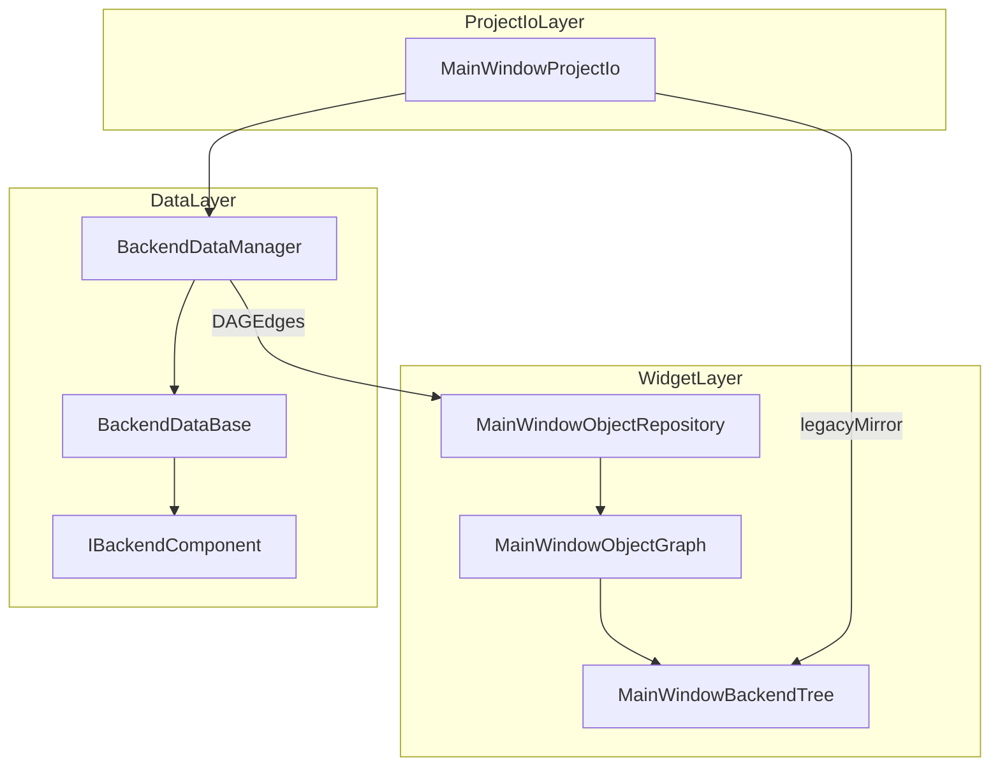
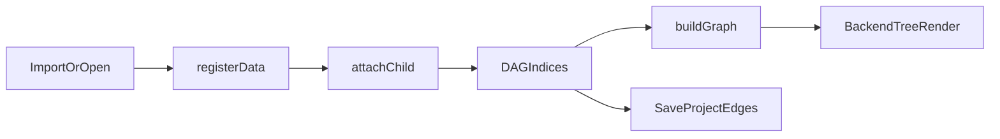

# DESIGN backend_dag_upgrade

## 总体架构

## 分层设计

- `BackendDataBase`
  - 维持现有几何/属性接口。
  - 新增类型化组件容器接口（增删查列）。
- `BackendDataManager`
  - 保留原对象注册表。
  - 新增 DAG 关系索引（`childrenByParent`、`parentsByChild`）。
  - 新增关系查询、图校验、按组件查询。
- `MainWindowObjectRepository`
  - 从 Data 层 `listEdges` 构图。
- `MainWindowObjectGraph`
  - 由单父字段升级为 `parentIds + primaryParentId + childIds`。
- `MainWindowProjectIo`
  - 新增 `edges` 序列化，兼容旧 `parentId`。

## 关键接口契约

- 组件契约：`IBackendComponent::componentType()`
- 关系契约：`attachChild/detachChild/parentsOf/childrenOf/descendantsOf`
- 校验契约：`wouldCreateCycle/validateGraph`
- 持久化契约：
  - 新：`edges: [{parentId, childId}]`
  - 旧：`parentId`（读取兼容）

## 数据流

## 异常与回退策略

- `attachChild` 失败（环/无效节点）时拒绝建立关系。
- 读取工程 `edges` 含悬空边时跳过并记录 warning。
- OSG 暂采用主父关系同步（`parentsOf` 首父）以兼容现有单父渲染链。
