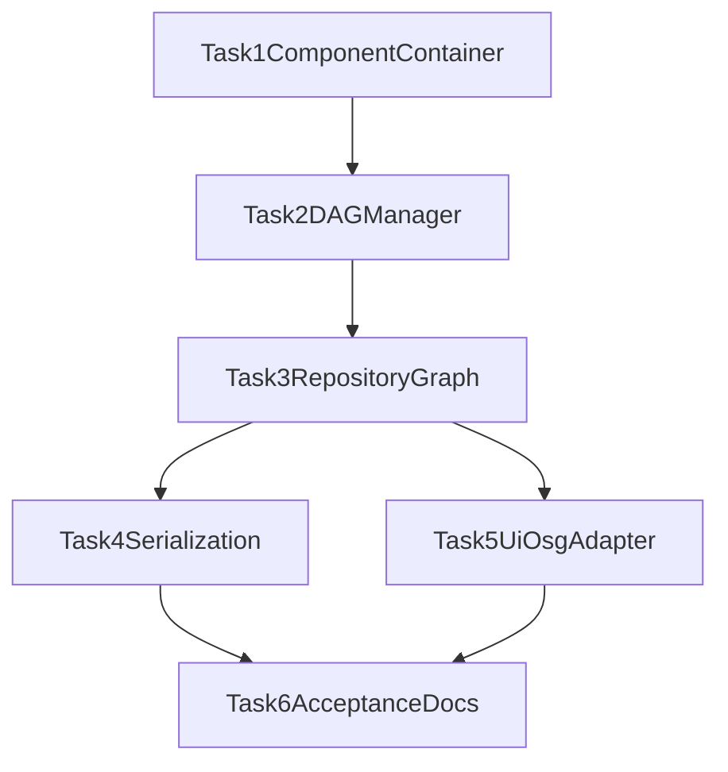

# TASK backend_dag_upgrade

## T1 组件容器基础

- 输入契约
  - 现有 `BackendDataBase` 可编译通过。
- 输出契约
  - 提供 `IBackendComponent` 与对象级组件容器接口。
- 实现约束
  - 不破坏原属性系统 `m_attributes`。
  - 保持线程安全（互斥保护）。
- 验收标准
  - 新接口可用于增删查组件。

## T2 DAG 关系管理

- 输入契约
  - `BackendDataManager` 已有对象注册能力。
- 输出契约
  - 支持 `attach/detach/parents/children/ancestors/descendants/rootIds`。
- 实现约束
  - 禁止环；对象删除自动清理边。
- 验收标准
  - 关系查询正确；`validateGraph` 可检测异常图。

## T3 仓储与对象图迁移

- 输入契约
  - `BackendDataManager::listEdges` 可用。
- 输出契约
  - `MainWindowObjectRepository` 与 `MainWindowObjectGraph` 支持多父。
- 实现约束
  - 保持 `findById/listAll/buildGraph` 对外签名不变。
- 验收标准
  - `subtreeIds` 在 DAG 下去重遍历。

## T4 项目序列化升级

- 输入契约
  - 对象 id 持久化稳定。
- 输出契约
  - 保存 `edges`，读取兼容旧 `parentId`。
- 实现约束
  - 对悬空边容错处理。
- 验收标准
  - 新旧工程均可打开并恢复层级。

## T5 UI/OSG 适配

- 输入契约
  - 对象图可提供 `parentIds`。
- 输出契约
  - 后端树可展示引用节点；OSG 采用主父映射。
- 实现约束
  - 保持已有选择/显隐流程可用。
- 验收标准
  - DAG 多父场景下树与显隐不崩溃。

## T6 验证与文档

- 输入契约
  - 上述任务代码已合并。
- 输出契约
  - `ACCEPTANCE/FINAL/TODO` 文档完整。
- 实现约束
  - 明确已完成与遗留风险。
- 验收标准
  - 文档可指导后续迭代。

## 依赖关系图

