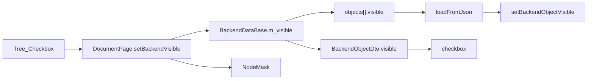

# DESIGN：后端对象显示/隐藏

## 真源与派生视图

| 层 | 角色 |
|----|------|
| `BackendDataBase::m_visible` | 真源；`saveToJson`/`loadFromJson` 字段 `visible` |
| `OsgWidget::m_backendVisibility` + NodeMask | 派生渲染态 |
| 后端树 `Qt::CheckState` | 派生 UI 态（读 `BackendObjectDto.visible`） |

## 关键路径

### 隐藏

`itemChanged` → `DocumentPage::setBackendVisible` → `IDataService::setVisible` + facade/OSG。

插件旁路：`BackendSceneDocumentFacade::setBackendsVisible` / `BackendSceneEntity::setVisible` 同步写 Data。

### 加载

- 内嵌：`decode`→`loadFromJson`→建视觉→`setBackendObjectVisible(id, isVisible())`
- 文件回退：导入几何后从 JSON 写回 `visible` 并应用到 OSG

## 关键文件

| 模块 | 文件 |
|------|------|
| Data | `BackendDataBase.h/.cpp` |
| Core | `CoreTypes.h`、`IDataService.h`、`NullCoreServices.cpp` |
| Host | `DataServiceAdapter`、`BackendProjectObjectIo`、`BackendVisualSync` |
| Widget | `DocumentPage`、`BackendSceneDocumentFacade`、`MainWindowBackendTree` |
