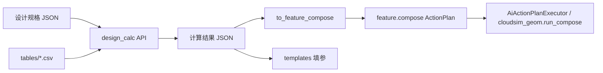

# DESIGN — design.calc

## 分层

| 层 | 路径 | 职责 |
|----|------|------|
| 计算 | `tools/design-calc/design_calc/` | 纯函数：输入 dict → 输出 dict |
| 查表 | `tools/design-calc/tables/` | CSV 真源（自 xls 导出后清洗） |
| 映射 | `design_calc/to_feature_compose.py` | geometry_dim → compose steps |
| 模板 | `tools/design-calc/templates/` | 毛坯 compose 样例 |
| 文档 | `docs/design.calc/` | CATALOG / CONSENSUS / ACCEPTANCE |

## feature.compose 映射约定（V1 毛坯）

| calc_id | compose 策略 |
|---------|----------------|
| `gear.spur_helical_shift` | 两只 `revolveSketchProfileToBrep`：矩形截面绕轴 → 外径≈da、宽度≈b；中心距 A 用 `pose`/`name` 区分 pinion/gear（V1 两 body 分步创建，装配位姿后续） |
| `gear.rack` | pinion 回转毛坯 + rack `extrudeSketchProfileToBrep` 矩形条（高≈全齿高包络） |
| `worm.geometry` | 蜗杆/蜗轮各一回转毛坯 |

缺齿宽 `b` 时默认 `b = 10 * m`（可配置）。

## 与 AI 关系

本轮：**离线/脚本可生成 compose JSON**，供 AI 或用户粘贴执行。  
二期：注册 Domain `design.calc`，Agent 先算再 `executeActionPlan`。
