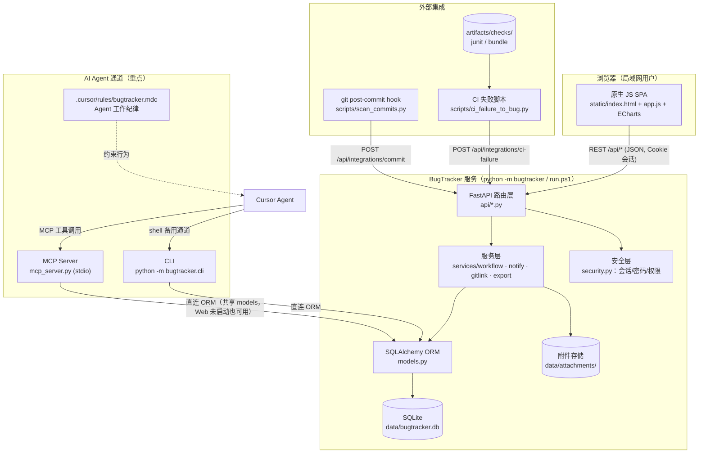
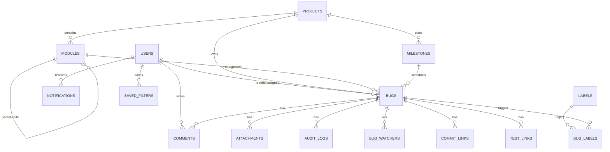
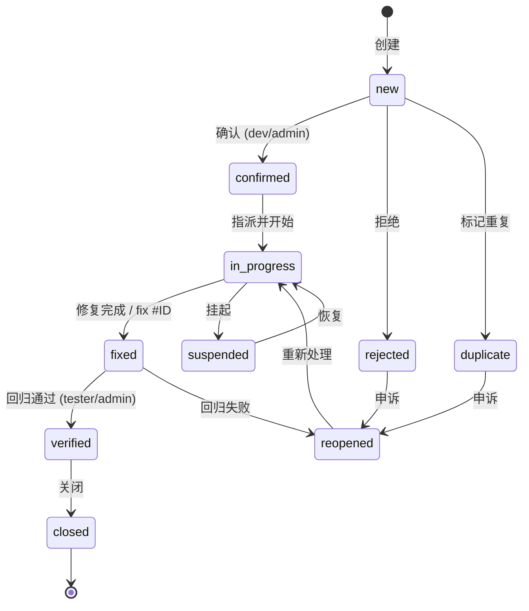
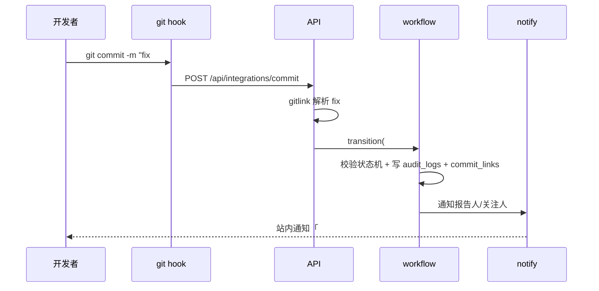

# DESIGN — Bug 管理系统（BugTracker）

## 1. 整体架构



## 2. 分层与核心组件

| 层 | 模块 | 职责 |
|----|------|------|
| 路由层 | `api/auth.py` `users.py` `projects.py` `bugs.py` `comments.py` `attachments.py` `stats.py` `notifications.py` `filters.py` `integrations.py` `admin.py` | 参数校验（pydantic）、鉴权、调用服务层、组装响应 |
| 服务层 | `services/workflow.py` | 状态机流转规则校验 + 审计记录 + 通知触发 |
| | `services/notify.py` | 站内通知生成；SMTP 通道接口（TODO 占位） |
| | `services/gitlink.py` | 解析 commit message 中 `fix #ID` / `ref #ID` |
| | `services/export.py` | JSON/CSV 导入导出 |
| 安全层 | `security.py` | PBKDF2 密码哈希、会话签发/校验、角色权限依赖注入 |
| 数据层 | `models.py` `db.py` | ORM 模型、引擎/会话管理、建表与种子数据 |
| 配置层 | `config.py` | 读取 `.env` / 环境变量：端口、密钥、附件上限、SMTP |
| 前端 | `static/` | 无构建 SPA：hash 路由、fetch 封装、ECharts 看板 |
| Agent 通道 | `mcp_server.py` `cli.py` | MCP 工具 + 命令行，**直连 ORM**（不经 HTTP），写操作归属种子用户 `agent` |

模块依赖规则：**api → services → models**，禁止反向依赖；`security.py` 仅被 api 层引用；`mcp_server.py`/`cli.py` 复用 `services/workflow.py` 保证状态机与审计逻辑只有一份。

## 3. 数据模型（ER）



关键表字段（完整 DDL 以 `models.py` 为准）：

- **users**: id, username(唯一), password_hash, display_name, role(admin/dev/tester/viewer), active, created_at
- **projects**: id, name, key(唯一), description, created_at
- **modules**: id, project_id, parent_id(nullable), name, sort
- **milestones**: id, project_id, name, due_date, status(open/closed)
- **bugs**: id, project_id, module_id, milestone_id, title, description, repro_steps, expected, actual, severity(fatal/major/minor/suggestion), priority(P0~P3), status, resolution, environment(debug/release), version_found, version_fixed, reporter_id, assignee_id, created_at, updated_at, closed_at
- **comments**: id, bug_id, user_id, body, created_at
- **attachments**: id, bug_id, filename, stored_name, size, mime, uploaded_by, created_at
- **audit_logs**: id, bug_id, user_id, field, old_value, new_value, created_at
- **bug_watchers**: bug_id, user_id（联合主键）
- **commit_links**: id, bug_id, repo, commit_hash, message, created_at
- **test_links**: id, bug_id, test_path, note, created_at
- **labels** / **bug_labels**: id, name, color / bug_id+label_id
- **notifications**: id, user_id, bug_id, type, message, read, created_at
- **saved_filters**: id, user_id, name, query_json
- **sessions**: token(主键), user_id, expires_at
- **settings**: key, value（SMTP 等）

## 4. 状态机（workflow.py 唯一权威）



流转规则：
- 每次流转校验「当前状态 → 目标状态」在允许表内，否则 409 返回允许的目标列表。
- 流转写入 `resolution`（fixed/wontfix/duplicate/bydesign/cannot_reproduce，仅终态类状态需要）。
- 每次流转 + 字段变更写 `audit_logs`，并触发 `notify`（报告人/指派人/关注人）。
- 权限：确认/指派=dev↑；验证/关闭=tester↑；reopen=tester↑ 或报告人。

## 5. REST API 契约（摘要）

统一约定：Cookie 会话；错误 `{ "detail": "..." }`；列表统一 `?page=&size=&sort=` 返回 `{items, total}`。

| 方法 | 路径 | 说明 | 权限 |
|------|------|------|------|
| POST | /api/auth/login · /logout | 登录/登出 | 公开 |
| GET | /api/auth/me | 当前用户 | 登录 |
| GET/POST | /api/users | 列表/建号 | admin |
| PATCH | /api/users/{id} | 改角色/停用/重置密码 | admin |
| GET/POST | /api/projects | 项目 | 登录 / admin |
| POST/DELETE | /api/projects/{id}/modules · /milestones | 模块树/里程碑 | admin |
| GET/POST | /api/bugs | 列表（多条件+全文+分页）/ 新建 | 登录 / tester↑ |
| GET/PATCH | /api/bugs/{id} | 详情 / 改字段（写审计） | 登录 / dev↑ 或报告人 |
| POST | /api/bugs/{id}/status | 状态流转 `{to, resolution?, comment?}` | 按状态机 |
| POST | /api/bugs/{id}/comments | 评论（@用户名 触发通知） | 登录 |
| POST/GET/DELETE | /api/bugs/{id}/attachments[/{aid}] | 附件（multipart，白名单，≤50MB） | 登录 |
| POST/DELETE | /api/bugs/{id}/watch | 关注/取消 | 登录 |
| GET | /api/bugs/{id}/history | 审计历史 | 登录 |
| POST/DELETE | /api/bugs/{id}/links/commit · /test | 关联 commit / 回归用例 | dev↑ |
| GET | /api/stats/overview · /trend?days=30 · /by-module · /by-user | 看板数据 | 登录 |
| GET/POST/DELETE | /api/filters[/{id}] | 保存的过滤器 | 登录 |
| GET/POST | /api/notifications · /{id}/read · /read-all | 通知中心 | 登录 |
| POST | /api/integrations/commit | `{repo, hash, message, author}` → 解析联动 | token |
| POST | /api/integrations/ci-failure | `{stamp, summary, failures[]}` → bug 草稿 | token |
| GET/POST | /api/export/json · /api/import/json | 全量导出/导入 | admin |
| GET/POST | /api/export/csv · /api/import/csv | bug 列表导出/导入 | 登录 / admin |
| GET/POST/DELETE | /api/labels | 标签管理 | 登录 / admin |

集成接口用 `X-Integration-Token`（`.env` 配置）鉴权，不用会话。

## 6. 数据流（以「修复联动」为例）



## 7. 异常处理策略

| 场景 | 策略 |
|------|------|
| 参数校验失败 | 422，pydantic 明细 |
| 未登录/无权限 | 401 / 403，前端跳登录或提示 |
| 资源不存在 | 404 |
| 非法状态流转 | 409 + 允许目标列表 |
| 附件超限/类型非法 | 413 / 415 |
| 集成 token 错误 | 401，且不计入审计 |
| DB 异常 | 全局异常处理器 → 500 + 日志（`data/server.log`），会话回滚 |
| 前端 | fetch 封装统一拦截错误码，toast 提示；401 跳登录页 |

## 8. 前端页面（hash 路由）

| 路由 | 页面 |
|------|------|
| #/login | 登录 |
| #/dashboard | 看板（4 图 + 我的待办/我报告的） |
| #/bugs | 列表（筛选栏、搜索、分页、保存过滤器、CSV 导出） |
| #/bugs/new · #/bugs/{id} · #/bugs/{id}/edit | 新建 / 详情（字段+状态按钮+评论+附件+历史+关联）/ 编辑 |
| #/projects | 项目/模块树/里程碑管理（admin） |
| #/users | 用户管理（admin） |
| #/notifications | 通知中心 |
| #/settings | 导入导出、集成 token 查看（admin） |

## 9. Agent 通道设计（MCP / CLI / Cursor 规则）

### 9.1 MCP Server（`mcp_server.py`，stdio 传输）

基于 `mcp` SDK（FastMCP），**直接复用 `models.py` + `services/workflow.py`** 访问 SQLite，不依赖 Web 服务运行。注册位置：仓库根 `.cursor/mcp.json`：

```json
{
  "mcpServers": {
    "bugtracker": {
      "command": "<repo>/CloudSim/tools/bugtracker/.venv/Scripts/python.exe",
      "args": ["-m", "bugtracker.mcp_server"],
      "cwd": "<repo>/CloudSim/tools/bugtracker"
    }
  }
}
```

暴露工具（命名 `bt_*`，返回 JSON 文本）：

| 工具 | 参数 | 说明 |
|------|------|------|
| bt_list_bugs | status/severity/priority/project/module/assignee/reporter/keyword/page/size | 多条件查询（默认排除 closed） |
| bt_get_bug | id | 详情 + 评论 + 审计历史 + 关联 commit/用例 |
| bt_create_bug | title, project_key, severity, priority, description/repro_steps/expected/actual, module?, assignee? | 提单，返回 bug id |
| bt_update_status | id, to, resolution?, comment? | 走状态机（含审计+通知） |
| bt_update_bug | id, assignee?/priority?/severity?/module?/milestone?/labels? | 改字段（写审计） |
| bt_add_comment | id, body | 评论（@提及生效） |
| bt_search | keyword | 标题/描述/复现步骤全文 |
| bt_stats_overview | — | 状态/严重级别分布计数 |
| bt_list_projects / bt_list_modules | project_key | 项目与模块树 |

写操作归属种子用户 `agent`（role=dev，`.env` 的 `AGENT_USERNAME` 可改）；全部写操作照常写审计与通知，Web 端可见「agent 改了什么」。

### 9.2 CLI（`bugtracker/cli.py`）

`python -m bugtracker.cli <cmd>`，子命令：`list / show / create / comment / status / update / stats / projects / export`。默认 `--json` 输出（Agent 解析友好），`--pretty` 给人看。退出码：0 成功 / 2 参数错 / 3 业务错（如非法流转）。与 MCP 共用同一套服务函数，行为一致。

### 9.3 Cursor 规则（根 `.cursor/rules/bugtracker.mdc`）

要点（always apply）：
1. 用户报告 bug 或会话中确认存在缺陷 → 用 `bt_create_bug` 提单（或 CLI），返回单号给用户。
2. 修 bug 前 → `bt_get_bug`/`bt_list_bugs` 查单，修复中置「处理中」，完成后置「已修复」并评论说明修复方案与回归用例。
3. commit message 引用 `#ID`（`fix #ID` 自动联动）。
4. 发现与当前任务无关的疑似缺陷 → 提单记录，不擅自修复。
5. MCP 不可用时降级用 CLI；两者都不可用 → 提示用户启动/检查 BugTracker。

### 9.4 并发与一致性

SQLite WAL 模式；MCP/CLI 与 Web 服务共享同一库文件，短事务写入；附件写入先落临时文件再 rename，避免半文件。

## 10. 目录结构

```
CloudSim/tools/bugtracker/
├── run.ps1                  # 一键启动（venv+依赖+初始化+uvicorn）
├── requirements.txt         # fastapi uvicorn sqlalchemy python-multipart pydantic
├── .env.example             # PORT/SECRET/INTEGRATION_TOKEN/SMTP 占位
├── .gitignore               # data/ .env __pycache__ .venv
├── README.md
├── bugtracker/
│   ├── __init__.py  __main__.py  app.py  config.py  db.py  models.py
│   ├── schemas.py  security.py
│   ├── mcp_server.py          # MCP stdio 服务（Agent 原生通道）
│   ├── cli.py                 # 命令行（JSON 输出，备用通道）
│   ├── api/  (auth users projects bugs comments attachments stats
│   │          notifications filters integrations admin)
│   ├── services/  (workflow notify gitlink export)
│   └── static/  (index.html app.js api.js style.css vendor/echarts.min.js)
├── scripts/
│   ├── scan_commits.py      # git hook 调用：解析最新 commit → API
│   ├── post-commit          # hook 模板
│   ├── install_hook.ps1     # 安装 hook 到指定仓库
│   └── ci_failure_to_bug.py # 读 artifacts junit → bug 草稿
├── tests/  (conftest + test_auth/test_users/test_projects/test_bugs/
│            test_workflow/test_comments/test_attachments/test_stats/
│            test_filters/test_notifications/test_integrations/test_export/
│            test_mcp/test_cli)
└── data/   (gitignore：bugtracker.db attachments/ server.log)
```

仓库根新增（BugTracker 相关）：

```
.cursor/mcp.json               # 注册 bugtracker MCP server
.cursor/rules/bugtracker.mdc   # Agent 工作纪律（always apply）
```

## 11. 设计原则符合性自查

- 不改动 CloudSim 任何现有工程/代码 ✔
- 复用项目 Python/pytest 体系 ✔
- 无 npm 构建、无外部服务依赖，离线可跑 ✔
- 敏感配置仅 `.env` ✔
