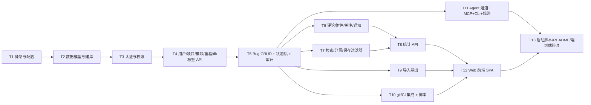

# TASK — Bug 管理系统（BugTracker）

> 依据 DESIGN_Bug管理系统.md 拆分。每个任务可独立验证；按依赖顺序执行。

## 任务依赖图

## T1 项目骨架与配置

- **输入**：CONSENSUS/DESIGN 已批准；Python 3.12 可用
- **产出**：`tools/bugtracker/` 目录骨架、`requirements.txt`、`.env.example`、`.gitignore`、`config.py`（端口/密钥/附件上限/SMTP 占位）、`db.py`（引擎/会话）、`app.py`（FastAPI 工厂 + 静态托管 + 全局异常处理）、`__main__.py`
- **验收**：`uvicorn` 启动后 `GET /api/health` 返回 200；静态 `index.html` 可访问
- **约束**：依赖仅 fastapi/uvicorn/sqlalchemy/python-multipart/pydantic

## T2 数据模型与建库

- **输入**：T1
- **产出**：`models.py` 全部 16 张表（见 DESIGN §3）、建表函数、首启种子（默认 admin，密码首启随机生成并打印到控制台 + 强制首登改密标记）
- **验收**：pytest 验证所有表创建、唯一约束、外键、admin 种子存在
- **约束**：SQLite 开启 WAL 与外键约束

## T3 认证与权限

- **输入**：T2
- **产出**：`security.py`（PBKDF2 哈希、会话签发/过期/校验、角色依赖注入 `require(role)`）、`api/auth.py`（login/logout/me/改密）
- **验收**：pytest 覆盖：登录成功/失败、会话过期、四角色权限矩阵抽样、越权 403
- **约束**：会话 HttpOnly Cookie，默认 12h 过期；密码不可逆

## T4 用户/项目/模块/里程碑/标签 API

- **输入**：T3
- **产出**：`api/users.py`（admin 建号/改角色/停用/重置密码）、`api/projects.py`（项目+模块树+里程碑）、`api/admin.py` 中标签 CRUD
- **验收**：pytest 覆盖 CRUD、模块树多级、非 admin 写操作 403、停用用户无法登录
- **依赖**：无并行冲突

## T5 Bug CRUD + 状态机 + 审计

- **输入**：T4
- **产出**：`api/bugs.py`（新建/详情/改字段）、`services/workflow.py`（状态机唯一权威：流转校验、resolution、审计写入、通知钩子）、`GET /api/bugs/{id}/history`
- **验收**：pytest 覆盖：全字段 CRUD；DESIGN §4 每条合法/非法流转；字段变更逐条审计；关闭时写 closed_at
- **约束**：所有字段变更必须过审计；状态流转只允许走 `/status` 端点

## T6 评论/附件/关注/通知

- **输入**：T5
- **产出**：`api/comments.py`（含 @提及解析）、`api/attachments.py`（multipart 上传/下载/删除，白名单 png/jpg/gif/log/txt/zip/dmp/csv/xml/json，≤50MB，存 `data/attachments/`）、`watch` 端点、`services/notify.py` + `api/notifications.py`（列表/已读/全读）
- **验收**：pytest 覆盖：评论与 @通知、附件上传下载往返、超限 413、非法类型 415、关注人收到状态变更通知
- **依赖**：与 T7 可并行

## T7 检索/分页/保存过滤器

- **输入**：T5
- **产出**：`GET /api/bugs` 多条件（status/severity/priority/project/module/milestone/assignee/reporter/label/日期区间/关键词全文）+ 排序 + 分页；`api/filters.py` 保存过滤器 CRUD
- **验收**：pytest 覆盖组合筛选、关键词命中标题/描述/复现步骤、分页边界、过滤器保存与复用
- **依赖**：与 T6 可并行

## T8 统计 API

- **输入**：T6、T7
- **产出**：`api/stats.py`：overview（按状态/严重级别计数）、trend（近 N 天新建/关闭）、by-module、by-user（指派/完成）
- **验收**：pytest 用构造数据集校验各统计数值精确正确
- **依赖**：—

## T9 导入导出

- **输入**：T5
- **产出**：`services/export.py` + `api/admin.py` 端点：全量 JSON 导出/导入（含附件清单，附件文件打包 zip）、bug CSV 导出/导入
- **验收**：pytest：导出→清空库→导入→数据一致；CSV 往返；非 admin 导入 403
- **依赖**：—

## T10 git/CI 集成 + 脚本

- **输入**：T5
- **产出**：`services/gitlink.py`（`fix|close|resolve #ID` / `ref #ID` 解析）、`api/integrations.py`（token 鉴权的 commit / ci-failure 端点）、`scripts/scan_commits.py`、`post-commit` 模板、`install_hook.ps1`、`scripts/ci_failure_to_bug.py`（解析 junit XML 失败用例 → 草稿）
- **验收**：pytest 覆盖解析规则与端点联动（fix 置 fixed + commit_links + 通知；ci-failure 生成草稿）；真实 git 仓库装 hook 提交验证
- **约束**：集成 token 仅 `.env`；hook 安装脚本不修改仓库其它配置

## T11 Agent 通道（MCP + CLI + Cursor 规则）★重点

- **输入**：T5（复用 models + workflow 服务）
- **产出**：
  - `bugtracker/mcp_server.py`：FastMCP stdio 服务，暴露 `bt_*` 十个工具（DESIGN §9.1），直连 ORM
  - `bugtracker/cli.py`：`list/show/create/comment/status/update/stats/projects/export` 子命令，`--json` 默认输出，退出码规范
  - 根 `.cursor/mcp.json`：注册 bugtracker server（指向 venv python）
  - 根 `.cursor/rules/bugtracker.mdc`：Agent 工作纪律五条（DESIGN §9.3）
  - 种子用户 `agent`（role=dev，T2 种子函数中追加）
- **验收**：pytest（test_mcp/test_cli：工具调用往返、非法流转被拒、写操作归属 agent、审计落库）；CLI 真实执行 `list --json` 输出合法 JSON；MCP 注册后新会话可见 `bt_*` 工具
- **约束**：MCP/CLI 不依赖 Web 服务进程；与 Web 共用同一状态机与审计逻辑

## T12 Web 前端 SPA

- **输入**：T8、T9、T10（API 全部就绪）
- **产出**：`static/` 全部页面（DESIGN §8）：登录、看板（ECharts 4 图 + 我的待办）、bug 列表（筛选/搜索/分页/保存过滤器/导出）、详情（字段+状态流转按钮+评论+附件+历史+关联+关注）、新建/编辑、项目模块管理、用户管理、通知中心、设置页
- **验收**：浏览器手工点验全链路（CONSENSUS §6-1）；截图存档 ACCEPTANCE
- **约束**：原生 JS 无构建；ECharts 本地 vendor；风格简洁（参考现有 cloudsim-web-ui 深色风格）

## T13 启动脚本 / README / 端到端验收

- **输入**：T11、T12
- **产出**：`run.ps1`（建 venv→装依赖→初始化→启动，端口冲突提示）、`README.md`（启动/账号/集成安装/备份/Agent 通道说明）、补全 ACCEPTANCE 文档
- **验收**：干净环境 `run.ps1` 一键跑通；pytest 全绿；CONSENSUS §6 全部满足（含 Agent 通道验收）
- **依赖**：—

## 风险与缓解

| 风险 | 缓解 |
|------|------|
| 依赖安装失败（离线） | requirements 固定版本；README 记录离线 whl 安装方式（TODO 项） |
| ECharts vendor 体积 | 仅引入 echarts.min.js 单文件 |
| 首启 admin 密码泄露 | 随机生成仅打印一次 + 强制首登改密 |
