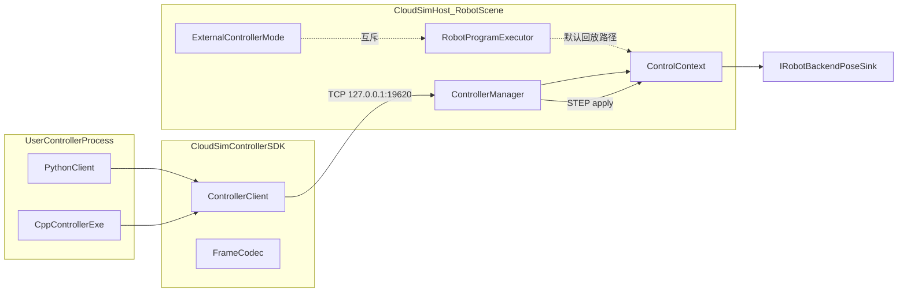
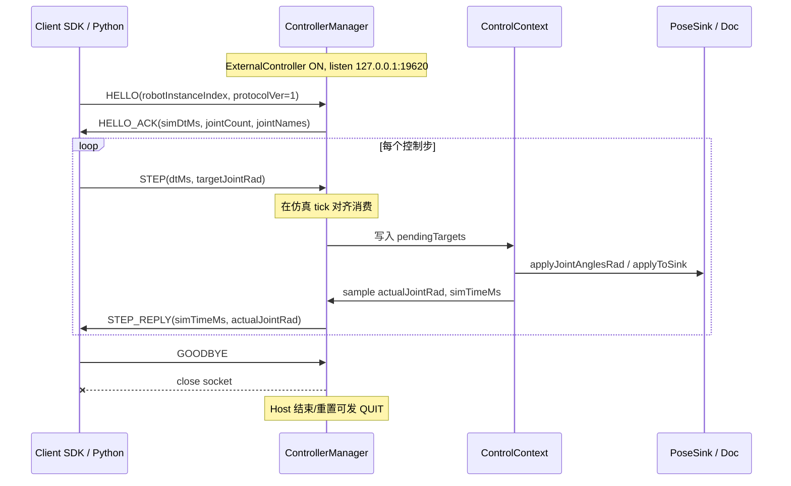

# DESIGN — 仿真外置控制器

> 实现设计；**协议字段以** [`CONSENSUS_仿真外置控制器.md`](CONSENSUS_仿真外置控制器.md) **为准，本文不得私改 schema**。
>
> 对齐文档：[`ALIGNMENT_仿真外置控制器.md`](ALIGNMENT_仿真外置控制器.md)。

## 1. 整体架构



### 分层职责

| 层 | 组件 | 职责 |
|----|------|------|
| 用户进程 | Python / C++ 控制器 | 业务控制循环；不嵌入 Host |
| Client SDK | `CloudSimControllerSDK` | TCP 连接、JSON 编解码、HELLO/STEP/GOODBYE API |
| Host Manager | `ControllerManager` | listen、单会话、按 tick 消费 STEP、回 STEP_REPLY / ERROR / QUIT |
| 仿真上下文 | `ControlContext` | `pendingTargets`、可选 `sensorSnapshot`、`applyToSink` / `sampleFromDoc` |
| 模式 | `ExternalController` | 与 `RobotProgramExecutor` 指令回放互斥；默认关闭 |
| UI 钩子 | `RobotWidget` 独立 cpp | start/stop/tick 接线；不塞协议解析进巨型 controller 文件 |

## 2. 模块路径（CONSENSUS §5）

| 组件 | 路径 |
|------|------|
| ControlContext | `src/Robot/RobotScene/` |
| Client DLL | `src/Plugins/CloudSimControllerSDK/` |
| Manager | `src/Host/CloudSimHost/`（含 headless 同构接入） |
| UI 钩子 | `src/UI/RobotWidget/`（建议 `RobotSimulationController_controller.cpp` 等独立文件） |
| Python | `resource/Python/ControllerPython/` |

### 构建与输出

- **Debug\|x64** → `bin\x64d\`（中间文件按工程 `IntDir`，典型 `bin\x64dmiddle\<工程名>\`）
- **Release\|x64** → `bin\x64\`（典型 `bin\x64middle\<工程名>\`）
- 禁止私改 `OutDir`；新源须 sync `.vcxproj.filters`
- 源码约定：UTF-8 BOM + CRLF；禁止 `#pragma once`

验证命令（每个相关 `.vcxproj` 双配置）：

```text
msbuild <path>.vcxproj /p:Configuration=Debug /p:Platform=x64
msbuild <path>.vcxproj /p:Configuration=Release /p:Platform=x64
```

## 3. STEP 数据流



要点：

1. Host 仅在 `ExternalController` 开启时 listen；MVP 单连接、一机器人一会话。
2. `STEP` 在仿真 tick 应用；`dtMs` 宜为 `simDtMs` 正整数倍（MVP 可忽略倍数，仅取本帧目标角）。
3. `targetJointRad.length == HELLO_ACK.jointCount`，否则 `ERROR` / `BAD_JOINT_COUNT`。
4. 默认模式不走上述路径；`RobotProgramExecutor` 示教回放保持原样。

## 4. 接口契约（实现侧，字段名对齐 CONSENSUS）

### 4.1 Client → Host

- `HELLO`：`robotInstanceIndex`
- `STEP`：`dtMs`，`targetJointRad[]`
- `GOODBYE`

### 4.2 Host → Client

- `HELLO_ACK`：`simDtMs`，`jointCount`，`jointNames[]`
- `STEP_REPLY`：`simTimeMs`，`actualJointRad[]`
- `QUIT`：可选 `reason`
- `ERROR`：`code`，`message`

错误码：`PROTOCOL_MISMATCH` / `BAD_ROBOT_INDEX` / `BAD_JOINT_COUNT` / `NOT_READY` / `INTERNAL`（见 CONSENSUS §4.3）。

### 4.3 ControlContext（P1-B 目标面）

建议最小面（实现可微调命名，但语义保持）：

- `pendingTargets`：最近一次 STEP 目标关节角
- `sensorSnapshot`：可选，供后续扩展
- `applyToSink(...)`：写到后端 / PoseSink
- `sampleFromDoc(...)`：读实际角与仿真时间

无 Qt Widgets 依赖；RobotScene 内可编译单元测试清单。

### 4.4 ControllerClient（P1-C 目标面）

- `connect(host, port)` → 默认 `127.0.0.1:19620`
- `hello(robotInstanceIndex)` → 解析 `HELLO_ACK`
- `step(dtMs, targetJointRad)` → 阻塞读 `STEP_REPLY` 或 `ERROR`
- `goodbye()` / 析构关连接
- FrameCodec：一行 JSON + `\n`

## 5. 异常与生命周期

| 场景 | 行为 |
|------|------|
| protocolVer ≠ 1 | `ERROR` / `PROTOCOL_MISMATCH`，可断开 |
| robotInstanceIndex 无效 | `ERROR` / `BAD_ROBOT_INDEX` |
| 关节数组长度不符 | `ERROR` / `BAD_JOINT_COUNT` |
| 模式未开或无机器人 | `ERROR` / `NOT_READY` |
| Host 内部异常 | `ERROR` / `INTERNAL`；尽量不抛穿 UI 线程 |
| Client 崩溃 / 半开连接 | Manager 关掉 socket；仿真继续；不拖垮 Host |
| Host 结束 / 重置 | 可发 `QUIT`；随后关 listen / 会话 |
| Client `GOODBYE` | 优雅断开；会话结束 |

并发：MVP 单连接；Manager 与 tick 线程的队列/互斥由 P2-E 实现时按现有 Host 线程模型选型（避免在 UI 线程阻塞读完整控制循环）。

## 6. 与 RobotComm 边界（设计约束）

- **不得**复用 19610、RobotComm 消息类型或 `IRobotMotionClient` 语义。
- SDK 工程布局可**对照** `RobotCommSDK`（Winsock + nlohmann/json、独立 DLL），但命名空间、导出名、端口全部独立。
- 文档与 DEVELOPER_GUIDE 须写清「真机反馈 vs 仿真外置」双轨，避免后续混用。

## 7. Headless（P2-F）

`HeadlessRobotPlaybackBridge` / Gateway 机器人路径：同构挂接同一 `ControllerManager` + `ControlContext`；HTTP 侧可选只暴露状态，不另发明控制协议。

## 8. P0 步进语义

见 [P0_语义附录.md](P0_语义附录.md)（无 STEP 空转、断连保持、真实 actualJointRad、dtMs 警告）。
