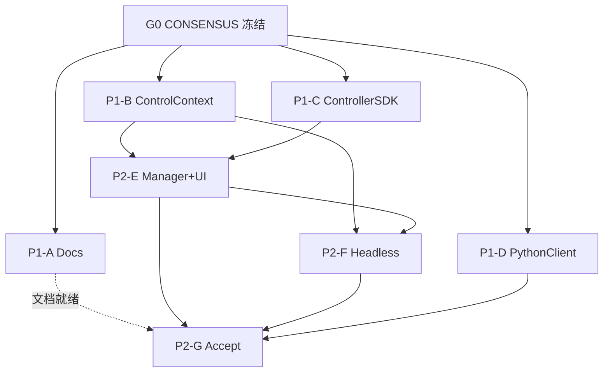

# TASK — 仿真外置控制器 MVP

> 原子任务与并行包；协议字段只引用 [`CONSENSUS_仿真外置控制器.md`](CONSENSUS_仿真外置控制器.md)。
>
> 设计见 [`DESIGN_仿真外置控制器.md`](DESIGN_仿真外置控制器.md)。

## 依赖总图



**硬隔离**：同一波禁止两 Agent 同改 `RobotSimulationController.cpp`；P1 的 C/D 不改 RobotScene；B 不碰 SDK 工程。

---

## G0 — 协议冻结（已完成）

| 项 | 内容 |
|----|------|
| 状态 | **Done** |
| Owner | 主 Agent |
| 独占写路径 | `docs/features/仿真外置控制器/CONSENSUS_仿真外置控制器.md` |
| 输入契约 | 选定 localhost TCP、关节角控制、避开 RobotComm 19610 |
| 输出契约 | 冻结 JSON schema、端口 **19620**、错误码、与 RobotComm 边界、模块落点、构建约定 |
| 验收 | 字段名锁定；后续 Agent **只许引用、禁止私改 schema** |

---

## 并行波 P1（G0 完成后同时开工）

### P1-A — Docs（本任务）

| 项 | 内容 |
|----|------|
| 独占写路径 | `docs/features/仿真外置控制器/*`（CONSENSUS 已冻结字段外补齐 ALIGNMENT/DESIGN/TASK/README）；更新 `docs/features/README.md` 一行索引 |
| 输入契约 | CONSENSUS 全文；计划中的模块路径与并行包划分；活文档权威 > 归档 zip |
| 输出契约 | ALIGNMENT / DESIGN / TASK / 专题 README；features 索引可发现 |
| 实现约束 | 中文 OK；UTF-8 BOM + CRLF 优先；不改 CONSENSUS；不碰 src |
| 验收 | 6A 文档齐全；写明 OutDir/`bin\x64d`/`bin\x64` 与 Debug+Release；链接 CONSENSUS |
| 后置 | 无代码依赖；P2-G 引用本套文档 |

### P1-B — ControlContext

| 项 | 内容 |
|----|------|
| 独占写路径 | 仅 `RobotScene/inc|source` 下 `ControlContext.*` + 最小配套与文档片段 |
| 输入契约 | CONSENSUS §5；DESIGN §4.3；现有 `applyJointAnglesRad` / PoseSink / 文档采样路径 |
| 输出契约 | `pendingTargets` / `sensorSnapshot` / `applyToSink` / `sampleFromDoc`；可被 Manager 调用的稳定面 |
| 实现约束 | 无 Qt Widgets；不引入 SDK；UTF-8 BOM + CRLF；sync filters；**Debug\|x64 + Release\|x64**，产物进工程定义 OutDir（`bin\x64d` / `bin\x64`） |
| 验收 | RobotScene 相关工程双配置编译通过；单元/清单可验证 apply/sample |
| 并行 | 与 A/C/D 并行；禁止改 Host/SDK/Python |

### P1-C — CloudSimControllerSDK

| 项 | 内容 |
|----|------|
| 独占写路径 | 新工程 `Plugins/CloudSimControllerSDK/**` + 挂入 `CloudSim.sln` |
| 输入契约 | CONSENSUS §3–§4 消息与端口；对照 RobotCommSDK 工程模式（独立端口/字段） |
| 输出契约 | Client 帧编解码 + `connect` / `hello` / `step` / `goodbye` API；DLL 输出到 `bin\x64d` / `bin\x64` |
| 实现约束 | 禁止改 RobotScene；可用 mock server 或环回自测一帧 STEP；双配置 MSBuild；sync filters |
| 验收 | Debug+Release 均产出 DLL；最小联调（mock 即可）跑通 HELLO→STEP→STEP_REPLY |
| 并行 | 与 A/B/D 并行 |

### P1-D — Python 最小客户端

| 项 | 内容 |
|----|------|
| 独占写路径 | 仅 `resource/Python/ControllerPython/**` + 运行说明 |
| 输入契约 | CONSENSUS 帧格式与类型名；端口 19620 |
| 输出契约 | `cloudsim_controller.py`（HELLO/STEP 循环封装）；示例脚本；README（如何对 Host ExternalController 运行） |
| 实现约束 | 不改 C++；可先对 mock，后对 Host；资源拷贝约定随工程（`bin/x64(d)/resource/...`） |
| 验收 | 独立进程能发 HELLO/STEP/GOODBYE；字段名与 CONSENSUS 一致 |
| 并行 | 与 A/B/C 并行 |

---

## 并行波 P2（建议 B+C 合并后）

### P2-E — Manager + UI

| 项 | 内容 |
|----|------|
| 独占写路径 | `CloudSimHost` 内 `ControllerManager.*`；`RobotWidget` 用**独立** start/stop/tick 接线文件（如 `RobotSimulationController_controller.cpp`）；可选小 UI 开关 |
| 输入契约 | P1-B ControlContext API；P1-C 协议语义；CONSENSUS 生命周期；DESIGN STEP 序列 |
| 输出契约 | listen `127.0.0.1:19620`；按 robotInstance 绑定；tick 中消费 STEP 写 Context 并回 STEP_REPLY；与 Executor 互斥/协同 |
| 实现约束 | 禁止与其他 Agent 同改 `RobotSimulationController.cpp` 本体；默认模式关闭外置；双配置构建 Host/RobotWidget；OutDir 不变 |
| 验收 | Debug+Release；UI Run 时可被 Python 驱动关节；默认示教回放不变 |
| 前置 | P1-B、P1-C |
| 后置 | P2-F、P2-G |

### P2-F — Headless

| 项 | 内容 |
|----|------|
| 独占写路径 | 仅 `Host/.../headless/HeadlessRobotPlaybackBridge*` 与 Gateway 机器人路径的小扩展 |
| 输入契约 | P2-E 同构 Manager；CONSENSUS 同一协议 |
| 输出契约 | Headless 同挂 Manager；HTTP 可选只读状态（不新发明控制协议） |
| 实现约束 | 复用 Context/Manager；双配置；不改 Client SDK 协议 |
| 验收 | Headless 模式下控制器可驱动关节一步 |
| 前置 | P2-E（及 P1-B） |

### P2-G — Accept

| 项 | 内容 |
|----|------|
| 独占写路径 | `ACCEPTANCE_*.md`；`RobotScene/DEVELOPER_GUIDE.md` / RobotCommSDK 边界说明；`MODULE_DEVELOPER_GUIDES` 一行 |
| 输入契约 | MVP 成功标准（CONSENSUS §7）；P1/P2 交付物；手工冒烟步骤 |
| 输出契约 | 验收清单 + 手工步骤；边界说明；已知债（未做 IPC/ROS/管道等同 API） |
| 实现约束 | 不改协议字段；列出 Debug+Release 与 `bin\x64d`/`bin\x64` 点验目录 |
| 验收 | 清单可勾选；文档与实现一致 |
| 前置 | P2-E/F、P1-D；文档侧依赖 P1-A |

---

## 构建门禁（所有 C++ 任务）

```text
msbuild <vcxproj> /p:Configuration=Debug /p:Platform=x64
msbuild <vcxproj> /p:Configuration=Release /p:Platform=x64
```

依赖链示例：改 RobotScene 后按需编 Data / Host / 插件；SDK 单独工程；E 涉及 `CloudSimHost` / `RobotWidget`。

**禁止**：只编 Debug 即声称通过；手动拷 DLL 到非工程 OutDir。
