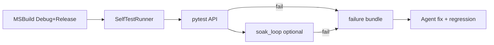

# DESIGN — 自动化测试

## 1. 流水线

## SelfTestRunner

控制台应用。默认 `--preset=gate`（CI 友好）；`--preset=full` 跑全部模块。

顺序（full）：

1. `UrdfRobotLoader::runSelfTest`
2. `engine::runSelfTest`
3. `geoalgo::runSelfTest`（gate 跳过，耗时长）
4. `GeometryServicesSelfTest::runPointCloudSelfTest`（gate 跳过；经 DLL 转发静态库）
5. `vcgalgo::runSelfTest`（gate 跳过；Debug 第三方 assert）
6. `robot_path::runSelfTest`
7. `MeshBoolean::runSelfTest`

启动前须 PATH 含 Qt + OSG（`scripts/run_selftest.ps1`）。

## 3. API fixture

`conftest.py`：选空闲端口 → 启 `CloudSimWeb.exe --port=N` → 轮询 `GET /api/help` → yield base_url → terminate + 收集日志到 `artifacts/`。

## 4. 崩溃捕获

`CrashDump::install()`：`SetUnhandledExceptionFilter` → `MiniDumpWriteDump` → `{exeDir}/crash/`。  
`CLOUDSIM_WEB_CRASH_ON_START=1` 仅 CloudSimWeb 启动后故意崩溃（验证用）。

## 5. Soak

每轮：primitive → patch → undo → redo → collision-settings 往返 → sidecar 往返；采样 `WorkingSet`；线性回归斜率超阈值失败。
