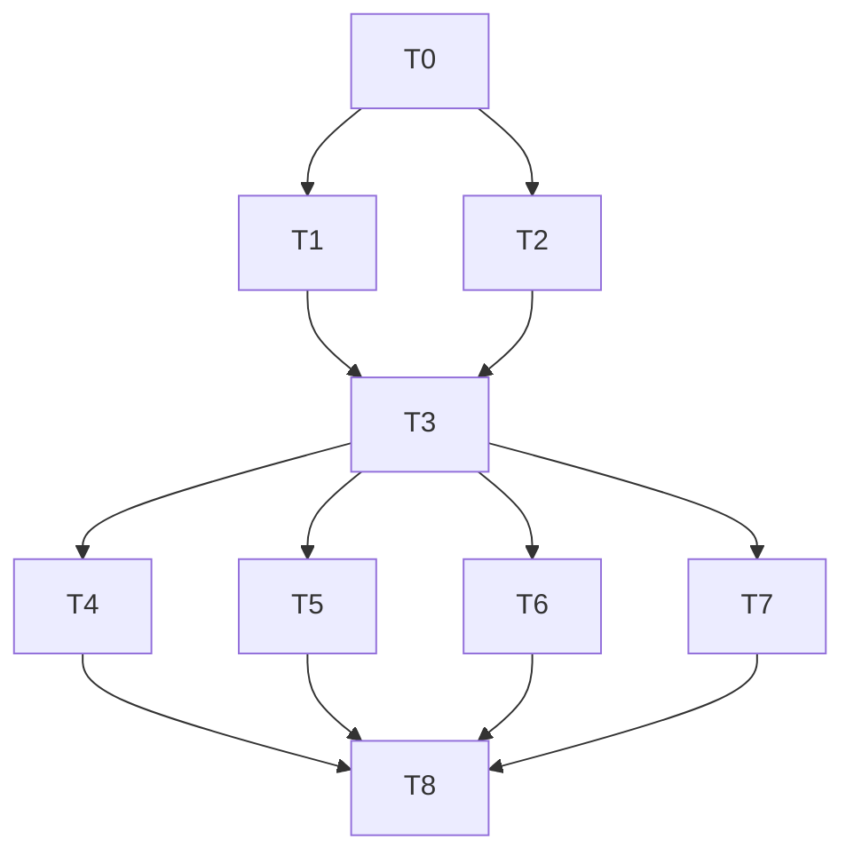

# TASK — 自动化测试

| ID | 任务 | 验收 |
|----|------|------|
| T0 | 6A 文档骨架 | docs/features/自动化测试/ 齐全 |
| T1 | SelfTestRunner + 入 sln | 双配置编过，退出码 0 |
| T2 | pytest API + run_api_tests.ps1 | 约 10 用例可跑 |
| T3 | run_checks.ps1 | 一键门禁 |
| T4 | CrashDump + CRASH_ON_START | dump 落盘 |
| T5 | soak_loop + run_soak.ps1 | 200 轮可跑 |
| T6 | CI yml + CI_RUNNER_SETUP | 工作流存在 |
| T7 | collect_failure_bundle + BUGFIX_LOOP | 文档与脚本就绪 |
| T8 | ACCEPTANCE/FINAL/TODO | 验收关闭 |

