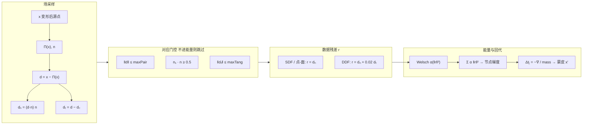
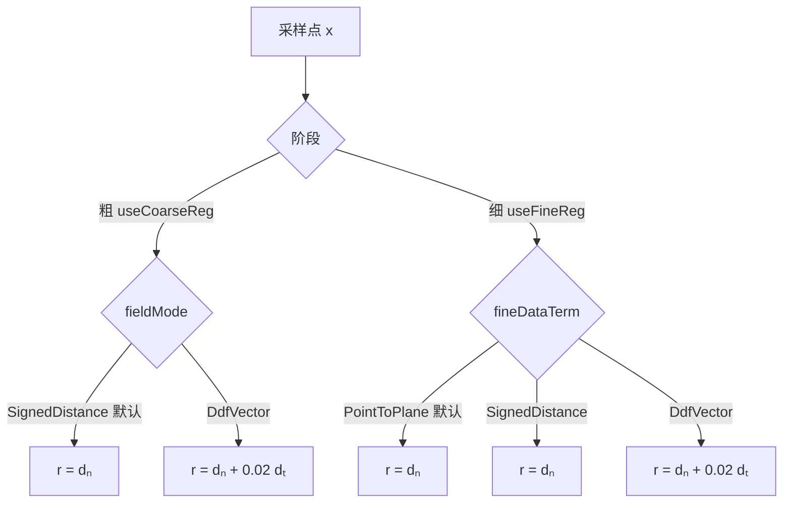

# SDF/DDF 混合非刚性配准

自研模块，与 SPARE **代码树分离**。

## 调试日志（网格错乱排查）

配准成功后插件会输出 `[SDF-debug]` / `[SDF-WARN]` 行，重点看：

| 指标 | 异常含义 |
|------|----------|
| `edgeStretch >10x` 数量大 | 蜘蛛网长三角（拓扑撕裂） |
| `acceptRate` 很低 | 对应门控过严 / 预对齐差 |
| `singleNodeVerts` 比例高 | 蒙皮不连续 → 尖刺 |
| `nodeDisp≪meanErr` | 边/平滑过强，非刚性几乎未动 |
| `meshTopo=0` 但有 edges | 未走网格拓扑蒙皮 |
| `weldRatio` 接近 100% | soup 几乎未焊点，角点独立 |

RMSE 低但 `edgeStretch` 高 ⇒ 点贴面、三角已撕开。  
`edgeStretch≈1` 且 `nodeDisp≈0` ⇒ 网格没被撕，但也几乎没非刚性变形。

## 为何日志 RMSE 正常但显示像蜘蛛网？

**平均误差 / RMSE 只度量「采样点到目标表面的距离」**，不检查三角边是否被拉长。

多凸起零件上，欧氏 kNN 蒙皮会把凹槽两侧顶点绑到不同瓣的节点；数据项把各瓣顶点都贴到目标上（RMSE 仍可到几 mm），桥接三角却被撕成黑色长条。

网格路径现已：

1. **沿网格邻接**做蒙皮 / 节点连边（不跨空腔）  
2. **边长保持能量**（`wArapCoarse`）锁 rest 边向量  

## 逻辑总览

```mermaid
flowchart TB
  subgraph prep [预处理]
    A[源/目标 xyz + 法线] --> B[质心对齐]
    B --> C{刚性预对齐?}
    C -->|是| D[点-面 ICP]
    C -->|否| E[尺度归一化]
    D --> E
  end

  subgraph field [目标距离场]
    E --> F[KdTree 精确 NN]
    F --> G["查询: Π(x), n, d=x−Π(x), φ=d·n"]
  end

  subgraph graph [变形图]
    E --> H[FPS 节点 + ED 蒙皮]
  end

  subgraph solve [粗 → 细 只更新节点平移 tⱼ]
    G --> I[粗: fieldMode 数据项]
    H --> I
    I --> J[节点平滑 + 步长钳制]
    J --> K[细: fineDataTerm 数据项]
    K --> L[节点平滑]
    L --> M[蒙皮写回顶点]
  end

  prep --> field
  prep --> graph
  field --> solve
  graph --> solve
```

## 数据项（重点）

对变形后源点 \(x\)，在目标场取最近点 \(\Pi(x)\) 与法线 \(n\)：

\[
\mathbf{d}=x-\Pi(x),\quad
\phi=\mathbf{d}\cdot n,\quad
\mathbf{d}_n=\phi\,n,\quad
\mathbf{d}_t=\mathbf{d}-\mathbf{d}_n
\]

| 残差形式 | 公式 | 含义 |
|----------|------|------|
| **SDF / 点-面** | \(r=\mathbf{d}_n=\phi\,n\) | 只沿法向贴合；柱面轴向无驱动力，不易拉丝 |
| **DDF（阻尼）** | \(r=\mathbf{d}_n+0.02\,\mathbf{d}_t\) | 保留极弱切向，补滑动；切向过大会轴向错配 |



### 粗 / 细如何选残差



- **粗阶段** `fieldMode`：默认 **SDF（法向）**；可选阻尼 DDF。  
- **细阶段** `fineDataTerm`：默认 **点-面**（与 SDF 残差同形 \(r=\mathbf{d}_n\)）；可选阻尼 DDF / SDF。  
- 数据项只驱动**变形图节点平移** \(t_j\)，顶点经 ED 蒙皮得到；另有节点平滑项，不是逐顶点独立投影。

### 几何直观

```text
        目标表面
    ───────────────  n ↑
              Π(x)
               ↑ dₙ   ← SDF / 点-面只消除这一段
         x ●───→      ← dₜ 沿表面；完整 DDF 会拉它（管件上易轴向错配）
              d
```

## 管状/细长件拉丝根因（本轮）

| 根因 | 现象 | 对策 |
|------|------|------|
| 蒙皮硬截断 `(1-d/r)^2` 常只剩 1 个节点 | 节间尖刺、折痕 | ED 多项式权重，影响半径 `2.5×` 采样距 |
| 法线一致性仅 `dot≥0` | 柱面↔端盖正交也通过 → 轴向错配 | 要求 `n_s·n_t ≥ 0.5` |
| `maxPair≈0.15·diag` 过大 | 长管轴向远端 NN | `min(0.06·diag, max(20s, 2.5R))` |
| 无切向门控 | 沿表面滑移拉丝/重影端 | `‖d_tang‖` 超阈值则拒对应 |
| 顶点独立 Laplacian | 与蒙皮场不一致 | 改为节点位移平滑 |
| soup 焊点过细 | 共点不焊 → 三角撕裂 | 量化 `max(1e-4, 1e-6·diag)` |

## 默认参数

| 项 | 默认 |
|----|------|
| `fieldMode` | SignedDistance |
| `rigidPreAlign` | true |
| `wSmo` | 8.0 |
| 细阶段 | Point-to-plane |

## 建议操作

1. 场模式保持 **有符号 SDF**，勾选 **刚性预对齐**
2. 重编 `PointCloudAlgorithm` + Data + Host + PointCloudPlugin
3. 源/目标姿态差过大时先 ICP

轨迹算子仍走 SPARE。
