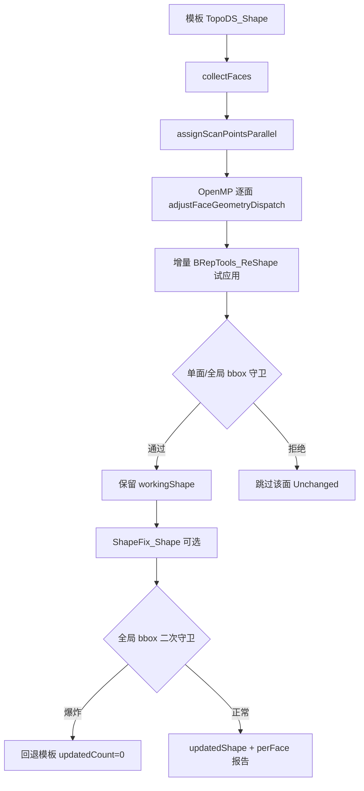

# CAD 模板 + 扫描点云 → B-rep 面重构

点云插件「CAD 模板 B-rep 更新」：**反向配准**（固定扫描、变换 CAD 模板）；用户在 3D 视图拖动 **CAD 工件** 与扫描大致对齐后，后台 soup ICP 精化（可选）+ 逐面几何调整，**注册新的 `BrepModel` 工件**（原模板保持不变）。

## 1. 端到端流程

UI 拆为两步：**匹配 (ICP)** 与 **面重构**；面选择经 `geometryHost()->pickStepElementFromViewport` 累积到 `selectedFaceIndices`。

```text
PointCloudDockWidget
  ├─ [匹配] IPluginPointCloudHost::registerScanToCadTemplate
  │    PluginPointCloudHostImpl
  │      ├─ prepareScanPointCloudForRegistration（校验/必要时从 PLY 重载）
  │      ├─ transformScanPointsToTemplateModelFrame（扫描→STEP，固定不动）
  │      ├─ captureRegistrationWorldFrameSnapshot（OSG 世界矩阵快照）
  │      ├─ Job: geometry_backend_ops::registerScanToCadTemplate（反向 soup ICP）
  │      ├─ applyTemplateRegistrationToVisual（模板 OSG + backend pose/rotation）
  │      ├─ 预览失败时 restoreTemplateShapeFromStep（恢复原始 STEP 几何）
  │      └─ TemplateBrepAlignCache（alignedWorkXyz/Normals + alignedTemplateShape + report）
  │
  └─ [面重构] IPluginPointCloudHost::updateTemplateBrepFromAlignedScan
       PluginPointCloudHostImpl（校验缓存 scan+template+doc）
         ├─ Job: geometry_backend_ops::updateBrepFromAlignedScan
         │      └─ geoalgo::updateShapeFromPointCloud（基于 cache 中 alignedTemplateShape）
         ├─ registerAdoptedBrepAndLoadScene（新 B-rep，模板不修改）
         └─ alignFaceUpdatedBrepWithTemplateVisual（新工件世界位姿与模板一致）
```

| 阶段 | 入口 | 坐标系 / 表示 |
|------|------|----------------|
| 手动对齐 | 用户拖动 **CAD 工件** `pose/rotation` | OSG 世界 |
| 配准输入 | `transformScanPointsToTemplateModelFrame` | **STEP 文件坐标**（与 `shapeRef()`、`FeaturePickTransform` 一致） |
| 反向 ICP | displaySoup 点云 + FPFH/RANSAC + 点-面 ICP（`pclalgo`） | 输出 `templateToScan`；扫描 stored **不变** |
| 匹配预览 | `applyTemplateRegistrationToVisual` | 见 §2.1（装配 STEP 与常规模型分支不同） |
| 面更新输入 | `updateShapeFromPointCloud(alignedTemplateShape, …)` | **ICP 对齐后的模型坐标**（aligned 系） |
| 新工件显示 | `alignFaceUpdatedBrepWithTemplateVisual` | aligned 几何 + 与模板等价的世界矩阵（§2.2） |

### 1.1 新工件注册（Host）

面重构成功后 `PluginPointCloudHostImpl`：

1. `updateBrepFromAlignedScan` 将 `updatedShape` 写入 `result->brep`（**aligned 系**）
2. 复制模板 `color`；命名 `{模板名}_updated`（或 `displayNameUtf8`）
3. `clearBrepImportArtifactsCache()` 后 `registerAdoptedBrepAndLoadScene(..., resetViewToHome=false, skipRebase=true)`
4. **`alignFaceUpdatedBrepWithTemplateVisual`**：按 §2.2 设置新工件 `pose/rotation` 与 OSG 根矩阵（**勿**直接 `setPose(templateBrep->pose())`，否则会重复叠 ICP）
5. 模板、点云、新工件均保持可见；相机对焦新工件

`updateResult.newBrepBackendId` 为新 backend id，**不是**模板 id。

### 1.2 配准结果门控（Host）

| 字段 | 含义 |
|------|------|
| `registerOk` | 算法流水线完成 |
| `registrationPreviewOk` | 重叠预览通过（inlier 统计，见 §3.4）→ 才调用 `applyTemplateRegistrationToVisual` |
| `icpRmseGatePassed` | RMSE ≤ `max(faceBand×8, 12)` mm → 才写入 `TemplateBrepAlignCache` 供面重构 |

预览通过但 RMSE 超门限时：模板显示已更新，面重构按钮仍会因缓存未写入而要求重新匹配。

## 2. 坐标变换（关键）

与 B-rep 拾取、轨迹 AI overlay 共用规则（`feature_pick_transform` / `DocumentPointCloudOps`）：

1. **`resolvePickScopeBackendId`**：装配子零件无 Geode 时 alias 到 `importParent` visual id。
2. **统一世界坐标**（[`spatial_contract_world_pose.md`](spatial_contract_world_pose.md)）：`stored` 为世界绝对坐标；经 `getBackendRootWorldMatrix` 做 stored↔world，**不**加减 `modelCenter`。
3. 扫描/模板配准：世界系 ICP，结果只写 `template.pose`。

实现：`CloudSimPluginHost/source/DocumentPointCloudOps.cpp`  
头文件：`inc/DocumentPointCloudOps.h`

**常见故障**：3D 里看起来对齐，但 `frameCheck pairHits=0` → 变换 id 或 skip-rebase 与显示不一致；修复后 `pairHits` 应 ≥ 32（512 点采样内）。手动对齐应拖动 **CAD 工件**，不是点云。

### 2.1 匹配预览：`applyTemplateRegistrationToVisual`

实现：`DocumentPointCloudOps.cpp`。输入 `alignedTemplateShape`（ICP 烘焙后的 shape，供 cache/面重构）与 `templateToScanInModelFrame`（STEP 模型系）。

**行向量 OSG 约定**（与 `engine::osgMatrixFromRigidTransform` 一致）：

```text
worldAfter = icpOsg × worldBefore
p_world = p_model × worldAfter   （原始 STEP 几何）
p_world = p_aligned × worldBefore （ICP 已烘焙进几何时）
```

| 分支 | 条件 | backend shape | OSG 根矩阵 | backend pose/rotation |
|------|------|---------------|------------|------------------------|
| **originalPose**（装配 STEP 默认） | `skipRebase && hasIcp`，且能重载原始 STEP | 保持 **原始 STEP** | `worldAfter` | 由 `worldAfter` 分解写入 |
| **bakedAligned**（fallback） | 上述 STEP 重载失败 | `alignedTemplateShape` | 保持 `worldBefore` | 不更新（几何已含 ICP） |
| **常规模型** | `!skipRebase` | `alignedTemplateShape` | `worldAfter` | 由 `worldAfter` 分解（含 modelCenter 扣除） |

要点：

- `alignedTemplateShape` **始终**写入 `TemplateBrepAlignCache.report`，面重构只用 cache，不依赖模板 backend 是否仍为原始几何。
- Eigen→OSG 必须用 `RigidTransform::fromIsometry` + `osgMatrixFromRigidTransform`，禁止手写列主序拷贝（会导致旋转爆炸）。
- 预览失败时 Host 调用 `restoreTemplateShapeFromStep` 恢复模板原始几何。

### 2.2 面重构新工件：`alignFaceUpdatedBrepWithTemplateVisual`

面更新输出 `updatedShape` 与 `alignedTemplateShape` 同系（**ICP 对齐坐标**）。注册后若直接复制模板 `pose/rotation`（对应 **originalPose** 路径下的 `worldAfter`），会在 aligned 几何上 **重复施加 ICP**。

算法（`registerAdoptedBrepAndLoadScene` **之后**调用）：

1. 读取模板 visual 的 `templateWorld`（OSG 根世界矩阵）
2. 若模板 backend `pose/rotation` 与 `templateWorld` 分解结果一致（originalPose 路径）  
   → `worldForAligned = inverse(icpOsg) × templateWorld`（即配准前的 `worldBefore`）
3. 否则（bakedAligned fallback）→ `worldForAligned = templateWorld`
4. `writeBackendPoseFromWorldMatrix` + `setBackendRootWorldMatrixFromWorld` 作用于新工件

新工件与模板在 3D 中应 **世界位姿重合**（面形可因重构而变化）。

## 3. 配准流水线（反向 `alignScanToTemplateRegistration`）

实现：`Data/source/GeometryBackendOps.cpp`；模板点云：`GeometryAlgorithm/BrepImportArtifacts.cpp`（`extractDisplaySoupPointCloud`）；ICP 核心：`PointCloudAlgorithm/RegistrationRigid.h`（`pclalgo::rigidRegisterPointToPlaneIcp`）。

**方向**：固定扫描点（STEP 系），ICP 输出 `templateToScan` 作用于模板 B-rep；`scanToTemplate = inverse(templateToScan)` 仅作兼容字段。

**模板侧数据源**：导入时缓存的 `displaySoup` / `displayNormals`（与 OSG 显示同一套三角网格顶点），均匀下采样至约 40000 点；**不再**调用 `sampleShapeSurfacePoints` 或配准阶段的 `BRepExtrema` 投影。

### 3.1 非预对齐（`scanAlreadyInTemplateFrame=false`）

```text
extractDisplaySoupPointCloud → bbox 居中 → PCA 朝向 → [可选 RANSAC 反向] → 粗反向 ICP → 点-面精 ICP（soup）
```

### 3.2 预对齐（插件固定 `scanAlreadyInTemplateFrame=true`）

`resolveRegistrationAlignMode` 根据初始 overlap 选择策略（日志字段 `alignMode`）：

| 模式 | 条件（概要） | 行为 |
|------|--------------|------|
| `manualTrusted` | overlap 充足，用户 CAD 预对齐可信 | 跳 bbox/PCA/RANSAC；多尺度 soup ICP |
| `manualPartial` | `pairHits∈[1,31]` 且 maxDev 适中 | 跳 bbox/PCA；soup ICP |
| `autoRecover` | **`pairHits=0`** 或 maxDev 过大 | bbox+PCA → [RANSAC] → soup ICP → **coarse ICP ladder 回退** → 可选 tight soup |
| `coldStart` | `scanAlreadyInTemplateFrame=false` | 完整粗配 + RANSAC + soup ICP |

```text
coarseStage=modeSelect → bbox → pca → frameCheck → ransac? → soupMulti → [fallback] coarseIcpLadder → [optional] soupRefine
→ applyIsometryToShapeHandle → alignedTemplateShape + templateToScan
```

| 参数 / 行为 | 说明 |
|-------------|------|
| `enableRansacCoarseMatch` | `manualTrusted` 不跑；`autoRecover` 在 recovery 后 overlap 仍不足时跑；**`overlapHits=0` 时放大 inlierDistanceMm / featureVoxelMm** |
| soup 首档 maxPair | `allowLargeCorrection` 且 baselineMaxDev > modelDiag×0.1 时：`min(baseline×0.95, modelDiag×0.4)` |
| coarse ICP ladder | soup rollback 或 post-soup `pairHits<32` 时触发（`autoRecover` / `coldStart`） |
| 精 ICP | `runReversePointToPlaneIcpStage` → `pclalgo::rigidRegisterPointToPlaneIcp`（模板 soup 点-面） |
| 粗 ICP 后跳过精配 | 粗 RMSE ≤ `max(faceBand×8, 12)` mm 时跳过 fine ICP |
| 预对齐采纳 | `trialMaxDev` 改善 + 位移/转角门控；`autoRecover` 允许 `allowLargeCorrection` |
| 匹配预览 | `registrationPreviewOk` 为真时 `applyTemplateRegistrationToVisual`；**点云 stored 不变** |

### 3.3 重叠预览（`registrationPreviewOk`）

在 ICP 下采样扫描上，对 template soup 做 **inlier 统计**（`measureScanToCloudInlierStats`），避免全云 maxDev 被离群点主导：

- `registrationOverlapMaxDevMm`：inlier 足够时用 inlier maxDev，否则用全局 maxDev
- `registrationPreviewOk`：`inlierHits ≥ 32` 且 inlier maxDev ≤ `max(faceBand×10, 25)` mm

### 3.4 诊断日志（RunLogger `[TemplateBrepUpdate]`）

| 日志 | 含义 |
|------|------|
| `baseline mode=manualTrusted/autoRecover/…` | 配准策略（`RegistrationAlignMode`）；日志前缀 `coarseStage=` |
| `coarseStage=coarseIcpLadder` | soup 未改善时的 coarse ICP 多档回退 |
| `coarseStage=ransac enlarged` | 零重叠时放大 RANSAC 门限 |
| `template soup pts=N (from T tris)` | 从 displaySoup 提取的模板点云规模 |
| `frameCheck pairHits=… maxDevMm=…` | STEP 系重叠与扫描→soup 最近邻最大/平均偏差 |
| `autoRecover bbox+PCA` | 无 overlap 时自动粗对齐 |
| `coarse reverse ICP ok, rmseMm=` | 粗反向离散 ICP 完成 |
| `multi-stage soup ICP` / `reverse soup ICP applied/skipped` | 预对齐多尺度 soup ICP |
| `reverse registration done, icpRmseMm=` | 配准结束 |
| `registration preview ok, inlierMaxDevMm=` | 预览门控通过 |
| `registration overlap inlierHits=` | inlier 命中数与偏差 |
| `assembly STEP: original geometry + ICP pose` | 匹配预览走 originalPose 分支 |

**注意**：`icpRmseMm=0` 且 `pairHits=0` 表示**无有效配对**，不是完美对齐。面更新质量看 `globalMaxDeviationMm` 与 `qualityPassed`。`rigidRegisterTemplateToScanPointToPlane` 仍保留于 `TemplateBrepRegistration.cpp`，供面重构等非配准路径使用。

## 4. 面重构核心逻辑（`updateShapeFromPointCloud`）

实现：`Geometry/GeometryAlgorithm/source/TemplateBrepUpdate.cpp`



### 4.1 扫描点 → 面归属（`assignScanPointsParallel`）

全工件默认走 **bbox 预筛 + 单面投影**（OpenMP 并行），避免对整模做 `BRepExtrema`。

| 步骤 | 说明 |
|------|------|
| 采样步长 `pointStep` | 选择性重构：`pointCount / (selectedFaces × maxAssignPointsPerFace)`；全工件：`pointCount / (faceCount × effectiveCap)`，`effectiveCap = min(maxAssignPointsPerFace, max(30, 8000/faceCount))` |
| 面 bbox 扩展 | 各面 AABB 按 `faceBandMm` 膨胀，扫描点先命中候选面集合 |
| 距离 + 法线 | 点到面距离 ≤ `faceBandMm`；扫描法线与面法线夹角 ≤ `normalThresholdDeg` |
| 每面预算 | 归属点超过 `maxAssignPointsPerFace` 时均匀抽稀 |
| 输出 | `facePoints[fi]`：STEP 坐标下的归属点列表 |

日志：`assign scan points done, step=… perFaceBudget=… selective=… threads=… ms=…`

### 4.2 逐面几何调整（`adjustFaceGeometryDispatch`）

OpenMP 并行计算各面新几何，**先不写回 shape**，结果存入 `FaceUpdateWorkItem`（`newFace` + `replaceFace` 标志）。

| 面类型（`GeomAbs_SurfaceType`） | 调整方式 | `FaceUpdateAction` |
|-------------------------------|----------|-------------------|
| Plane | 最小二乘拟合 + 原始 wire | `PlaneAdjusted` |
| Cylinder | PCA 轴线 + 径向均值半径 | `CylinderAdjusted` |
| Cone | PCA 轴线 + 半角估算 | `ConeAdjusted` |
| Sphere | 质心 + 径向均值半径 | `SphereAdjusted` |
| Torus | PCA 轴线 + 中位数主半径 | `ToroidAdjusted` |
| BSplineSurface | 见 §4.3 | `BSplineAdjusted` |
| 其他 | `refitFaceFromPoints` 降级 | `PlaneRefit` 等 |

归属点 `< minPointsPerFace` → `SkippedNoPoints`。`selectedFaceIndices` 非空时未选面 → `Unchanged`。

### 4.3 BSpline 面调整（`adjustBSplineFace`）

保留原曲面结点与面边界 wire，仅移动控制点：

1. 复制 `Geom_BSplineSurface`
2. 各归属点投影到曲面；距离 > `bsplineAdjustThresholdMm`（0 → `maxAllowedDeviationMm` → `faceBandMm`）的记为 outlier
3. outlier 按 UV 落入 `bsplineUvGridCellsU × bsplineUvGridCellsV` 网格聚合位移
4. 基函数权重分配到邻近控制点；`bsplinePoleSmoothPasses` 次 Laplacian 平滑位移场
5. `SetPole` 应用位移，单点位移上限 `bsplineMaxPoleMoveMm`（0 → `max(3×threshold, 1mm)`）
6. 用原 `outerWire` 或 UV 参数域重建 `TopoDS_Face`

无 outlier 时返回原面（`Unchanged` 语义，不记 `BSplineAdjusted`）。

### 4.4 增量试应用 + 包围盒守卫

批量 `reshaper.Apply` 曾导致「单面 bbox 正常、组合后整体 bbox 爆炸」。现改为**按面索引顺序增量应用**：

| 守卫 | 条件 | 行为 |
|------|------|------|
| 单面 bbox | 新面对角线 > 原面 ×3 + 500mm | 跳过，`skippedBadBboxFaceCount++` |
| 试应用 null | `trialReshaper.Apply` 失败 | 跳过 |
| 全局 bbox（试应用） | 候选整体对角线 > 模板 ×1.5 + 500mm | 跳过该面，不污染 `workingShape` |
| ShapeFix | `diagAfterFix > diagBeforeFix ×1.25 + 1mm` | 不用 fix 结果（防显示精度丢失） |
| 全局 bbox（最终） | 输出对角线仍超模板 ×1.5 + 500mm | **整件回退模板**，`updatedCount=0` |

通过守卫的面累积到 `workingShape`；`updatedFaceCount` 为最终成功替换面数。

日志：`face geometry update done, updated=… skippedBbox=… skippedNoPts=… threads=… ms=…`

### 4.5 质量门控与结果字段

| 字段 | 说明 |
|------|------|
| `updatedFaceCount` | 成功写入 shape 的面数 |
| `skippedBadBboxFaceCount` | bbox 守卫跳过的面数 |
| `globalMaxDeviationMm` | 选择性重构：仅已更新面归属点；全量：全扫描点到更新 shape |
| `qualityPassed` | `globalMaxDeviationMm ≤ maxAllowedDeviationMm`（`maxAllowedDeviationMm≤0` 时恒 true） |
| `perFace[]` | 每面 `surfaceTypeName`、`action`、偏差统计 |

## 5. 插件参数

`PluginPointCloudTemplateBrepUpdateParams`（SDK）→ `geoalgo::TemplateBrepUpdateParams`（Host 映射）：

| UI / SDK | `TemplateBrepUpdateParams` | 默认 |
|----------|---------------------------|------|
| 体素预滤波 | `voxelPrefilterMm` | 1.0 mm |
| 面带宽 | `faceBandMm` | 2.0 mm |
| 法线夹角 | `normalThresholdDeg` | 35° |
| 每面最少点 | `minPointsPerFace` | 30 |
| 最大允许偏差 | `maxAllowedDeviationMm` | 0.5 mm |
| 用户选择面索引 | `selectedFaceIndices` | 空（处理所有面） |
| 每面归属点数上限 | `maxAssignPointsPerFace` | 800 |
| BSpline UV 网格 U/V | `bsplineUvGridCellsU/V` | 24 / 12 |
| BSpline 极点平滑 | `bsplinePoleSmoothPasses` | 2 |
| BSpline 超阈值 | `bsplineAdjustThresholdMm` | 0（链式默认） |
| BSpline 控制点最大位移 | `bsplineMaxPoleMoveMm` | 0（自动） |
| 自定义新工件名 | `displayNameUtf8` | 空 → `{模板名}_updated` |

Host 另设：`scanAlreadyInTemplateFrame=true`；`sampleSpacingMm=2.0`；`enableRansacCoarseMatch` 默认 true。

### 5.1 选择性面重构

`selectedFaceIndices`（0-based 面索引）控制哪些面参与调整：
- **为空**：处理所有面（默认）
- **非空**：仅处理指定面

面拾取：`IPluginGeometryHost::pickStepElementFromViewport`（`PluginGeometryElementKind::Face`）。

插件 UI 日志仅输出**已调整面摘要**（最多 25 条），避免 200+ 面刷屏导致 Dock 卡顿。

## 6. 质量门控（配准 + 面更新）

| 门控 | 条件 |
|------|------|
| 配准 RMSE | `icpRmseMm > max(faceBand×8, 12)` → `icpRmseGatePassed=false`（不写面重构缓存） |
| 配准预览 | `registrationPreviewOk=false` → 不刷新模板显示，尝试 `restoreTemplateShapeFromStep` |
| 面更新 | `globalMaxDeviationMm` vs `maxAllowedDeviationMm` → `qualityPassed` |
| 零面更新 | `updatedFaceCount==0`：若有 `skippedBadBboxFaceCount>0` 提示包围盒守卫；否则提示 ICP/面带/点数/阈值 |

**调参提示**：ICP RMSE 明显大于 `faceBandMm` 时，面归属质量下降，可增大面带或重新配准。

## 7. 性能

| 环节 | 策略 |
|------|------|
| 点归属 | OpenMP + 面 bbox 预筛（`GeometryAlgorithm.vcxproj` 启用 `/openmp`） |
| 面几何 | OpenMP `parallel for` over face index |
| 全工件采样 | `effectiveAssignPointsPerFace` 按面数摊薄，避免 `faceCount × 800` 爆炸 |

典型 200+ 面工件：归属数秒 + 面更新数秒（视 CPU 核数与更新面数而定）。

## 8. 相关源码索引

| 路径 | 说明 |
|------|------|
| `Plugins/PointCloudPlugin/source/PointCloudDockWidget.cpp` | 侧栏 UI、参数、摘要日志 |
| `UI/CloudSimPluginHost/source/PluginPointCloudHostImpl.cpp` | 双 Job、新 B-rep 注册、缓存 |
| `UI/CloudSimPluginHost/source/DocumentPointCloudOps.cpp` | 坐标变换、`applyTemplateRegistrationToVisual`、`alignFaceUpdatedBrepWithTemplateVisual` |
| `Data/source/GeometryBackendOps.cpp` | 配准编排（`RegistrationAlignMode`、soup ICP）、`updateBrepFromAlignedScan` |
| `Geometry/GeometryAlgorithm/source/BrepImportArtifacts.cpp` | `extractDisplaySoupPointCloud` |
| `Geometry/PointCloudAlgorithm/` | FPFH/RANSAC、点-面 ICP |
| `Geometry/GeometryAlgorithm/source/TemplateBrepUpdate.cpp` | 面归属、调整、增量应用 |
| `Geometry/GeometryAlgorithm/source/TemplateBrepRegistration.cpp` | `applyIsometryToShapeHandle`（配准/面更新 shape 变换） |
| `Host/CloudSimHost/source/BackendFileImport.cpp` | `registerAdoptedBrepAndLoadScene` |

## 9. 相关文档

- [`../src/UI/OsgWidgetCore/DEVELOPER_GUIDE.md`](../src/UI/OsgWidgetCore/DEVELOPER_GUIDE.md) — `resolvePickScopeBackendId`、`m_backendSkipCenterRebase`
- [`../src/UI/RobotWidget/DEVELOPER_GUIDE.md`](../src/UI/RobotWidget/DEVELOPER_GUIDE.md) — `feature_pick_transform`、STEP 坐标约定
- [`../src/Data/Data/DEVELOPER_GUIDE.md`](../src/Data/Data/DEVELOPER_GUIDE.md) §4.6
- [`../src/UI/CloudSimPluginHost/DEVELOPER_GUIDE.md`](../src/UI/CloudSimPluginHost/DEVELOPER_GUIDE.md) §3.7
- [`../src/Geometry/GeometryAlgorithm/DEVELOPER_GUIDE.md`](../src/Geometry/GeometryAlgorithm/DEVELOPER_GUIDE.md) §3.3
