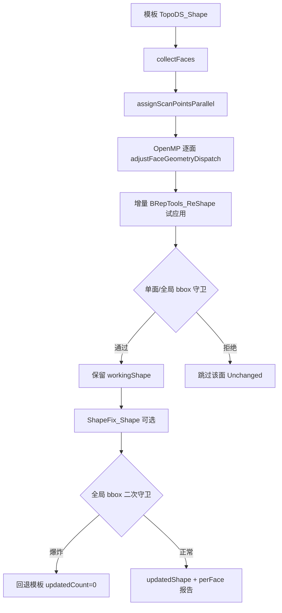

# CAD 模板 + 扫描点云 → B-rep 面重构

点云插件「CAD 模板 B-rep 更新」：用户在 3D 视图手动对齐扫描点云与 STEP 工件后，后台 ICP 精化（可选）+ 逐面几何调整，**注册新的 `BrepModel` 工件**（原模板保持不变）。

## 1. 端到端流程

UI 拆为两步：**匹配 (ICP)** 与 **面重构**；面选择经 `geometryHost()->pickStepElementFromViewport` 累积到 `selectedFaceIndices`。

```text
PointCloudDockWidget
  ├─ [匹配] IPluginPointCloudHost::registerScanToCadTemplate
  │    PluginPointCloudHostImpl
  │      ├─ transformScanPointsToTemplateModelFrame
  │      ├─ Job: geometry_backend_ops::registerScanToCadTemplate
  │      ├─ applyScanIcpAlignmentToStoredPoints
  │      └─ TemplateBrepAlignCache（alignedWorkXyz/Normals + report）
  │
  └─ [面重构] IPluginPointCloudHost::updateTemplateBrepFromAlignedScan
       PluginPointCloudHostImpl（校验缓存 scan+template+doc）
         ├─ Job: geometry_backend_ops::updateBrepFromAlignedScan
         │      └─ geoalgo::updateShapeFromPointCloud
         └─ registerAdoptedBrepAndLoadScene（新 B-rep，模板不修改）
```

| 阶段 | 入口 | 坐标系 |
|------|------|--------|
| 手动对齐 | 用户拖动点云 `pose/rotation` | OSG 世界 |
| 配准输入 | `transformScanPointsToTemplateModelFrame` | **STEP 文件坐标**（与 `shapeRef()`、`FeaturePickTransform` 一致） |
| ICP 目标 | `sampleShapeSurfacePoints(templateShape)` | 同上 |
| 面更新 | `updateShapeFromPointCloud` | 同上 |
| 场景注册 | `registerAdoptedBrepAndLoadScene` | 显示：`skipInnerModelCenterRebase=false`（与点云去心一致） |

### 1.1 新工件注册（Host）

面重构成功后 `PluginPointCloudHostImpl`：

1. 从 `result->brep` 取更新后 shape（`updateBrepFromAlignedScan` 已写入）
2. 复制模板 `pose` / `rotation` / `color`
3. 命名：`{模板名}_updated`（重名自动 `_2`、`_3`…），或 `displayNameUtf8`
4. `clearBrepImportArtifactsCache()` 后 `registerAdoptedBrepAndLoadScene(..., resetViewToHome=false, skipRebase=false)`
5. 模板、点云、新工件均保持可见；相机对焦新工件

`updateResult.newBrepBackendId` 为新 backend id，**不是**模板 id。

## 2. 坐标变换（关键）

与 B-rep 拾取、轨迹 AI overlay 共用规则（`feature_pick_transform` / `DocumentPointCloudOps`）：

1. **`resolvePickScopeBackendId`**：装配子零件无 Geode 时 alias 到 `importParent` visual id。
2. **`backendSkipsInnerModelCenterRebase`**：为真时不加减 `modelCenter`（装配 STEP 导入、`skipInnerModelCenterRebase=true`）。
3. 扫描：`stored → world`（减 scan modelCenter 后乘 worldMat）。
4. 模板：`world → STEP model`（乘 inv(worldMat) 后加 template modelCenter）。

实现：`CloudSimPluginHost/source/DocumentPointCloudOps.cpp`  
头文件：`inc/DocumentPointCloudOps.h`

**常见故障**：3D 里看起来对齐，但 `frameCheck pairHits=0` → 变换 id 或 skip-rebase 与显示不一致；修复后 `pairHits` 应 ≥ 32（512 点采样内）。

## 3. 配准流水线（`alignScanToTemplateRegistration`）

实现：`Data/source/GeometryBackendOps.cpp`

### 3.1 非预对齐（`scanAlreadyInTemplateFrame=false`）

```text
bbox 中心对齐 → PCA 朝向 → [可选 RANSAC] → 粗 ICP（modelDiag 比例档）→ 精 ICP（点-面）
```

### 3.2 预对齐（插件固定 `scanAlreadyInTemplateFrame=true`）

```text
跳过 bbox/PCA/RANSAC
→ frameCheck（pairHits、centroidDistMm）
→ 分支 A：pairHits ≥ 32 → 仅试精 ICP；改善且平移/旋转在门限内才应用
→ 分支 B：pairHits < 32 → recovery：bbox 居中 + PCA 朝向 + RANSAC + modelDiag 档粗 ICP + 精 ICP
```

| 参数 / 行为 | 说明 |
|-------------|------|
| `enableRansacCoarseMatch` | 预对齐且 overlap 充足时**不运行** RANSAC；recovery 路径**运行** RANSAC |
| recovery 粗 ICP 档位 | `modelDiag × [0.5, 0.75, 1.0, 1.25]`（与非预对齐路径一致） |
| recovery 精 ICP maxPair | `max(modelDiag × 0.05, 2.0)` |
| 粗 ICP 法线门控 | 关闭（`normalGateDeg=0`） |
| 精 ICP 法线门控 | `normalThresholdDeg`（默认 35°） |
| 预对齐精 ICP 采纳 | `trialOverlapRmse + 0.02 < baseline` 且 `trans ≤ max(faceBand×5,8)mm`、`rot ≤ 5°` |
| `overlapRmseMm` | 重叠区 RMSE（`pair ≤ max(faceBand×2.5, 2)mm`）；预对齐成功路径用作 `icpRmseMm` |

### 3.3 诊断日志（RunLogger `[TemplateBrepUpdate]`）

| 日志 | 含义 |
|------|------|
| `frameCheck pairHits=x/512 centroidDistMm=y` | STEP 系重叠探测；`x=0` 表示坐标或对齐问题 |
| `recovery ICP: … overlap insufficient` | 走 bbox + PCA + RANSAC + modelDiag 档粗/精 ICP |
| `pre-aligned ICP applied/skipped` | 轻量精 ICP 是否写回 |
| `overlapRmseMm=` | 重叠区质量（非全点云最大偏差） |
| `registration done, icpRmseMm=` | 配准结束 |

**注意**：`icpRmseMm=0` 且 `pairHits=0` 表示**无有效配对**，不是完美对齐。面更新质量看 `globalMaxDeviationMm` 与 `qualityPassed`。

## 4. 面重构核心逻辑（`updateShapeFromPointCloud`）

实现：`Geometry/GeometryAlgorithm/source/TemplateBrepUpdate.cpp`



### 4.1 扫描点 → 面归属（`assignScanPointsParallel`）

全工件默认走 **bbox 预筛 + 单面投影**（OpenMP 并行），避免对整模做 `BRepExtrema`。

| 步骤 | 说明 |
|------|------|
| 采样步长 `pointStep` | 选择性重构：`pointCount / (selectedFaces × maxAssignPointsPerFace)`；全工件：`pointCount / (faceCount × effectiveCap)`，`effectiveCap = min(maxAssignPointsPerFace, max(30, 8000/faceCount))` |
| 面 bbox 扩展 | 各面 AABB 按 `faceBandMm` 膨胀，扫描点先命中候选面集合 |
| 距离 + 法线 | 点到面距离 ≤ `faceBandMm`；扫描法线与面法线夹角 ≤ `normalThresholdDeg` |
| 每面预算 | 归属点超过 `maxAssignPointsPerFace` 时均匀抽稀 |
| 输出 | `facePoints[fi]`：STEP 坐标下的归属点列表 |

日志：`assign scan points done, step=… perFaceBudget=… selective=… threads=… ms=…`

### 4.2 逐面几何调整（`adjustFaceGeometryDispatch`）

OpenMP 并行计算各面新几何，**先不写回 shape**，结果存入 `FaceUpdateWorkItem`（`newFace` + `replaceFace` 标志）。

| 面类型（`GeomAbs_SurfaceType`） | 调整方式 | `FaceUpdateAction` |
|-------------------------------|----------|-------------------|
| Plane | 最小二乘拟合 + 原始 wire | `PlaneAdjusted` |
| Cylinder | PCA 轴线 + 径向均值半径 | `CylinderAdjusted` |
| Cone | PCA 轴线 + 半角估算 | `ConeAdjusted` |
| Sphere | 质心 + 径向均值半径 | `SphereAdjusted` |
| Torus | PCA 轴线 + 中位数主半径 | `ToroidAdjusted` |
| BSplineSurface | 见 §4.3 | `BSplineAdjusted` |
| 其他 | `refitFaceFromPoints` 降级 | `PlaneRefit` 等 |

归属点 `< minPointsPerFace` → `SkippedNoPoints`。`selectedFaceIndices` 非空时未选面 → `Unchanged`。

### 4.3 BSpline 面调整（`adjustBSplineFace`）

保留原曲面结点与面边界 wire，仅移动控制点：

1. 复制 `Geom_BSplineSurface`
2. 各归属点投影到曲面；距离 > `bsplineAdjustThresholdMm`（0 → `maxAllowedDeviationMm` → `faceBandMm`）的记为 outlier
3. outlier 按 UV 落入 `bsplineUvGridCellsU × bsplineUvGridCellsV` 网格聚合位移
4. 基函数权重分配到邻近控制点；`bsplinePoleSmoothPasses` 次 Laplacian 平滑位移场
5. `SetPole` 应用位移，单点位移上限 `bsplineMaxPoleMoveMm`（0 → `max(3×threshold, 1mm)`）
6. 用原 `outerWire` 或 UV 参数域重建 `TopoDS_Face`

无 outlier 时返回原面（`Unchanged` 语义，不记 `BSplineAdjusted`）。

### 4.4 增量试应用 + 包围盒守卫

批量 `reshaper.Apply` 曾导致「单面 bbox 正常、组合后整体 bbox 爆炸」。现改为**按面索引顺序增量应用**：

| 守卫 | 条件 | 行为 |
|------|------|------|
| 单面 bbox | 新面对角线 > 原面 ×3 + 500mm | 跳过，`skippedBadBboxFaceCount++` |
| 试应用 null | `trialReshaper.Apply` 失败 | 跳过 |
| 全局 bbox（试应用） | 候选整体对角线 > 模板 ×1.5 + 500mm | 跳过该面，不污染 `workingShape` |
| ShapeFix | `diagAfterFix > diagBeforeFix ×1.25 + 1mm` | 不用 fix 结果（防显示精度丢失） |
| 全局 bbox（最终） | 输出对角线仍超模板 ×1.5 + 500mm | **整件回退模板**，`updatedCount=0` |

通过守卫的面累积到 `workingShape`；`updatedFaceCount` 为最终成功替换面数。

日志：`face geometry update done, updated=… skippedBbox=… skippedNoPts=… threads=… ms=…`

### 4.5 质量门控与结果字段

| 字段 | 说明 |
|------|------|
| `updatedFaceCount` | 成功写入 shape 的面数 |
| `skippedBadBboxFaceCount` | bbox 守卫跳过的面数 |
| `globalMaxDeviationMm` | 选择性重构：仅已更新面归属点；全量：全扫描点到更新 shape |
| `qualityPassed` | `globalMaxDeviationMm ≤ maxAllowedDeviationMm`（`maxAllowedDeviationMm≤0` 时恒 true） |
| `perFace[]` | 每面 `surfaceTypeName`、`action`、偏差统计 |

## 5. 插件参数

`PluginPointCloudTemplateBrepUpdateParams`（SDK）→ `geoalgo::TemplateBrepUpdateParams`（Host 映射）：

| UI / SDK | `TemplateBrepUpdateParams` | 默认 |
|----------|---------------------------|------|
| 体素预滤波 | `voxelPrefilterMm` | 1.0 mm |
| 面带宽 | `faceBandMm` | 2.0 mm |
| 法线夹角 | `normalThresholdDeg` | 35° |
| 每面最少点 | `minPointsPerFace` | 30 |
| 最大允许偏差 | `maxAllowedDeviationMm` | 0.5 mm |
| 用户选择面索引 | `selectedFaceIndices` | 空（处理所有面） |
| 每面归属点数上限 | `maxAssignPointsPerFace` | 800 |
| BSpline UV 网格 U/V | `bsplineUvGridCellsU/V` | 24 / 12 |
| BSpline 极点平滑 | `bsplinePoleSmoothPasses` | 2 |
| BSpline 超阈值 | `bsplineAdjustThresholdMm` | 0（链式默认） |
| BSpline 控制点最大位移 | `bsplineMaxPoleMoveMm` | 0（自动） |
| 自定义新工件名 | `displayNameUtf8` | 空 → `{模板名}_updated` |

Host 另设：`scanAlreadyInTemplateFrame=true`；`sampleSpacingMm=2.0`；`enableRansacCoarseMatch` 默认 true。

### 5.1 选择性面重构

`selectedFaceIndices`（0-based 面索引）控制哪些面参与调整：
- **为空**：处理所有面（默认）
- **非空**：仅处理指定面

面拾取：`IPluginGeometryHost::pickStepElementFromViewport`（`PluginGeometryElementKind::Face`）。

插件 UI 日志仅输出**已调整面摘要**（最多 25 条），避免 200+ 面刷屏导致 Dock 卡顿。

## 6. 质量门控（配准 + 面更新）

| 门控 | 条件 |
|------|------|
| 配准 | `icpRmseMm > max(faceBand×8, 12)` → `registerScanToCadTemplate` 失败 |
| 面更新 | `globalMaxDeviationMm` vs `maxAllowedDeviationMm` → `qualityPassed` |
| 零面更新 | `updatedFaceCount==0`：若有 `skippedBadBboxFaceCount>0` 提示包围盒守卫；否则提示 ICP/面带/点数/阈值 |

**调参提示**：ICP RMSE 明显大于 `faceBandMm` 时，面归属质量下降，可增大面带或重新配准。

## 7. 性能

| 环节 | 策略 |
|------|------|
| 点归属 | OpenMP + 面 bbox 预筛（`GeometryAlgorithm.vcxproj` 启用 `/openmp`） |
| 面几何 | OpenMP `parallel for` over face index |
| 全工件采样 | `effectiveAssignPointsPerFace` 按面数摊薄，避免 `faceCount × 800` 爆炸 |

典型 200+ 面工件：归属数秒 + 面更新数秒（视 CPU 核数与更新面数而定）。

## 8. 相关源码索引

| 路径 | 说明 |
|------|------|
| `Plugins/PointCloudPlugin/source/PointCloudDockWidget.cpp` | 侧栏 UI、参数、摘要日志 |
| `UI/CloudSimPluginHost/source/PluginPointCloudHostImpl.cpp` | 双 Job、新 B-rep 注册 |
| `UI/CloudSimPluginHost/source/DocumentPointCloudOps.cpp` | 坐标变换 |
| `Data/source/GeometryBackendOps.cpp` | 配准编排、`updateBrepFromAlignedScan` |
| `Geometry/GeometryAlgorithm/source/TemplateBrepUpdate.cpp` | 面归属、调整、增量应用 |
| `Host/CloudSimHost/source/BackendFileImport.cpp` | `registerAdoptedBrepAndLoadScene` |

## 9. 相关文档

- [`../src/UI/OsgWidgetCore/DEVELOPER_GUIDE.md`](../src/UI/OsgWidgetCore/DEVELOPER_GUIDE.md) — `resolvePickScopeBackendId`、`m_backendSkipCenterRebase`
- [`../src/UI/RobotWidget/DEVELOPER_GUIDE.md`](../src/UI/RobotWidget/DEVELOPER_GUIDE.md) — `feature_pick_transform`、STEP 坐标约定
- [`../src/Data/Data/DEVELOPER_GUIDE.md`](../src/Data/Data/DEVELOPER_GUIDE.md) §4.6
- [`../src/UI/CloudSimPluginHost/DEVELOPER_GUIDE.md`](../src/UI/CloudSimPluginHost/DEVELOPER_GUIDE.md) §3.7
- [`../src/Geometry/GeometryAlgorithm/DEVELOPER_GUIDE.md`](../src/Geometry/GeometryAlgorithm/DEVELOPER_GUIDE.md) §3.3
