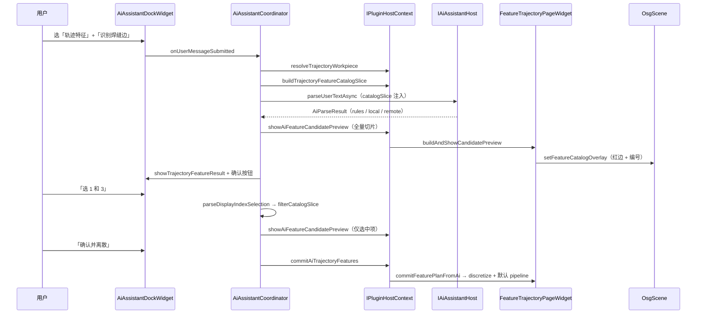

# AI 轨迹特征识别（`trajectory.feature`）

本文档描述 CloudSim **AI 助手 → 轨迹生成页 → 3D 编号高亮 → 确认离散** 的完整开发与验收约定。相关模块索引见 [`MODULE_DEVELOPER_GUIDES.md`](MODULE_DEVELOPER_GUIDES.md)。

## 前置条件

| 项 | 说明 |
|----|------|
| 轨迹页工件 | **轨迹生成** Dock 页 STEP combo 已选当前工件（`FeatureTrajectoryPageWidget::currentWorkpiece`） |
| STEP 路径 | `IRobotDocumentHost::meshBackendStepSourcePath` 可解析到磁盘 STEP |
| 特征目录 | 首次识别前自动 `ensureFeatureCatalogEnumerated()`；亦可在轨迹页手动「枚举特征目录」 |
| AI 配置 | `ai_config.json` 含 `domains[]` 项 `trajectory.feature`（出厂默认见 `ai_config.defaults.json`） |

未选工件时 `AiAssistantCoordinator::prepareTrajectoryFeatureRequest` fail-fast，提示用户先在轨迹页选择 STEP。

## 端到端流程



## 会话状态（`AiAssistantCoordinator`）

| 状态 | 含义 | 用户可输入 |
|------|------|------------|
| `Idle` | 无进行中的特征会话 | 新的识别指令 |
| `AwaitingAxisClarify` | `featureAxis == ambiguous` | 「线特征」/「面特征」 |
| `PreviewCandidates` | 已列出候选，3D 显示**全部**编号 | 「选 N…」、「重新」 |
| `AwaitingSelection` | 用户已选编号，3D 仅高亮**选中项** | 再次「选 N…」调整、确认 |

Coordinator 在 `onUserMessageSubmitted` 开头调用 `tryHandleFeatureFollowUp`：轴澄清、编号选择、会话重置优先于新一轮 LLM 解析。

## 3D 特征叠加层

| 项 | 实现 |
|----|------|
| 入口 | `IRobotOsgViewHost::setFeatureCatalogOverlay` → `OsgScene::setFeatureCatalogOverlay` |
| 数据 | `FeatureTrajectoryPageWidget::buildPreviewOverlayJson`：`computeFeatureAnchor` + 工件世界矩阵 |
| 样式 | 候选边/面 **红色** 高亮；编号 **黑色** 文本（`BackdropType::NONE`）；标签沿 bbox 外法向角向展开，带 leader 线 |
| 清除 | `clearFeatureCatalogOverlay`；确认/取消会话时 Coordinator 调用 `clearAiFeatureCandidatePreview` |

## 编号选择与高亮过滤

用户输入「选 1 和 3」等含数字文本时：

1. `parseDisplayIndexSelection`（Coordinator 本地实现，逻辑与 `AiTrajectoryFeatureCatalog::parseDisplayIndexSelection` 一致）将 **displayIndex（1-based）** 映射为 `candidateId`。
2. `filterCatalogSliceByCandidateIds` 过滤 `catalogSlice` 的 `candidates[]`，**保留原 displayIndex**（聊天列表与 3D 编号一致）。
3. `showAiFeatureCandidatePreview(filteredSlice)` — 3D **仅**显示选中特征。
4. Dock 文案切换为「已选中特征（3D 视口已高亮）」。

首次识别（`PreviewCandidates`）仍展示切片内**全部**候选编号，便于用户浏览后再选。

## 解析链与 catalog 注入

`trajectory.feature` **必须**携带 catalog 上下文，不可走通用 `parseUserTextWithRules(domainId)`。

| 步骤 | 行为 |
|------|------|
| `prepareTrajectoryFeatureRequest` | 解析工件 → `buildTrajectoryFeatureCatalogSlice` → 写入 `AiInferenceRequest.catalogFullUtf8` / `catalogSliceUtf8` |
| `rules` | `AiAssistantHostImpl::parseTrajectoryFeatureRequest` → `AiTrajectoryFeatureCatalog::tryParseTrajectoryFeatureRules`（`suggestFeaturesFromCatalog` 或前 8 项回退） |
| `local` / `remote` | `AiLlmClient` 专用 prompt；user 消息附带 `catalogSliceUtf8` JSON |
| 空 catalog 重试 | LLM 返回「No features in catalog…」或切片无候选时，Coordinator **一次**自动以 rules 重试（`scheduleTrajectoryCatalogRetry`） |

默认 `parser_priority`：`["rules", "local"]`（`ai_config.defaults.json`）。

## 输出 JSON（version 1）

```json
{
  "version": 1,
  "featureAxis": "line|surface|ambiguous",
  "clarifyMessage": "ambiguous 时可选",
  "selectedCandidateIds": ["edge_3"],
  "features": [ { "kind": "EdgeChain", "featureId": "edge_3", "refs": {}, "workpiece": {}, "discretize": {} } ],
  "suggestedPipelineTemplate": "weld_default|glue_default|grind_default"
}
```

- `TrajectoryFeatureDomainHandler::validateOutput`：逐项 `featureSpecFromJson`。
- **确认执行**不经 Handler `execute`，而由 `commitAiTrajectoryFeatures` → `FeatureTrajectoryPageWidget::commitFeaturePlanFromAi`：离散、`TrajectoryEditSession` 写入 raw、注入默认工艺 Op 链。

## 宿主 API（`IPluginHostContext` 1.7.0+）

| API | 职责 |
|-----|------|
| `resolveTrajectoryWorkpiece` | 轨迹页 combo → `backendId` + STEP 路径 |
| `buildTrajectoryFeatureCatalogSlice` | 全量 catalog + 按 `featureAxis` 切片（含 `displayIndex`） |
| `showAiFeatureCandidatePreview` | catalog 切片 JSON → 3D 叠加 |
| `clearAiFeatureCandidatePreview` | 清除叠加 |
| `commitAiTrajectoryFeatures` | 特征计划 JSON → 离散 + session |

Widget 桥接：`MainWindowRobotStubs` → `RobotSimulationController` → `FeatureTrajectoryPageWidget`。

## 关键源文件

| 模块 | 路径 |
|------|------|
| 编排 | `UI/AiWidget/source/AiAssistantCoordinator.cpp` |
| Catalog / 规则 | `UI/CloudSimPluginHost/source/Ai/AiTrajectoryFeatureCatalog.cpp` |
| LLM prompt | `UI/CloudSimPluginHost/source/Ai/AiLlmClient.cpp` |
| 宿主桥 | `UI/CloudSimPluginHost/source/PluginHostContext.cpp`、`UI/Widget/source/MainWindowRobotStubs.cpp` |
| 轨迹页 | `UI/RobotWidget/source/FeatureTrajectoryPageWidget.cpp` |
| 3D 叠加 | `UI/OsgWidgetCore/source/OsgScene.cpp` |
| Anchor | `Geometry/GeometryAlgorithm/source/FeatureDiscretize.cpp`（`computeFeatureAnchor`） |
| 类型 / 请求 | `Plugins/CloudSimAiSDK/inc/AiTrajectoryFeatureTypes.h`、`AiInferenceTypes.h` |

**编译注意**：`AiTrajectoryFeatureCatalog.cpp` 同时编入 `CloudSimPluginHost` 与 `Widget.vcxproj`（PluginHost 源码由 Widget 工程消费时需同步 vcxproj，避免 LNK2001）。

## 路由关键词

`AiDomainRouter`：轨迹、焊缝、涂胶、打磨、trajectory、seam、weld、glue、grind 等 → `trajectory.feature`（避免误路由到 `geometry.recognize`）。

## 训练与配置

| 文档 | 内容 |
|------|------|
| [`tools/ai-training/domains/trajectory.feature/README.md`](../tools/ai-training/domains/trajectory.feature/README.md) | 数据集 schema、校验 |
| [`tools/ai-training/CONFIGURATION.md`](../tools/ai-training/CONFIGURATION.md) | `ai_config.json` 字段 |
| [`Plugins/CloudSimAiSDK/DEVELOPER_GUIDE.md`](../src/Plugins/CloudSimAiSDK/DEVELOPER_GUIDE.md) | 分域接模总览 |

生成数据集：`python tools/ai-training/scripts/gen_trajectory_feature_dataset.py`  
校验：`python tools/ai-training/scripts/build_dataset.py trajectory.feature`

## 运行时验收清单

1. 轨迹页选 STEP → AI「轨迹特征」→「识别焊缝边」→ 对话列表编号 + 3D **全部**候选高亮。
2. 「识别打磨面」→ 仅面候选；「线特征」→ 线候选切片。
3. 「识别特征」→ 线/面澄清，不误走 `geometry.recognize`。
4. 「选 1 和 3」→ 3D **仅** #1、#3 高亮；对话显示「已选中特征」。
5. 「确认并离散」→ raw 轨迹预览 + 默认 pipeline（weld/glue/grind）。
6. catalog 为空时自动 rules 重试一次；仍失败则明确提示检查工件与枚举。
