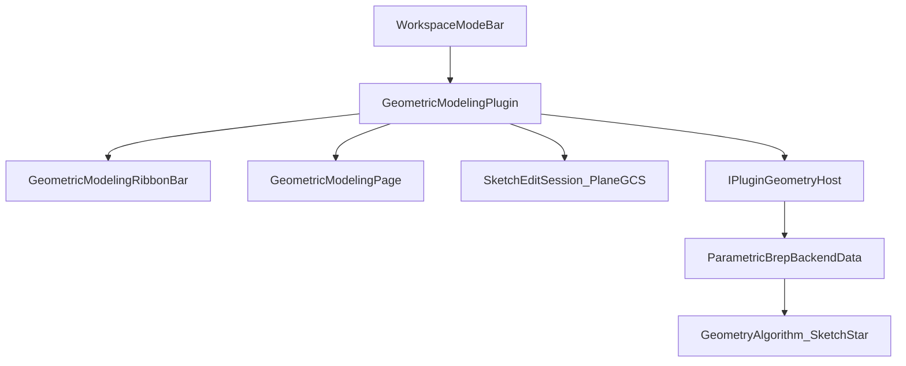
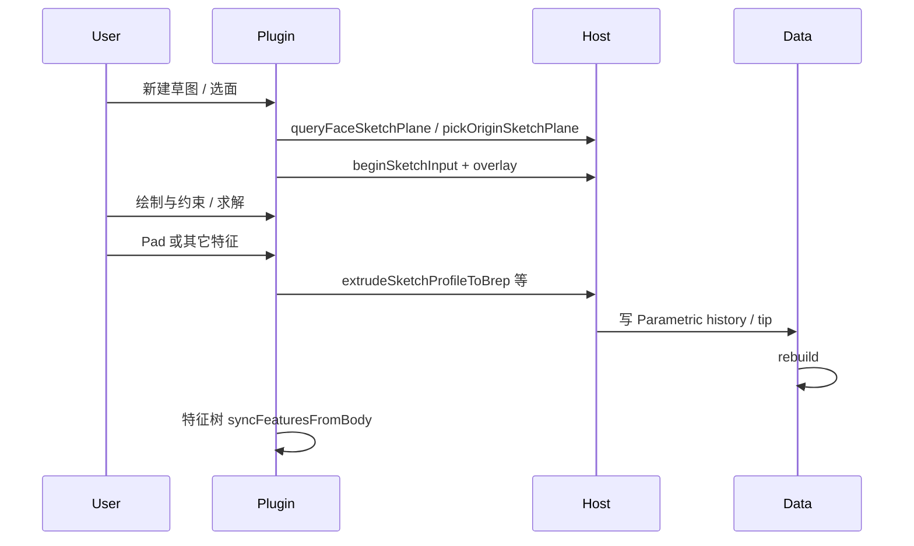

# ARCHITECTURE — 几何建模分层与数据流

## 总览



插件不直连 OCC 场景图：拾取、overlay、挤出/扫描等经 **Host ABI**；形状真源在 **Data** 的 `ParametricBrepModel` + history JSON；内核在 **GeometryAlgorithm**。

## 分层职责

| 层 | 角色 | 关键路径 |
|----|------|----------|
| 工作区入口 | 顶栏分段切换；`claimWorkspaceMode` 互斥 | `docs/_archive/WorkspaceModeSwitcher/`；Host chrome |
| 插件壳 | 进入/退出、Ribbon 接线、特征编排、存盘钩子 | `GeometricModelingPlugin.*` |
| 会话 UI | 特征树、侧栏属性/拾取面板、Body 下拉 | `GeometricModelingPage.*`、`GeometricModelingSolidFeatures.cpp` |
| 特征模型 | kind + 参数 + JSON；DatumPlane 仅插件树 | `FeatureDocument.*` |
| 草图会话 | 绘制/约束/求解/overlay | `SketchEditSession`、`SketchTools`、`SketchGeom`、`SketchConstraintSolver` |
| Undo | 命令栈 / Body 历史快照 | `CommandStack.*`、`BodyHistoryCmd.h` |
| Host ABI | 几何与拾取契约 | `CloudSimPluginSDK/inc/IPluginGeometryHost.h` |
| Host 实现 | OCC / 视口桥 | `CloudSimPluginHost/.../PluginGeometryHostImpl.cpp` |
| Parametric 重建 | history → tip 形状 | `Data/.../ParametricBrepBackendData.cpp` |
| 算法 | Extrude/Sweep/Fillet/… | `GeometryAlgorithm` 的 `Sketch*.{h,cpp}` |
| 第三方 | PlaneGCS（LGPL） | `third_party/planegcs/` |

## 工作区与 UI 态

- 模式 id = 插件 id：`com.cloudsim.geomodeling`
- 进入后：`setModeToolBar`（Ribbon）+ `enterAlternateSideUi`（特征树）+ 共用 3D 视口
- `registerMenus()` 为空；勿再写「菜单 → 进入几何建模」
- 与工艺流程 / 工程图互斥（同一 claim 机制）

## 草图态 vs 特征态



- 草图文档可存 `sketchDocumentUtf8`；轮廓导出为 profile 供实体算子
- 特征提交后写入同一 Body 的 parametric history；插件树与 Host 通知 `onParametricBodyHistoryChanged` 对齐

## FeatureDocument 与 Parametric tip

| 概念 | 位置 | 说明 |
|------|------|------|
| 插件特征树 | `FeatureDocument` | UI 名、草图文档、DatumPlane、部分参数缓存 |
| Parametric history | Data / Host JSON | rebuild 真源；种类与插件 kind 对齐演进 |
| 工程侧车 | `kProjectKeyGeometricModeling` | 如 `activeBodyId`；Body 在 `objects[]` |

DatumPlane：**不进** Parametric tip；持久化走侧车/插件 JSON，视口用 overlay。

## 依赖与编译

推荐顺序（改算法或 Host 后）：

```text
CloudSimPluginSDK → GeometryAlgorithm → Data → CloudSimHost → GeometricModelingPlugin
```

须 **Debug|x64** 与 **Release|x64** 均编过。产物：

- Debug：`bin/x64d/plugins/com.cloudsim.geomodeling/`
- Release：`bin/x64/plugins/com.cloudsim.geomodeling/`

新 Host API 须 bump `CLOUDSIM_PLUGIN_HOST_VERSION`（虚表仅尾部追加）；插件门禁当前 **1.47.0**（`0x00012F00`）。

## 相关文档

- 功能清单：[FEATURES.md](FEATURES.md)
- 路线图：[ROADMAP.md](ROADMAP.md)
- Body / 模式语义：[后端对象与软件模式](../后端对象与软件模式/)
- AI 写特征史：[_archive/特征史AI](../_archive/特征史AI/)
- 历史设计（部分过时）：[_archive/几何建模](../_archive/几何建模/)
