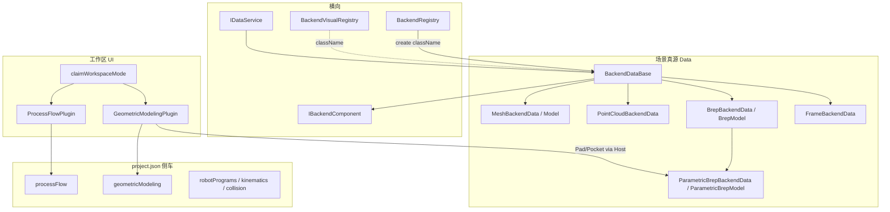

# DESIGN — 后端对象与软件模式（P0）

## 1. 派生与框架

| 机制 | 职责 |
|------|------|
| `BackendDataBase` | id/name/visible、位姿/`worldMatrix`、PropertyBag、components、JSON 模板方法 |
| `BackendRegistry` | `className → factory`；工程加载入口 |
| `BackendDataManager` | 每文档对象表 + DAG |
| `IBackendComponent` | 横向行为（如 FollowAttachment） |
| `BackendVisualRegistry` | className → OSG 分支（与 Data 平行） |
| `claimWorkspaceMode` | UI 互斥；**不**改 Backend 类型集合 |

## 2. 类型身份「三键」权威表

**代码真源**：[`CloudSimCore/BackendTypeIds.h`](../../src/Contracts/CloudSimCore/inc/BackendTypeIds.h)（`namespace backend_type`）。Data [`BackendTypeIdentity.h`](../../src/Data/Data/inc/BackendTypeIdentity.h) 仅 `#include` 转发。下表为人读副本。

| C++ 类型 | className（工厂/工程/权威） | catalog / sourceType（导入与树） | Visual 注册键 | 备注 |
|----------|------------------------------|----------------------------------|---------------|------|
| `PointCloudBackendData` | `PointCloudBackendData` | `PointCloud` | `PointCloudBackendData` | |
| `MeshBackendData` | `Model` | `Model` | `Model` | Visual 另兼容读 `MeshBackendData`（`kClassModelVisualAlias`）；**禁止新写该别名** |
| `BrepBackendData` | `BrepModel` | `BrepModel` | `BrepModel` | `isBrepWorkpieceClassName` 含本类 |
| `ParametricBrepBackendData` | `ParametricBrepModel` | `ParametricBrepModel` | `ParametricBrepModel`（复用 Brep visual） | 几何建模 Body |
| `FrameBackendData` | `FrameBackendData` | `CoordinateFrame` | `FrameBackendData` | 无实体几何 |

规则：

1. **持久化与 `BackendRegistry::create` 只认 className。**
2. **Host `backendSourceType` / 导入 `catalogTypeName` 用第二列；缺省时 `catalogTypeFromClassName`。**
3. **新增类型：先改 `BackendTypeIds.h`，再 builtins + Visual + 本表；业务代码禁止再写裸字面量。**
4. **侧车键用 `kProjectKeyProcessFlow` / `kProjectKeyGeometricModeling`。**
5. **Property schema id**（如 `backend.mesh`）是第三命名空间 — 勿与 className 混用。

实现锚点：[BackendTypeIds.h](../../src/Contracts/CloudSimCore/inc/BackendTypeIds.h)、[BackendRegistryBuiltins.h](../../src/Data/Data/inc/BackendRegistryBuiltins.h)、[BackendVisualRegistry.cpp](../../src/UI/BackendVisual/source/BackendVisualRegistry.cpp)、[BackendProjectObjectIo.cpp](../../src/Host/CloudSimHost/source/BackendProjectObjectIo.cpp)。

## 3. Document 侧车键注册表

`project.json` 根对象键。新增键前须登记本表；插件经 `PluginManager::invokeProjectAboutToSave` / `invokeProjectLoaded` 读写。

### 3.1 Host / 核心

| 根键 | Owner | 空写策略 | 说明 |
|------|-------|----------|------|
| `version` | Host `ProjectPackageIo` | 必写 `4` | 工程格式主版本 |
| `componentsSchemaVersion` | Host | 必写 | 组件编解码 schema |
| `language` | Host | 必写 | UI 语言快照 |
| `bundle` | Widget 保存路径 | 可选 | 如 zip 包标记 |
| `objects` | Host | 必写数组 | Backend 对象 |
| `edges` | Host | 必写数组 | DAG 边 |
| `annotations` | Host | 必写（可空数组） | 视口标注 |
| `camera` | 视口 I/O（若存在） | 按实现 | 相机状态 |
| `robotKinematics` | RobotProjectIo | 无机器人可缺 | 遗留/汇总运动学 |
| `robotKinematicsInstances` | RobotProjectIo | 无则缺 | per-instance 关节 |
| `robotPrograms` | Host merge | 无则缺/可移除空 | 程序 JSON |
| `robotCollision` | MainWindowProjectIo | 无机器人可缺 | 碰撞设置 |

### 3.2 插件侧车

| 根键 | Owner 插件 | schema 提示 | 空写策略 | 内容边界 |
|------|------------|-------------|----------|----------|
| `processFlow` | `com.cloudsim.processflow` | 画布 `toJson`（含 nodes/edges/jobSet） | **空图不写**（`nodeCount==0 && edgeCount==0` 则跳过） | 键常量 `backend_type::kProjectKeyProcessFlow`；**不是** Backend 对象 |
| `geometricModeling` | `com.cloudsim.geomodeling` | `{ activeBodyId }`；旧工程可能含 `features` | 无对应 page 则不写；可有仅 UI 态 | 键常量 `kProjectKeyGeometricModeling`；Body 在 `objects[]` |

### 3.3 侧车纪律

1. 键名小驼峰；插件私有键避免与 Host 键冲突。
2. 大体积几何/点云仍走 `objects[]` + sidecar 文件（ply/brep），不塞进插件根键。
3. 键内自演进优先加 `schemaVersion` 字段；不轻易改全局 `version`。
4. 未知根键：加载时忽略；保存时不得静默丢弃其它插件已写入字段（Host 应在既有 root 上 merge 插件回调）。

## 4. 工作区模式 vs 后端对象

| 概念 | 是什么 | 不是什么 |
|------|--------|----------|
| Workspace mode | `claimWorkspaceMode` 字符串（常为 pluginId）；中央页/侧栏/Ribbon 互斥 | Backend 类型开关、工程加载过滤器 |
| 默认三维 | 空 mode；OsgWidget + 工作区 Dock | 「唯一允许存在的对象类型」 |
| 工艺流程模式 | 替换中央为流程图；侧栏流程专用 | 把 PlantGraph 注册进 Manager |
| 几何建模模式 | 嵌入 3D + Ribbon；Host 写 Parametric Body | 卸载 Mesh/PointCloud |

**强制约定：** 打开工程时无论当前 UI 模式，均完整恢复 `objects[]` 与已登记侧车键。切换模式不得 `unregister` 他模式对象。

## 5. 扩展路径决策（P0 冻结）

| 路径 | 适用 | P0 决策 |
|------|------|---------|
| A 内置类型 + Host API | 需进场景、可渲染、可跟随 | **默认推荐**（几何建模已用） |
| B `registerBackendType` | 第三方必须自带新 className | **暂不投资**；无插件调用 |
| C 侧车根键 | 非场景域图/仿真/UI 会话 | **工艺/几何 UI 继续用** |

禁止：为 DES 节点、JobSet、甘特数据建立 `BackendDataBase` 子类。

## 6. 跨模式绑定（仅契约预留，P0 不实现）

工艺节点 `binding` 若落地：存 **backendId**（或稳定 name），经 `IDataService` 解析；允许 className 白名单。不复制几何进 `processFlow`。

## 7. 与现网差异说明

- CONSENSUS_工艺流程仿真插件早期「不持久化」已被覆盖；以 ProcessFlow README + 本侧车表为准。
- CONSENSUS_几何建模仍写 Pad→`BrepModel`；现网优先 `ParametricBrepModel`（见 PluginGeometryTypes 1.23.0+）。
