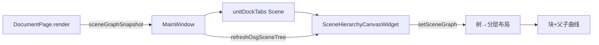

# DESIGN — 场景层级块式显示

## 整体架构



## 核心组件

| 组件 | 职责 |
|------|------|
| `SceneHierarchyCanvasWidget` | 只读画布：布局、绘制、平移缩放、点选 |
| `MainWindow::refreshOsgSceneTree` | 取快照 → `setSceneGraph` / `clear` |
| `MainWindowUiSetup` | Tab 挂载画布，替换 `QTreeWidget` |

## 接口契约

```cpp
class SceneHierarchyCanvasWidget : public QWidget {
public:
  void setUseChinese(bool);
  void clearGraph();
  /// emptyHint 非空时只画居中提示（无场景）
  void setSceneGraph(const IRenderView::SceneNodeInfo& root);
  void setEmptyHint(const QString& text);
};
```

## 数据流

```
Tab 当前=Scene → refreshOsgSceneTree
  → snapshot = render().sceneGraphSnapshot(256)
  → 扁平化 DFS 生成 nodes/edges（截断 ≤200）
  → 分层布局 (depth→X, 子树加权→Y)
  → update() 绘制
```

## 异常 / 边界

| 情况 | 处理 |
|------|------|
| 无 DocumentPage | `setEmptyHint("无场景")` |
| `className` 空 | 同上 |
| 节点 >200 | 截断 + 底栏「已截断」 |
| 深树 | 布局自动伸展；依赖缩放浏览 |

## 模块依赖

- Widget → CloudSimCore（`IRenderView::SceneNodeInfo`）已有
- **不**依赖 RobotWidget 组装画布类型
