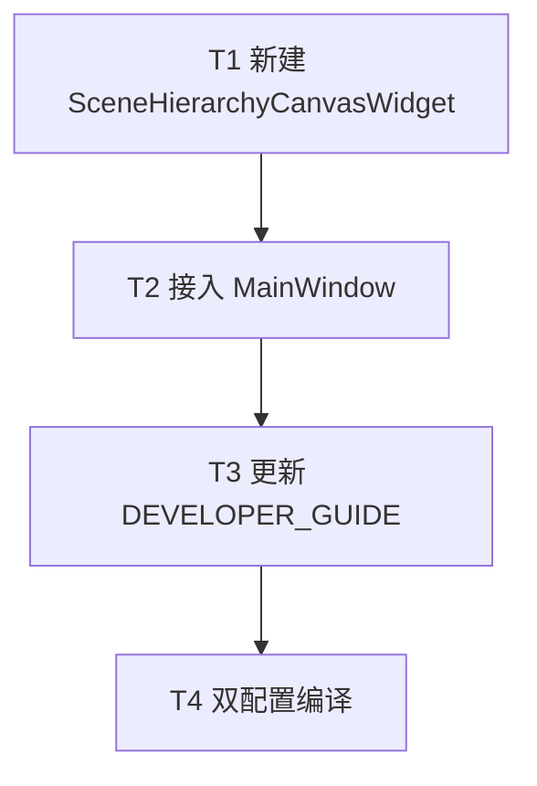

# TASK — 场景层级块式显示

## 依赖图

## T1 — 新建画布控件

- **输入**：CONSENSUS/DESIGN；组装画布视觉参考
- **输出**：`inc/SceneHierarchyCanvasWidget.h`、`source/SceneHierarchyCanvasWidget.cpp`；写入 `Widget.vcxproj` + filters sync
- **验收**：可独立构造；`setSceneGraph` 后能画块与连线
- **约束**：纯中文必要注释；无关节编辑逻辑

## T2 — 接入 MainWindow

- **输入**：T1
- **输出**：`MainWindow.h` 成员类型替换；`MainWindowUiSetup` / `MainWindowBackendTree` / `MainWindow.cpp` i18n 去表头
- **验收**：切到「场景层级」可见画布；刷新路径不变
- **并行**：无

## T3 — 文档

- **输入**：T2
- **输出**：`Widget/DEVELOPER_GUIDE.md` §5.3 补充画布说明；`ACCEPTANCE_*.md`
- **验收**：与实现一致

## T4 — 编译

- **输入**：T1–T3
- **输出**：Widget Debug\|x64 + Release\|x64 成功
- **验收**：无链接/MOC 错误
