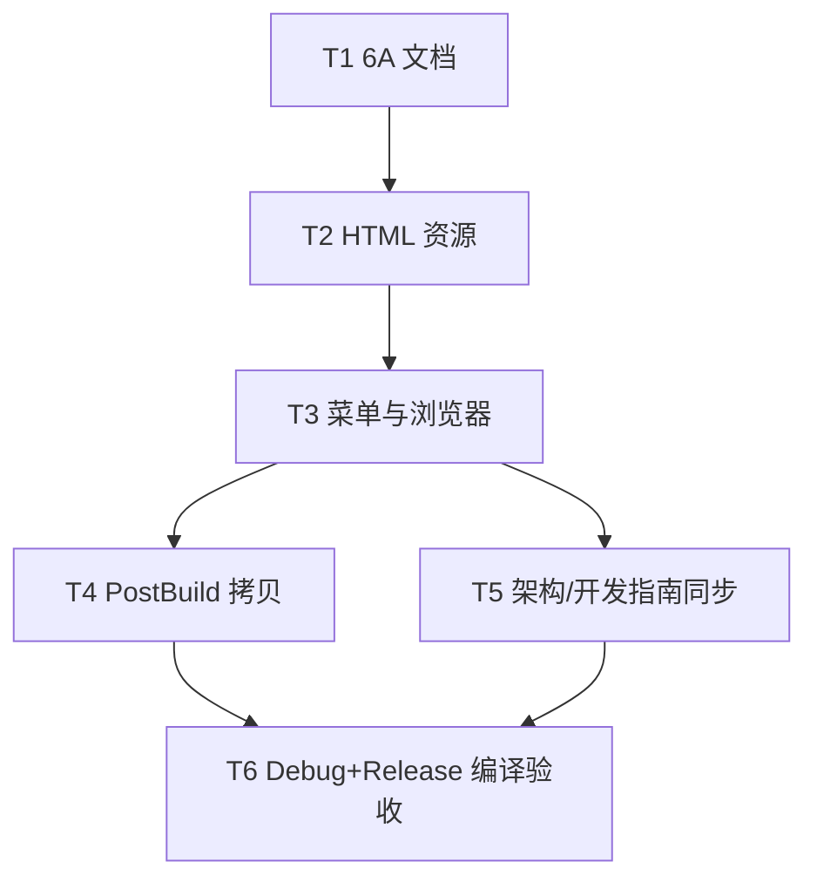

# TASK — 帮助系统

## 任务依赖

---

### T1 — 6A 文档

- **输入**：ALIGNMENT 决策（1A/2C）
- **输出**：ALIGNMENT / CONSENSUS / DESIGN / TASK
- **验收**：四份文档齐全、边界无歧义

### T2 — 最小 HTML

- **输入**：无
- **输出**：`CloudSim/help/zh/index.html`、`en/index.html`
- **验收**：欢迎页 + 占位说明，中英各一

### T3 — 菜单与内嵌浏览器

- **输入**：T2 路径约定
- **输出**：`MainWindow` Help 菜单、`MainWindowHelp.cpp`、`HelpBrowserDialog`、vcxproj 编入
- **验收**：菜单两项可用；缺文件有警告

### T4 — PostBuild 部署

- **输入**：T2 源目录
- **输出**：`CloudSim.vcxproj` Debug/Release PostBuild 拷贝到 `$(CloudSimBinDir)help\`
- **验收**：构建后 OutDir 存在 help/zh|en/index.html

### T5 — 文档同步

- **输入**：DESIGN
- **输出**：更新 `ARCHITECTURE_SUMMARY.md`、`Widget/DEVELOPER_GUIDE.md`
- **验收**：菜单结构含 Help；路径说明正确

### T6 — 编译验收

- **输入**：T3–T5
- **输出**：Widget + CloudSim Debug|x64 / Release|x64 通过；ACCEPTANCE/FINAL/TODO
- **验收**：见 CONSENSUS 验收标准
