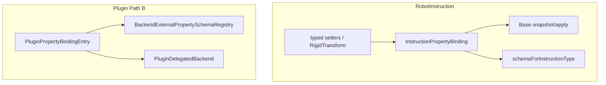

# DESIGN：指令与插件属性 Binding

## 决策

| 项 | 约定 |
|----|------|
| RobotInstruction | 类型级静态 Binding；删 Attribute/`m_attributes`；schema 由 Binding 生成 |
| 未知 key | apply 失败 `"Unknown property key."` |
| `m_extensionProperties` | 仅 load/save 兼容；不进 snapshot；不被 apply 吞掉 |
| 插件 Path B | `PluginBackendMeta.propertyBindings` 注册表；Host 转 schema/aspect；有 Binding 时忽略 `propertyRowsJson` 真源 |
| ABI | `IDataService` / `IRobotService` 方法签名不变；SDK 版本 bump（当前码基上 +1 minor） |

## 分层

## Instruction 行集合

按 `has*Property` / 条件门控组装（与旧 Attribute 可见性一致）：

- Motion：pose/euler、via、speed/acc、blend、axisConfig.*
- Wait/If/While：condition.*（Io 子字段仅 kind==Io 时进 snapshot）
- SetDo/SetAo/DeviceAxis：对应 IO/设备键
- PathPlan：planning.* 只读/可写与成员对齐

## 插件

- Entry：key/label/type/editable/semanticFlags + format/apply（`IPluginBackendObject*`）
- `supportsTransform` / `supportsVisibility` → Host 侧 `hasPose`/`hasRotation`/`visible` 标准包
- Data：`registerExternalPropertySchema` / `invalidateSchemaCache`；`schemaForClassName` 优先查外部表
- 无 Binding：仍回退 `propertyRowsJson`

## 非范围

- sidecar 插件改 Path B；Instruction 并入 IDataService；插件 `#include BackendPropertyBinding.h`
