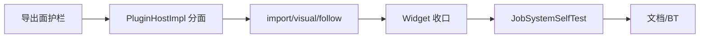

# DESIGN：下阶段硬化深化测试

## 目标

相对 `ACCEPTANCE_终态余留全量.md` 的「非本轮余留」，落地选项 5：链接导出面护栏 + 视口分面深化 + JobSystem 可自动化契约测试。不重做 A–E。

## 锁定决策

| 议题 | 决策 |
|------|------|
| WHOLEARCHIVE | **保留** Host/Headless `/WHOLEARCHIVE:CloudSimHostCore.lib`；硬化 = 可观测导出面护栏 |
| 分面深化 | Plugin\*HostImpl → import/project/visual/follow → Widget 收口；SelectionOperation / RobotWidget 本波不做 |
| JobSystem CI | `runJobSystemLifecycleSelfTest` + 独立 `JobSystemSelfTest.exe`（SelfTestRunner 链 Widget 过重） |
| Three.js | 不建 Playwright/vitest；契约表写明默认 CI 不阻塞 |

## 架构要点

### N1 导出面

- `scripts/check_host_export_surface.py`：`dumpbin /EXPORTS` + 基线名片段 allowlist
- 挂入 `make-source-check.ps1`
- WA = 纳入机制；脚本 = 表面控制（见 `Headless共享库抽取设计.md` §8）

### N2–N4 分面

- `DocumentHost::{sceneOps,pickObserve,overlay,toolbar}` 为真源
- 业务侧停止扩散 `widgetOsgFromPage` / `osgWidgetFrom` fat 指针
- `WidgetDocumentAccess.h` 提供分面 helper；`WidgetSceneSignalWiring` 用 Signals + PickObserve

### N5 JobSystem

- 慢任务 > `kShutdownWaitMs` → `shutdown()` 限时返回、`isShutdown`、之后 enqueue 拒绝
- `JobSystemSelfTest.exe` 经 `run_selftest.ps1` 在 SelfTestRunner 之后执行

## 明确不做

- 删除 WHOLEARCHIVE / HostCore
- SelectionOperation 多接口 owner
- RobotWidget `IRobotOsgViewHost` 分面
- Playwright / 完整前端 e2e
