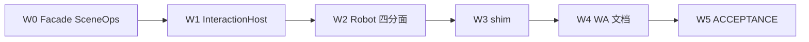

# DESIGN：主程序架构全量

BugTracker **#12**。范围：桌面主程序 `CloudSim.exe → Bootstrap → Widget → Host + DesktopViewport`。不含 Web/Headless 产品优化、不含业务功能包。

## 锁定决策

| 议题 | 决策 |
|------|------|
| SelectionOperation | `IViewportInteractionHost`（OsgWidget 实现）；无 `ownerWidget()`/`static_cast<OsgWidget*>` |
| RobotWidget | `IRobotOsgSceneOps` / Pick / Overlay / Teach；fat `IRobotOsgViewHost` 仅 KEEP_FAT |
| DocumentHost/Facade | 业务路径 `IViewportSceneOps*` |
| 死 shim | 删除 `widgetOsgFromPage` / `osgWidgetFrom` |
| WHOLEARCHIVE | 终态保留；表面靠导出面脚本 |

## 窗口

## KEEP_FAT（Robot）

跨分面会话保留 `osgView()` / `IRobotOsgViewHost*`：TCP teach 开关、坐标系/锚点同步、PathPlan overlay+scene、AssemblyMate、部分 Trajectory 预览等。

## 明确不做

- 消灭 WHOLEARCHIVE / HostCore
- 机器人 overlay/teach 并入 Host `IViewportOverlay`
- Playwright / 几何包 D
