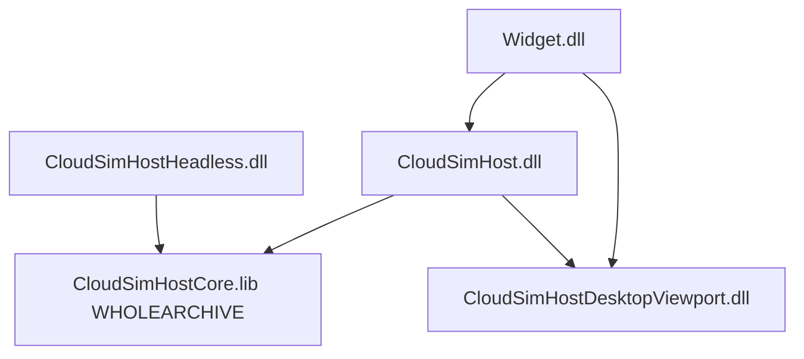

# DESIGN：终态 A+B+C 落地

> BugTracker **#9**。范围：A 文档级数据/Config 注入、B 视口分面与去公开 `OsgWidget*`、C Desktop Viewport DLL + WHOLEARCHIVE 收窄。不含 D（插件旧虚表砍刀）/ E（生命周期 CI）。

## 目标分层

| 层 | 职责 |
|----|------|
| **Core.lib** | 共享 Host 逻辑；`CLOUDSIM_HOST_LIB` + Host/Headless `/WHOLEARCHIVE` 再导出 |
| **Host.dll** | 桌面组合根；链 Viewport；无内联 DESKTOP_ONLY 源 |
| **Viewport.dll** | 真 OSG 视口 / 拾取 / Controllers；正常 DLL 导出；**禁 WHOLEARCHIVE** |
| **Headless.dll** | stub 视口 + Web 桥；不链 Viewport |

## A — 数据 / Config

- 嵌入 `cloudsimCreateDataService`：`BackendManagerDataService` 自持 `BackendDataManager`；`instance()` abort。
- Host：每文档 `DocumentHost::backend()`。
- Config schema：`TrajectoryOpConfigRegistry` / `FeatureDiscretizerConfigRegistry` 经 `setProcessInstance` 进程注入。
- 加载态：`DocumentHost::configResourceBaseDir`；`ensureLoaded(baseDir)` 写入进程加载态前须带文档目录。

## B — 视口接口

- `IOsgWidgetView` = `IViewportSceneOps` + `IViewportPickObserve` + `IViewportToolbar` + `IViewportOverlay`（`IViewportSceneSignals` 独立）。
- `DocumentHost::osgWidget()` 私有；对外 `osgView()` / 分面访问器。
- `SelectionOperation::m_owner` 为 `IOsgWidgetView*`。

## C — Viewport DLL

- 工程：`CloudSimHostDesktopViewport.vcxproj`；导出宏 `CLOUDSIM_VIEWPORT_*`。
- 源：`DESKTOP_ONLY_*`（含 `HostOsgFlavorHooks_Desktop`、`OsgRenderViewAdapter`）。
- 挂载：`mountFlavorOsgViewport` 由 Viewport 导出；Core 只声明。
- 护栏：`check_host_headless_sources.py` 三方对齐 + Viewport 禁 WHOLEARCHIVE。

## 余留（不做）

- D：收缩 `IPluginHostContext` 旧虚表 / 物理删 LabelingSDK
- E：生命周期自动化 CI
- 取消 HostCore 或消灭 Core 的 WHOLEARCHIVE
