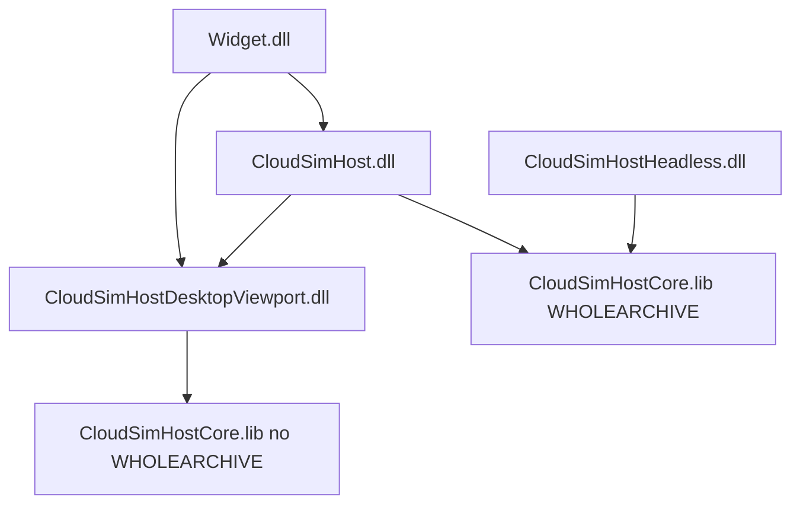

# DESIGN：终态余留全量落地（选项 4）

> BugTracker **#10**。在 A+B+C 已关门前提下完成 D + 工程债 + E。

## 范围

| 阶梯 | 内容 |
|------|------|
| D | `IPluginHostContext` 聚合虚表砍刀（仅基础槽 + 7 窄上下文）；LabelingSDK 物理删除 |
| 工程债 | Config `ensureLoaded` → thread_local；Host↔Viewport 解环 |
| E | LIFECYCLE_CONTRACT 可自动化子集进 `run_tests`/`run_api_tests` |

## ABI

- PluginSDK / AiSDK：`0x00013A00`
- 聚合接口仅为门面：`hostVersion` / `applicationDirPath` / `log*` / `useChinese` / `onLanguageChanged` / `*Context()`
- 域能力只经窄上下文；`pointCloudHost`→`geometryContext`，`labelingHost`→`documentContext`

## 链接

Viewport **不**链 `CloudSimHost.lib`（`CLOUDSIM_HOST_STATIC` + Core.lib）。

## Config

`DocumentHost::configResourceBaseDir` 为文档 SoT；`ensureLoaded` 写入 **thread_local** 活动目录供 ConfigImpl 读取。

## 明确不做

- 消灭 HostCore / 去掉 Core WHOLEARCHIVE
- 再拆 PluginHost.dll
- 全量视口调用改分面
