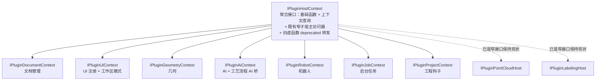

# IPluginHostContext 拆分设计（巨型接口 → 按域窄接口）

> 立项来源：[`P2_方向_中级缺陷.md`](P2_方向_中级缺陷.md) 架构缺陷分级修复；与 [`SDK整合设计.md`](SDK整合设计.md)（核心 PluginSDK + 域扩展两级结构）配套。
> 本文为**纯设计文档**，不改任何代码；落地时须遵循 `SDK整合设计.md` §5 的 ABI 规则（bump `CLOUDSIM_PLUGIN_SDK_VERSION` + 全插件重编）。

## 1. 现状分析

### 1.1 规模与版本跨度

`src/Plugins/CloudSimPluginSDK/inc/IPluginHostContext.h`（约 255 行）：

| 指标 | 数值 |
|------|------|
| 虚函数槽位总数 | **80**（含 const/non-const 重载，不含析构） |
| 唯一函数名 | **71** |
| 版本跨度 | 1.0 → **1.55.0**（`CLOUDSIM_PLUGIN_SDK_VERSION = 0x00013700`） |
| 版本里程碑数 | 21 个（1.2.0 / 1.3.0 / 1.4.0 / 1.5.0 / 1.6.0 / 1.7.0 / 1.16.0 / 1.17.0 / 1.18.0 / 1.19.0 / 1.20.0 / 1.21.0 / 1.22.0 / 1.25.0 / 1.34.0 / 1.35.0 / 1.36.0 / 1.43.0 / 1.51.0 / 1.52.0 / 1.55.0） |

版本演进时间线（按头文件注释）：

| 版本 | 新增能力 | 域 |
|------|----------|----|
| 1.0 | 基础（版本/日志/文档/UI 注册/几何 Phase1-2/导入/语言） | 混合 |
| 1.2.0 | `pointCloudHost` | 点云 |
| 1.3.0 | `aiAssistantHost` | AI |
| 1.4.0 | soup 级几何（`buildPrimitiveMeshSoup` 等 3 个） | 几何 |
| 1.5.0 | `geometryHost` | 几何 |
| 1.6.0 | `captureActiveViewportPng` | 几何/AI |
| 1.7.0 | 轨迹 AI 组（catalog 切片/预览/提交，5 个） | AI |
| 1.16.0 | `labelingHost` | 标注 |
| 1.17.0 | 中央 alternate + 工艺流程侧栏（6 个） | UI |
| 1.18.0 | 工程保存/加载钩子 | 工程 |
| 1.19.0 | `enterProcessFlowSideUi` 同槽改签名（**破坏性**，须同编） | UI |
| 1.20.0 | `processFlowAiBridge` | 工艺流程 |
| 1.21.0 | 3D 视口嵌入/还原 | UI |
| 1.22.0 | `setModeToolBar` | UI |
| 1.25.0 | 互斥工作区模式 claim（3 个） | 工作区模式 |
| 1.34.0 | 通用 alternate 侧栏 | UI |
| 1.35.0 | 工作区模式注册/进入/退回（3 个） | 工作区模式 |
| 1.36.0 | 文档未保存标记（3 个） | 文档 |
| 1.43.0 | `onParametricBodyHistoryChanged` | AI |
| 1.51.0 | 轨迹计划确认组（3 个） | AI |
| 1.52.0 | 可取消任务 + `documentById` + `onDocumentClosed` | 任务/文档 |
| 1.55.0 | `robotHost` | 机器人 |

### 1.2 按域分类的函数清单

下表「槽位」列把 const/non-const 重载计为 2 个槽位。

#### 基础/通用（7 槽位）—— 跨域，留在聚合接口

`hostVersion` · `applicationDirPath` · `logInfo` · `logWarn` · `logError` · `useChinese` · `onLanguageChanged`

#### 文档管理（12 槽位 / 9 名）

`documentCount` · `activeDocument`(×2) · `documentAt`(×2) · `documentById`(×2) · `onActiveDocumentChanged` · `onDocumentClosed` · `markActiveDocumentModified` · `clearActiveDocumentModified` · `isActiveDocumentModified`

#### UI 注册（24 槽位）

`registerDockWidget` · `sidePanelTabParent` · `registerSidePanelTab` · `unregisterSidePanelTab` · `registerMenuPath` · `registerAction` · `setSidePanelTabTitle` · `setCentralAlternateWidget` · `showCentralScene3D` · `showCentralAlternate` · `isShowingCentralAlternate` · `enterProcessFlowSideUi` · `exitProcessFlowSideUi` · `setModeToolBar` · `embedActiveRenderWidget` · `restoreActiveRenderWidget` · `enterAlternateSideUi` · `exitAlternateSideUi`

#### 工作区模式（7 槽位）—— UI 子域，并入 UI 上下文

`claimWorkspaceMode` · `onWorkspaceModeClaimed` · `currentWorkspaceMode` · `registerWorkspaceMode` · `returnToMainWorkspace` · `enterWorkspaceMode`

（注：`embedActiveRenderWidget`/`restoreActiveRenderWidget`/`enterAlternateSideUi`/`exitAlternateSideUi` 在实现上与工作区模式联动，归类上属 UI 槽位管理，一并放入 UI 上下文。）

#### 几何（10 槽位 / 9 名）

`createPrimitiveMesh` · `booleanMesh` · `registerBackendType` · `registerTriangleMesh` · `buildPrimitiveMeshSoup` · `booleanMeshSoups` · `booleanPrimitiveMeshes` · `geometryHost`(×2) · `captureActiveViewportPng`

#### 点云（2 槽位）—— 已是窄子宿主，保持现状

`pointCloudHost`(×2)：`IPluginPointCloudHost*` 本身就是窄接口，无需再拆。

#### AI（11 槽位 / 10 名）

`aiAssistantHost`(×2) · `resolveTrajectoryWorkpiece` · `buildTrajectoryFeatureCatalogSlice` · `showAiFeatureCandidatePreview` · `clearAiFeatureCandidatePreview` · `commitAiTrajectoryFeatures` · `proposeAndConfirmTrajectoryPlan` · `loadBoundTrajectoryPlanForAi` · `reviseAiTrajectoryPlan` · `onParametricBodyHistoryChanged`

#### 标注（2 槽位）—— 已是窄子宿主，保持现状

`labelingHost`(×2)：同点云，`IPluginLabelingHost*` 已是窄接口。

#### 机器人（2 槽位）

`robotHost`(×2)

#### 工艺流程（3 槽位 / 2 名）

`setProcessFlowAiBridge` · `processFlowAiBridge`(×2)

#### 后台任务（4 槽位）

`enqueueJob` · `enqueueCancellableJob` · `cancelJob` · `invokeOnUiThread`

#### 工程钩子（3 槽位）

`onProjectAboutToSave` · `onProjectLoaded` · `importFileIntoActiveDocument`

合计：7 + 12 + (18 + 6) + 10 + 2 + 11 + 2 + 2 + 3 + 4 + 3 = **80**，与 1.1 总数一致（UI 注册 18 + 工作区模式 6 = 任务书口径的 UI 域 24）。

### 1.3 巨型接口的问题

1. **违反 ISP（接口隔离原则）**：一个只做菜单注册的插件（如 HelloAiPlugin 的 UI 部分）被迫依赖含机器人、点云、布尔运算的 80 槽位接口。依赖面与需求面严重不匹配，任何域的演进都名义上「触碰」了所有插件的依赖接口。
2. **ABI 脆弱**：单一 vtable 承载全部域，只能靠「末尾追加」的人为约定维持兼容。已有前车之鉴——`IPluginPointCloudHost` 中间插入虚函数导致 `queryMeshInfo` 误调 `simplifyMesh` 崩溃（见 PluginSDK DEVELOPER_GUIDE）；1.19.0 `enterProcessFlowSideUi` 同槽改签名也强制了宿主与插件同编。接口越大，误插入/误重排的概率越高。
3. **认知负担**：插件开发者面对 71 个函数名难以定位自己域的 API；头文件注释已不得不按版本号（1.4.0+ / 1.7.0+ …）而非按域组织，阅读路径是「考古式」的。
4. **版本粒度错配**：几何域加一个函数（如 1.4.0）就要 bump 整个 SDK 版本并重编**全部**插件，包括与几何无关的 PLC、相机插件。域演进被全局版本锁串行化。
5. **测试与 Mock 困难**：单元测试想 mock 宿主能力必须实现 80 个纯虚函数，实际上各插件测试只能放弃 mock 或写巨型空实现。

## 2. 拆分方案

### 2.1 总体结构

按域拆为 **7 个窄接口**，加上保留在聚合接口上的基础函数与既有窄子宿主访问器：



公共约定：

- 所有窄接口均为**纯虚接口**（无实现符号、无数据成员），满足 `SDK整合设计.md` §3 核心级判据（无 Qt 以外依赖、无第三方依赖）。
- 每个窄接口**独立版本号**，从 `1.0.0` 起；版本查询函数 `contextVersion()` 作为各接口的**第一个**虚函数。
- 窄接口内部同样只允许 **vtable 末尾追加**，禁止中间插入/重排（沿用现有约定，见头文件 1.4.0 注释）。
- 头文件统一放 `src/Plugins/CloudSimPluginSDK/inc/`，新增后须按工作区规则跑 `scripts/generate_vcxproj_filters.py --sync --project CloudSimPluginSDK`。

### 2.2 IPluginDocumentContext —— 文档管理

- **头文件**：`IPluginDocumentContext.h`
- **初始版本**：`1.0.0`（搬移自宿主 1.0 / 1.36.0 / 1.52.0 的能力）

```cpp
class IPluginDocumentContext
{
public:
	virtual ~IPluginDocumentContext() = default;
	virtual unsigned int contextVersion() const = 0;   // 0x00010000 = 1.0.0

	virtual int documentCount() const = 0;
	virtual IPluginDocument* activeDocument() = 0;
	virtual const IPluginDocument* activeDocument() const = 0;
	virtual IPluginDocument* documentAt(int index) = 0;
	virtual const IPluginDocument* documentAt(int index) const = 0;
	virtual IPluginDocument* documentById(const QString& documentId) = 0;
	virtual const IPluginDocument* documentById(const QString& documentId) const = 0;

	virtual void onActiveDocumentChanged(std::function<void(IPluginDocument*)> callback) = 0;
	virtual void onDocumentClosed(std::function<void(const QString& documentId)> callback) = 0;

	virtual void markActiveDocumentModified() = 0;
	virtual void clearActiveDocumentModified() = 0;
	virtual bool isActiveDocumentModified() const = 0;
};
```

### 2.3 IPluginUiContext —— UI 注册与工作区模式

- **头文件**：`IPluginUiContext.h`
- **初始版本**：`1.0.0`（搬移自宿主 1.0 / 1.17.0 / 1.19.0 / 1.21.0 / 1.22.0 / 1.25.0 / 1.34.0 / 1.35.0）
- 说明：`enterProcessFlowSideUi`/`exitProcessFlowSideUi` 为 1.34.0 通用槽位的旧名，窄接口中**只保留** `enterAlternateSideUi`/`exitAlternateSideUi`，旧名由聚合接口的 deprecated 转发层保留（转发到通用槽位），避免窄接口一出生就带重复别名。

```cpp
class IPluginUiContext
{
public:
	virtual ~IPluginUiContext() = default;
	virtual unsigned int contextVersion() const = 0;

	// dock / side panel / menu
	virtual QDockWidget* registerDockWidget(const QString& title, QWidget* widget,
											Qt::DockWidgetArea area = Qt::LeftDockWidgetArea) = 0;
	virtual QWidget* sidePanelTabParent() const = 0;
	virtual int registerSidePanelTab(const char* titleUtf8, QWidget* widget) = 0;
	virtual void unregisterSidePanelTab(QWidget* widget) = 0;
	virtual void setSidePanelTabTitle(QWidget* widget, const char* titleUtf8) = 0;
	virtual QMenu* registerMenuPath(const QStringList& path) = 0;
	virtual QAction* registerAction(QMenu* menu, const QString& text, std::function<void()> handler) = 0;

	// central alternate
	virtual void setCentralAlternateWidget(QWidget* widget) = 0;
	virtual void showCentralScene3D() = 0;
	virtual void showCentralAlternate() = 0;
	virtual bool isShowingCentralAlternate() const = 0;

	// alternate side ui (generic; supersedes enterProcessFlowSideUi)
	virtual void enterAlternateSideUi(QWidget* leftPanel, QWidget* rightPanel) = 0;
	virtual void exitAlternateSideUi() = 0;

	// render widget embedding
	virtual bool embedActiveRenderWidget(QWidget* slot, QString* outError = nullptr) = 0;
	virtual void restoreActiveRenderWidget() = 0;

	// mode toolbar + workspace modes
	virtual void setModeToolBar(QWidget* toolBar) = 0;
	virtual void claimWorkspaceMode(const QString& modeId) = 0;
	virtual void onWorkspaceModeClaimed(std::function<void(const QString& modeId)> callback) = 0;
	virtual QString currentWorkspaceMode() const = 0;
	virtual void registerWorkspaceMode(const QString& modeId, const QString& titleZh, const QString& titleEn,
									   std::function<void()> enterFn) = 0;
	virtual void returnToMainWorkspace() = 0;
	virtual void enterWorkspaceMode(const QString& modeId) = 0;
};
```

### 2.4 IPluginGeometryContext —— 几何

- **头文件**：`IPluginGeometryContext.h`
- **初始版本**：`1.0.0`（搬移自宿主 1.0 / 1.4.0 / 1.5.0 / 1.6.0）
- 说明：`captureActiveViewportPng` 的消费场景是多模态 AI（`geometry.recognize`），但能力本身是「活动文档 3D 视口截图」，与几何域的视口/后端耦合更紧，归入几何上下文；若未来 AI 域出现更多视口依赖再评估迁移。

```cpp
class IPluginGeometryContext
{
public:
	virtual ~IPluginGeometryContext() = default;
	virtual unsigned int contextVersion() const = 0;

	virtual bool createPrimitiveMesh(const PluginPrimitiveMeshParams& params, const PluginPrimitiveMeshQuality& quality,
									 const PluginMeshCreateOptions& options, QString* outError,
									 QString* outBackendId = nullptr) = 0;
	virtual bool registerBackendType(const PluginBackendMeta& meta, QString* outError) = 0;
	virtual bool registerTriangleMesh(const std::vector<float>& triangleSoup, const PluginMeshCreateOptions& options,
									  QString* outError) = 0;
	virtual bool booleanMesh(PluginMeshBooleanOp op, const std::string& targetBackendId,
							 const std::string& toolBackendId, const PluginBooleanMeshOptions& options,
							 std::string* outResultBackendId, QString* outError) = 0;
	virtual bool buildPrimitiveMeshSoup(const PluginPrimitiveMeshParams& params,
										const PluginPrimitiveMeshQuality& quality,
										const PluginMeshCreateOptions& placement, std::vector<float>& outWorldSoup,
										QString* outError) = 0;
	virtual bool booleanMeshSoups(PluginMeshBooleanOp op, const std::vector<float>& targetWorldSoup,
								  const std::vector<float>& toolWorldSoup, const PluginBooleanMeshOptions& options,
								  std::string* outResultBackendId, QString* outError) = 0;
	virtual bool booleanPrimitiveMeshes(PluginMeshBooleanOp op, const PluginPrimitiveMeshParams& targetParams,
										const PluginPrimitiveMeshQuality& targetQuality,
										const PluginMeshCreateOptions& targetPlacement,
										const PluginPrimitiveMeshParams& toolParams,
										const PluginPrimitiveMeshQuality& toolQuality,
										const PluginMeshCreateOptions& toolPlacement,
										const PluginBooleanMeshOptions& options, std::string* outResultBackendId,
										QString* outError) = 0;

	virtual IPluginGeometryHost* geometryHost() = 0;
	virtual const IPluginGeometryHost* geometryHost() const = 0;

	virtual bool captureActiveViewportPng(QByteArray& outPng, QString* outError = nullptr) = 0;
};
```

### 2.5 IPluginAiContext —— AI 与工艺流程 AI 桥

- **头文件**：`IPluginAiContext.h`
- **初始版本**：`1.0.0`（搬移自宿主 1.3.0 / 1.7.0 / 1.20.0 / 1.43.0 / 1.51.0）
- 说明：`setProcessFlowAiBridge`/`processFlowAiBridge` 是「AI 桥」注册点，消费方是 AI 能力提供方，归入 AI 上下文（备选方案是单列 `IPluginProcessFlowContext`，目前仅 3 槽位，暂不过度拆分）。

```cpp
class IPluginAiContext
{
public:
	virtual ~IPluginAiContext() = default;
	virtual unsigned int contextVersion() const = 0;

	virtual IAiAssistantHost* aiAssistantHost() = 0;
	virtual const IAiAssistantHost* aiAssistantHost() const = 0;

	virtual bool resolveTrajectoryWorkpiece(QString& outBackendId, QString& outStepPath,
											QString* outError = nullptr) = 0;
	virtual bool buildTrajectoryFeatureCatalogSlice(const QString& backendId, const QString& stepPathUtf8,
													const QString& userText, QByteArray& outFullCatalogUtf8,
													QByteArray& outSliceUtf8, QString* outError = nullptr) = 0;
	virtual bool showAiFeatureCandidatePreview(const QByteArray& catalogSliceUtf8, QString* outError = nullptr) = 0;
	virtual void clearAiFeatureCandidatePreview() = 0;
	virtual bool commitAiTrajectoryFeatures(const QByteArray& featurePlanJsonUtf8, QString* outSummary,
											QString* outError = nullptr) = 0;
	virtual int proposeAndConfirmTrajectoryPlan(const QByteArray& planInUtf8, QByteArray& planOutUtf8,
												QString* outError = nullptr, bool showRetry = true) = 0;
	virtual bool loadBoundTrajectoryPlanForAi(QByteArray& planOutUtf8, QString* outError = nullptr) = 0;
	virtual bool reviseAiTrajectoryPlan(const QByteArray& planJsonUtf8, QString* outSummary,
										QString* outError = nullptr) = 0;

	virtual void onParametricBodyHistoryChanged(
		std::function<void(const QString& documentId, const QString& backendId)> callback) = 0;

	virtual void setProcessFlowAiBridge(IProcessFlowAiBridge* bridge) = 0;
	virtual IProcessFlowAiBridge* processFlowAiBridge() = 0;
	virtual const IProcessFlowAiBridge* processFlowAiBridge() const = 0;
};
```

### 2.6 IPluginRobotContext —— 机器人

- **头文件**：`IPluginRobotContext.h`
- **初始版本**：`1.0.0`（搬移自宿主 1.55.0）

```cpp
class IPluginRobotContext
{
public:
	virtual ~IPluginRobotContext() = default;
	virtual unsigned int contextVersion() const = 0;

	virtual IPluginRobotHost* robotHost() = 0;
	virtual const IPluginRobotHost* robotHost() const = 0;
};
```

### 2.7 IPluginJobContext —— 后台任务

- **头文件**：`IPluginJobContext.h`
- **初始版本**：`1.0.0`（搬移自宿主 1.0 / 1.52.0）
- 说明：`PluginJobCancelToken`、`PluginJobProgressFn`、`PluginCancellableJobWorkFn` 类型定义随此头文件搬移（或留在公共 Types 头中由本头 include，落地时二选一，倾向后者以减少 include 变动）。

```cpp
class IPluginJobContext
{
public:
	virtual ~IPluginJobContext() = default;
	virtual unsigned int contextVersion() const = 0;

	virtual void invokeOnUiThread(std::function<void()> fn) = 0;
	virtual void enqueueJob(const QString& title, std::function<void(const PluginJobProgressFn&)> work,
							std::function<void(bool threw, const QString& throwMessage)> onFinished) = 0;
	virtual quint64 enqueueCancellableJob(const QString& title, PluginCancellableJobWorkFn work,
										  std::function<void(bool threw, const QString& throwMessage)> onFinished) = 0;
	virtual bool cancelJob(quint64 jobId) = 0;
};
```

### 2.8 IPluginProjectContext —— 工程钩子

- **头文件**：`IPluginProjectContext.h`
- **初始版本**：`1.0.0`（搬移自宿主 1.0 / 1.18.0）

```cpp
class IPluginProjectContext
{
public:
	virtual ~IPluginProjectContext() = default;
	virtual unsigned int contextVersion() const = 0;

	virtual void onProjectAboutToSave(std::function<void(const QString& documentId, QJsonObject& root)> callback) = 0;
	virtual void onProjectLoaded(std::function<void(const QString& documentId, const QJsonObject& root)> callback) = 0;
	virtual std::string importFileIntoActiveDocument(const std::string& pathUtf8, bool isPointCloud,
													 std::string* outError = nullptr) = 0;
};
```

### 2.9 不拆的部分

| 内容 | 处置 | 理由 |
|------|------|------|
| `hostVersion` / `applicationDirPath` / `logInfo` / `logWarn` / `logError` / `useChinese` / `onLanguageChanged` | 留在聚合接口 | 跨域通用，任何插件都可能用；再拆只会多一次无谓查询 |
| `pointCloudHost` / `labelingHost` 访问器 | 留在聚合接口 | 返回的 `IPluginPointCloudHost*` / `IPluginLabelingHost*` **本身已是窄接口**，符合「按需查询」模式，无需包第二层 |
| `PluginJobCancelToken` 等 Job 类型 | 随 `IPluginJobContext.h` 或公共 Types 头 | 见 2.7 |

## 3. 迁移路径

### 3.1 聚合接口形态

`IPluginHostContext` 保留为聚合接口，**vtable 末尾追加** 7 个上下文查询方法：

```cpp
class IPluginHostContext
{
public:
	virtual ~IPluginHostContext() = default;

	// --- 基础函数（保留） ---
	virtual unsigned int hostVersion() const = 0;
	virtual QString applicationDirPath() const = 0;
	virtual void logInfo(const QString& message) const = 0;
	virtual void logWarn(const QString& message) const = 0;
	virtual void logError(const QString& message) const = 0;
	virtual bool useChinese() const = 0;
	virtual void onLanguageChanged(std::function<void(bool useChinese)> callback) = 0;

	// --- 既有窄子宿主访问器（保留） ---
	virtual IPluginPointCloudHost* pointCloudHost() = 0;
	virtual const IPluginPointCloudHost* pointCloudHost() const = 0;
	virtual IPluginLabelingHost* labelingHost() = 0;
	virtual const IPluginLabelingHost* labelingHost() const = 0;

	// --- 现有全部虚函数保留，标记 deprecated，宿主实现内部转发到窄接口 ---
	// （documentCount / activeDocument / ... / robotHost，共 69 槽位 = 80 - 7 基础 - 4 子宿主访问器，原顺序原签名不动）

	// --- vtable 末尾追加：窄接口查询（1.56.0+） ---
	virtual IPluginDocumentContext* documentContext() = 0;
	virtual IPluginUiContext* uiContext() = 0;
	virtual IPluginGeometryContext* geometryContext() = 0;
	virtual IPluginAiContext* aiContext() = 0;
	virtual IPluginRobotContext* robotContext() = 0;
	virtual IPluginJobContext* jobContext() = 0;
	virtual IPluginProjectContext* projectContext() = 0;
};
```

### 3.2 插件侧用法

新插件按需查询，只依赖自己域的头文件：

```cpp
// before
IPluginDocument* doc = host->activeDocument();

// after
IPluginDocument* doc = host->documentContext()->activeDocument();
```

### 3.3 旧插件兼容

- **现有 80 个槽位一个不动**：顺序、签名、const 性全部保持，旧插件 DLL 无需重编即可继续加载运行。
- 旧虚函数在宿主侧的实现改为**转发**到对应窄接口实现（宿主内部持有一个实现全部窄接口的领域对象集合，聚合接口与窄接口是同一组实现的两张「视图」）。
- deprecated 标记方式：鉴于 `[[deprecated]]` 会在宿主自身转发实现与既有插件源码中制造大量告警，采用**注释 + 文档**标记（`/// @deprecated Use documentContext()->activeDocument()`），并在 PluginSDK DEVELOPER_GUIDE 中声明「旧直挂函数冻结，新能力只加到窄接口」。是否引入可关闭的 `CLOUDSIM_DEPRECATED` 宏留待落地阶段决定。

### 3.4 ABI 影响

1. **新增查询方法全部追加在 vtable 末尾**：旧插件编译时的 vtable 布局不变，对前 80 槽的调用完全不受影响（与 1.4.0→1.55.0 的演进方式一致）。
2. **必须 bump `CLOUDSIM_PLUGIN_SDK_VERSION`**（如 1.56.0）并重编全部插件——这是 `SDK整合设计.md` §5-1 的既有要求；但 bump 的目的是让**新插件**能安全调用 `documentContext()` 等（宿主版本不足时返回 nullptr 或经 IID 版本检查拒绝），而非旧插件不兼容。
3. **窄接口自身是全新 vtable**：从 0 开始，没有历史负担；后续演进同样只许末尾追加。
4. **宿主版本不足时的兜底**：窄接口访问器在旧宿主上不存在（vtable 越界），因此插件必须先查 `hostVersion()` 再调用——与现有 `pointCloudHost()`「宿主版本不足时可为 null」的防御模式一致，写入 DEVELOPER_GUIDE。

### 3.5 迁移步骤（落地时）

| 步骤 | 内容 | 重编范围 |
|------|------|----------|
| 1 | 新增 7 个窄接口头文件（纯接口，无实现）；同步 vcxproj + filters | PluginSDK |
| 2 | 宿主侧实现窄接口（领域对象）；聚合接口追加 7 个查询方法；旧函数改转发 | CloudSimHost(+Headless)、CloudSimPluginHost |
| 3 | bump `CLOUDSIM_PLUGIN_SDK_VERSION`；DEVELOPER_GUIDE 增补「窄接口优先」章节 | PluginSDK、全部插件 |
| 4 | 插件按域逐步迁移调用点（每个插件独立 PR，可并行） | 各插件 |
| 5 | 旧直挂函数冻结公告；新能力评审只进窄接口 | 无（流程） |

步骤 2/3 涉及宿主与全插件联动，须安排统一编译窗口（同 `SDK整合设计.md` §4 的约束）；Debug|x64 与 Release|x64 双配置按工作区规则各编一遍。

## 4. 与 SDK 整合设计的关系

本文是 [`SDK整合设计.md`](SDK整合设计.md)「核心 PluginSDK + 域扩展」两级结构在**核心级内部**的细化：

1. **窄接口是核心级的内部组织方式，不改变两级划分**。`SDK整合设计.md` §3 规定核心级是「插件与宿主跨 DLL 边界的唯一稳定 ABI」；拆分后这一 ABI 面从「1 个巨型接口 + 4 个子宿主」变为「1 个聚合接口 + 7 个窄上下文 + 4 个子宿主」，仍全部位于 CloudSimPluginSDK 一个 DLL 内，不新增核心级 DLL。
2. **域扩展 DLL 只暴露对应窄接口/子宿主**：AiSDK（插件面域 ABI，见 `SDK整合设计.md` §3）的消费入口是 `aiContext()->aiAssistantHost()`；未来若有点云、标注域扩展，入口分别是聚合接口上的 `pointCloudHost()` / `labelingHost()`。域扩展永远拿不到聚合接口全量能力，依赖方向单向（域扩展 → 核心窄接口）。
3. **版本策略互补**：`SDK整合设计.md` §5-1 的 IID 版本编码（`CloudSimPlugin_iid` 内嵌 SDK 版本）保护的是「插件整体 vs 宿主」握手；窄接口的独立 `contextVersion()` 提供**域粒度**的运行时协商，使「几何域加函数」不再强迫 AI 插件感知版本变化——全局 IID 版本仍 bump（核心头变了），但插件可通过 `geometryContext()->contextVersion()` 精确判断能力，减少防御性空指针分支。
4. **与整合路线图的衔接**：`SDK整合设计.md` §4 的阶段 1（Labeling 去重）、阶段 2（AiSDK IID 对齐）与本文拆分**互不阻塞**，可并行；建议拆分落地（本文 §3.5 步骤 1-3）安排在阶段 1/2 之后的统一编译窗口，避免连续两轮全量重编。

## 5. 风险与缓解

| 风险 | 说明 | 缓解 |
|------|------|------|
| vtable 末尾追加约定靠人遵守 | 聚合接口与 7 个窄接口都依赖「只追加不插入」；历史上有 `IPluginPointCloudHost` 中间插入导致崩溃的先例 | ① 每个接口头文件顶部固定注释模板（沿用现有 1.4.0 注释样式）；② DEVELOPER_GUIDE 设「ABI 红线」章节；③ 评审 checklist 加「虚函数是否末尾追加」；④ 中期可在 CI 加 ABI 快照比对（如 abi-compliance-checker） |
| 窄接口版本号独立演进的记录负担 | 7 个 `contextVersion()` 各自递增，版本矩阵可能失控 | ① `CloudSimPluginVersion.h` 集中登记各上下文当前版本宏；② 每个窄接口头文件维护版本变更表（仿本文 §1.1）；③ 版本 bump 必须伴随该表更新，评审把关 |
| 旧插件迁移周期长 | 全部插件迁完前，宿主必须长期维护「旧函数转发层」 | 转发层是机械的一行委托，成本低；明确「冻结不删除」策略——旧函数**永不移除**（除非主版本号升级），迁移无强制截止期，按插件各自节奏进行 |
| 双入口并存期的认知分裂 | 同一能力有 `host->activeDocument()` 与 `host->documentContext()->activeDocument()` 两种写法，插件代码风格可能混杂 | DEVELOPER_GUIDE 声明「新代码只用窄接口」；示例工程（HelloAiPlugin 等）率先迁移作示范；评审时拦截新增的旧式调用 |
| 转发层引入额外间接 | 旧路径多一次虚调用 | 插件调用频率远低于渲染/仿真内循环，性能影响可忽略；无需缓解 |
| 1.19.0 式同槽改签名重演 | 拆分不能阻止未来有人想改既有签名 | 窄接口同样禁止同槽改签名；确需改签名时走「新增函数 + 旧函数 deprecated 转发」模式（如同 `enterProcessFlowSideUi` → `enterAlternateSideUi` 的既有做法） |
| Headless 失步 | `CloudSimHost` 与 `CloudSimHostHeadless` 共享源，窄接口实现须两边同步 | 落地后跑 `scripts/check_host_headless_sources.py`（工作区既有规则） |
