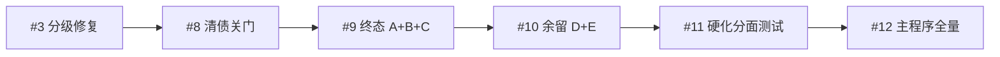
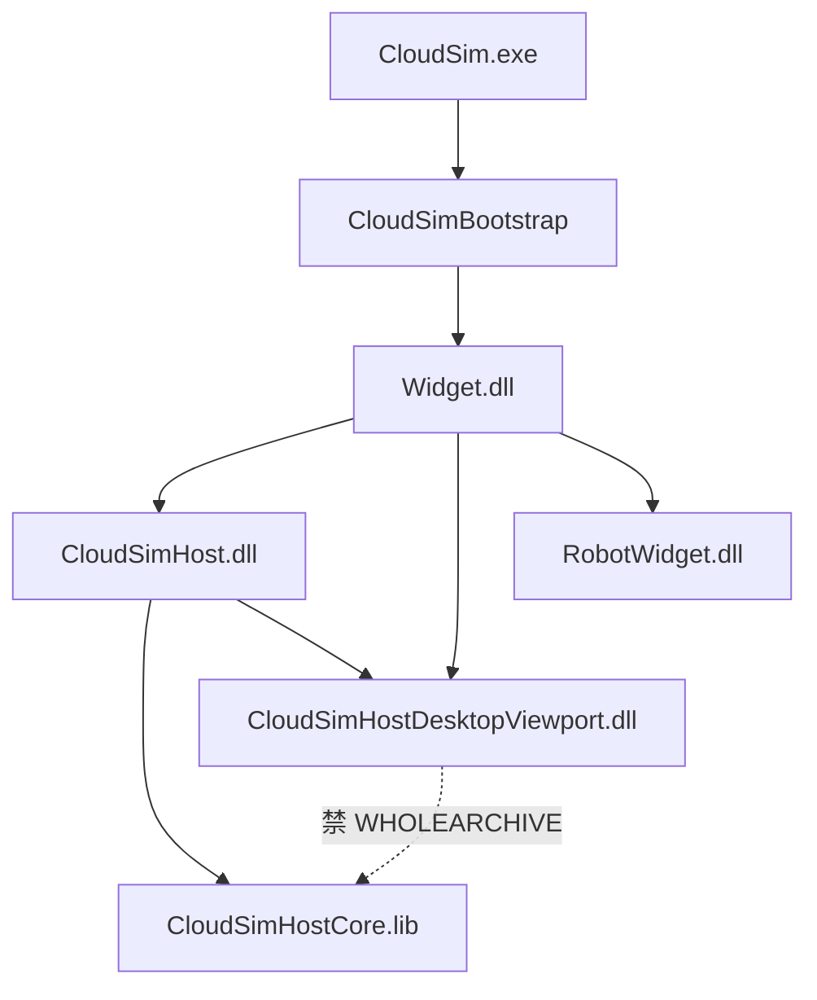

# CloudSim 架构修复路线图

本目录入口。下文按时间顺序说明**已完成**的架构修复路线；细节以各阶段 DESIGN / ACCEPTANCE 为准，本文不重复实现条款。

**主程序终态（桌面）**：`CloudSim.exe → Bootstrap → Widget → CloudSimHost + DesktopViewport`（HostCore `/WHOLEARCHIVE` 再导出；导出面由脚本护栏）。

---

## 1. 总览表

| 序 | 阶段 | Bug | 一句话 | 验收文档 |
|----|------|-----|--------|----------|
| 1 | 缺陷分级（P0/P1/P2） | #3 | Host 收回 Osg/PluginHost 借编源；backend 棘轮；生命周期契约起步 | [ACCEPTANCE_架构缺陷分级修复](ACCEPTANCE_架构缺陷分级修复.md) |
| 2 | 全量清债关门 | #8 | Bootstrap/Registry/视口窄接口/Core 真源/Labeling 迁 Host/SDK ABI | [ACCEPTANCE_清债关门](ACCEPTANCE_清债关门.md) |
| 3 | 终态 A+B+C | #9 | 文档级数据·Config；视口分面；DesktopViewport DLL + WA 收窄 | [ACCEPTANCE_终态A+B+C](ACCEPTANCE_终态A+B+C.md) |
| 4 | 终态余留 D+E | #10 | 插件虚表砍刀·LabelingSDK 退场；Config TLS；生命周期 pytest | [ACCEPTANCE_终态余留全量](ACCEPTANCE_终态余留全量.md) |
| 5 | 硬化 + 分面 + 测试 | #11 | 导出面护栏；PluginHost/import 分面；JobSystemSelfTest | [ACCEPTANCE_下阶段硬化深化测试](ACCEPTANCE_下阶段硬化深化测试.md) |
| 6 | 主程序架构全量 | #12 | Selection InteractionHost；Robot 四分面；死 shim；WA 终态声明 | [ACCEPTANCE_主程序架构全量](ACCEPTANCE_主程序架构全量.md) |

相关启动崩溃修复（构造期空宿主）：BugTracker **#13**（`MeshTrajectoryPageWidget::syncMethodPreview`），不单独立项文档。

---

## 2. 路线说明（按阶段）

### 阶段 1 — 分级修复（#3）

- **P0**：OsgWidget / PluginHost 源码物理归属 Host；共享清单与漂移检查；`backend()` 调用点棘轮。
- **P1**：数据正确性（pose JSON、URDF 开关、revision、线程归属）；[LIFECYCLE_CONTRACT.md](LIFECYCLE_CONTRACT.md) 初版。
- **P2**：中级方向备忘（[P2_方向_中级缺陷.md](P2_方向_中级缺陷.md)）；`make-source-check.ps1` 巡逻入口。

对齐原文：[ALIGNMENT_架构缺陷分级修复.md](ALIGNMENT_架构缺陷分级修复.md)。

### 阶段 2 — 清债关门（#8）

在分级修复之上关「债」：

- Bootstrap 去 stub；Registry 业务路径去静默兜底。
- 生产路径去裸 `OsgWidget*`（Mate / DocumentPage / Signals）。
- HostCore 为共享真源（删 items.props）；Labeling 会话进 Core。
- 插件 ABI/`sdkAbiVersion`；Web fallback 护栏。

专题设计（可并行阅读）：

- [Headless共享库抽取设计.md](Headless共享库抽取设计.md) — Core / Host / Headless / Viewport 链接模型（后续各波续写 §）
- [Registry去单例设计.md](Registry去单例设计.md)
- [PluginHostContext拆分设计.md](PluginHostContext拆分设计.md)
- [SDK整合设计.md](SDK整合设计.md)

### 阶段 3 — 终态 A+B+C（#9）

目标分层落地：

| 字母 | 内容 |
|------|------|
| **A** | 文档级 `BackendDataManager`；Config 进程注入 + 文档目录加载态 |
| **B** | `IViewportSceneOps` / Pick / Overlay / Toolbar；公开面去 `OsgWidget*` |
| **C** | `CloudSimHostDesktopViewport.dll`；WHOLEARCHIVE **仅** Core→Host/Headless |

设计：[DESIGN_终态A+B+C.md](DESIGN_终态A+B+C.md)。

### 阶段 4 — 余留 D+E（#10）

A+B+C 之后的「选项 4」：

- **D**：`IPluginHostContext` 砍刀；IID `0x00013A00`；LabelingSDK 物理退场；Config `ensureLoaded` → TLS。
- **E**：生命周期 API 测试挂入 `run_tests`；Viewport 去对 Host 的 DLL 依赖环。

设计：[DESIGN_终态余留全量.md](DESIGN_终态余留全量.md)。

### 阶段 5 — 硬化 / 分面深化 / 测试（#11）

不重做 A–E，补「可观测 + 深化」：

- 导出面 allowlist（`check_host_export_surface.py`）挂入 make-source-check；**保留** WHOLEARCHIVE。
- Plugin\*HostImpl、import/visual/follow、Widget 收口以分面为主。
- `JobSystemSelfTest.exe`；契约表纠正 Three.js「默认 CI 不阻塞」。

设计：[DESIGN_下阶段硬化深化测试.md](DESIGN_下阶段硬化深化测试.md)。

### 阶段 6 — 主程序架构全量（#12）

只收桌面主程序余留（不含 Web/Headless 产品包、不含几何业务）：

| 窗口 | 内容 |
|------|------|
| W0 | DocumentHost / Facade → SceneOps |
| W1 | `IViewportInteractionHost`；SelectionOperation 去 `OsgWidget*` 强转桥 |
| W2 | RobotWidget 四分面（Scene/Pick/Overlay/Teach）；跨面 KEEP_FAT |
| W3 | 删除死 shim（`widgetOsgFromPage` / `osgWidgetFrom`） |
| W4 | WHOLEARCHIVE **终态保留**文档声明（不消灭） |

设计：[DESIGN_主程序架构全量.md](DESIGN_主程序架构全量.md)。Headless 设计续写见该文与 [Headless共享库抽取设计.md §8–§9](Headless共享库抽取设计.md)。

---

## 3. 当前架构快照（主程序）

- **纳入**：Host/Headless 链 Core 用 `/WHOLEARCHIVE`。
- **表面**：`scripts/check_host_export_surface.py`。
- **巡逻**：`scripts/make-source-check.ps1`（host-headless、export-surface、plugin-iid、encoding…）。
- **生命周期**：`LIFECYCLE_CONTRACT.md` + API pytest + `JobSystemSelfTest.exe`。

---

## 4. 明确不在本路线内 / 已冻结

- 消灭 `/WHOLEARCHIVE` 或 HostCore（需另立导出重写专项）。
- Selection / Robot 再拆到 Host `IViewport*` 统一 ABI（机器人域 API 留在 RobotWidget 四分面）。
- Web/Headless **产品**优化、Playwright、几何包 D 等业务线（见 `docs/features/`）。
- 清债阶段明示余留：部分配置侧单例、旧虚表冻结层等 — 见 [ACCEPTANCE_清债关门](ACCEPTANCE_清债关门.md)「余留」。

---

## 5. 文档索引（本目录）

| 类型 | 文件 |
|------|------|
| **本路线图** | `路线图.md`（本文） |
| 契约 | `LIFECYCLE_CONTRACT.md` |
| 专题设计 | `Headless共享库抽取设计.md`、`Registry去单例设计.md`、`PluginHostContext拆分设计.md`、`SDK整合设计.md`、`P2_方向_中级缺陷.md` |
| 阶段 DESIGN | `DESIGN_终态A+B+C.md`、`DESIGN_终态余留全量.md`、`DESIGN_下阶段硬化深化测试.md`、`DESIGN_主程序架构全量.md` |
| 阶段 ACCEPTANCE | `ACCEPTANCE_架构缺陷分级修复.md`、`ACCEPTANCE_清债关门.md`、`ACCEPTANCE_终态A+B+C.md`、`ACCEPTANCE_终态余留全量.md`、`ACCEPTANCE_下阶段硬化深化测试.md`、`ACCEPTANCE_主程序架构全量.md` |
| 对齐原稿 | `ALIGNMENT_架构缺陷分级修复.md` |

**阅读建议**：新人先读本文 §1–§3；改链接/视口读 Headless 设计 + 对应阶段 DESIGN；改生命周期读 `LIFECYCLE_CONTRACT.md`。
