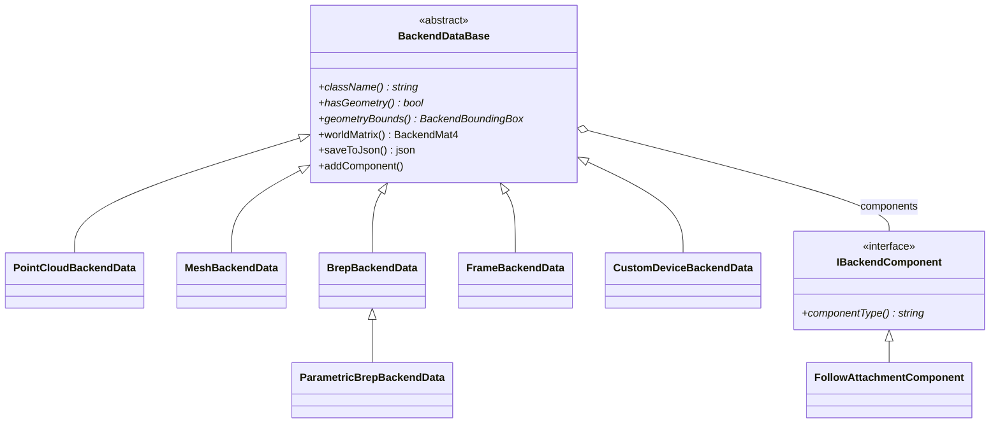

# Data 模块开发文档

> **空间契约 v2**：[`../../../docs/spatial_contract_world_pose.md`](../../../docs/spatial_contract_world_pose.md) — **Breaking**：JSON 仅 `worldMatrix`（16 元）；`pose`/`rotation` 为分解视图；`p_world = p_geometry × worldMatrix`。

### Breaking: v2 坐标模型

| 变更 | 说明 |
|------|------|
| 权威存储 | `BackendDataBase::m_worldMatrix`；`setPose`/`setRotation` 重建矩阵 |
| JSON | `saveToJson` 只写 `worldMatrix`；缺字段 `loadFromJson` 失败并提示重导入 |
| 配准 | 世界系 ICP → `icpDeltaWorld`；不输出 `alignedTemplateShape` |
| 面重构 | `scanPointsToTemplateModelFrame`：`v_model = v_geo × M_scan × inv(M_tpl)` |
| UI 工具 | `composeWorldMatrix` / `decomposeWorldMatrix`（`BackendFollowMath.h` 别名） |

## 1. 模块定位

`Data` 是应用内 **后端数据真源（Single Source of Truth）**：统一描述场景中的点云/网格对象、属性面板协议、DAG 父子关系、可选跟随约束组件。不处理 Qt 事件、不持有 OSG 节点。

| 属性 | 说明 |
|------|------|
| x64 输出 | `Data.dll`（`DATA_LIB`） |
| 静态嵌入 | `PointCloudAlgorithm.lib`（CGAL 算法，无独立 DLL） |
| 动态链接 | x64：`RunLogger.dll`（import lib） |
| 并发 | `BackendDataManager` 容器与边由 `std::shared_mutex` 保护；**单个 `BackendDataBase` 字段**无细粒度锁，跨线程写需调用方序列化（通常 UI 线程） |
| 序列化 | 属性行 JSON + 工程 **`project.json` v4**（`saveToJson`/`loadFromJson`、内嵌 `geometry`、`propertyBag`、`components`） |
| 导出 | `DATA_EXPORT` |

---

## 2. 基础值类型（`BackendDataBase.h` / `BackendFollowMath.h`）

| 类型 | 字段 / 说明 |
|------|-------------|
| `BackendVec3` | `x,y,z` double |
| `BackendBoundingBox` | `min`, `max`, `valid` |
| `BackendColor` | `r,g,b,a` float 0..1 |
| `BackendPoseValue` | `position` + `eulerDeg` |
| `BackendPoseReferenceFrame` | `World` / `Parent` |
| `BackendMat4` | `v[16]` 列主序；**刚体语义**（R\|t）：`backend_mat4_multiply` / `backend_mat4_invert_rigid` 按刚体抽取后运算（恒成功）；加载用 `backend_mat4_is_nearly_rigid` fail-fast |
| `objectWorldMatrix` / `transformPointToWorld` | 世界点 = `objectWorldMatrix × v_stored`（见 `BackendSpatial.h`；`objectWorldMatrix` 即 `worldMatrix()`） |
| `backend_world_mat_from_pose` | 列向量 `p'=R×p_model+pose`；委托 `rigidTransformFromBackendPoseEuler` + `colMajorFromRigidTransform`；**无** `+modelCenter`（见契约 §1.1） |

---

## 3. `class BackendDataBase`（抽象根）

### 3.1 身份与类型

| 方法 | 说明 |
|------|------|
| `id()` / `setId` | 进程内自增 id（`backend_data_N`）；`registerData` 成功后 **id 冻结**（再改拒绝并 warn）；加载解码期（未注册）仍可 `setId` |
| `name()` / `setName` | 显示名（跟随 `follow.targetName` 匹配用） |
| `isVisible()` / `setVisible` | 场景显示/隐藏真源（持久化字段 `visible`） |
| `className()` | **纯虚**；如 `"PointCloudBackendData"`, `"Model"` |

### 3.2 几何契约（纯虚）

| 方法 | 说明 |
|------|------|
| `hasGeometry()` | 是否可渲染（有自有几何） |
| `geometryBounds()` | 模型空间 AABB，**必须是真实几何包络**；无自有几何的类型返回 `valid=false`（不得谎报，如 CustomDevice 根） |
| `geometryElementCount()` | 点数或三角数 |
| `clearGeometry()` | 清空缓冲 |

**geometryRevision 纪律**：Host 侧 `BackendVisualSyncEngine` 仅靠 diff `geometryRevision()` 判断几何是否过期。任何改几何缓冲/shape 的路径**必须** `bumpGeometryRevision()`——漏 bump 即视觉过期且无报错。setter 校验失败时**保持原状**并 `RunLogger::warn` 告警，**禁止** `clearGeometry()` 自毁式清掉已有好数据。

**poseRevision**：`poseRevision()` / `bumpPoseRevision()`；`setPose` / `setRotation` / `setWorldMatrix` / `applyBackendWorldPose` / `setPoseInFrame` / `setRotationInFrame` / `setPoseValue` / `setVisible` 等全部位姿/可见性写路径 bump（Host transform/visibility flush 后续可接入）。

**容差 / epsilon（静默早退）**：`setPose` 位置差 ≤ `5e-4` 不写；`setRotation` / `applyBackendWorldPose` 与现矩阵近等（`1e-5`）不写。

### 3.3 位姿与颜色（可覆盖）

| 方法 | 默认 |
|------|------|
| `pose` / `setPose`, `rotation` / `setRotation`, `color` / `setColor` | 零/白 |
| `hasPoseProperty()` 等 | `false` |
| `isPoseExternallyDriven()` | `false`；位姿由外部系统驱动时（如机器人挂载）覆盖为 `true`，Follow 求解器不覆写其世界矩阵 |
| `supportsBackendTransform()` | `hasPoseProperty()` |
| `applyBackendWorldPose(centerWorld, eulerDegWorld)` | 世界系写回窄接口 |

### 3.4 参考系与 4×4 矩阵

| 方法 | 说明 |
|------|------|
| `poseReferenceFrame()` / `setPoseReferenceFrame` | World / Parent |
| `poseInFrame` / `setPoseInFrame`（含 rotation） | 需 `BackendDataManager` 做父链变换 |
| `poseValue` / `setPoseValue` | `BackendPoseValue` 原子读写 |
| `worldMatrix()` / `setWorldMatrix(world)` / `applyWorldMatrixIncrement(inc)` | 缓存世界矩阵（世界系左乘增量） |
| `validatePoseFrameRoundTrip(mgr, epsilon)` | 帧转换自检 |

### 3.5 属性系统

| 方法 | 说明 |
|------|------|
| `propertyBag()` | `PropertyBag` 键值（类型安全 variant） |
| `snapshotPropertyRows(mgr)` | 属性面板 JSON 行数组 |
| `applyPropertyChange(key, value, errMsg, mgr)` | 单行提交（**UI/插件**应优先 `IDataService::applyPropertyChange`，由 Host `BackendVisualSync` 同步 OSG 并发布 `PoseCommitted`） |

### 3.6 组件（Component）

| 方法 | 说明 |
|------|------|
| `addComponent` / `removeComponent` / `getComponent` / `hasComponent` | 按 `componentType()` 字符串 |
| `getComponent<T>()` / `emplaceComponent<T>(...)` | 类型安全 |
| `listComponents()` | 全部组件 |
| `collectReferencedBackendIds(out)` | 汇总本对象（含组件）引用的其他后端 id；派生类/组件可覆盖 |

**跨对象 id 引用悬挂检测**：`BackendDataManager::unregisterData` 移除对象后扫描其余对象的 `collectReferencedBackendIds()`，命中已删 id 即 `RunLogger::warn`（只告警，不自动改写引用方）。内建来源：`FollowAttachment.targetBackendId`、`CustomDeviceRobotMount` 三个 id、`CustomDeviceLink::geometryBackendId`、轴 `motionCenterFrameBackendId`。

### 3.7 层级（经 Manager 图）

| 方法 | 说明 |
|------|------|
| `parentObjects(manager)` | 直接父对象 shared_ptr 列表 |
| `childObjects(manager)` | 直接子对象 |
| `descendantObjects(manager)` | 可达后代（DAG） |

### 3.8 工程持久化（`project.json` v4）

| 方法 | 说明 |
|------|------|
| `saveToJson() const` | 模板方法：写出公共字段 + `propertyBag` + `components` + 调用 `saveDerivedJson` |
| `loadFromJson(in, errMsg)` | 模板方法：恢复公共字段 + `propertyBag` + `components` + 调用 `loadDerivedJson`；兼容旧字段 `followAttachment` |
| `saveDerivedJson(out)` / `loadDerivedJson(in, errMsg)` | 派生类扩展（几何等），默认空实现 |

**公共字段**（基类统一写出）：`id`、`name`、`className`、`visible`、`color`（若有）、`worldMatrix`（16 元）、`poseReferenceFrame`、`propertyBag`、`components`。**不写** `pose`/`rotation`（仅为 `worldMatrix` 分解视图）。

| 字段 | 说明 |
|------|------|
| `visible` | 场景显示态真源（默认 `true`）；缺字段加载时视为显示。OSG NodeMask / 后端树勾选为派生视图 |
| `worldMatrix` | 列主序 16 元；加载时须近似刚体，否则 fail-fast |

**派生扩展**：

| 类型 | `geometry` / 派生字段 |
|------|----------------------|
| `PointCloudBackendData` | `kind=points`，`storage=ply_sidecar`，`pointCount`；几何真源 `objects/{id}.ply`（兼容旧工程 `xyzBase64`） |
| `MeshBackendData` | `kind=triangles`，`encoding=float32_le`，`xyzBase64`；可选 `normalsBase64` / `vertexColorsBase64` / `overlayLinesBase64`（尺寸不匹配 warn-drop）；另 `mesh.transformPivotAtOrigin`、`mesh.overlayLinesAlwaysOnTop` |
| `BrepBackendData` | `.brep` sidecar 相对路径 + shape；**不**持久化 display soup |
| `ParametricBrepBackendData` | 同上 + 特征 `history`（见 §4.5） |
| `FrameBackendData` | `axisLengthMm`（无 geometry 缓冲） |
| `CustomDeviceBackendData` | Link/Joint/axes/q、namedPoses、poseSignalBindings、ioSignals（无根几何缓冲） |

仍保留 `writeProjectEmbeddedGeometry` / `readProjectEmbeddedGeometry` 供派生类内部使用。

**刚体校验**：`backend_mat4_is_nearly_rigid` 检查列单位长 + 正交 + 齐次行 + **右手系**（叉积方向 `dot(cross(c0,c1),c2) > 0`，排除镜像矩阵 det=-1）。

---

## 4. 具体后端类型

### 4.0- 继承与职责总览

六类内置均由 `BackendRegistry` / `ensureBackendBuiltinsRegistered()` 按 **className** 工厂创建；唯一二级派生为 `ParametricBrepBackendData : BrepBackendData`。组件（`IBackendComponent`）挂在对象上，**不是** Backend 派生类。

| 对象 | 继承 | 持久化几何 / 专有数据 | 典型用途 |
|------|------|----------------------|----------|
| `PointCloudBackendData` | `BackendDataBase` | PLY sidecar（`objects/{id}.ply`） | 扫描点云 |
| `MeshBackendData` | `BackendDataBase` | `triangleSoup`（±法线） | 显示网格、URDF 连杆 |
| `BrepBackendData` | `BackendDataBase` | `ShapeHandle` + `.brep` sidecar | STEP 工件 |
| `ParametricBrepBackendData` | **`BrepBackendData`** | Brep + 特征 history | 参数化建模 |
| `FrameBackendData` | `BackendDataBase` | 无 mesh；`axisLengthMm` | 命名坐标系 |
| `CustomDeviceBackendData` | `BackendDataBase` | Link/Joint/q JSON；几何在子 Backend | 自定义设备根 |

### 4.0 类型身份「三键」（权威）

**代码真源**：[CloudSimCore/BackendTypeIds.h](../../Contracts/CloudSimCore/inc/BackendTypeIds.h)（`namespace backend_type`）。Data 入口 [BackendTypeIdentity.h](inc/BackendTypeIdentity.h) 仅转发。新增类型先改契约头，再改 builtins / Visual。

持久化 / 工厂认 **className**；导入与 Host 树分类认 **catalog / sourceType**；C++ 类型名可与 className 不同。完整规范与侧车键见 [`docs/后端对象与软件模式/`](../../../docs/后端对象与软件模式/)。

| C++ 类型 | className（`kClass*`） | catalog / sourceType（`kCatalog*`） | Visual 键 |
|----------|------------------------|-------------------------------------|-----------|
| `PointCloudBackendData` | `PointCloudBackendData` | `PointCloud` | 同 className |
| `MeshBackendData` | `Model` | `Model` | `Model`；读兼容 `kClassModelVisualAlias`=`MeshBackendData` |
| `BrepBackendData` | `BrepModel` | `BrepModel` | 同 className |
| `ParametricBrepBackendData` | `ParametricBrepModel` | `ParametricBrepModel` | 同 className（复用 Brep visual） |
| `FrameBackendData` | `FrameBackendData` | `CoordinateFrame` | 同 className |
| `CustomDeviceBackendData` | `CustomDeviceBackendData` | `CustomDevice` | 同 className（设备根示意轴；几何在子件） |

侧车根键：`kProjectKeyProcessFlow` / `kProjectKeyGeometricModeling`。`backend_type::isBrepWorkpieceClassName` 等助手优先于手写比较。Property schema id（如 `backend.mesh`）为另一命名空间，勿与 className 混用。

### 4.0.1 文件路径编码约定

Data 层凡以 `std::string path` 打开磁盘文件的 API（含 `PlyIo`、`PointCloudBackendData::loadFromFile` / `readPointCloudFromPlyFile`、`MeshBackendData::loadFromFile` 传入 CGAL/OCCT 的路径）均约定为 **Qt 本地窄字节路径**，与 `QFile::encodeName(QString)` 一致。

| 做法 | 说明 |
|------|------|
| Widget/Host 传参 | `QByteArray enc = QFile::encodeName(filePath)` → `std::string(enc.constData(), enc.size())` |
| C++ 打开文件 | `std::ifstream{std::filesystem::path{path}}` 或 `std::filesystem::path(path)` |
| **禁止** | 对本地路径使用 `std::filesystem::u8path`（中文 Windows 下非法 UTF-8 序列会抛 `system_error`） |
| **禁止** | Widget 侧对含中文路径用 `filePath.toUtf8()` 再交给上述 API（与 `encodeName` 语义不一致） |

**导入门面两阶段提交**（`backend_io::loadPointCloudFromFile` / `loadMeshFromFile`）：失败路径**不**先 `clearGeometry()`；解析到临时缓冲成功后才置换目标对象。**空结果判定前置**：STEP/DXF 路径在 `setTriangleSoup` 之前判空（纯曲线/点 STEP、空 DXF 不清空原几何），与 CGAL 路径对齐。`meshImportQuality` 参数保留兼容，**真源层不再有损抽稀**（0 与 1 行为一致；显式传 0 触发一次弃用告警）。XYZ 读取坏行计数，结尾统一 `RunLogger::warn`（不再静默吞行）。

**`float32_le`**：工程内嵌 Base64 float 块按主机原生 float 字节序 `memcpy`；当前工程仅支持 little-endian 平台（编码处 `static_assert`）。

### 4.1 `PointCloudBackendData`

| 注册名 | `className()` = `"PointCloudBackendData"` |
|--------|-------------------------------------------|

| 方法 | 说明 |
|------|------|
| `setPointBuffers(xyz, rgba)` / `setPointBuffers(xyz, rgba, normals)` | `3*N` float + 可选 `4*N` RGBA + 可选 `3*N` 法线 |
| `pointNormalsNxNyNz()` / `hasPointNormals()` | 法线缓冲（**v1 不写入 project.json**，仅内存） |
| `pointPositionsXyz()` / `pointVertexRgba()` | 只读缓冲 |
| `loadFromFile` | `.ply`, `.xyz`（CGAL）；路径见 §4.0.1；实现见 `backend_io::loadPointCloudFromFile`（[`BackendImporters.h`](inc/BackendImporters.h)） |
| `readPointCloudFromPlyFile` / `writePointCloudPlySidecar` | PLY 专用（**仅顶点**，忽略 `element face`）；路径见 §4.0.1 |
| `writeProjectEmbeddedGeometry` / `readProjectEmbeddedGeometry` | 旧工程内嵌 Base64（新保存走 PLY sidecar） |
| `writePointCloudPlySidecar` / `readPointCloudPlySidecar` | 工程 `objects/{id}.ply` 读写 |

**PLY 双形态（`PlyIo.h`，路径 §4.0.1）**

| API | 说明 |
|-----|------|
| `scanPlyHeader` | 解析头：`vertexCount`/`faceCount`（`size_t`）、`hasFaceElement`、点云读路径所需 x/y/z/RGB 列索引；首行可剥离 UTF-8 BOM；`format` 可在 header **任意行**（容忍前置 comment；历史字段名 `cgalFormatOnLine2`） |
| `plyFileHasTriangleFaces` | `valid && hasFaceElement && faceCount > 0`；面元元素名支持 `face` / `polygon` / `triangle` |
| 分流约定 | 含三角面的 PLY 经点云菜单或 Host `importPointCloudFile` 时，由 Host/Widget 改道 `MeshBackendData::loadFromFile`（`read_polygon_soup`），**不在此**读顶点 |
| `loadFromFile`（点云） | `.ply` 且 `plyFileHasTriangleFaces` 为真时**拒绝**并提示改走网格导入（防止 Job 异步路径误当纯点云） |

位姿/颜色/属性：`hasPoseProperty` 等均为 `true`。

### 4.2 `MeshBackendData`

| 注册名 | `className()` = **`"Model"`**（显示名 Mesh） |
|--------|-----------------------------------------------|

| 方法 | 说明 |
|------|------|
| `setTriangleSoup` / `triangleSoup()` | 每三角 9 float（v0,v1,v2 各 xyz） |
| `setTriangleSoupWithNormals` / `triangleVertexNormals()` / `hasTriangleVertexNormals()` | 可选每顶点法线（9 float/三角，与 soup 下标对齐）；OBJ 含 `vn` 时写入；工程 JSON 可选 `normalsBase64` |
| `triangleVertexColors` / overlay 线段 | 可选；工程 JSON 可选 `vertexColorsBase64` / `overlayLinesBase64`（尺寸不匹配则 warn-drop 该通道，保留 soup） |
| `transformVerticesColumnMajorHomogeneous4x4(colMajor16)` | 列主序 4×4 烘焙顶点（URDF 世界烘焙、配准等）；**同时**旋转 `triangleVertexNormals` |
| `setTransformPivotAtOrigin(true)` | 烘焙后枢轴在原点；外包络 `modelCenter` 仍可非零，**不参与** pose 分解 |
| `loadFromFile` | 见 §4.2.1；实现见 `backend_io::loadMeshFromFile` |
| `loadStepHierarchyFromFile` / `loadDxfHierarchyFromFile` | 静态；STEP 实现见 `backend_io::loadMeshStepHierarchy` |

### 4.2.1 网格文件导入（`loadFromFile`）

统一写入 `triangleSoup`。导入门面两阶段提交：失败保留原几何。损坏 OBJ 面索引（非法 `stoi`）回退 CGAL，不崩出 `loadFromFile`。

| 扩展名 | 实现 | 绕序 / 法线 |
|--------|------|-------------|
| `.step` / `.stp` | OCCT `STEPControl_Reader` + `BRepMesh_IncrementalMesh` | `TopAbs_REVERSED` 面导出时交换三角 n2/n3，避免场景光照发黑 |
| `.obj`（含 `vn`） | 自研解析 `v` / `vn` / `f v/vt/vn` | **保留文件顶点顺序**；`vn` 写入 `triangleVertexNormals`，供 `MeshBackendVisual` 光照（CGAL `read_polygon_soup` 会丢弃 `vn`） |
| `.obj`（无 `vn`） | CGAL `read_polygon_soup` | `orient_polygon_soup` 后保持绕序一致；封闭体按有符号体积整体翻转（避免逐三角质心翻转导致非凸面发黑） |
| `.stl` / `.ply` / `.off` | CGAL `read_polygon_soup` | 同 `.obj` 无 `vn` 路径（见下） |

**CGAL 无 `vn` 路径（`MeshBackendData_load_common.cpp`）**

1. `CGAL::IO::read_polygon_soup` → `orient_polygon_soup`（绕序一致化）。
2. `meshBuildSoupFromPolygons`：按 polygon 扇形三角化写入 `triangleSoup`，**不**做逐三角质心外向翻转。
3. `meshOrientSoupOutwardIfClosed`：以顶点质心为参考计算有符号体积；若 `vol` 相对包围盒尺度明显为负，则**整体**交换所有三角的 p1/p2；开放薄片（\|vol\| 近零）不翻转。

逐三角「相对质心朝外」翻转在非凸封闭体上会导致相邻面绕序不一致 → 场景光照下**部分面发黑**（已移除）。光照侧见 [`BackendVisual/DEVELOPER_GUIDE.md`](../../UI/BackendVisual/DEVELOPER_GUIDE.md) §4.2。

**现象与约定**：`BackendVisual` 在 `useSceneLighting=true` 时，无法线缓冲则用法线 `n = (p1-p0)×(p2-p0)`。绕序局部不一致会导致**部分或整面发黑**；带 `vn` 的 CAD/Max OBJ 必须走文件法线路径。

**Widget 导入**：STEP 走 `loadStepHierarchyFromFile`（`collectBrepTopLevelShapeParts`，一层子装配）；仅一块时整件 `BrepModel`。Solid 级拆件用 `extractBrepSolidByFace`。网格路径仍可用 `MeshBackendData::loadStepHierarchyFromFile`。`.obj` 等不走 OSG `importModelFile` fallback。

### 4.3 `struct MeshHierarchyPart`

STEP/DXF **mesh** 层级导入中间结构：`partPath`, `parentPartPath`, `displayName`, `triangleSoup`。

> **平行类型**：`geoalgo::MeshHierarchyPart`（GeometryAlgorithm/Types.h）字段语义相近但用于算法层；Data 层保留本结构，与 `BrepHierarchyPart` 并列，暂未模板化归并（见改造计划 P2-6 文档说明）。

DXF 分件经 `dxfExpandInsertRecursive` 写入的 `triangleSoup` 为 **世界绝对坐标**；导入时 `pose=0`，**不做** Follow 求解（见 [`CloudSimHost/DEVELOPER_GUIDE.md`](../../Host/CloudSimHost/DEVELOPER_GUIDE.md) §4.4.1a）。

**DXF 导入语义**：单文件/层级两路收集器共用 `DxfPolylineAccumulator`（POLYLINE M×N 网格/闭合环三角化）。图层 `off` 或 frozen（flags bit0）→ 该层实体（含 INSERT）跳过。INSERT `scale=0` 告警并按 1.0 处理；BLOCK 自引用环保告警并丢弃该分支。**限制**：dxflib 不透传 INSERT 的 210/220/230 extrusion，恒按 `+Z` 展开——旋转 UCS（OCS）下定义的 INSERT 方向可能不符（受第三方库 API 限制，未修库）。

### 4.4 `BrepBackendData`

| 注册名 | `className()` = **`"BrepModel"`**（catalog `BrepModel`） |
|--------|----------------------------------------------------------|

| 方法 | 说明 |
|------|------|
| `setShape` / `shapeRef()` | 持有 `geoalgo::ShapeHandle`；显示与特征离散共用 |
| `shareShapeFrom(other)` | 装配子零件共享 assembly shape |
| `loadFromStepFile` / `loadFromBrepFile` / `writeBrepFile` | STEP 见 `backend_io::loadBrepFromStepFile`；BREP 文件 I/O |
| `loadStepHierarchyFromFile` | 静态转发 `backend_io::loadBrepStepHierarchy` |
| `setBrepSidecarRelativePath` | 工程内嵌 `.brep` 相对路径 |

| `BrepHierarchyPart` 字段 | 说明 |
|-------------------------|------|
| `partPath` / `parentPartPath` | 装配树路径（与 mesh 层级相同约定） |
| `displayName` | 树节点显示名 |
| `shapeRef` | 该顶层子 Shape 的独立 `ShapeHandle`（非共享整件） |

显示 tessellation 在 `GeometryAlgorithm::getOrBuildBrepImportArtifacts`（Phase1/2 分阶段）；Data 层只持久化 BREP shape + 工程 `.brep` sidecar，**不**持久化 display soup。

位姿/颜色/属性：`hasPoseProperty` 等均为 `true`。Visual 见 [`BackendVisual/DEVELOPER_GUIDE.md`](../../UI/BackendVisual/DEVELOPER_GUIDE.md) §4.3；Host 装配见 [`CloudSimHost/DEVELOPER_GUIDE.md`](../../Host/CloudSimHost/DEVELOPER_GUIDE.md) §4.4.1b。

另：`worldShape()`（应用 `worldMatrix` 后的 shape 副本）、`writeStepFile`、`faceHighlightColors`（面高亮，进程内不持久化；setter/clear 均 bump geometryRevision，调用方无需自行标脏）。

### 4.5 `ParametricBrepBackendData`（`: BrepBackendData`）

| 注册名 | `className()` = **`"ParametricBrepModel"`**（catalog `ParametricBrepModel`） |
|--------|-------------------------------------------------------------------------------|

继承 Brep 的 `ShapeHandle` / sidecar / 位姿颜色；在此之上维护特征链（`ParametricBrepFeature.h`），`rebuild()` 重放 → 更新 tip shape 与面归属表。Visual **复用** Brep visual。

| 方法 | 说明 |
|------|------|
| `features()` / `setFeatures` / `clearFeatures` / `findFeature` | 特征链读写 |
| `addSketch` / `addPad` / `addPocket` / `addSweep` | 草图与拉伸/扫掠 |
| `addFillet` / `addChamfer` / `addRevolve` | 边圆角/倒角、旋转体 |
| `addLinearPattern` / `addCircularPattern` / `addMirror3D` | 阵列与镜像 |
| `addLoft` / `addShell` / `addDraft` | 放样、抽壳、拔模 |
| `setProfile` / `setLength` | 改草图轮廓或拉伸长度 |
| `rebuild(errMsg)` | 按特征链重放 → 更新 `ShapeHandle` + `faceOwnerByIndex`；**空 tip（全抑制/仅草图/无有效特征）返回 false**，非成功 |
| `featureIdForFace` / `faceOwnerByIndex` | tip 上面索引 → 产生该面的特征 id（跨会话不保证） |
| `tipBeforeFeature` / `tipAfterFeature` | rebuild 后某特征执行前/后 tip（阵列贡献体等） |
| `historyToJson` / `historyFromJson` | 特征历史序列化（经 `saveDerivedJson`/`loadDerivedJson`） |
| `loadDerivedJson` | 恢复 history 后**自动 `rebuild()`**，使面归属/tip 映射立即可用；rebuild 失败经 `errMsg` 上报但不阻断对象加载 |

`ParametricFeatureKind`：Sketch、Pad、Pocket、Sweep(/Cut)、Fillet、Chamfer、Revolve(/Cut)、Linear/CircularPattern、Mirror3D、Loft(/Cut)、Shell、Draft。自检：`runParametricHistorySelfTest`。

### 4.6 `FrameBackendData`

| 注册名 | `className()` = **`"FrameBackendData"`**（catalog `CoordinateFrame`） |
|--------|----------------------------------------------------------------------|

命名坐标系：仅世界位姿 + 轴长，**无实体网格**；场景显示为示意轴。

| 方法 | 说明 |
|------|------|
| `axisLengthMm` / `setAxisLengthMm` | 轴显示长度（默认 `kDefaultAxisLengthMm` = 100）；接受 `>0`；非法值 warn 并保持，不静默改回默认 |
| `hasPoseProperty` / `hasRotationProperty` | `true` |
| `hasColorProperty` | 基类默认 `false`（无整对象颜色属性） |

`hasGeometry()` 为示意轴语义（可渲染坐标轴，非三角/点云缓冲）。派生 JSON 写 `axisLengthMm`。

### 4.7 `CustomDeviceBackendData`

| 注册名 | `className()` = **`"CustomDeviceBackendData"`**（catalog `CustomDevice`） |
|--------|---------------------------------------------------------------------------|

自定义设备**聚合根**：Link/Joint 图为唯一持久化源；`axes`/`q` 为运行时投影。设备根仅示意轴；实体几何绑定在子 Backend（`CustomDeviceLink::geometryBackendId`）。

**几何契约**：设备根无自有几何——`hasGeometry()` = `false`、`geometryBounds()` = `valid=false`、`geometryElementCount()` = 0、`clearGeometry()` 空操作（示意轴由 `CustomDeviceBackendVisual` 按 `axisLengthMm` 自画，不经几何缓冲；fit-to-view/场景统计应由子件几何承担）。

**JSON 变换字段刚性校验**：`baseWorldW0`、`links[].restInDeviceW0`、`joints[].parentToChildRest` 读取时校验 `backend_mat4_is_nearly_rigid`；非法/非刚体 warn 后回退 identity（与基类 `worldMatrix` fail-fast 一致）。`motionType` 未知串 warn 后回退 `Translate`。`POSE_`/`PSB_` 生成计数器在加载已持久化 id 时自动回推，避免与工程内已有 id 碰撞。

| 方法 / 结构 | 说明 |
|-------------|------|
| `axisLengthMm` | 根示意轴长度（默认 80） |
| `links` / `setLinks` | `CustomDeviceLink`：画布刚体块 ↔ `geometryBackendId`、`restInDeviceW0` |
| `joints` / `setJoints` | `CustomDeviceJoint`：父子运动副 + `CustomDeviceAxisConfig` + `parentToChildRest` |
| `axes` / `setAxes` / `syncAxesFromJoints` | 轴配置；Joint → 运行时 axes/q 投影 |
| `qValues` / `setQValues` / `ensureQSize` | 关节量 |
| `baseWorldW0` / `captureBaseWorldW0FromCurrentWorld` | 设备 W0 世界矩阵 |
**运行时投影**：`CustomDeviceKinematicState`（`axes` + `q`）由 Link/Joint 图投影；聚合根 `axes()`/`qValues()` 等门面委托该结构。`setJoints` 后自动 `syncAxesFromJoints()`。

| `namedPoses` / `poseSignalBindings` | 命名姿态；DI 上升沿 → 姿态 |
| `ioSignalsJson` | 本设备自持 IO（与 NamedSignalTable JSON 同形） |
| `usesLinkJointGraph()` | `!joints.empty() && !links.empty()` |

**组件 `CustomDeviceRobotMount`**（`CustomDeviceRobotMountComponent`）：元数据 `enabled`、`robotSceneBackendId`、`flangeLinkName`、`flangeBackendId`、`mountFrameBackendId`、`frameInDeviceW0`、`toolFrameInFlange`。getter 一律**按值返回**（锁内拷贝，无悬挂引用；同 `FollowAttachmentComponent` 哲学）；JSON 读 `T_flange_device` / `frameInDeviceW0` / `toolFrameInFlange` 做刚性校验，非法/非刚体 warn 并保留现值。运行时设备根 `FollowAttachment` 跟随法兰；`CustomDeviceKinematics::applyQ` 读当前 `worldMatrix` 作 W0。详见 [`docs/自定义设备机器人挂载/`](../../../docs/自定义设备机器人挂载/)。

`CustomDeviceMotionType`：`Translate` / `Rotate`。位姿：`hasPoseProperty`/`hasRotationProperty` 为 `true`；无 `hasColorProperty`。

### 4.8 CAD 轨迹几何桥接（已迁至 GeometryServices）

算法门面已迁至 [`../../Geometry/GeometryServices/`](../../Geometry/GeometryServices/DEVELOPER_GUIDE.md)：`GeometryRef.h`、`GeometryBackendOps.h`（`geometry_backend_ops` 命名空间不变）。

场景显示仍为 `MeshBackendData` 三角 soup；**特征离散**在运行时从 STEP 临时加载 B-rep（`geoalgo::readStepShape`），不经 Data 持久化 `TopoDS_Shape`。

| 类型 / API | 说明 |
|------------|------|
| `geometry_backend_ops::GeometryRef` | `backendIdUtf8` + `stepPathUtf8` + `frameId`；`stepPathUtf8` 与 `DocumentHost::backendSourcePath` 对齐 |
| `resolveGeometryRef` | 填充 `geoalgo::WorkpieceRef` |
| `discretizeFeature` / `discretizeFeatures` | 转发 `geoalgo::discretizeFeature` |
| `validateFeatureSpec` | 转发 `validateFeatureSpecWithShape`（含索引范围） |
| `enumerateFeatureCatalog` | 边/面目录，供 UI 与 LLM grounding |
| `featureSpecFromJson` / `featureSpecToJson` | JSON 契约 |
| `suggestFeaturesFromCatalog` | 规则启发式（焊/胶/磨意图关键词） |

UI 经 `IRobotDocumentHost::meshBackendStepSourcePath(backendId)` 解析 STEP 路径（`MainWindowRobotHost::DocumentHost` 转发 `DocumentPage::backendSourcePath()`）。

### 4.9 CAD 模板 + 扫描点云 B-rep 更新

**专题文档**：[`docs/template_brep_pointcloud_update.md`](../../../docs/_archive/template_brep_pointcloud_update.md)

| API（`geometry_backend_ops`） | 说明 |
|-------------------------------|------|
| `registerScanToCadTemplate` | 世界系 soup ICP；输出 `icpDeltaWorld`、`registrationPreviewOk`、`icpRmseGatePassed` |
| `updateBrepFromAlignedScan` | 原始 STEP + `scanPointsToTemplateModelFrame` → `updateShapeFromPointCloud` → `brepOut`；**不**注册场景 |
| `updateBrepFromCadTemplate` | 上述两步合并（单次调用场景） |

配准实现于 GeometryServices 的 `GeometryBackendOps.cpp`：`runCoarseAlignmentPipeline` 编排粗配（`coarseStage=modeSelect/bbox/pca/frameCheck/ransac/soupMulti/coarseIcpLadder/soupRefine`）、`resolveRegistrationAlignMode`（**`pairHits=0` → `autoRecover`**，仅 `pairHits∈[1,31]` 且 maxDev 适中才 `manualPartial`）、`runReverseSoupMultiStageIcp`、**coarse ICP ladder 回退**（soup rollback 或 post-soup overlap 不足）。重叠度量与 PCA 评分使用 `KdTreePointSet` 加速。合成自检：`registrationCoarsePipelineSelfTest`（`pairHits=0 → autoRecover`、ladder maxPair 升序）。

配准在 Data 层将扫描/模板 soup 变换到世界系（`worldMatrix`）后 ICP；面归属前 `scanPointsToTemplateModelFrame` 变到模板文件系。

面更新算法见 [`docs/template_brep_pointcloud_update.md`](../../../docs/_archive/template_brep_pointcloud_update.md) §3。

| `TemplateBrepUpdateParams`（常用） | 说明 |
|-----------------------------------|------|
| `faceBandMm` / `normalThresholdDeg` | 面归属带与精 ICP 法线门控 |
| `maxAssignPointsPerFace` | 每面归属点预算（全工件自动摊薄） |
| `selectedFaceIndices` | 空=全工件；非空=选择性面 |
| `bsplineUvGridCellsU/V`、`bsplinePoleSmoothPasses` | BSpline UV 聚合与极点平滑 |

`TemplateBrepUpdateResult::skippedBadBboxFaceCount`：因单面或试应用全局 bbox 守卫而跳过的面数。

插件经 `PluginPointCloudHostImpl` 分步调用；面重构成功后 `registerAdoptedBrepAndLoadScene` + `alignFaceUpdatedBrepWithTemplateVisual` 注册**新** `BrepModel`（模板保留）。见 [`CloudSimPluginHost/DEVELOPER_GUIDE.md`](../../UI/CloudSimPluginHost/DEVELOPER_GUIDE.md) §3.7 与专题 §2.2。

### 4.10 管状铸件特征构建（1.15.0+）

`geometry_backend_ops` 转发 `geoalgo::TubularGrinding*`（[`GeometryBackendOps.cpp`](../../Geometry/GeometryServices/source/GeometryBackendOps.cpp) / [`GeometryBackendOps.h`](../../Geometry/GeometryServices/inc/GeometryBackendOps.h)，已迁至 GeometryServices）：

| API | 说明 |
|-----|------|
| `createTubularGrindingSession` | soup 快照 → `TubularGrindingSessionPtr` |
| `runTubularGrindingStage` | 单阶段执行（Segment / Centerline / TemplatePoints / Project） |
| `buildTubularGrindingSegmentColoredMeshSoup` 等 | 管段/环着色 mesh、环心点云、法向轴线、中心线/模板/投影点云 |

宿主 `PluginPointCloudHostImpl` 在 Segment 完成后注册 `_管段着色` / `_环着色` / `_环圆心` / `_法向` 等临时 `MeshBackendData`。算法与参数见 [`GeometryAlgorithm/DEVELOPER_GUIDE.md`](../../Geometry/GeometryAlgorithm/DEVELOPER_GUIDE.md) §3.5；UI 见 [`PointCloudPlugin/DEVELOPER_GUIDE.md`](../../Plugins/PointCloudPlugin/DEVELOPER_GUIDE.md)。

**rebuild 原子性**（`ParametricBrepBackendData.cpp`）：派生映射（`m_tipBeforeFeature` / `m_tipAfterFeature` / `m_faceOwnerByIndex`）先局部重建，**成功才整体提交**；中途失败保留旧映射与旧 shape 一致（`featureIdForFace` 不会拿到半成品）。**例外**：全抑制/空历史时允许 `clearGeometry()` + 清空映射（语义=空实体），返回 false。

**Fillet/Chamfer edgeIndices 索引漂移**：参数化 CAD 的固有约束——特征重放后 face/edge 索引可能漂移（依赖底层内核的拓扑命名），用户侧保存的 edgeIndices 在模型变更后可能指向错误边。属已知限制，需用户感知。

---

## 5. 属性基础设施

### 5.1 `PropertyBag`

| API | 说明 |
|-----|------|
| `set<T>(name, value)` | 类型化键 `PropertyKey{name, type_index}`；同名异型覆盖经 hook 告警 |
| `tryGet<T>(name, out)` | 类型不匹配返回 false |
| `applyDiff(PropertyBagDiff)` | 批量更新 |
| `toJson()` | 序列化；同名异型按**类型名字典序**取首个（跨运行输出确定） |
| `setWarningHook(hook)` | 默认已接 `RunLogger::warn`，测试可替换 |

### 5.2 `backend_property_json`（`BackendPropertyRow.h`）

行格式：`{ key, labelEn, editable, value }`。

### 5.3 `backend_property_schema`（`BackendPropertySchema.h`）

| 函数 | 产出 |
|------|------|
| `pointCloudBackendSchema()` / `meshBackendSchema()` | PropertyCore `PropertySchema`（五类内建均含 `visible` 描述符） |
| `followAttachmentBackendPropertySchema()` | `follow.targetName` 等 |
| `schemaForBackendClassName(className)` | 分发；未知 className warn 一次后落 mesh schema |
| `tagPoseRotationColorSemantics` | `pose.*` → 影响世界变换；`color.*` → 仅颜色 |

**aspect 映射**（`BackendPropertyVisualAspect.cpp`）：键按 schema `semanticFlags` → 视觉 aspect；未知键前缀**精确**匹配（`pose.`/`rotation.`/`color.`/`visible.`），不做子串猜测（`transposedXxx` 不误判）；仍未知时返回全量 aspect（安全默认）。

### 5.4 `BackendAttributeBase` 工厂

| 工厂 | 绑定属性 |
|------|----------|
| `makeBackendPoseAttribute()` | pose.x/y/z |
| `makeBackendRotationAttribute()` | rotation.x/y/z |
| `makeBackendDisplayColorAttribute()` | color.r/g/b/a |
| `appendStandardAttributesForCapabilities(self, out)` | 按对象 `hasPoseProperty()` / `hasRotationProperty()` / `hasColorProperty()` 声明统一追加标准 attribute；派生类构造函数**必须**调它而非手工 push——手工 push 与 `has*Property()` 无关联，漏推时面板静默少行 |

---

## 6. `FollowAttachmentComponent`（`IBackendComponent`）

**类型键**：`"FollowAttachment"`

| 方法 | 说明 |
|------|------|
| `snapshot()` | **单次原子读**（enabled/targetId/localPos/localEulerDeg/solverPaused/hierarchyDriven），求解器据此避免逐字段锁读到「新 target + 旧 local」的撕裂组合 |
| `enabled` / `targetBackendId` / `localPosition` / `localEulerDeg` | 跟随约束参数（逐字段锁，跨字段一致性请用 `snapshot()`） |
| `setLocalPose(p, e)` | local 位姿原子写，与 `snapshot()` 配对 |
| `solverPaused` | gizmo 拖动时暂停求解写回 |
| `hierarchyDriven` | 旧版 attach 自动 Follow 标记；现已不作为默认路径，加载/求解时剥离 |
| `appendPropertyRows` / `applyPropertyChange` | UI：`follow.targetName` → `findByName` |
| `writeJson` / `readJson` | 组件数据体（经 `BackendComponentCodecRegistry` 写入 `components[]`） |
| `recomputeLocalFromCurrentWorld`（静态） | 从当前世界位姿重算局部偏移 |

---

## 6.1 `BackendComponentCodecRegistry` + `BackendComponentCodecBuiltins`

| API | 说明 |
|-----|------|
| `registerCodec(type, writer, reader)` | 注册组件编解码 |
| `encodeComponent(component)` | → `{ type, data }` |
| `decodeComponent(entry)` | 按 `type` 还原 `BackendComponentPtr` |
| `setWarningHook` | 重复注册、未知类型、编解码失败 → 默认接 `RunLogger::warn` |
| `ensureBackendComponentCodecBuiltinsRegistered()` | 内建注册 `FollowAttachment`（`BackendComponentCodecBuiltins.h`） |

新增组件：实现 `writeJson`/`readJson`，在 builtins 中 `registerCodec`，无需改 `MainWindowProjectIo`。

---

## 7. `BackendFollowTransformSolver`

| API | 说明 |
|-----|------|
| `WorldMatQuery` | `bool(backendId, BackendMat4& outWorld)`，优先 OSG 真值 |
| `solve(mgr, worldQuery, skipUpdatingFollowerId, limitPoseUpdateToFollowerIds)` | 拓扑序更新 follower 的 `pose/rotation`；Follow 环只跳过成环分量并 `RunLogger::warn` 告警，**不再全场静默瘫痪**；位姿由外部驱动的对象（`isPoseExternallyDriven()`，如机器人挂载）求解器不覆写 |

与 `Widget::runBackendFollowSolveAndSync`、`BackendSceneDocumentFacade` 脏集配合。同部件子树刚体见 §7.1。

**Follow 求解器语义**（`BackendFollowTransformSolver.cpp`）：按拓扑序逐个 follower 求解 `wF = wT * local`；被跳过的 follower（无 pose 属性、限集外、no-op、外部驱动、求解暂停）**不写入 worldCache**，避免下游 Follow 命中缓存拿到从未生效的位姿；缓存只反映"实际生效的位姿"。no-op 判定阈值与 setter 侧对齐为 1e-5。

**`worldQuery` 两处接线**：
- 求解主循环（`BackendFollowSolve.cpp:383-393`）：**Data 直通**，直接 `obj->worldMatrix()`；
- 层级绑定瞬间（`BackendHierarchyFollow.cpp` 的 worldQuery）：**OSG 真值**，直调 `OsgWidget::getBackendRootWorldMatrix` 拿当前场景图位姿；`CustomDeviceRobotMountOps.cpp` 的挂载帧 rebake 同法。

**跳过自身已启用 Follow 的节点**：`BackendCompoundPropagate.cpp:50-53` 先入队后判跳过——**后代仍传播**（子树不受跳过影响），仅自身位姿不被覆写。

---

## 7.1 `backend_compound`（`BackendCompoundPropagate.h`）

同部件 Data 子树：\(\Delta=W_{new}\cdot W_{old}^{-1}\)。跳过自身已启用 Follow 的节点（跨部件位姿由 Follow 独占）。`CustomDeviceKinematicModel::applyToSink` 与 Host `propagateCompoundAfterRootWorldChange` 共用。

跨部件 vs 同部件约定见 [`docs/Follow与Compound分流/`](../../../docs/Follow与Compound分流/)。

---

## 8. `BackendDataManager`（场景注册表 + DAG）

### 8.1 对象注册

| 方法 | 说明 |
|------|------|
| `instance()` | 单例（每文档可独立实例，由 `DocumentPage` 持有） |
| `registerData` / `unregisterData` | 注册/移除（写锁） |
| `getData` / `contains` / `listData` | 查询（读锁） |
| `findByName` / `findByClass` / `findByComponent` | 条件查找 |

### 8.2 边与图算法

| 方法 | 说明 |
|------|------|
| `attachChild(parentId, childId)` | 有向边；若尚无主父则记录主父 |
| `setParent(childId, parentId)` | 单父替换；主父记为 `parentId` |
| `detachChild` / `detachAllParents` | 删边；同步更新主父 |
| `parentsOf` / `primaryParentOf` / `childrenOf` / `ancestorsOf` / `descendantsOf` | id 列表；`primaryParentOf` 为 Parent 参考系显式主父（无记录时回退字母序首个并 warn） |
| `subtreeIds(rootId)` | 缓存：根 + 后代；BFS 内子集先排序再入队，相同图结构下遍历序**可复现** |
| `topoOrder()` / `rootIds()` / `listEdges()` | 拓扑与根（`topoOrder` 用 `std::set` 有序 ready 队列，输出确定） |
| `wouldCreateCycle` / `validateGraph` | 一致性 |

### 8.3 观测与调试

| 方法 | 说明 |
|------|------|
| `addHierarchyObserver` / `removeHierarchyObserver` | 结构变更回调于**锁外**派发；回调内勿再抢 manager 写锁 |
| `takeSnapshot()` | `BackendSnapshot` 向量 |
| `collectBaselineMetrics` | 性能基线 |
| `clear()` | 清空 |

### 8.4 `BackendHierarchyModel`

**UI 线程专属**：构造、`resyncFrom`、`subtreeIds`、观察者回调均须在 UI 线程调用。

UI 侧增量镜像：`resyncFrom(mgr)`，`subtreeIds(root)`（结构变更后缓存失效）。结构变更经 `BackendHierarchyChange` 通知观察者（**锁外派发**）；回调内勿再抢 manager 写锁。

### 8.5 Units 显示投影（与 DAG 真源关系）

Units 树是每文档 DAG 的**显示投影**，规则由 Widget DisplayForest 实现；Data 真源不变。

| 真源（Data） | 显示投影（Units） |
|--------------|-------------------|
| 多父边可并存 | 仅主父 `parentsOf` 序首（或 DTO `parentIds.front()`）；无次父 `(ref)` 节点 |
| `rootIds()` / 无父对象 | 挂在**文档根**下（文档根属 UI，非 manager 节点） |
| `BackendHierarchyChange` | P1 起供 Units 文档作用域增量；P0 可用 `listObjectSnapshots` 按文档 rebuild |
| Follow / 属性仍读全图 | 树上看不见的次父边不影响属性与求解 |

专题：[`../../../docs/_archive/后端对象显示树/`](../../../docs/_archive/后端对象显示树/)。

---

## 9. `BackendRegistry`（类型工厂，非场景）

| 方法 | 说明 |
|------|------|
| `registerType(BackendMeta)` | `className`, `displayName`, `factory`, 标志 |
| `create(className)` | `shared_ptr<BackendDataBase>` |
| `ensureBackendBuiltinsRegistered()` | 见 §4.0- / §4.0：六类内置（PointCloud / Model / Brep / ParametricBrep / Frame / CustomDevice） |

工程加载时：按 JSON 中 `className` 调用 `create`，再 `loadFromJson`。插件扩展：优先 Host 创建内置类型；`registerBackendType`（委托适配）为半成品，无需求勿用。非场景域（工艺图等）走 `project.json` 侧车键，**不要**注册为 Backend 类型。

**C API `cloudsimCreateDataService(apiVersion)`**（`CloudSimCoreExport.cpp`）：返回 **Data 层直连实现** `BackendManagerDataService`（`BackendManagerDataService.h` / `CloudSimCoreDataService.cpp`）——注册/层级/属性/位姿/序列化走 `BackendDataManager`；**视觉分支与 Follow 求解属 Host 能力**：`hasVisualBranch` 恒 `false`，`markFollowDirtyFromMove` / `requestFollowSolveForced` warn-once 空转，`runFollowSolveAndSync` warn-once 返回 false；`importFromFile` 仅支持 mesh/pointcloud（brep/装配/网格骨骼需 Host 层 `IDataService`）。`apiVersion` 严格相等、无兼容窗。

**配套释放**：`cloudsimDestroyDataService(IDataService*)` 已导出；跨 DLL delete 仅在双方共享 CRT（/MD）时安全，Host 若 /MT 编译必须走此入口释放，禁止直接 `delete`。

**JSON 加载防火墙**：`loadObjectFromJson` / `decodeComponent` / `loadLegacyComponentsFromJson` 均包 `catch (const nlohmann::json::exception&)`，类型错配（如 className 是数字、visible 是字符串）转 outError/warn，不再跨 DLL 抛异常。

**单例绑定（架构拍板）**：本实现硬绑定 `BackendDataManager::instance()` 全局单例，**不支持 per-document 多实例**；多文档/多图场景需 Host 层自行维护多份 manager 并各自包适配器，Data 层不出该能力。

---

## 10. 工具

| 模块 | 作用 |
|------|------|
| `geometry_base64` | 浮点缓冲 ↔ Base64（工程嵌入） |
| `backend_relations` | `parents`/`children` 便捷包装 |
| `property_rows_compat::syncTransformColorToBag` | 面板 ↔ PropertyBag 同步；`color.*` 仅写给 `hasColorProperty()` 的对象（Frame/CustomDevice 不再被污染白值） |

---

## 11. 与上层模块边界

| 上层 | 如何使用 Data |
|------|----------------|
| `Widget` / `MainWindow` | 属性：`doc->data().applyPropertyChange`；注册/导入：Host `DocumentImportFacade`；场景：`BackendSceneDocumentFacade` |
| `CloudSimPluginHost` | 插件经 SDK；宿主内 `unregisterSubtree`、`importFileIntoActiveDocument`、`registerAdoptedMesh`（见 [`../CloudSimPluginHost/DEVELOPER_GUIDE.md`](../../UI/CloudSimPluginHost/DEVELOPER_GUIDE.md)） |
| `BackendVisual` | 读几何缓冲建 OSG |
| `PointCloudAlgorithm` | 经 `PointCloudBackendOps` 做点云下采样/裁剪/配准/重建等（见 [`../PointCloudAlgorithm/DEVELOPER_GUIDE.md`](../../Geometry/PointCloudAlgorithm/DEVELOPER_GUIDE.md)）；插件经 SDK `IPluginPointCloudHost` 间接调用 |
| `VcgAlgorithms` | 经 `PointCloudBackendOps` 做网格后处理：简化/平滑/修复/重网格（运行时加载 `VcgAlgorithms.dll`；见 [`../VcgAlgorithms/DEVELOPER_GUIDE.md`](../../Geometry/VcgAlgorithms/DEVELOPER_GUIDE.md)） |
| `RobotUrdf` | 每连杆 `MeshBackendData` |
| `RobotScene` | 读关节/连杆 id，写 `worldMatrix` |

**原则**：`Data` 为真源；跨模块勿长期 `BackendDataBase::applyPropertyChange` + 手写 OSG sync，应走 [`CloudSimCore` `IDataService`](../../Contracts/CloudSimCore/DEVELOPER_GUIDE.md) 或 Host Facade。

**Data 不包含 OSG 头文件**；世界矩阵经 `IBackendSceneBridge` 列主序 16 double 与 OSG 对齐。

---

## 12. 相关文档

- 可视化：[`../BackendVisual/DEVELOPER_GUIDE.md`](../../UI/BackendVisual/DEVELOPER_GUIDE.md)（法线光照 §4.2）
- 场景门面 / 文件导入 / 工程 I/O：[`../Widget/DEVELOPER_GUIDE.md`](../../UI/Widget/DEVELOPER_GUIDE.md) §6.1、§11；插件宿主：[`../CloudSimPluginHost/DEVELOPER_GUIDE.md`](../../UI/CloudSimPluginHost/DEVELOPER_GUIDE.md)
- Units 显示树：[`../../../docs/_archive/后端对象显示树/`](../../../docs/_archive/后端对象显示树/)；契约：[`../../Contracts/CloudSimCore/DEVELOPER_GUIDE.md`](../../Contracts/CloudSimCore/DEVELOPER_GUIDE.md) §2
- 文档索引：[`../../../docs/README.md`](../../../docs/README.md)
- 后端类型三键 / 侧车 / 工作区模式：[`../../docs/后端对象与软件模式/`](../../../docs/后端对象与软件模式/)
- 持久化设计/任务/回归：[`../../docs/_archive/backend_persistence/`](../../../docs/_archive/backend_persistence/)
