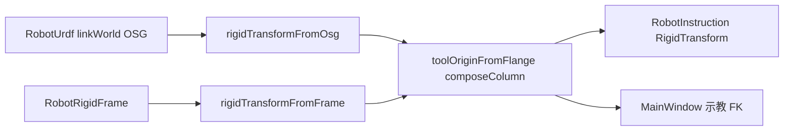

# GeometryEngine 模块开发文档

## 1. 模块定位

`GeometryEngine` 提供全应用统一的 **刚体变换真值**（`engine::RigidTransform`，内部 `Eigen::Isometry3d`），以及 OSG / `BackendMat4` 列主序之间的适配。不依赖 Qt、URDF、Widget。

| 属性 | 说明 |
|------|------|
| x64 输出 | `GeometryEngine.dll` + import lib `GeometryEngine.lib` |
| Win32 输出 | 静态 `GeometryEngine.lib` |
| 构建定义 | x64：`GEOMETRY_ENGINE_LIB`；Win32：`GEOMETRY_ENGINE_STATIC` |
| 依赖 | Eigen（`../../bin/SDK/eigen`）、OSG（`Adapters` 中 `osg::Matrixd` / `osg::Quat`） |
| 约定详表 | [`CONVENTIONS.md`](CONVENTIONS.md) |

**调用方**：`RobotScene`（指令位姿、工具链、IK 前置）、`Widget`（示教捕获、坐标系叠加层）、`Data`（`backend_mat4_multiply` 与 `composeColumn` 语义对齐）。

---

## 2. 核心类型

### 2.1 `engine::RigidTransform`

| API | 说明 |
|-----|------|
| `fromTranslationEulerDeg(px,py,pz, ex,ey,ez)` | 位姿 mm + 欧拉 deg（**显示/遗留 JSON**；比较旋转请用四元数） |
| `fromTranslationQuat(t, q)` | 平移 + 四元数（推荐真值构造） |
| `composeColumn(right)` | 列向量刚体乘：`p' = this * right`（`iso1 * iso2`） |
| `composeScene(child)` | OSG 行向量链：`v' = v * M_parent * M_child`（**仅**用于同源 OSG 矩阵链，勿与 URDF FK 混用于工具） |
| `inverse()` | 刚体逆 |
| `translationErrorMm` / `rotationErrorDeg` | IK/示教残差（旋转用四元数夹角，禁止欧拉相减） |

### 2.2 `engine::ToolKinematics`

| 函数 | 公式（列向量 / Eigen） |
|------|------------------------|
| `toolOriginFromFlange(T_base_flange, T_flange_tool)` | `T_base_tool = T_base_flange * T_flange_tool` |
| `flangeFromToolOrigin(T_base_tool, T_flange_tool)` | `T_base_flange = T_base_tool * inv(T_flange_tool)` |

**实现**：`ToolKinematics.cpp` 使用 **`composeColumn`**，不用 `composeScene`。

原因：URDF `linkWorld` 经 `rigidTransformFromOsg(mat4ToOsg(...))` 进入 Eigen，工具矩阵经 `rigidTransformFromBackendMat4`；若用 OSG 行向量 `parent.composeScene(child)`，两套适配器组合时会把法兰系平移 `(0,0,-200)` 误当成基座 Z 平移。修复后：`p_base = R_flange * t_tool + t_flange`（`t_tool` 在 **法兰连杆轴** 下）。

### 2.3 `Adapters.h`

| 函数 | 作用 |
|------|------|
| `rigidTransformFromOsg` / `osgMatrixFromRigidTransform` | OSG 行向量 ↔ Eigen（3×3 转置 + 底行平移） |
| `rigidTransformFromColMajor` / `colMajorFromRigidTransform` | `BackendMat4::v` 列主序 ↔ `RigidTransform` |
| `eulerDegToQuat` / `quatToEulerDeg` | 内禀 ZYX（`qz·qy·qx`），与 `BackendVisualMath` / 契约 §1.1 一致 |

### 2.4 `BackendWorldPose.h`（backend pose/rotation 真值）

Data、BackendVisual、OsgWidgetCore、ICP 共用的 **pose + 欧拉** 入口；语义见 [`spatial_contract_world_pose.md`](../../../docs/spatial_contract_world_pose.md) §1.1。

| API | 说明 |
|-----|------|
| `rigidTransformFromBackendPoseEuler(px,py,pz, ex,ey,ez)` | `pose` = 模型原点世界坐标 (mm)；`euler` = 内旋 ZYX 度；列向量 `p' = R×p + pose` |
| `backendPoseEulerFromRigidTransform(rt, …)` | 从 `RigidTransform` 反解 pose + ZYX 欧拉（显示/落盘） |

**包装（禁止重复拼装矩阵）：**

```text
rigidTransformFromBackendPoseEuler
  → osgMatrixFromRigidTransform     // BackendPoseOsg、ObjectGizmoFrame、buildOuterBranch
  → colMajorFromRigidTransform      // backend_world_mat_from_pose
```

`SelfTest.cpp` 覆盖：往返、Data/OSG 一致、绕原点旋转保 `pose`、与旧 `T×R` 区分。

---

## 3. 工具坐标系语义（与 UI 对齐）

`RobotCoordinate::RobotRigidFrame` → `rigidTransformFromFrame()`：

- **`positionMm`**：工具原点在 **法兰连杆坐标系**（`flangeLinkName`，如 `link_6`）下的 XYZ，单位 mm。
- **`eulerDeg`**：工具相对法兰的旋转（deg）。
- 例：`Z = -200`、欧拉全 0 → 沿 **法兰 Z** 负向 200 mm；映射到基座为 `R_flange * (0,0,-200)`。仅当法兰 Z ∥ 基座 Z 时，观感才像「只改世界 Z」。

UI：`RobotFrameSettingsWidget` 标签为 `X/Y/Z (mm, flange)`；列表行尾勾选控制该项 `showInScene`（与全局显示开关共同决定 3D 轴是否绘制）。

---

## 4. 自检

| API | 说明 |
|-----|------|
| `engine::runSelfTest(failures)` | 含 `BackendWorldPose` 往返、Data/OSG 一致、旋转保 pose、URDF compose、**Ry=90° 法兰 + (0,0,-200) 工具** |
| `RobotMatrixOsg::runConventionSelfTest` | 桥接 `RobotScene` 的 `targetInBaseFromFlange` 往返 |

构建后可在调试入口触发（见 `MainWindow` 矩阵自检日志）。

---

## 5. 与相邻模块的边界



| 模块 | 用法 |
|------|------|
| **RobotUrdf** | `computeLinkWorldMatrices` → OSG；勿在业务层再手写 `linkWorld * toolMat` 代替 `toolOriginFromFlange` |
| **RobotScene** | `RobotCoordinateFrames`、`RobotInstructionTransform`、`ikLinkTargetFromInstruction` |
| **Widget** | `targetRigidTransformFromUrdfFlangeFk`、`osgTcpInBaseFromFlangeLinkWorld`（内部已委托 engine）、`osgMatrixFromRobotRigidFrame` → `osgMatrixFromRigidTransform(rigidTransformFromFrame(...))` |
| **Data** | `backend_mat4_multiply` 与 `composeColumn` 同为 Eigen 列乘；遗留 `BackendMat4::translate` 仅边界/自检 |

---

## 6. 修改检查清单

1. 凡 **法兰 × 工具** 组合，只改 `ToolKinematics.cpp` 或经其 API，勿新增 `linkWorld * tool` 的裸 OSG 乘。
2. 旋转相等/IK 残差用 `rotationErrorDeg`，勿比欧拉字符串。
3. 扩展 `CONVENTIONS.md` 与本文档，避免在 `RobotScene` 重复写第三套约定。
4. 新增矩阵路径时补 `SelfTest.cpp` 用例。

---

## 7. 相关文档

- [`../../../docs/spatial_contract_world_pose.md`](../../../docs/spatial_contract_world_pose.md) §1.1（pose/rotation 基础语义）
- [`CONVENTIONS.md`](CONVENTIONS.md)
- [`../RobotScene/DEVELOPER_GUIDE.md`](../RobotScene/DEVELOPER_GUIDE.md) §8.3
- [`../RobotUrdf/DEVELOPER_GUIDE.md`](../RobotUrdf/DEVELOPER_GUIDE.md) §10
- [`../ARCHITECTURE_SUMMARY.md`](../ARCHITECTURE_SUMMARY.md) §6.4
