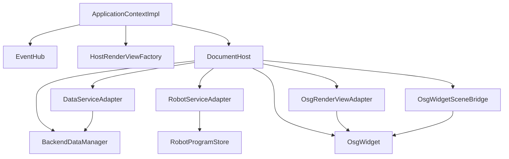

# CloudSimHost 模块开发文档

## 1. 模块定位

`CloudSimHost` 是 **本地引擎宿主 DLL**：把 `Data`、`OsgWidget`（Qt 壳层）与 `CloudSimCore` 契约接在一起，并导出应用组合根。对应架构中的「契约与宿主层」；**不是**远程服务。

| 属性 | 说明 |
|------|------|
| 路径 | `src/Host/CloudSimHost/` |
| x64 产物 | `bin/x64(d)/CloudSimHost.dll`、`CloudSimHost.lib` |
| 预处理器 | `CLOUDSIM_HOST_LIB`（本 DLL **export**）；消费方无此宏则为 **import** |
| 契约 | [`CloudSimCore/DEVELOPER_GUIDE.md`](../../Contracts/CloudSimCore/DEVELOPER_GUIDE.md) |
| 组合根声明 | [`CloudSimBootstrap/inc/CloudSimBootstrap.h`](../../App/CloudSimBootstrap/inc/CloudSimBootstrap.h)（实现于本 DLL） |

**与 `Widget` 的分工**

| 层 | 模块 | 职责 |
|----|------|------|
| UI 编排 | `Widget.dll` | `MainWindow`、树/属性/仿真 Dock、工程 I/O、`DocumentPage` 机器人元数据 |
| 文档宿主 | **`CloudSimHost.dll`** | 每页 `BackendDataManager` + `OsgWidget`、`Core` 适配器、`EventHub` 注入 |
| 契约 | `CloudSimCore.dll` | `IDataService` / `IRenderView` / `IRobotService` / `EventHub` |

`DocumentPage` **继承** `cloudsim::host::DocumentHost` 并实现 `IRobotSimulationDocument`；新功能优先经 `data()` / `render()` / `events()`，避免 Widget 再直接扩散 OSG/Data 头文件。

---

## 2. 目录与编译单元

```text
CloudSimHost/
├── inc/
│   ├── cloudsim_host_global.h    # CLOUDSIM_HOST_EXPORT
│   ├── widget_global.h           # Host 编 OSG 时 WIDGET_EXPORT / OSG_WIDGET_API → export
│   ├── CloudSimHost.h            # createDocumentHost / createHostRenderViewFactory
│   ├── DocumentHost.h            # QtMoc；勿与 ClInclude 重复登记
│   ├── HostRenderViewFactory.h
│   ├── BackendFileImport.h
│   ├── BackendHierarchyFollow.h
│   ├── HierarchyMeshImport.h
│   ├── BackendProjectObjectIo.h
│   ├── DocumentHostEvents.h
│   └── adapters/
│       ├── DataServiceAdapter.h
│       ├── OsgRenderViewAdapter.h
│       └── RobotServiceAdapter.h
└── source/
    ├── DocumentHost.cpp
    ├── CloudSimApplicationContext.cpp   # cloudsimCreateApplicationContext
    ├── CloudSimHostExport.cpp           # cloudsimCreateRenderViewFactory (C ABI)
    └── adapters/*.cpp
```

**自 `Widget` 编入本工程的源码**（路径仍为 `src/UI/Widget/`，勿在 Host 下维护第二份副本）：

- `OsgWidget.cpp` 及 `OsgWidget*Controller.cpp`、`ObjectTransformOperation.cpp`、`QWidgetViewer.cpp` 等
- `BackendSceneDocumentFacade.cpp`、`BackendFollowReverseIndex.cpp`、`OsgWidgetSceneBridge.cpp`

场景数学与拾取核心仍在 **`OsgWidgetCore.dll`**；`OsgWidget` 只做 Qt 事件与控件桥接。

---

## 3. 架构（本模块内）



---

## 4. 核心类型

### 4.1 `DocumentHost`

`DocumentHost` 是 Host 层的单文档组合根，既是 `QWidget`，也是 `cloudsim::core::IDocumentScope` 实现。`DocumentPage` 继承它后，不需要再自己拼装 Data/OSG/Core 三套对象。

| 维度 | 说明 |
|------|------|
| 职责边界 | 聚合 `BackendDataManager`、`OsgWidget`、三个 Core 适配器，向上提供统一文档能力 |
| 生命周期 | 构造时注入 `EventHub` 与 `documentId`；析构时统一释放文档级资源 |
| 对外契约 | `data()` / `robot()` / `render()` 返回稳定 Core 接口，供 UI 层长期调用 |
| 兼容接口 | `backend()` 存量直达；OSG 不再提供 `DocumentHost::osgWidget()`，Host 内用 `DocumentHostAccess.h` → `osgWidgetFrom(host)` |
| 事件协作 | 与 `MainWindow` 帧回调配合，处理跟随脏集、场景刷新与选择同步 |

常用 API 说明：

| API | 说明 |
|-----|------|
| `data()` / `robot()` / `render()` | Core 主入口；实际调用分别落到三个适配器 |
| `sceneBridge()` / `followReverseIndex()` | 返回场景桥接与跟随索引对象，用于主界面联动 |
| `loadMeshFromBackendIntoScene(...)` | 将 Data 树节点加载为 OSG 分支 |
| `removeBackendSubtree(...)` | 删除后端子树并同步场景节点移除 |
| `followDirtyBackendIds()` 等 | 提供跟随求解脏集，供外层按帧处理 |

工厂：

```cpp
std::unique_ptr<core::IDocumentScope> createDocumentHost(QWidget* parent, core::EventHub& events, const QString& documentId);
DocumentHost* documentHostFromScope(core::IDocumentScope* scope);  // dynamic_cast 包装
```

---

### 4.2 `DataServiceAdapter`

`DataServiceAdapter` 把 `BackendDataManager` 的工程数据能力投影到 `IDataService`。持有 `DocumentHost&`，可联动 OSG 与旁路表。

| 维度 | 说明 |
|------|------|
| 主要职责 | 节点注册、属性读写、导入导出、JSON/DTO 转换 |
| `importFromFile` | 委托 `DocumentImportFacade::importFileIntoDocument`（mesh；`ImportOptionsDto::isPointCloud` 时点云） |
| `applyPropertyChange` | 写 Backend 后委托 `BackendVisualSync::afterDataServicePropertyChange`（mesh/点云 OSG 同步、按需 `publishPoseCommittedFromBackend`） |
| `unregisterSubtree` | 委托 `DocumentHost::removeBackendSubtree`（Data + 旁路表 + OSG 视觉） |
| `hasVisualBranch` | 委托 `OsgWidget::hasBackendObjectBranch` |
| `saveObjectToJson` / `loadObjectFromJson` | 委托 `BackendProjectObjectIo` + `registerAdoptedBackendObject`（`load` 不含 OSG，内嵌几何用 `registerEmbeddedProjectObject`） |
| 扩展方式 | 新增数据能力时优先扩展 `IDataService` + Adapter，而不是暴露 `BackendDataManager*` |

---

### 4.2a `DocumentImportFacade` / `BackendFollowSolve`

| 模块 | 说明 |
|------|------|
| `importFileIntoDocument` | 点云 / 简单网格 / dxf·step·层级 统一路由；层级导入后 Host 内聚焦 |
| `registerAdoptedMesh` / `registerAdoptedPointCloud` | 已构造 mesh/点云注册（AI、插件、ply Job 完成回调）；内部 `registerAdopted*AndLoadScene` + `BackendObjectRegistered` |
| `runBackendFollowSolveAndSync` | Follow 求解 + `sceneBridge().syncOuterPatFromBackend`；`FollowSolveContext` 由 Widget 注入守卫 |
| `applyProjectEdgesFollowBindingAndSolve` | 工程 `edges[]` 批量 binding + 一次求解（`BackendProjectObjectIo`） |

### 4.2b `BackendVisualSync`

属性提交后的场景一致性与事件出口（供 `DataServiceAdapter::applyPropertyChange` 与 Widget pose 分量编辑后调用）。

| API | 说明 |
|-----|------|
| `propertyKeyNeedsVisualSync` / `propertyKeyCommitsPose` | 按 key 判断是否刷新 OSG / 发布 `PoseCommitted` |
| `syncVisualAfterPropertyChange` | `syncSelectionForBackendId` + `sceneBridge().syncOuterPatFromBackend`；可选 `setSelectedColor` |
| `afterDataServicePropertyChange` | 上述组合 + `publishPoseCommittedFromBackend` |

### 4.2c `ProjectPackageIo` / `AnnotationProjectIo`

| API | 说明 |
|-----|------|
| `buildProjectSaveRoot` | 生成 v4 的 objects/edges/annotations/camera；点云无坐标时 `abortMessage` |
| `mergeRobotKinematicsIntoProjectRoot` | 保存前写入 `robotKinematics` / `robotKinematicsInstances`（委托 `RobotProjectIo::writeRobotKinematics`；参数为全局 `::IRobotDocumentHost*`） |
| `applyProjectViewportFromJson` | 恢复标注与 `cameraFollowBackendId`（经 `AnnotationProjectIo`） |
| `finalizeProjectLoadFollowAndViewport` | OSG 父链、edges 跟随、视口、强制 Follow 求解 |
| `restoreRobotKinematicsFromProjectJson` | 工程 robotKinematics* 恢复（perLink） |
| `loadRobotProgramsFromProjectJson` / `mergeRobotProgramsIntoProjectRoot` | 程序 JSON 读写 |
| `buildAnnotationsJsonFromOsg` / `applyAnnotationsFromProjectJson` | 注释 snapshot ↔ JSON（`AnnotationProjectIo`） |

`DocumentHostEvents`：`publishProjectLoaded`、`publishSelectionChanged`、`publishPoseCommitted`（gizmo 松手、属性提交经 `publishPoseCommittedFromBackend`）。**订阅**：`MainWindowUiSetup` 已订阅 `SelectionChanged` / `PoseCommitted` 刷新属性面板；`BackendObjectRegistered/Removed` 刷新树。

---

### 4.3 `OsgRenderViewAdapter`

`OsgRenderViewAdapter` 负责把 `OsgWidget` 能力映射到 `IRenderView`，是 Host 内 OSG 交互的契约出口。

| 维度 | 说明 |
|------|------|
| 主要职责 | 相机控制、拾取、场景定位、变换提交、`focusCameraOnBackend`、`setBackendLogicalParent` |
| 关键转换 | `core::Mat4`（列主序 `16 x double`）与 `osg::Matrixd` 双向转换 |
| 事件接入 | 拾取回调通过 `setPickHandler` 注入，外层可转发到 `EventHub` |
| Widget 取用 | `MainWindow::currentOsgWidget()` → `qobject_cast<OsgWidget*>(page->render().widget())`（需 `#include "IRenderView.h"`） |
| 设计约束 | 不在 Adapter 内引入业务判断，业务决策放 `DocumentPage` 或上层服务 |

---

### 4.4 `RobotServiceAdapter`

`RobotServiceAdapter` 实现 `IRobotService`；URDF、FK、程序 JSON、基础规划已接线。

| API | 说明 |
|-----|------|
| `registerUrdfRobot` | → `UrdfRobotImport`；成功时 `publishBackendObjectRegistered` |
| `applyJointAnglesRad` | → `RobotSceneKinematics::applyJointAnglesForInstance`；`publishRobotKinematicsApplied` |
| `robotProgramsJson` / `setRobotProgramsJson` | → `RobotProgramJsonIo` + `RobotProgramStore` |
| `planInstruction` | → `RobotPlanInstruction::planMotionInstruction`（`RobotInstruction::Controller::plan`） |

### 4.4.1 `BackendFileImport` 注册（`registerAdopted*`）

实现于 `BackendFileImport.h`；对外入口为 `DocumentImportFacade::registerAdoptedMesh/PointCloud` 或 `importFileIntoDocument`。

| 函数 | 说明 |
|------|------|
| `registerAdoptedBackendObject` | 接管已构造 `BackendDataBase`；发布 `BackendObjectRegisteredEvent` |
| `registerAdoptedMeshAndLoadScene` | 上者 + `OsgWidget::loadMeshFromBackendData`（DXF/STEP/OSG 分件） |
| `registerAdoptedPointCloudAndLoadScene` | 上者 + `OsgWidget::loadPointCloudFromBackendData`（含 JobSystem 异步完成回调） |

**可选参数（`BackendFileImport`）**

| 参数 | 默认 | 说明 |
|------|------|------|
| `linkOsgSceneParent` | `true` | `false` 时仅 `BackendDataManager::attachChild` + `OsgWidget::setBackendLogicalParent`（不改 OSG 场景父链） |
| `skipInnerModelCenterRebase` | `false` | `true` 时顶点按文件世界坐标显示（DXF 分件）；与 URDF 每连杆语义相近 |

**层级跟随绑定**（工程 `edges` / 属性编辑，**非** DXF 分件导入）由 `cloudsim::host::applyHierarchyFollowBinding` 写入 `FollowAttachment`；`MainWindow::applyHierarchyFollowBinding` 再调用 `runBackendFollowSolveAndSync`。

层级分件导入时 `MainWindow::beginBackendTreeEventRefreshSuppress()` 抑制逐片树刷新，结束时一次 `refreshBackendTree()`。

### 4.4.1a `HierarchyMeshImport`（DXF / STEP / OSG 层级）

实现：`HierarchyMeshImport.cpp`；由 `MainWindowImportCaptureRenderController::registerBackendObject` 调用 `importMeshFileExtended`。

| API | 说明 |
|-----|------|
| `importMeshHierarchyParts` | 空壳父节点 + 按 `MeshHierarchyPart` 分件 `registerAdoptedMeshAndLoadScene` |
| `importMeshFileExtended` | dxf → `loadDxfHierarchyFromFile`；step → `loadStepHierarchyFromFile`；失败则 CGAL 单件或 OSG 捕获层级 |

**DXF/STEP 分件约定（勿与工程 `edges` 跟随混用）**

1. 顶点已在 **世界坐标**（`dxfExpandInsertRecursive` 等烘焙进 `triangleSoup`）。
2. 每片：`skipInnerModelCenterRebase=true`、`linkOsgSceneParent=false`、`setBackendLogicalParent` 写入 `m_backendParentIds`。
3. **导入阶段不调用** `onParentFollow` / `applyHierarchyFollowBinding`（Follow 求解会把 `pose` 写成约 `-质心`，导致 3D 错位）。
4. 导入结束：`OsgWidget::focusCameraOnBackend(importParent->id())` 聚合逻辑子树下全部分件包围球（依赖 `setBackendLogicalParent` + `worldBoundOfBackendRoot` 对世界坐标顶点取变换后中心）。

`HierarchyFollowBindingFn onParentFollow` 参数保留供 API 稳定；当前分件路径内为 no-op。

### 4.4.2 `DocumentHostEvents`

| 函数 | 事件 |
|------|------|
| `publishBackendObjectRegistered` | `BackendObjectRegisteredEvent` |
| `publishBackendObjectRemoved` | `BackendObjectRemovedEvent`（`removeBackendSubtree`） |
| `publishRobotKinematicsApplied` | `RobotKinematicsAppliedEvent` |

`MainWindow` 订阅前两项，在 `documentId` 与当前页一致时 `refreshBackendTree()`。

**工程 I/O**

| 操作 | API |
|------|-----|
| 保存 `robotPrograms` | `page->robot().robotProgramsJson()` |
| 加载 `robotPrograms` | `setRobotProgramsJson` |
| 保存 `objects[]` | `BackendProjectObjectIo::saveProjectObject` |
| 加载 `objects[]` | `loadProjectObjectsFromJson` + `finalizeProjectHierarchyAfterObjects` |
| 加载内嵌几何 | `registerEmbeddedProjectObject`（由 load 编排调用） |
| 工程文件回退 | `importProjectObjectFromFile`（网格 `importMeshFile`；点云 ply/xyz `importPointCloudFile`） |
| 点云 ply/xyz/las/laz | `importPointCloudFile`（ply/xyz=CGAL 顶点；**ply 含 face**→`importMeshFile`；las/laz=OsgWidget+capture）；大文件纯顶点 ply 可走 Job 异步（Widget） |
| `parseProjectEdgesJson` / `applyProjectEdgesToBackend` | 恢复 `edges[]` → `BackendDataManager::attachChild` |
| `syncOsgBackendParentsFromBackend` | Data 父子 → `OsgWidget::setBackendParent` |
| `rebuildBackendParentIdMirror` | edges 后重建 `backendParentId` 旁路表 |
| `applyPointCloudPoseFromProjectJson` | 文件回退点云的 pose/rotation/color |
| `collectRobotLinkMeshBackendIds` | 工程内 perLink 连杆网格 id（`meshInLinkFrame`） |
| `restorePerLinkRobotKinematicsFromProjectJson` | 恢复 `robotKinematicsInstances[]` / 旧 `robotKinematics` |
| `rekeyBackendObject` | Data/OSG/旁路表迁移 + remove/register 事件 |
| 删除子树 | `page->data().unregisterSubtree()` |
| DXF/STEP/OSG 层级网格 | `importMeshFileExtended` / `importMeshHierarchyParts` |
| 层级跟随（仅组件，不求解） | `applyHierarchyFollowBinding` |

**插件**：`IPluginDocument::removeBackendObject` → `unregisterSubtree`；`IPluginHostContext::importFileIntoActiveDocument` → `DocumentImportFacade`；网格注册 → `registerAdoptedMesh`。

**规划**：`RobotSimulationController` 经 `IRobotMainWindowHost::planRobotMotionInstruction` → `planRobotInstruction` → `planMotionInstruction`（与 `IRobotService::planInstruction` 同 Host 路径）。

### 4.4.3 API 迁移与废弃（2025 Host 收口）

| 场景 | 使用 | 说明 |
|------|------|------|
| 已构造 mesh/点云注册 + OSG | `DocumentImportFacade::registerAdoptedMesh` / `registerAdoptedPointCloud` | 发 `BackendObjectRegisteredEvent` |
| 已构造任意 `BackendDataBase`（Host 内部） | `BackendFileImport::registerAdoptedBackendObject` | 发 `BackendObjectRegisteredEvent` |
| 简单网格文件 obj/stl/ply/off | `page->data().importFromFile` → `BackendFileImport::importMeshFile` | 含 `ImportOptionsDto::persistedId` |
| 点云 ply/xyz（工程/Host） | `importPointCloudFile` / `importProjectObjectFromFile` | |
| 工程 `objects[]` 整批加载 | `loadProjectObjectsFromJson` + `finalizeProjectHierarchyAfterObjects` | las/laz 经 Widget 回调 |
| 工程稳定 id | `rekeyBackendObject` 或导入前 `setId` | |
| 删子树 | `page->data().unregisterSubtree` | |
| DXF/STEP/OSG 层级 / CGAL+OSG 回退 | `importMeshFileExtended` / `importMeshHierarchyParts`（`HierarchyMeshImport`） | 世界坐标分件：`skipInnerModelCenterRebase` + `setBackendLogicalParent` + 导入时不做 Follow；导入后 `focusCameraOnBackend(importParent)`；工程 `edges` 仍走 `applyHierarchyFollowBinding` |
| 跟随（层级边 / legacy parentId） | `applyHierarchyFollowBinding`（Host） | 工程加载 edges 批量绑定后一次 `runBackendFollowSolveAndSync`；属性编辑仍经 `MainWindow::applyHierarchyFollowBinding` |

**已删除（勿再引用）**

| 符号 | 说明 |
|------|------|
| `DocumentHost::registerAdoptedBackendObject` / `registerAdoptedMeshAndLoadScene` / `registerAdoptedPointCloudAndLoadScene` | 改用 `BackendFileImport.h` 自由函数或 `DocumentImportFacade` |
| `DocumentHost::osgWidget()` | 改用 `osgWidgetFrom(host)`（`DocumentHostAccess.h`） |
| `MainWindow::registerExistingBackendObject` | 无调用方 |
| `MainWindow::syncOsgViewerFrom*Backend`、`backendPropertyCommitted` | 由 `BackendVisualSync` + EventHub 替代 |
| `RobotProjectIo::writeRobotKinematicsAndPrograms` | 保存拆分为 `mergeRobotKinematicsIntoProjectRoot` + `mergeRobotProgramsIntoProjectRoot` |

**访问辅助头**

| 头文件 | 函数 | 调用方 |
|--------|------|--------|
| `DocumentHostAccess.h` | `osgWidgetFrom(DocumentHost&)` | Host 模块内 |
| `WidgetDocumentAccess.h`（Widget） | `widgetOsgFromPage(DocumentPage*)` | `MainWindow`、`DocumentPage` 等 |

**暂勿删除**

- `MainWindow::registerBackendObject` / `MainWindowImportCaptureRenderController::registerBackendObject` — 复杂格式与异步点云仍依赖该路径。
- `MainWindow::runBackendFollowSolveAndSync` — 跟随求解与 UI 树/属性面板/仿真态耦合。

头文件中类型前向声明必须写在**全局**命名空间（勿在 `namespace cloudsim::host { class OsgWidget; }` 内声明，否则会与 `::OsgWidget` 冲突）。

---

### 4.5 `ApplicationContextImpl`

`ApplicationContextImpl` 是进程级应用上下文，实现于 `CloudSimApplicationContext.cpp`，负责聚合全局 `EventHub` 和文档工厂。

| 维度 | 说明 |
|------|------|
| 创建入口 | `cloudsimCreateApplicationContext()` |
| 核心职责 | 提供 `events()`；按需创建 `IDocumentScope` |
| 关键调用链 | `createDocumentScope` → `createDocumentHost` |
| 生命周期 | 通常在 `main` 启动阶段创建一次，进程内复用 |

对外 C 导出：

| 导出函数 | 说明 |
|----------|------|
| `cloudsimCreateApplicationContext()` | 构造 `ApplicationContextImpl` + `createHostRenderViewFactory()` |
| `cloudsimSetApplicationContext(...)` | 写入进程单例（`main` 调用） |
| `cloudsimApplicationContext()` | 获取当前上下文；`MainWindow` 用 `->events()` |

---

### 4.6 `HostRenderViewFactory`

`HostRenderViewFactory` 负责按文档实例生产 `IRenderView` 视图对象，给非 `DocumentHost` 直持有场景视图的调用方使用。

| 维度 | 说明 |
|------|------|
| 定位 | 渲染视图工厂，不承载业务逻辑 |
| 使用场景 | 插件化加载、跨模块按需获取渲染视图 |
| 约束 | 仅负责创建与生命周期托管，不负责事件编排 |

---

### 4.7 `OsgWidgetSceneBridge` 与 `BackendFollowReverseIndex`

两者源码位于 `Widget/source`，但由 Host 工程编译并作为文档级基础设施使用。

| 类 | 说明 |
|----|------|
| `OsgWidgetSceneBridge` | 封装场景节点与后端对象树的映射关系，降低 `DocumentPage` 直接操作 OSG 细节的频率 |
| `BackendFollowReverseIndex` | 维护“被跟随对象 → 跟随者集合”反向索引，支持脏集增量更新 |

---

### 4.8 `cloudsimCreateRenderViewFactory`

`CloudSimHostExport.cpp` 的 C 导出函数。调用时先校验 `cloudsimCoreApiVersion()`，通过后返回 `HostRenderViewFactory`。当前主程序以 `cloudsimCreateApplicationContext()` 为主路径，保留该导出用于未来动态加载方。

---

## 5. 工程与构建

### 5.1 链接依赖（`CloudSimHost.vcxproj`）

`CloudSimCore`、`OsgWidgetCore`、`BackendVisual`、`Data`、`RunLogger`、`GeometryEngine`、`RobotScene`、`RobotUrdf`、`RobotKinematics`、`RobotWidget`（工程引用，保证生成顺序）。

### 5.2 输出与链接路径

[`CloudSim/Directory.Build.props`](../../../Directory.Build.props) 定义：

- Debug：`$(CloudSimBinDir)` → `CGAL5.5.2/bin/x64d/`
- Release：`bin/x64/`

`OutDir` = `$(CloudSimBinDir)`。消费方（`Widget`、`CloudSim`）应链接 `$(CloudSimBinDir)CloudSimHost.lib` 并设置 `ProjectReference` + `LinkLibraryDependencies`。

### 5.3 推荐生成顺序

`CloudSimCore` → `Data`（及依赖引擎）→ **`CloudSimHost`** → `Widget` → `CloudSim`。

若仅生成 Widget/CloudSim 报 **LNK1181 找不到 CloudSimHost.lib**，先单独生成 **CloudSimHost**。

### 5.4 Qt MOC 注意

- `DocumentHost.h`：仅 `<QtMoc Include="inc\DocumentHost.h" />`
- `OsgWidget.h` / `QWidgetViewer.h`：MOC 项附加 `<Defines>CLOUDSIM_HOST_LIB;%(Defines)</Defines>`，与 `widget_global.h` 一致

**禁止**同一头文件同时出现在 `ClInclude` 与 `QtMoc`（VS 报错：重复项目项）。

### 5.5 预处理器（Host 工程）

| 宏 | 作用 |
|----|------|
| `CLOUDSIM_HOST_LIB` | 本 DLL 导出 `CLOUDSIM_HOST_EXPORT` |
| `CLOUDSIM_OSG_IN_HOST` | Widget 头文件中区分 OSG 符号 import/export（与 Widget 工程约定） |

Widget 工程 **不**定义 `CLOUDSIM_HOST_LIB`，链接 Host 的 import lib。

---

## 6. 消费方集成

### 6.1 `CloudSim.exe`

```cpp
#include "CloudSimBootstrap.h"
#include "MainWindow.h"

cloudsimSetApplicationContext(cloudsimCreateApplicationContext());
MainWindow w(cloudsimApplicationContext()->events());
```

Include：`CloudSimBootstrap/inc`、`CloudSimHost/inc`、`CloudSimCore/inc`。  
链接：`CloudSimCore.lib`、`CloudSimHost.lib`、`Widget.lib`（及 Data 等）。

### 6.2 `Widget` / `DocumentPage`

```cpp
class DocumentPage : public cloudsim::host::DocumentHost, public IRobotSimulationDocument
```

- 构造：`DocumentHost(parentTabs, events, documentId)`
- 机器人仿真、URDF 聚合、`HierarchicalRobotInstance` 仍在 `DocumentPage`；后续可改为调用 `robot()` 或 `EventHub`

### 6.3 新代码应遵守

1. **跨模块数据**：经 `CoreTypes` DTO 与 `IDataService` / `IRenderView`，禁止 `void*` 或全 API JSON 穿透 UI。
2. **OSG 修改**：改 `Widget/source/OsgWidget*.cpp`（由 Host 编译）；核心场景改 `OsgWidgetCore`。
3. **事件**：向 `EventHub` 发布/订阅（`CoreEvents.h`）；选择/姿态刷新优先走 `SelectionChanged` / `PoseCommitted`，避免新增 `MainWindow`↔`OsgWidget` 硬编码信号链。

---

## 7. 与相关文档

| 文档 | 内容 |
|------|------|
| [`ARCHITECTURE_SUMMARY.md`](../../../ARCHITECTURE_SUMMARY.md) §2.1、§4.0.1 | 全局边界与运行时 DLL |
| [`CloudSimCore/DEVELOPER_GUIDE.md`](../../Contracts/CloudSimCore/DEVELOPER_GUIDE.md) | `IDataService` / `IRenderView` / `EventHub` 与 Host 行为对照 |
| [`Widget/DEVELOPER_GUIDE.md`](../../UI/Widget/DEVELOPER_GUIDE.md) | 主窗口与 `DocumentPage`（UI 仍描述 OsgWidget 行为，实现位于 Host） |
| [`CloudSimPluginHost/DEVELOPER_GUIDE.md`](../../UI/CloudSimPluginHost/DEVELOPER_GUIDE.md) | 动态插件宿主、`PluginHostContext` 与 Facade 接线 |
| [`OsgWidgetCore/DEVELOPER_GUIDE.md`](../../UI/OsgWidgetCore/DEVELOPER_GUIDE.md) | 场景核心、gizmo、拾取索引 |

---

## 8. 演进路线（维护者）

**已完成（Host 剩余接线）**

1. ~~**属性 `IDataService`**~~：`DataServiceAdapter::applyPropertyChange` + `BackendVisualSync`；`MainWindowPropertyPanel` 普通行走 `doc->data()`。
2. ~~**导入/注册收口**~~：`DocumentImportFacade::registerAdoptedMesh/PointCloud`；菜单/插件/AI/ply Job 异步完成回调统一；`importFromFile` 支持点云。
3. ~~**EventHub 选择/姿态**~~：`publishSelectionChanged` / `publishPoseCommitted`；`MainWindowUiSetup` 订阅刷新属性面板。
4. ~~**工程保存**~~：`mergeRobotKinematicsIntoProjectRoot`；注释 JSON 抽至 `AnnotationProjectIo`。
5. ~~**场景门面**~~：`BackendSceneDocumentFacade::ensureSelectionVisualForBackend`；`currentOsgWidget` 经 `render().widget()`。
6. ~~**API 去重**~~：移除 `DocumentHost` 公开 `registerAdopted*` / `osgWidget()`；`osgWidgetFrom` + Widget `widgetOsgFromPage`；删除 Widget 死代码（`syncOsgViewer*`、`backendPropertyCommitted` 等）。

**仍待 / 长期**

1. **`IRobotSimulationDocument`**：实例元数据仍留 `DocumentPage` / `RobotWidget`（`RobotSimulationController` 编排）。
2. **`IRenderView` 全面替代**：拾取/显隐/gizmo 等逐步经契约或 `sceneFacade`，减少裸 `OsgWidget*`（OSG 获取已统一为 `osgWidgetFrom` / `widgetOsgFromPage`）。
3. **仿真指令属性**：`MainWindowPropertyPanel` 内 `RobotInstruction` 仍直连（非 `IDataService`）。
4. **Host 目录**：`source/osg/` 若存在勿加入 vcxproj；以 `Widget/source` 为唯一 OsgWidget 源码真源。
5. **`.pcp` zip**：仍在 Widget（`project_package_zip`），非 Host 职责。

---

## 9. 常见问题

| 现象 | 处理 |
|------|------|
| LNK1181 `CloudSimHost.lib` | 先编 Host；确认 `bin/x64d/CloudSimHost.lib` 存在；检查 `Directory.Build.props` 是否生效 |
| 重复项目项 `DocumentHost.h` | 从 `ClInclude` 移除，仅保留 `QtMoc` |
| OsgWidget 符号链接错误 | Host 编时必须有 `CLOUDSIM_HOST_LIB`；Widget 侧 include `widget_global.h` 且 **不要** 再编 OsgWidget.cpp |
| LNK1104 `CloudSimCore.lib` | 并行生成时先单独编 `CloudSimCore`，再编 Host |
| DXF 导入后 3D 错位 | 勿对分件开 Follow 求解；确认 `skipInnerModelCenterRebase` 且未误调 `applyHierarchyFollowBinding` |
| DXF 导入后相机不对 | 应对 `importParent` 调 `focusCameraOnBackend`；分件须 `setBackendLogicalParent`（见 §4.4.1a） |
| `cloudsim::host::MeshBackendData` 编译错误 | 头文件前向声明须在**全局**命名空间（见 §4.4.3） |
| `cloudsim::host::IRobotDocumentHost` 与 `IRobotDocumentHost*` 不匹配 | `ProjectPackageIo.h` 须在**全局**前向声明 `IRobotDocumentHost`，API 使用 `::IRobotDocumentHost*` |
| `IRenderView` 未定义 | 包含 `IRenderView.h`（`DocumentHostAccess.h` / `WidgetDocumentAccess.h` 已包含） |
| C2662 `render()` 与 `const DocumentHost` | `osgWidgetFrom` 仅接受非 const `DocumentHost&` |
| C2662 `render()` 与 `const DocumentPage` | Widget 仅用 `widgetOsgFromPage(DocumentPage*)`，勿加 const 重载 |
