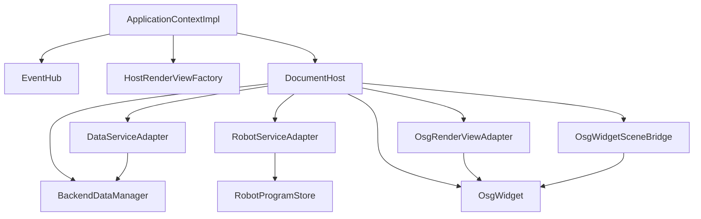

# CloudSimHost 模块开发文档

## 1. 模块定位

`CloudSimHost` 是 **本地引擎宿主 DLL**：把 `Data`、`OsgWidget`（Qt 壳层）与 `CloudSimCore` 契约接在一起，并导出应用组合根。对应架构中的「契约与宿主层」；**不是**远程服务。

| 属性 | 说明 |
|------|------|
| 路径 | `src/Host/CloudSimHost/` |
| x64 产物 | `bin/x64(d)/CloudSimHost.dll`、`CloudSimHost.lib` |
| 预处理器 | `CLOUDSIM_HOST_LIB`（本 DLL **export**）；消费方无此宏则为 **import** |
| 契约 | [`CloudSimCore/DEVELOPER_GUIDE.md`](../../Contracts/CloudSimCore/DEVELOPER_GUIDE.md) |
| 组合根声明 | [`CloudSimBootstrap/inc/CloudSimBootstrap.h`](../../App/CloudSimBootstrap/inc/CloudSimBootstrap.h)（实现于本 DLL） |

**与 `Widget` 的分工**

| 层 | 模块 | 职责 |
|----|------|------|
| UI 编排 | `Widget.dll` | `MainWindow`、树/属性/仿真 Dock、工程 I/O、`DocumentPage` 机器人元数据 |
| 文档宿主 | **`CloudSimHost.dll`** | 每页 `BackendDataManager` + `OsgWidget`、`Core` 适配器、`EventHub` 注入 |
| 契约 | `CloudSimCore.dll` | `IDataService` / `IRenderView` / `IRobotService` / `EventHub` |

`DocumentPage` **继承** `cloudsim::host::DocumentHost` 并实现 `IRobotSimulationDocument`；新功能优先经 `data()` / `render()` / `events()`，避免 Widget 再直接扩散 OSG/Data 头文件。

---

## 2. 目录与编译单元

```text
CloudSimHost/
├── inc/
│   ├── cloudsim_host_global.h    # CLOUDSIM_HOST_EXPORT
│   ├── widget_global.h           # Host 编 OSG 时 WIDGET_EXPORT / OSG_WIDGET_API → export
│   ├── CloudSimHost.h            # createDocumentHost / createHostRenderViewFactory
│   ├── DocumentHost.h            # QtMoc；勿与 ClInclude 重复登记
│   ├── HostRenderViewFactory.h
│   └── adapters/
│       ├── DataServiceAdapter.h
│       ├── OsgRenderViewAdapter.h
│       └── RobotServiceAdapter.h
└── source/
    ├── DocumentHost.cpp
    ├── CloudSimApplicationContext.cpp   # cloudsimCreateApplicationContext
    ├── CloudSimHostExport.cpp           # cloudsimCreateRenderViewFactory (C ABI)
    └── adapters/*.cpp
```

**自 `Widget` 编入本工程的源码**（路径仍为 `src/UI/Widget/`，勿在 Host 下维护第二份副本）：

- `OsgWidget.cpp` 及 `OsgWidget*Controller.cpp`、`ObjectTransformOperation.cpp`、`QWidgetViewer.cpp` 等
- `BackendSceneDocumentFacade.cpp`、`BackendFollowReverseIndex.cpp`、`OsgWidgetSceneBridge.cpp`

场景数学与拾取核心仍在 **`OsgWidgetCore.dll`**；`OsgWidget` 只做 Qt 事件与控件桥接。

---

## 3. 架构（本模块内）



---

## 4. 核心类型

### 4.1 `DocumentHost`

单文档宿主：`QWidget` + `cloudsim::core::IDocumentScope`。

| API | 说明 |
|-----|------|
| `data()` / `robot()` / `render()` | Core 接口；背后为三个适配器 |
| `osgWidget()` / `backend()` | 遗留直达指针；Widget 内逐步收敛到 Core |
| `sceneBridge()` / `followReverseIndex()` | 场景门面与跟随反向索引（源码在 Widget，由 Host 编译） |
| `loadMeshFromBackendIntoScene(...)` | 委托 `OsgWidget` 加载网格分支 |
| `removeBackendSubtree(...)` | 逻辑删除 + 场景视觉移除 |
| `followDirtyBackendIds()` 等 | 跟随求解脏集（与 `MainWindow` 帧回调协作） |

工厂：

```cpp
std::unique_ptr<core::IDocumentScope> createDocumentHost(QWidget* parent, core::EventHub& events, const QString& documentId);
DocumentHost* documentHostFromScope(core::IDocumentScope* scope);  // dynamic_cast 包装
```

### 4.2 适配器

| 类 | 实现状态 | 说明 |
|----|----------|------|
| **`DataServiceAdapter`** | **已接真实 `BackendDataManager`** | 注册/属性/导入/JSON 等映射到 `IDataService` DTO |
| **`OsgRenderViewAdapter`** | **已接 `OsgWidget`** | `Mat4`（列主序 16×double）↔ `osg::Matrixd`；拾取经 `setPickHandler` |
| **`RobotServiceAdapter`** | **占位** | 各方法返回错误提示，引导使用 `RobotWidget` / `RobotScene` / `RobotProjectIo` |

扩展机器人能力时：在 `RobotServiceAdapter.cpp` 内调用 `RobotScene` / `DocumentPage` 已有逻辑，或迁入 `RobotProgramStore` 的 JSON 读写，**不要**在 Widget 再实现一套平行 API。

### 4.3 组合根（`CloudSimApplicationContext.cpp`）

| 导出函数 | 说明 |
|----------|------|
| `cloudsimCreateApplicationContext()` | 构造 `ApplicationContextImpl` + `createHostRenderViewFactory()` |
| `cloudsimSetApplicationContext(...)` | 进程单例（`main` 调用） |
| `cloudsimApplicationContext()` | 取当前上下文；`MainWindow` 用 `->events()` |

`ApplicationContextImpl::createDocumentScope` 内部调用 `createDocumentHost`。

### 4.4 `cloudsimCreateRenderViewFactory`

`CloudSimHostExport.cpp` 提供 C 导出，校验 `cloudsimCoreApiVersion()` 后返回 `HostRenderViewFactory`。供将来非 Widget 消费者动态加载；当前 exe 主要走 `cloudsimCreateApplicationContext()`。

---

## 5. 工程与构建

### 5.1 链接依赖（`CloudSimHost.vcxproj`）

`CloudSimCore`、`OsgWidgetCore`、`BackendVisual`、`Data`、`RunLogger`、`GeometryEngine`、`RobotScene`、`RobotUrdf`、`RobotKinematics`、`RobotWidget`（工程引用，保证生成顺序）。

### 5.2 输出与链接路径

[`CloudSim/Directory.Build.props`](../../../Directory.Build.props) 定义：

- Debug：`$(CloudSimBinDir)` → `CGAL5.5.2/bin/x64d/`
- Release：`bin/x64/`

`OutDir` = `$(CloudSimBinDir)`。消费方（`Widget`、`CloudSim`）应链接 `$(CloudSimBinDir)CloudSimHost.lib` 并设置 `ProjectReference` + `LinkLibraryDependencies`。

### 5.3 推荐生成顺序

`CloudSimCore` → `Data`（及依赖引擎）→ **`CloudSimHost`** → `Widget` → `CloudSim`。

若仅生成 Widget/CloudSim 报 **LNK1181 找不到 CloudSimHost.lib**，先单独生成 **CloudSimHost**。

### 5.4 Qt MOC 注意

- `DocumentHost.h`：仅 `<QtMoc Include="inc\DocumentHost.h" />`
- `OsgWidget.h` / `QWidgetViewer.h`：MOC 项附加 `<Defines>CLOUDSIM_HOST_LIB;%(Defines)</Defines>`，与 `widget_global.h` 一致

**禁止**同一头文件同时出现在 `ClInclude` 与 `QtMoc`（VS 报错：重复项目项）。

### 5.5 预处理器（Host 工程）

| 宏 | 作用 |
|----|------|
| `CLOUDSIM_HOST_LIB` | 本 DLL 导出 `CLOUDSIM_HOST_EXPORT` |
| `CLOUDSIM_OSG_IN_HOST` | Widget 头文件中区分 OSG 符号 import/export（与 Widget 工程约定） |

Widget 工程 **不**定义 `CLOUDSIM_HOST_LIB`，链接 Host 的 import lib。

---

## 6. 消费方集成

### 6.1 `CloudSim.exe`

```cpp
#include "CloudSimBootstrap.h"
#include "MainWindow.h"

cloudsimSetApplicationContext(cloudsimCreateApplicationContext());
MainWindow w(cloudsimApplicationContext()->events());
```

Include：`CloudSimBootstrap/inc`、`CloudSimHost/inc`、`CloudSimCore/inc`。  
链接：`CloudSimCore.lib`、`CloudSimHost.lib`、`Widget.lib`（及 Data 等）。

### 6.2 `Widget` / `DocumentPage`

```cpp
class DocumentPage : public cloudsim::host::DocumentHost, public IRobotSimulationDocument
```

- 构造：`DocumentHost(parentTabs, events, documentId)`
- 机器人仿真、URDF 聚合、`HierarchicalRobotInstance` 仍在 `DocumentPage`；后续可改为调用 `robot()` 或 `EventHub`

### 6.3 新代码应遵守

1. **跨模块数据**：经 `CoreTypes` DTO 与 `IDataService` / `IRenderView`，禁止 `void*` 或全 API JSON 穿透 UI。
2. **OSG 修改**：改 `Widget/source/OsgWidget*.cpp`（由 Host 编译）；核心场景改 `OsgWidgetCore`。
3. **事件**：向 `EventHub` 发布/订阅（`CoreEvents.h`）；避免 `MainWindow` 与 `OsgWidget` 新增硬编码信号链（待办：SelectionChanged、PoseCommitted 等贯通）。

---

## 7. 与相关文档

| 文档 | 内容 |
|------|------|
| [`ARCHITECTURE_SUMMARY.md`](../../../ARCHITECTURE_SUMMARY.md) §2.1、§4.0.1 | 全局边界与运行时 DLL |
| [`CloudSimCore/DEVELOPER_GUIDE.md`](../../Contracts/CloudSimCore/DEVELOPER_GUIDE.md) | 契约接口一览 |
| [`Widget/DEVELOPER_GUIDE.md`](../../UI/Widget/DEVELOPER_GUIDE.md) | 主窗口与 `DocumentPage`（UI 仍描述 OsgWidget 行为，实现位于 Host） |
| [`OsgWidgetCore/DEVELOPER_GUIDE.md`](../../UI/OsgWidgetCore/DEVELOPER_GUIDE.md) | 场景核心、gizmo、拾取索引 |

---

## 8. 演进路线（维护者）

1. **`EventHub`**：`OsgWidget` 拾取、gizmo 提交、属性变更发布统一事件，`MainWindow` 订阅刷新。
2. **`IRobotService`**：在 `RobotServiceAdapter` 中对接 `RobotSceneKinematics`、`RobotProjectIo`、URDF 注册（替换占位返回）。
3. **`DocumentPage` 瘦身**：`IRobotSimulationDocument` 字段逐步 DTO 化，减少 Widget 对 `osg::` / `BackendDataManager` 的直接 include。
4. **Host 目录**：`source/osg/` 若存在勿加入 vcxproj；以 `Widget/source` 为唯一源码真源。

---

## 9. 常见问题

| 现象 | 处理 |
|------|------|
| LNK1181 `CloudSimHost.lib` | 先编 Host；确认 `bin/x64d/CloudSimHost.lib` 存在；检查 `Directory.Build.props` 是否生效 |
| 重复项目项 `DocumentHost.h` | 从 `ClInclude` 移除，仅保留 `QtMoc` |
| OsgWidget 符号链接错误 | Host 编时必须有 `CLOUDSIM_HOST_LIB`；Widget 侧 include `widget_global.h` 且 **不要** 再编 OsgWidget.cpp |
| LNK1104 `CloudSimCore.lib` | 并行生成时先单独编 `CloudSimCore`，再编 Host |
