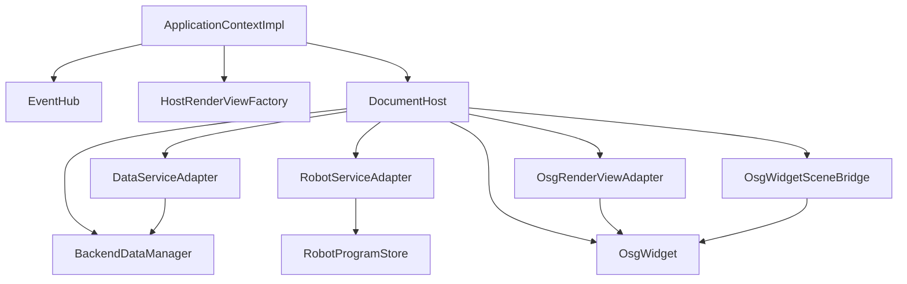

# CloudSimHost 模块开发文档

> **空间契约**：[`../../../docs/spatial_contract_world_pose.md`](../../../docs/spatial_contract_world_pose.md) §1.1 — `pose`=模型原点世界坐标；URDF 导入、层级 mesh/BREP、配准写回须走 `BackendWorldPose` / `osgMatrixFromRigidTransform` 单一路径。

## 1. 模块定位

`CloudSimHost` 是 **本地引擎宿主 DLL**：把 `Data`、`OsgWidget`（Qt 壳层）与 `CloudSimCore` 契约接在一起，并导出应用组合根。对应架构中的「契约与宿主层」；**不是**远程服务。

| 属性 | 说明 |
|------|------|
| 路径 | `src/Host/CloudSimHost/` |
| x64 产物 | `bin/x64(d)/CloudSimHost.dll`、`CloudSimHost.lib` |
| 预处理器 | `CLOUDSIM_HOST_LIB`（本 DLL **export**）；消费方无此宏则为 **import** |
| 契约 | [`CloudSimCore/DEVELOPER_GUIDE.md`](../../Contracts/CloudSimCore/DEVELOPER_GUIDE.md) |
| 组合根声明 | [`CloudSimBootstrap/inc/CloudSimBootstrap.h`](../../App/CloudSimBootstrap/inc/CloudSimBootstrap.h)（实现于本 DLL） |

**与 `Widget` 的分工**

| 层 | 模块 | 职责 |
|----|------|------|
| UI 编排 | `Widget.dll` | `MainWindow`、树/属性/仿真 Dock、工程 I/O、`DocumentPage` 机器人元数据 |
| 文档宿主 | **`CloudSimHost.dll`** | 每页 `BackendDataManager` + `OsgWidget`、`Core` 适配器、`EventHub` 注入 |
| 契约 | `CloudSimCore.dll` | `IDataService` / `IRenderView` / `IRobotService` / `EventHub` |

`DocumentPage` **继承** `cloudsim::host::DocumentHost` 并实现 `IRobotSimulationDocument`；新功能优先经 `data()` / `render()` / `events()`，避免 Widget 再直接扩散 OSG/Data 头文件。

---

## 2. 目录与编译单元

> **功能域索引（路径 B）**：[`docs/HostOptimization/INTERFACE_CATALOG.md`](../../../docs/HostOptimization/INTERFACE_CATALOG.md)；`backend()` 清单见同目录 `BACKEND_CALLSITE_INVENTORY.md`。

```text
CloudSimHost/
├── inc/
│   ├── cloudsim_host_global.h    # CLOUDSIM_HOST_EXPORT
│   ├── widget_global.h           # Host 编 OSG 时 WIDGET_EXPORT / OSG_WIDGET_API → export
│   ├── CloudSimHost.h            # createDocumentHost / createHeadlessDocumentHost / createHostRenderViewFactory
│   ├── DocumentHost.h            # QtMoc；勿与 ClInclude 重复登记
│   ├── DocumentProjectSidecar.h  # 工程旁路表
│   ├── DocumentFollowState.h     # Follow 脏集/门闩
│   ├── HostRenderViewFactory.h
│   ├── import/ …                 # 导入（扁平 shim 仍在 inc/ 根）
│   ├── project/ …
│   ├── robot/ …
│   ├── headless/ …
│   ├── follow/ …
│   ├── io/                       # IoSignalNetwork / CustomDevice*
│   └── adapters/
│       ├── DataServiceAdapter.h
│       ├── OsgRenderViewAdapter.h
│       └── RobotServiceAdapter.h
└── source/
    ├── DocumentHost.cpp
    ├── CloudSimApplicationContext.cpp
    ├── CloudSimHostExport.cpp
    ├── import|project|robot|headless|follow|io/
    └── adapters/*.cpp
```

VS 筛选器（`CloudSimHost.vcxproj.filters`）与上表同域：`inc|src` 下按 `DocumentHost / Global / Visual / adapters / import / project / robot / headless / follow / io`；编入的 Widget / PluginHost 源在 `External\UI\…`。**全量 API 表见 §10**。

**自 `Widget` 编入本工程的源码**（路径仍为 `src/UI/Widget/`，勿在 Host 下维护第二份副本）：

- `OsgWidget.cpp` 及 `OsgWidget*Controller.cpp`、`ObjectTransformOperation.cpp`、`QWidgetViewer.cpp` 等
- `BackendSceneDocumentFacade.cpp`、`BackendFollowReverseIndex.cpp`、`OsgWidgetSceneBridge.cpp`

**自 `CloudSimPluginHost` 编入本工程**（路径 `src/UI/CloudSimPluginHost/`）：

- `PluginManager`、`PluginHostContext`、`PluginSceneBridgeAdapter`、`PluginDocumentAdapter` 等
- AI 宿主：`AiAssistantHostImpl`、`AiActionPlanExecutor`、分域 Handler 等（`source/Ai/*.cpp`）

场景数学与拾取核心仍在 **`OsgWidgetCore.dll`**；`OsgWidget` 只做 Qt 事件与控件桥接。

---

## 3. 架构（本模块内）



---

## 4. 核心类型

### 4.1 `DocumentHost`

`DocumentHost` 是 Host 层的单文档组合根，既是 `QWidget`，也是 `cloudsim::core::IDocumentScope` 实现。`DocumentPage` 继承它后，不需要再自己拼装 Data/OSG/Core 三套对象。

| 维度 | 说明 |
|------|------|
| 职责边界 | 聚合 `BackendDataManager`、`OsgWidget`、三个 Core 适配器，向上提供统一文档能力 |
| 生命周期 | 构造时注入 `EventHub` 与 `documentId`；析构时统一释放文档级资源 |
| 对外契约 | `data()` / `robot()` / `render()` 返回稳定 Core 接口，供 UI 层长期调用 |
| 兼容接口 | `backend()` 存量直达；`osgWidget()` 供 Host 内部与 `DocumentHostAccess.h::osgWidgetFrom`；Widget 侧优先 `render()` / `sceneFacade()`（插件存量 `widgetOsgFromPage`） |
| 场景门面 | `sceneFacade()` 返回 `BackendSceneDocumentFacade`（插件 `PluginSceneBridgeAdapter` 亦经此访问） |
| 事件协作 | 与 `MainWindow` 帧回调配合，处理跟随脏集、场景刷新与选择同步 |

常用 API 说明（完整清单见 §10）：

| API | 说明 |
|-----|------|
| `data()` / `robot()` / `render()` / `events()` | Core 主入口；分别落到三适配器与 EventHub |
| `osgWidget()` | 文档内 `OsgWidget*`；**须在 `m_osgWidget` 构造之后**再建 `OsgRenderViewAdapter` |
| `findObject` / `listObjects` | 按 id / 全量枚举 Backend 对象（替代 UI 直调 `backend().getData/listData`） |
| `sceneFacade()` | 场景实体、选择视觉、`ensureSelectionVisualForBackend` |
| `sceneBridge()` / `followReverseIndex()` | 场景桥接与跟随反向索引 |
| `ioSignalNetwork()` / `namedSignalTable()` | 多 Owner IO 网 / 主机器人信号表兼容入口 |
| `loadMeshFromBackendIntoScene(...)` | 将 Data 树节点加载为 OSG 分支 |
| `removeBackendSubtree(...)` | 删除后端子树并同步场景节点移除 |
| `followDirtyBackendIds()` 等 | 跟随求解脏集，供外层按帧处理 |
| `headlessRobotContext()` 等 | Headless 路径下的机器人/轨迹/点云会话 |
| `embedRenderWidget` / `setCentralAlternateWidget` | 建模页中区嵌入 / 中央 alternate |

工厂：

```cpp
std::unique_ptr<core::IDocumentScope> createDocumentHost(QWidget* parent, core::EventHub& events, const QString& documentId);
std::unique_ptr<core::IDocumentScope> createHeadlessDocumentHost(core::EventHub& events, const QString& documentId);
DocumentHost* documentHostFromScope(core::IDocumentScope* scope);  // dynamic_cast 包装
```

---

### 4.2 `DataServiceAdapter`

`DataServiceAdapter` 把 `BackendDataManager` 的工程数据能力投影到 `IDataService`。持有 `DocumentHost&`，可联动 OSG 与旁路表。

| 维度 | 说明 |
|------|------|
| 主要职责 | 节点注册、属性读写、导入导出、JSON/DTO 转换 |
| `importFromFile` | 委托 `DocumentImportFacade::importFileIntoDocument`（mesh；`ImportOptionsDto::isPointCloud` 时点云） |
| `applyPropertyChange` | 写 Backend 后委托 `BackendVisualSync::afterDataServicePropertyChange`（mesh/点云 OSG 同步、按需 `publishPoseCommittedFromBackend`） |
| `applyWorldPoseMm` | gizmo / 属性面板写回：更新 Data pose/rotation 后走 `afterDataServicePropertyChange`（等价 pose 分量提交） |
| `applyColor` | 写 `BackendDataBase::setColor` 后 OSG 同步 |
| `worldPoseMm` | 读取对象 pose + rotation → `PoseDto`（mm + 欧拉度） |
| `unregisterSubtree` | 委托 `DocumentHost::removeBackendSubtree`（Data + 旁路表 + OSG 视觉） |
| `hasVisualBranch` | 委托 `OsgWidget::hasBackendObjectBranch` |
| `saveObjectToJson` / `loadObjectFromJson` | 委托 `BackendProjectObjectIo` + `registerAdoptedBackendObject`（`load` 不含 OSG，内嵌几何用 `registerEmbeddedProjectObject`） |
| 扩展方式 | 新增数据能力时优先扩展 `IDataService` + Adapter，而不是暴露 `BackendDataManager*` |

---

### 4.2a `DocumentImportFacade` / `BackendFollowSolve`

| 模块 | 说明 |
|------|------|
| `importFileIntoDocument` | 点云 / 简单网格 / dxf·step·层级 统一路由；层级导入后 Host 内聚焦 |
| `registerAdoptedMesh` / `registerAdoptedPointCloud` | 已构造 mesh/点云注册（AI、插件、ply Job 完成回调）；内部 `registerAdopted*AndLoadScene` + `BackendObjectRegistered` |
| `PointCloudBackgroundLoadState` | 后台 Job 读 ply/xyz（Widget 不接触 `PointCloudBackendData`）：`executeLoad` → UI 线程 `adoptIntoDocument` |
| `runBackendFollowSolveAndSync` | Follow 求解 + `sceneBridge().syncOuterPatFromBackend`；`FollowSolveContext` 由 Widget 注入守卫 |
| `applyProjectEdgesFollowBindingAndSolve` | 登记连杆 ownership、剥离 kinematics/hierarchyDriven Follow，再 Follow 求解（edges 不再自动 binding） |

**对象导出**（`DocumentPointCloudOps`，Widget 后端树右键复用）：`exportPointCloudToPly`（`writePointCloudPlySidecar`）、`exportBrepToStep`（`BrepBackendData::writeStepFile` → `geoalgo::writeStepFile`）；路径 `QFile::encodeName`。

### 4.2b `BackendVisualSync`

属性提交后的场景一致性与事件出口（供 `DataServiceAdapter::applyPropertyChange` 与 Widget pose 分量编辑后调用）。

| API | 说明 |
|-----|------|
| `propertyKeyNeedsVisualSync` / `propertyKeyCommitsPose` | 按 key 判断是否刷新 OSG / 发布 `PoseCommitted` |
| `syncVisualAfterPropertyChange` | `syncSelectionForBackendId` + `sceneBridge().syncOuterPatFromBackend`；可选 `setSelectedColor` |
| `syncVisualAfterPropertyChangeById` | 按 id 查 `BackendDataBase` 后调用上者（Widget pose/颜色分量编辑入口） |
| `afterDataServicePropertyChange` | 上述组合 + `publishPoseCommittedFromBackend` |

### 4.2c `ProjectPackageIo` / `AnnotationProjectIo`

| API | 说明 |
|-----|------|
| `buildProjectSaveRoot` | 生成 v4 的 objects/edges/annotations/camera；点云保存前 `ensurePointCloudGeometryForSave`（scene→staging→sourcePath 重读），写 `objects/{id}.ply`；无坐标时 `abortMessage` |
| `mergeRobotProgramsIntoProjectRoot` | 保存前写入 `robotPrograms` |
| `mergeRobotKinematicsIntoProjectRoot` | 保存前写入 `robotKinematicsInstances`（含 coordinateFrames；字段兼容桌面） |
| `applyProjectViewportFromJson` | 恢复标注与 `cameraFollowBackendId`（经 `AnnotationProjectIo`） |
| `finalizeProjectLoadFollowAndViewport` | OSG 父链、剥离 hierarchyDriven、Follow 求解、视口、末尾 `focusCameraOnAllVisibleBackends` |
| `restoreRobotKinematicsFromProjectJson` | 工程 robotKinematics* 恢复（perLink） |
| `applyRestoredJointAnglesToScene` | 工程加载后把聚合关节角 FK 写回场景（Widget 不链 `RobotScene`） |
| `loadRobotProgramsFromProjectJson` / `mergeRobotProgramsIntoProjectRoot` | 程序 JSON 读写 |
| `buildAnnotationsJsonFromOsg` / `applyAnnotationsFromProjectJson` | 注释 snapshot ↔ JSON（`AnnotationProjectIo`） |

**URDF 空壳根（保存再开）**：导入时 `RobotURDF_<型号>` 注册为**无三角**的 `MeshBackendData`，`sourceType=URDF`。重开时若按普通网格加载会失败并丢弃，Units 树只剩 `base_link`。`BackendProjectObjectIo` 识别 `sourceType=URDF` / id 前缀 `RobotURDF_` 为空壳，经 `registerEmbeddedProjectObject` 建枝；`MeshBackendVisual` 对空 soup 返回 `EmptyMeshShell` 组。edges 再挂连杆父子。

`DocumentHostEvents`：`publishProjectLoaded`、`publishSelectionChanged`、`publishPoseCommitted`（gizmo 松手、属性提交经 `publishPoseCommittedFromBackend` / **`publishPoseCommittedFromBackendId`**）。**订阅**：`MainWindowUiSetup` 已订阅 `SelectionChanged` / `PoseCommitted` 刷新属性面板；`BackendObjectRegistered/Removed` 刷新树。

---

### 4.3 `OsgRenderViewAdapter`

`OsgRenderViewAdapter` 负责把 `OsgWidget` 能力映射到 `IRenderView`，是 Host 内 OSG 交互的契约出口。

| 维度 | 说明 |
|------|------|
| 主要职责 | 相机控制、拾取、场景定位、变换提交、`focusCameraOnBackend`、`setBackendLogicalParent` |
| 构造 | `(OsgWidget& widget, DocumentHost& host)`：显式传入已构造的 widget，避免构造期经 `render()` 递归 |
| 关键转换 | `core::Mat4`（列主序 `16 x double`）与 `osg::Matrixd` 双向转换 |
| 事件接入 | 拾取回调通过 `setPickHandler` 注入，外层可转发到 `EventHub` |
| Widget 取用 | `currentPage()->render()`；`IRobotOsgViewHost` 经 `WidgetOsgViewHost` 委托 `IRenderView` |
| Host 内部取用 | `DocumentHostAccess.h::osgWidgetFrom(host)` → `host.osgWidget()` |
| 设计约束 | 不在 Adapter 内引入业务判断，业务决策放 `DocumentPage` 或上层服务 |

---

### 4.4 `RobotServiceAdapter`

`RobotServiceAdapter` 实现 `IRobotService`；URDF、FK、程序 JSON、基础规划已接线。

| API | 说明 |
|-----|------|
| `registerUrdfRobot` | → `importUrdfRobot`（q0 世界烘焙、`meshVerticesInLinkFrame=false`；见契约 §5 与下文 §4.4.4） |
| `applyJointAnglesRad` | → `RobotSceneKinematics::applyJointAnglesForInstance`；`publishRobotKinematicsApplied`；可选 `outAggregated` 返回聚合向量 |
| `robotProgramsJson` / `setRobotProgramsJson` | → `RobotProgramJsonIo` + `RobotProgramStore` |
| `planInstruction` | → `RobotPlanInstruction::planMotionInstruction`（`RobotInstruction::Controller::plan`） |

**指令属性 / 可行轴（已接线）**：经 `IRobotService` + `IRobotInstructionPropertyDelegate`（桌面由 Widget 注入；Headless 用 `HeadlessInstructionPropertyDelegate`）。

| API（`doc->robot()`） | 说明 |
|----------------------|------|
| `instructionPropertyRows` | 指令属性行 |
| `applyInstructionPropertyChange` | 写回指令属性 |
| `feasibleMotionAxisConfigTokens` | 可行轴配置 token 列表 |
| `queryFeasibleMotionAxisOptions` / `cachedFeasibleMotionAxisOptions` | 可行轴选项 DTO |

**坐标系捕获**（`RobotCoordinateFrameOps`，双端共路）：`captureToolFrameFromTcpPose` / `captureUserFrameFromTcpPose` / `resetActiveToolFrame` / `buildFrameOverlaySnapshot` / `addToolFrame` / `addUserFrame` 等，见 §11.9。

### 4.4.1 `BackendFileImport` 注册（`registerAdopted*`）

实现于 `BackendFileImport.h`；对外入口为 `DocumentImportFacade::registerAdoptedMesh/PointCloud` 或 `importFileIntoDocument`。

| 函数 | 说明 |
|------|------|
| `registerAdoptedBackendObject` | 接管已构造 `BackendDataBase`；发布 `BackendObjectRegisteredEvent` |
| `registerAdoptedMeshAndLoadScene` | 上者 + `OsgWidget::loadMeshFromBackendData`（DXF/STEP/OSG 分件）；OSG 失败时返回 `false`，不保留无视觉对象 |
| `registerAdoptedPointCloudAndLoadScene` | 上者 + `OsgWidget::loadPointCloudFromBackendData`（含 JobSystem 异步完成回调） |
| `importMeshFile` | 读 obj/stl/ply/off → `registerData` → `loadMeshFromBackendData`；`loadFromFile` 失败、`!hasGeometry()` 或 OSG 失败 → 返回空 id 并 `unregisterData` + 清理旁路表 |
| `importPointCloudFile` | ply/xyz/las/laz；路径 `QFile::encodeName`（见 Data §4.0）。**ply 含面**（`plyFileHasTriangleFaces`）→ `importMeshFile`，`catalogTypeName = Model` |

`importMeshFile` 与 `registerAdoptedMeshAndLoadScene` 在 OSG 显示失败时语义对齐：均不应留下已注册但无视口几何的对象。

**可选参数（`BackendFileImport`）**

| 参数 | 默认 | 说明 |
|------|------|------|
| `linkOsgSceneParent` | `true` | `false` 时仅 `BackendDataManager::attachChild` + `OsgWidget::setBackendLogicalParent`（不改 OSG 场景父链） |

**说明**：`skipInnerModelCenterRebase` 参数已从主路径移除（inner PAT 恒 `(0,0,0)`）。世界坐标分件依赖顶点烘焙 + `pose=0`，见契约 §3。

**Follow vs compound（硬边界）**

- **Follow**：仅跨部件（显式 `FollowAttachment`、设备根挂法兰）。`applyHierarchyFollowBinding` 仅供显式调用，**不是** attach / 工程 `edges` 的默认行为。
- **Compound**：同部件 Data 子树刚体 \(\Delta=W_{new}\cdot W_{old}^{-1}\)（`backend_compound::propagate*` / `propagateCompoundAfterRootWorldChange`）。
- **位姿所有权**：`sourceType=URDF` 与 `CustomDeviceLink` 由 FK 独占，不得作 Follow follower；`runBackendFollowSolveAndSync` 入口 `stripKinematicsOwnedFollowAttachments` + `stripHierarchyDrivenFollowAttachments`（旧工程 hierarchy Follow 剥离，显式 Follow 保留）。

**Follow 求解流水线**（`runBackendFollowSolveAndSync`）：Follow → 变更 follower 的 compound/`applyQ` → 受限 Follow（跟 compound target）→ `refreshCustomDevicesFollowingKinematicsTargets` → 再受限 Follow（跟挂载连杆子件）→ flush。

层级分件导入时 `MainWindow::beginBackendTreeEventRefreshSuppress()` 抑制逐片树刷新，结束时一次 `refreshBackendTree()`。

### 4.4.1a `HierarchyMeshImport`（DXF / STEP / OSG 层级）

实现：`HierarchyMeshImport.cpp`；由 `MainWindowImportCaptureRenderController::registerBackendObject` 调用 `importMeshFileExtended`。

| API | 说明 |
|-----|------|
| `importMeshHierarchyParts` | 空壳父节点 + 按 `MeshHierarchyPart` 分件 `registerAdoptedMeshAndLoadScene` |
| `importMeshFileExtended` | dxf → `loadDxfHierarchyFromFile`；**step 一层子装配**（`collectBrepTopLevelShapeParts`）；单件整件；失败则 CGAL/OSG |

**DXF/STEP 分件约定（勿与工程 `edges` 跟随混用）**

1. 顶点已在 **世界坐标**（`dxfExpandInsertRecursive` 等烘焙进 `triangleSoup`）。
2. 每片：顶点世界坐标、`pose=0`、`linkOsgSceneParent=false`、`setBackendLogicalParent` 写入 `m_backendParentIds`。
3. **导入阶段不调用** `onParentFollow` / `applyHierarchyFollowBinding`（Follow 求解会改写 `pose`，与世界坐标顶点冲突）。
4. 导入结束：`OsgWidget::focusCameraOnBackend(importParent->id())` 聚合逻辑子树下全部分件包围球（依赖 `setBackendLogicalParent` + `worldBoundOfBackendRoot` 对世界坐标顶点取变换后中心）。

`HierarchyFollowBindingFn onParentFollow` 参数保留供 API 稳定；当前分件路径内为 no-op。

### 4.4.1b STEP B-rep（一层子装配导入 + 按需抽 Solid）

Open Model / `importMeshFileExtended`：`loadStepHierarchyFromFile` → `collectBrepTopLevelShapeParts`。根 Compound **只拆直接子 Shape**（子装配内多个 Solid 仍绑在同一子件上）；仅 1 块时整件 `BrepModel`。Insert「配合」仍按当前选中件整件刚体定位；自定义设备「3D 选择零件」可再 `extractBrepSolidByFace`。

| API | 说明 |
|-----|------|
| `registerAdoptedBrepAndLoadScene(..., loadScene)` | 注册 `BrepModel`；`loadScene=false` 时仅 Data/逻辑树，不建 OSG |
| `importBrepHierarchyParts` | **空壳父（无 Shape）** + 各顶层子 Shape 独立 `BrepModel` 上屏；父勿挂整装配，否则选中根会再上屏整件导致子勾选隐藏无效 |
| `warmBrepHierarchyPartsDisplayFromAssembly` | 装配一次 mesh，再 `sliceBrepImportArtifactsForShape` 写入各子件缓存 |
| `extractBrepSolidByFace(host, brepId, faceIndex, outPartId)` | 点面所属 Solid 抽成子件；仅一块时返回原 id |
| `resolveAssemblyMatePick` / `applyAssemblyMate`（`AssemblyMateApply.h`） | 配合拾取：整件 `faceIndex`；确认时左乘动件 `worldMatrix`（同 ICP） |
| `loadStepHierarchyFromFile(..., outAssembly?)` | Data：一层子装配 → `BrepHierarchyPart[]` |

**显示网格（Phase1）**：Worker 对每个顶层子件 `getOrBuildBrepImportArtifacts`（相对 deflection **0.002**、串行 `IncrementalMesh`）。工程 sidecar `.brep` 不缓存 display soup。

**异步导入（`ModelBackgroundLoadState` + Widget `JobSystem`）**

| 阶段 | 线程 | 行为 |
|------|------|------|
| `executeLoad` | Worker | 读 STEP；`parts.size()>1` → `BrepHierarchy`：**装配 Phase1 一次 + 切片到子件缓存**；否则 `SimpleBrep` |
| `finishIntoDocument` | UI | `importBrepHierarchyParts`（空壳父无 Shape，子件各自上屏）或整件注册；**不**投递 `BREP pick warm` |
| Phase2 边折线 | 首次边拾取 / 线框 | `ensureBrepImportPickArtifacts` |

`warmPickArtifacts` API 仍在，Open Model 回调不再 enqueue。无 `JobSystem` 时同步 `importFileIntoDocument` / `importMeshFileExtended`。

### 4.4.2 `DocumentHostEvents`

| 函数 | 事件 / 用途 |
|------|-------------|
| `publishBackendObjectRegistered` | `BackendObjectRegisteredEvent` |
| `publishBackendObjectRemoved` | `BackendObjectRemovedEvent`（`removeBackendSubtree`） |
| `publishRobotKinematicsApplied` | `RobotKinematicsAppliedEvent` |
| `publishSelectionChanged` | `SelectionChangedEvent` |
| `publishPoseCommitted` | `PoseCommittedEvent`（显式 `PoseDto`） |
| `publishPoseCommittedFromBackend` | 从 `BackendDataBase` 组装 pose 后发布 |
| `publishPoseCommittedFromBackendId` | 按 object id 查 Data 后发布（Widget 属性 pose 分量） |
| `publishProjectLoaded` | `ProjectLoadedEvent` |

`MainWindow` 订阅前两项，在 `documentId` 与当前页一致时 `refreshBackendTree()`。

**工程 I/O**

| 操作 | API |
|------|-----|
| 保存 `robotPrograms` | `page->robot().robotProgramsJson()` |
| 加载 `robotPrograms` | `setRobotProgramsJson` |
| 保存 `objects[]` | `BackendProjectObjectIo::saveProjectObject`；点云 PLY 由 `buildProjectSaveRoot` 写入 `objects/{id}.ply` |
| 内嵌点云加载 | `registerEmbeddedProjectObject`：`plySidecar` / `assetRelativePath` → `readPointCloudPlySidecar`（兼容 `xyzBase64`） |
| 加载 `objects[]` | `loadProjectObjectsFromJson` + `finalizeProjectHierarchyAfterObjects` |
| 加载坐标系 | `FrameBackendData` / `CoordinateFrame`：无文件几何亦可走 `registerEmbeddedProjectObject`（`geometry.kind=frame` 或仅 pose） |
| 加载内嵌几何 | `registerEmbeddedProjectObject`（由 load 编排调用） |
| 工程文件回退 | `importProjectObjectFromFile`（网格 `importMeshFile`；点云 ply/xyz `importPointCloudFile`） |
| 点云 ply/xyz/las/laz | `importPointCloudFile`（路径 `encodeName`；ply/xyz=CGAL 顶点；**ply 含 face**→`importMeshFile`/`Model`；las/laz=OsgWidget+capture）；大文件**纯顶点** ply 可走 Job 异步（Widget） |
| STEP/BREP/Mesh 模型 | `ModelBackgroundLoadState` + Widget `JobSystem`（STEP 一层子装配或整件 → UI `finishIntoDocument`）；拆 Solid 走 `extractBrepSolidByFace` |
| `parseProjectEdgesJson` / `applyProjectEdgesToBackend` | 恢复 `edges[]` → `BackendDataManager::attachChild` |
| `syncOsgBackendParentsFromBackend` | Data 父子 → `OsgWidget::setBackendParent` |
| `rebuildBackendParentIdMirror` | edges 后重建 `backendParentId` 旁路表 |
| `applyPointCloudPoseFromProjectJson` | 文件回退点云的 pose/rotation/color |
| `collectRobotLinkMeshBackendIds` | 工程内 perLink 连杆网格 id |
| `restorePerLinkRobotKinematicsFromProjectJson` | 恢复 `robotKinematicsInstances[]` / 旧 `robotKinematics` |
| `rekeyBackendObject` | Data/OSG/旁路表迁移 + remove/register 事件 |
| 删除子树 | `page->data().unregisterSubtree()` |
| DXF 层级网格 | `importMeshFileExtended` / `importMeshHierarchyParts` |
| STEP 一层子装配 / 抽 Solid | `loadStepHierarchyFromFile` / `extractBrepSolidByFace` |
| 显式层级 Follow（非默认） | `applyHierarchyFollowBinding` |

**插件**：`IPluginDocument::removeBackendObject` → `unregisterSubtree`；`IPluginHostContext::importFileIntoActiveDocument` → `DocumentImportFacade`；网格注册 → `registerAdoptedMesh`。

**AI ActionPlan（按钮关键词）**：`AiHostButtonApiDispatch` 经 `PluginHostContext` 调用 `pointCloudHost()` / `geometryHost()` / `labelingHost()` 与导入 API，与 PointCloud/Geometry/Labeling Dock 按钮同一套 Host 公共接口；keywords 见 [`CloudSimAiSDK/DEVELOPER_GUIDE.md`](../../Plugins/CloudSimAiSDK/DEVELOPER_GUIDE.md) §6。

**AI Agent Runtime**：`AiAgentRuntime` + `AiAgentPlanBuilder`（需求拆分）+ Dock `AiConfirmPanel`；`scene.ops` 经 `removeBackendObject` / `PluginDocumentAdapter::applyWorldPoseMm`。见 [`docs/ai_agent_runtime/`](../../../docs/_archive/ai_agent_runtime/) 与 AiSDK DEVELOPER_GUIDE「Agent 运行时」。

**规划**：`RobotSimulationController` 经 `IRobotMainWindowHost::planRobotMotionInstruction` → `planRobotInstruction` → `planMotionInstruction`（与 `IRobotService::planInstruction` 同 Host 路径）。Run 中并行预读经 `enqueueBackgroundJob` → Widget `JobSystem`（结果回 UI 写 `PlanResultCache`）。

### 4.4.3 API 迁移与废弃（2025 Host 收口）

| 场景 | 使用 | 说明 |
|------|------|------|
| 已构造 mesh/点云注册 + OSG | `DocumentImportFacade::registerAdoptedMesh` / `registerAdoptedPointCloud` | 发 `BackendObjectRegisteredEvent` |
| 已构造任意 `BackendDataBase`（Host 内部） | `BackendFileImport::registerAdoptedBackendObject` | 发 `BackendObjectRegisteredEvent` |
| 简单网格文件 obj/stl/ply/off | `page->data().importFromFile` → `BackendFileImport::importMeshFile` | 含 `ImportOptionsDto::persistedId`；失败不回填 id |
| 点云 ply/xyz（工程/Host） | `importPointCloudFile` / `importProjectObjectFromFile` | ply 含面自动 mesh；路径见 Data §4.0 |
| 工程 `objects[]` 整批加载 | `loadProjectObjectsFromJson` + `finalizeProjectHierarchyAfterObjects` | las/laz 经 Widget 回调 |
| 工程稳定 id | `rekeyBackendObject` 或导入前 `setId` | |
| 删子树 | `page->data().unregisterSubtree` | |
| DXF 层级 / CGAL+OSG 回退 | `importMeshFileExtended` / `importMeshHierarchyParts` | 世界坐标分件 + `setBackendLogicalParent`；导入时不做 Follow |
| STEP 一层子装配 / 抽 Solid | `collectBrepTopLevelShapeParts` / `extractBrepSolidByFace` | Open Model 拆根 Compound 直接子件；点面再抽 Solid |
| 跟随（显式 / 挂载） | `FollowAttachment` + `runBackendFollowSolveAndSync` | edges 只建父子；同部件靠 compound；属性面板可显式配 Follow |

**已删除（勿再引用）**

| 符号 | 说明 |
|------|------|
| `DocumentHost::registerAdoptedBackendObject` / `registerAdoptedMeshAndLoadScene` / `registerAdoptedPointCloudAndLoadScene` | 改用 `BackendFileImport.h` 自由函数或 `DocumentImportFacade` |
| `MainWindow::registerExistingBackendObject` | 无调用方 |
| `MainWindow::syncOsgViewerFrom*Backend`、`backendPropertyCommitted` | 由 `BackendVisualSync` + EventHub 替代 |
| `RobotProjectIo::writeRobotKinematicsAndPrograms` | 保存拆分为 `mergeRobotKinematicsIntoProjectRoot` + `mergeRobotProgramsIntoProjectRoot` |

### 4.4.4 URDF 每连杆导入（`UrdfRobotImport.cpp`）

实现 `importUrdfRobot`；**无** `OsgWidget*` 依赖，经 `IRobotUrdfImportContext` 挂场景。

| 步骤 | 行为 |
|------|------|
| FK bind | `computeMeshWorldMatrices(urdf, q0, Tbind, …, false)` |
| 顶点烘焙 | `osgMatrixToColumnMajor16(Tbind)` **转置** → `transformVerticesColumnMajorHomogeneous4x4` |
| **禁止** | `linkMeshFileToLinkColumnMajor16` + 全量 `Tbind`（visual 双重烘焙） |
| 后端 | 另注册空壳根 `RobotURDF_<型号>`（无 mesh）；连杆 `rootId_linkName`；`setRobotPerLinkKinematicsBinding(..., meshVerticesInLinkFrame=false)` |
| FK 运行时 | `M = M0·inv(T0)·Tq·P`；q0 时 **M0=I**、outer=I |
| 工程重开 | 空壳根须按 §4.2c 空壳路径注册，否则父子边失效、树顶变 `base_link` |

详见 [`../../../docs/spatial_contract_world_pose.md`](../../../docs/spatial_contract_world_pose.md) §5。

**访问辅助头**

| 头文件 | 函数 | 调用方 |
|--------|------|--------|
| `DocumentHostAccess.h` | `osgWidgetFrom(DocumentHost&)` → `host.osgWidget()`（Host 模块内；构造期勿经 `render().widget()`） |
| `WidgetDocumentAccess.h`（Widget） | `widgetOsgFromPage(DocumentPage*)` | 插件等存量；`DocumentPage`/`MainWindow` 主路径已改契约 |
| `IRobotUrdfImportContext` | `urdfImportLoadLinkMeshIntoScene` 等 | `UrdfRobotImport`（**无** `OsgWidget*`）；`DocumentHost` 实现边界 |

**暂勿删除**

- `MainWindow::registerBackendObject` / `MainWindowImportCaptureRenderController::registerBackendObject` — 复杂格式与异步点云仍依赖该路径。
- `MainWindow::runBackendFollowSolveAndSync` — 跟随求解与 UI 树/属性面板/仿真态耦合。

头文件中类型前向声明必须写在**全局**命名空间（勿在 `namespace cloudsim::host { class OsgWidget; }` 内声明，否则会与 `::OsgWidget` 冲突）。

### 4.4.5 `IPerLinkKinematicsHost` / `IPerLinkRobotStateAccessor`（2026）

**目的**：将 `DocumentPage` 中的 `RobotSceneKinematics` / `UrdfRobotLoader` 调用通过接口抽象收口到 Host 编译单元，实现 Widget 与 Robot 引擎的进一步解耦。

| 接口 | 职责 |
|------|------|
| `IPerLinkKinematicsHost` | 定义 `applyPerLinkRobotFkFromGizmoAnchor` / `reconcilePerLinkOuterBindFromScene` |
| `IPerLinkRobotStateAccessor` | 定义状态快照提取（`PerLinkRobotStateSnapshot`）与结果应用（`PerLinkRobotFkResult`） |
| `PerLinkKinematicsHostImpl` | Host 实现类，依赖访问器接口，内部调用 `RobotSceneKinematics` / `UrdfRobotLoader` |

**集成方式**：
- `DocumentHost` 新增 `setPerLinkKinematicsHost` / `setPerLinkRobotStateAccessor`
- `DocumentPage` 同时实现两个接口，构造时注入自己
- `MainWindow` / 其他调用方通过 `doc->robot()` 或 `doc->render()` 间接触发，无需直接 include Robot* 头

**状态访问器模式优势**：Host 实现类完全不依赖 `DocumentPage` 具体类型，仅通过 `IPerLinkRobotStateAccessor` 操作状态，符合依赖倒置原则。

---

### 4.5 `ApplicationContextImpl`

`ApplicationContextImpl` 是进程级应用上下文，实现于 `CloudSimApplicationContext.cpp`，负责聚合全局 `EventHub` 和文档工厂。

| 维度 | 说明 |
|------|------|
| 创建入口 | `cloudsimCreateApplicationContext()` |
| 核心职责 | 提供 `events()`；按需创建 `IDocumentScope` |
| 关键调用链 | `createDocumentScope` → `createDocumentHost` |
| 生命周期 | 通常在 `main` 启动阶段创建一次，进程内复用 |

对外 C 导出：

| 导出函数 | 说明 |
|----------|------|
| `cloudsimCreateApplicationContext()` | 构造 `ApplicationContextImpl` + `createHostRenderViewFactory()` |
| `cloudsimSetApplicationContext(...)` | 写入进程单例（`main` 调用） |
| `cloudsimApplicationContext()` | 获取当前上下文；`MainWindow` 用 `->events()` |

---

### 4.6 `HostRenderViewFactory`

`HostRenderViewFactory` 负责按文档实例生产 `IRenderView` 视图对象，给非 `DocumentHost` 直持有场景视图的调用方使用。

| 维度 | 说明 |
|------|------|
| 定位 | 渲染视图工厂，不承载业务逻辑 |
| 使用场景 | 插件化加载、跨模块按需获取渲染视图 |
| 约束 | 仅负责创建与生命周期托管，不负责事件编排 |

---

### 4.7 `OsgWidgetSceneBridge` 与 `BackendFollowReverseIndex`

两者源码位于 `Widget/source`，但由 Host 工程编译并作为文档级基础设施使用。

| 类 | 说明 |
|----|------|
| `OsgWidgetSceneBridge` | 封装场景节点与后端对象树的映射关系，降低 `DocumentPage` 直接操作 OSG 细节的频率 |
| `BackendFollowReverseIndex` | 维护“被跟随对象 → 跟随者集合”反向索引，支持脏集增量更新 |

---

### 4.8 `cloudsimCreateRenderViewFactory`

`CloudSimHostExport.cpp` 的 C 导出函数。调用时先校验 `cloudsimCoreApiVersion()`，通过后返回 `HostRenderViewFactory`。当前主程序以 `cloudsimCreateApplicationContext()` 为主路径，保留该导出用于未来动态加载方。

---

## 5. 工程与构建

### 5.1 链接依赖（`CloudSimHost.vcxproj`）

`CloudSimCore`、`OsgWidgetCore`、`BackendVisual`、`Data`、`RunLogger`、`GeometryEngine`、`GeometryAlgorithm`、`RobotScene`、`RobotUrdf`、`RobotKinematics`、`CloudSimPluginSDK`、`CloudSimAiSDK`（工程引用，保证生成顺序）。**不再链接 `RobotWidget.lib`**（`RobotProgramStore` 已在 RobotScene）。**`CloudSimPluginHost` 全部 `.cpp` 编入本 vcxproj**（非 Widget）。

### 5.2 输出与链接路径

[`CloudSim/Directory.Build.props`](../../../Directory.Build.props) 定义：

- Debug：`$(CloudSimBinDir)` → `CGAL5.5.2/bin/x64d/`
- Release：`bin/x64/`

`OutDir` = `$(CloudSimBinDir)`。消费方（`Widget`、`CloudSim`）应链接 `$(CloudSimBinDir)CloudSimHost.lib` 并设置 `ProjectReference` + `LinkLibraryDependencies`。

### 5.3 推荐生成顺序

`CloudSimCore` → `Data`（及依赖引擎）→ **`CloudSimHost`** → `Widget` → `CloudSim`。

若仅生成 Widget/CloudSim 报 **LNK1181 找不到 CloudSimHost.lib**，先单独生成 **CloudSimHost**。

### 5.4 Qt MOC 注意

- `DocumentHost.h`：仅 `<QtMoc Include="inc\DocumentHost.h" />`
- `OsgWidget.h` / `QWidgetViewer.h`：MOC 项附加 `<Defines>CLOUDSIM_HOST_LIB;%(Defines)</Defines>`，与 `widget_global.h` 一致

**禁止**同一头文件同时出现在 `ClInclude` 与 `QtMoc`（VS 报错：重复项目项）。

### 5.5 预处理器（Host 工程）

| 宏 | 作用 |
|----|------|
| `CLOUDSIM_HOST_LIB` | 本 DLL 导出 `CLOUDSIM_HOST_EXPORT` |
| `CLOUDSIM_OSG_IN_HOST` | Widget 头文件中区分 OSG 符号 import/export（与 Widget 工程约定） |

Widget 工程 **不**定义 `CLOUDSIM_HOST_LIB`，链接 Host 的 import lib。

---

## 6. 消费方集成

### 6.1 `CloudSim.exe`

```cpp
#include "CloudSimBootstrap.h"
#include "MainWindow.h"

cloudsimSetApplicationContext(cloudsimCreateApplicationContext());
MainWindow w(cloudsimApplicationContext()->events());
```

Include：`CloudSimBootstrap/inc`、`CloudSimHost/inc`、`CloudSimCore/inc`。  
链接：`CloudSimCore.lib`、`CloudSimHost.lib`、`Widget.lib`（及 Data 等）。

### 6.2 `Widget` / `DocumentPage`

```cpp
class DocumentPage : public cloudsim::host::DocumentHost, public IRobotSimulationDocument
```

- 构造：`DocumentHost(parentTabs, events, documentId)`
- 机器人仿真、URDF 聚合、`HierarchicalRobotInstance` 仍在 `DocumentPage`；后续可改为调用 `robot()` 或 `EventHub`

### 6.3 新代码应遵守

1. **跨模块数据**：经 `CoreTypes` DTO 与 `IDataService` / `IRenderView`，禁止 `void*` 或全 API JSON 穿透 UI。
2. **OSG 修改**：改 `Widget/source/OsgWidget*.cpp`（由 Host 编译）；核心场景改 `OsgWidgetCore`。
3. **HiDPI / 视口**：`QWidgetViewer`（`QOpenGLWidget`）负责 framebuffer 与 DPR 同步；gizmo/TCP 屏幕数学在 `OsgWidgetCore` 用 **逻辑像素**（见 [`OsgWidgetCore/DEVELOPER_GUIDE.md`](../../UI/OsgWidgetCore/DEVELOPER_GUIDE.md) §5.1），勿在 gizmo 路径对 Qt 鼠标再乘 DPR。
4. **事件**：向 `EventHub` 发布/订阅（`CoreEvents.h`）；选择/姿态刷新优先走 `SelectionChanged` / `PoseCommitted`，避免新增 `MainWindow`↔`OsgWidget` 硬编码信号链。

---

## 7. 与相关文档

| 文档 | 内容 |
|------|------|
| [文档索引](../../../docs/README.md) §2.1、§4.0.1 | 全局边界与运行时 DLL |
| [`CloudSimCore/DEVELOPER_GUIDE.md`](../../Contracts/CloudSimCore/DEVELOPER_GUIDE.md) | `IDataService` / `IRenderView` / `EventHub` 与 Host 行为对照 |
| [`Widget/DEVELOPER_GUIDE.md`](../../UI/Widget/DEVELOPER_GUIDE.md) | 主窗口与 `DocumentPage`（UI 仍描述 OsgWidget 行为，实现位于 Host） |
| [`CloudSimPluginHost/DEVELOPER_GUIDE.md`](../../UI/CloudSimPluginHost/DEVELOPER_GUIDE.md) | 动态插件宿主（**编入 Host**）、`PluginHostContext` 与 Facade 接线 |
| [`CloudSimAiSDK/DEVELOPER_GUIDE.md`](../../Plugins/CloudSimAiSDK/DEVELOPER_GUIDE.md) | AI Domain、Catalog keywords、Agent Runtime / ConfirmPanel |
| [`docs/ai_agent_runtime/`](../../../docs/_archive/ai_agent_runtime/) | Full Agent Runtime 6A |
| [`OsgWidgetCore/DEVELOPER_GUIDE.md`](../../UI/OsgWidgetCore/DEVELOPER_GUIDE.md) | 场景核心、gizmo、拾取索引、HiDPI 屏幕坐标约定 |

### 变更历史（2026-06）

- **HiDPI viewport**：`QWidgetViewer` 迁移 `QOpenGLWidget`，framebuffer 尺寸经 `windowResized` 同步至 `OsgWidget::syncViewportLayoutFromFramebuffer`。
- **Gizmo 跟手**：DPR 正确后，`OsgScene` gizmo/TCP 屏幕交互须与 `viewportWidth/Height`（逻辑）一致；详见 OsgWidgetCore §5.1。

---

## 8. 演进路线（维护者）

**已完成（Host 剩余接线）**

1. ~~**属性 `IDataService`**~~：`DataServiceAdapter::applyPropertyChange` + `BackendVisualSync`；`MainWindowPropertyPanel` 普通行走 `doc->data()`。
2. ~~**导入/注册收口**~~：`DocumentImportFacade::registerAdoptedMesh/PointCloud`；菜单/插件/AI/ply Job 异步完成回调统一；`importFromFile` 支持点云。
3. ~~**EventHub 选择/姿态**~~：`publishSelectionChanged` / `publishPoseCommitted`；`MainWindowUiSetup` 订阅刷新属性面板。
4. ~~**工程保存**~~：`mergeRobotKinematicsIntoProjectRoot`；注释 JSON 抽至 `AnnotationProjectIo`。
5. ~~**场景门面**~~：`BackendSceneDocumentFacade::ensureSelectionVisualForBackend` 经 `DocumentHost::sceneFacade()`；Widget `currentOsgWidget` 经 `widgetOsgFromPage` / `render().widget()`。
6. ~~**API 去重**~~：移除 `DocumentHost` 公开 `registerAdopted*`；Host 内 `osgWidgetFrom` + Widget `widgetOsgFromPage`；删除 Widget 死代码（`syncOsgViewer*`、`backendPropertyCommitted` 等）。
7. ~~**PluginHost 迁入 Host**~~：`CloudSimPluginHost` 源码编入 `CloudSimHost.vcxproj`；`PluginManager`（`CLOUDSIM_HOST_EXPORT`）+ `IPluginMainWindowHost` 解耦 Widget 类型。

**仍待 / 长期（详见本文件演进说明与 `docs/_archive/架构边界收口/`）**

1. ~~**`RobotSimulationController` 核心逻辑迁入 Host**~~：阶段 1.1-1.5 已完成。运动学（6 处）、坐标系管理、TCP IK 已通过 `IRobotDocumentHost` 委托；规划和程序 JSON 已通过 Host 模块集中。阶段 1.6（导出）待定。
2. **`IRobotSimulationDocument`**：实例元数据仍留 `DocumentPage` / `RobotWidget`（`RobotSimulationController` 编排）。
3. ~~**`IRenderView` 全面替代（Widget 主路径）**~~：叠加/TCP/拾取/截图经 `IRenderView`；`WidgetOsgViewHost`；Qt 信号在 `WidgetSceneSignalWiring`。阶段 3.3-3.4（`ObjectTransformOperation` 等）待定。
4. ~~**仿真指令属性 UI**~~：`InstructionPropertyPanel` 在 `RobotWidget`；写回经 `doc->robot()`。`MainWindowPropertyPanel` 仍链 `RobotInstruction` 头（过渡白名单）。
5. ~~**BackendDataManager 收口**~~：阶段 2.1-2.2 已完成。`MainWindowBackendTree` 改用 `doc->data().topoOrder()`/`parentsOf()`；工程 I/O 已通过 Host 集中。阶段 2.3：`IDataService::followTargetId` + Follow 反向索引经契约重建（2026-07）；`DocumentPage::backend()` 等存量穿透仍待接口上提。
6. **OSG 头文件解耦**：阶段 3.1-3.2 已完成（2 个文件移除 14 个 OSG include）。阶段 3.3-3.4（DocumentPage 等）待定。
7. ~~**Host 目录 OsgWidget 双轨**~~：已删除 `Host/inc/osg` 与 `Host/source/osg` 平行副本；唯一真源为 `Widget/source`（由 `CloudSimHost.vcxproj` 编译）。
8. **`.pcp` zip**：仍在 Widget（`project_package_zip`），非 Host 职责。
9. **per-link 机器人运动学收口**：通过 `IPerLinkKinematicsHost` + `IPerLinkRobotStateAccessor` 实现 `DocumentPage` 调用封装；`PerLinkKinematicsHostImpl` 位于 Host 编译单元（2026 已落地）。

---

## 9. Headless 轨迹会话与缓存

`HeadlessTrajectorySession`（网页轨迹编辑 / 拾取）持有：

| 成员 | 说明 |
|------|------|
| `m_faceHighlightSoup` | 按 `workpiece#faceIndex` 缓存面高亮 `QJsonArray`；命中可避免重复离散 |

**已知风险（行为修复待审）：** 当前未见在 `beginEdit` / `cancelEdit` / 析构路径统一 `clear`；长时间悬停多面可能涨内存。修前勿假定会话级缓存有界。SSE 队列边界见 [`CloudSimWebGateway/DEVELOPER_GUIDE.md`](../../Web/CloudSimWebGateway/DEVELOPER_GUIDE.md) §2。

---

## 10. Host API 全量参考

> **索引**：契约实现细节仍以 [`CloudSimCore/DEVELOPER_GUIDE.md`](../../Contracts/CloudSimCore/DEVELOPER_GUIDE.md) 为准；稳定面白名单见 [`docs/HostOptimization/INTERFACE_CATALOG.md`](../../../docs/HostOptimization/INTERFACE_CATALOG.md)。  
> 本节按**调用入口**列出 Host 当前支持的全部对外 API（含 Core 三件套经 Adapter 落地的方法）。插件/AI 的 SDK 面见 PluginHost / AiSDK 指南；下表只列同 DLL 内 Host 侧入口。

### 10.0 入口分层

| 层级 | 如何拿到 | 推荐调用方 |
|------|----------|------------|
| C / Bootstrap | `cloudsimCreateApplicationContext` 等 | `CloudSim.exe` / Web `main` |
| 工厂 | `CloudSimHost.h` | App / Gateway / 测试 |
| 文档组合根 | `DocumentHost` / `IDocumentScope` | Widget `DocumentPage`、Headless |
| Core 契约 | `doc->data()` / `robot()` / `render()` / `events()` | **新代码首选** |
| Host 编排自由函数 | `DocumentImportFacade` / `ProjectPackageIo` / … | Widget 工程 IO、Gateway |
| Headless 会话 | `headless*()` | WebGateway |
| IO / 自定义设备 | `ioSignalNetwork()` + `CustomDeviceHostOps` | Gateway / 桌面 IO 画布 |

---

### 10.1 工厂与 C ABI

| API | 头文件 | 说明 |
|-----|--------|------|
| `createDocumentHost(parent, events, documentId)` | `CloudSimHost.h` | 桌面文档宿主（建 `OsgWidget`） |
| `createHeadlessDocumentHost(events, documentId)` | 同上 | Web/无 UI：不建 OSG，`render()` 为 Null |
| `createHostRenderViewFactory()` | 同上 | `IRenderViewFactory` |
| `documentHostFromScope(scope)` | 同上 | `IDocumentScope*` → `DocumentHost*` |
| `cloudsimCreateRenderViewFactory(apiVersion)` | C ABI | 校验 Core API 版本后返回工厂 |
| `cloudsimCreateApplicationContext()` | Bootstrap（实现于 Host） | 进程级上下文 + 工厂 |
| `cloudsimCreateHeadlessApplicationContext()` | 同上 | Headless 进程 |
| `cloudsimSetApplicationContext` / `cloudsimApplicationContext` | 同上 | 进程单例读写 |

---

### 10.2 `DocumentHost`（组合根）

**Core 投影**

| API | 说明 |
|-----|------|
| `documentId()` | 文档 id |
| `data()` | → `IDataService`（`DataServiceAdapter`） |
| `robot()` | → `IRobotService`（`RobotServiceAdapter`） |
| `render()` | → `IRenderView`（`OsgRenderViewAdapter` 或 Null） |
| `events()` | → `EventHub` |

**视口 / 布局**

| API | 说明 |
|-----|------|
| `osgWidget()` | 内部 OSG 壳（构造期可用） |
| `setCentralAlternateWidget` / `showCentralScene3D` / `showCentralAlternate` / `isShowingCentralAlternate` / `centralAlternateWidget` | 中央 3D ↔ alternate |
| `embedRenderWidget` / `restoreRenderWidget` / `isRenderWidgetEmbedded` | 把视口 reparent 到外部槽 |

**数据 / 场景基础设施**

| API | 说明 |
|-----|------|
| `backend()` | 存量 `BackendDataManager&`（新代码优先 `data()` / `findObject`） |
| `findObject` / `listObjects` | 按 id / 全量对象 |
| `robotProgramStore()` | 程序存储 |
| `hierarchyModel()` | 层级模型 |
| `followReverseIndex()` / `sceneBridge()` / `sceneFacade()` | 跟随索引 / 场景桥 / 门面 |
| `loadMeshFromBackendIntoScene` / `loadUrdfLinkMeshIntoScene` | 网格上屏 |
| `clearStagingGeometry` / `syncSceneBackendParent` / `focusSceneCameraOnBackend` | 暂存清理 / 父链 / 相机 |
| `backendSourcePath/Type/ParentId` | 工程旁路表 |
| `removeBackendSubtree` | 删子树（Data+旁路+OSG） |
| `setProjectFilePath` / `projectFilePath` | 当前工程路径 |

**Follow / 选择视觉**

| API | 说明 |
|-----|------|
| `followDirtyBackendIds` / `markFollowAttachmentDirtyFromBackendMove` / `invalidateFollowReverseIndex` / `clearFollowDirtyBackendIds` | 脏集 |
| `requestFollowSolveForced` / `takeFollowSolveForced` / `followSolveForcedPending` | 强制求解门闩 |
| `isKinematicsOwnedBackend` / `stripKinematicsOwnedFollowAttachments` / `stripHierarchyDrivenFollowAttachments` | URDF/连杆位姿所有权；剥离旧 hierarchyDriven Follow |
| `setSuppressRobotFollowDirtyNotify` / `setDeferPropertyPanelVisualFullSync` | FK/属性编辑门闩 |
| `ensureSelectionVisualForBackend` / `syncOuterPatFromBackendId` | 选择视觉 / outer PAT |

**注入与 Headless / IO**

| API | 说明 |
|-----|------|
| `setRobotUrdfImportContext` / `robotUrdfImportContext` | URDF 导入上下文 |
| `headlessRobotContext` / `headlessTrajectorySession` / `headlessPointCloudBridge` | Headless 会话 |
| `ioSignalNetwork` / `namedSignalTable` | IO 网 / 主机器人表 |
| `setInstructionPropertyDelegate` / `setOwnedInstructionPropertyDelegate` | 指令属性委托 |
| `setPerLinkKinematicsHost` / `setPerLinkRobotStateAccessor` | per-link FK 注入 |
| 信号 `visualSceneDirty` | 自定义设备等改写 worldMatrix 后通知网页拉 objects |

---

### 10.3 `IDataService`（`doc->data()`）

实现：`DataServiceAdapter`。

| API | 说明 |
|-----|------|
| `isValid` / `clear` | 有效性 / 清空文档数据 |
| `registerObject` / `unregisterSubtree` | 注册元数据对象 / 删子树 |
| `findByName` / `findByClassName` / `className` / `displayName` | 查询 |
| `listChildren` / `attachChild` / `topoOrder` / `listAll` / `parentsOf` | 拓扑 |
| `propertyRows` / `applyPropertyChange` | 属性读写（写后走 `BackendVisualSync`） |
| `applyWorldPoseMm` / `applyColor` / `worldPoseMm` | 世界位姿 / 颜色 |
| `isVisible` / `setVisible` | 可见性 |
| `boundingBox` / `hasVisualBranch` / `geometryKind` / `hasComponent` | 几何元信息 |
| `objectSnapshot` / `listObjectSnapshots` | 对象快照 DTO |
| `saveObjectToJson` / `loadObjectFromJson` | 单对象 JSON（load 委托工程 IO） |
| `importFromFile` | → `DocumentImportFacade::importFileIntoDocument` |
| `applyFollowTargetByName` / `markFollowDirtyFromMove` / `requestFollowSolveForced` / `runFollowSolveAndSync` / `followTargetId` | Follow |

---

### 10.4 `IRobotService`（`doc->robot()`）

实现：`RobotServiceAdapter`。

| API | 说明 |
|-----|------|
| `registerUrdfRobot` | → `importUrdfRobot`（per-link、q0 烘焙） |
| `applyJointAnglesRad` | FK 写场景；发 `RobotKinematicsApplied` |
| `planInstruction` | → `RobotPlanInstruction::planMotionInstruction` |
| `robotProgramsJson` / `setRobotProgramsJson` | 程序 JSON ↔ `RobotProgramStore` |
| `instructionPropertyRows` / `applyInstructionPropertyChange` | 经 `IRobotInstructionPropertyDelegate` |
| `feasibleMotionAxisConfigTokens` | 可行轴 token |
| `queryFeasibleMotionAxisOptions` / `cachedFeasibleMotionAxisOptions` | 可行轴 DTO |

---

### 10.5 `IRenderView`（`doc->render()`）

实现：`OsgRenderViewAdapter`（Headless 为 Null，无 OSG 能力）。

| 分组 | API |
|------|-----|
| 视口 | `widget` / `requestRedraw` / `setViewerBackgroundForDarkUi` / `setPerFrameHook` / `captureViewportPng` / `pointCloudPluginReport` |
| 矩阵/可见 | `setWorldMatrix` / `getWorldMatrix` / `setVisible` / `removeVisual` / `hasVisualBranch` / `tryGetModelCenterMm` |
| 拾取 | `setPickHandler` / `clearPickHandler` / `setObjectSelectionMode` / `setPointPickMode` / `setMeshLinePickMode` / `setMeshFacePickMode` / `syncSelectionForBackend` / `resolvePickScopeBackendId` |
| 选择/标注 | `setSelectionActive` / `ensureSelectionVisualForBackend` / `selectedPosition` / `selectedRotationEulerDeg` / `setAnnotationVisible` / `removeAnnotation` / `clearAllAnnotations` / `annotationSnapshots` |
| 相机/父链 | `focusCameraOnBackend` / `setBackendLogicalParent` / `setCameraFollowBackendId` / `clearCameraFollowBackendId` |
| Gizmo/TCP | `setTransformGizmoFrame` / `transformGizmoFrame` / `commitGizmoPoseToBackend` / `isTransformGizmoDragging` / `beginTcpDragTeach` / `endTcpDragTeach` / `updateTcpDragTeach*` / `tcpDragTeachTargetInBase` / `isTcpDragTeachActive` |
| 叠加 | `setInstructionPoseAxes` / `clearInstructionPoseAxes` / `setRawTrajectoryOverlay*` / `clearRawTrajectoryOverlay*` / `setRobotFrameOverlays` / `clearRobotFrameOverlays` / `setFeatureCatalogOverlay` / `clearFeatureCatalogOverlay` |
| 其它 | `sceneGraphSnapshot` / `syncOuterPatFromBackend` / `geometryKindForBackend` / `hasImportedContent` / `backendSkipsInnerModelCenterRebase` / `activeBackendId` / `setRobotObjectGizmoSyncHook` / `setRobotObjectGizmoFkRefreshHook` |

工厂：`IRenderViewFactory::createView`（`HostRenderViewFactory`）。

---

### 10.6 导入

| API | 头文件 | 说明 |
|-----|--------|------|
| `importFileIntoDocument` | `DocumentImportFacade` | 统一路由 mesh/点云/层级 |
| `registerAdoptedMesh` / `registerAdoptedPointCloud` | 同上 | 已构造几何注册 + 上屏 + 事件 |
| `PointCloudBackgroundLoadState::{executeLoad,adoptIntoDocument}` | 同上 | 点云后台 Job |
| `ModelBackgroundLoadState::{executeLoad,finishIntoDocument,needsPickArtifactWarm,warmPickArtifacts}` | 同上 | STEP 后台 Job；Open Model **不**自动 warm Phase2 |
| `importMeshFile` / `importPointCloudFile` | `BackendFileImport` | 简单文件导入 |
| `registerAdoptedBackendObject` / `registerAdoptedMeshAndLoadScene` / `registerAdoptedPointCloudAndLoadScene` / `registerAdoptedFrameAndLoadScene` / `registerAdoptedBrepAndLoadScene` | 同上 | 采纳注册变体 |
| `attachBackendChildToCustomDevice` / `exportCustomDeviceUrdfPackage` / `rekeyBackendObject` | 同上 | 设备挂载 / URDF 包 / 改 id |
| `importMeshHierarchyParts` / `importBrepHierarchyParts` / `importMeshFileExtended` / `extractBrepSolidByFace` | `HierarchyMeshImport` | DXF 层级；STEP 一层子装配 + 按面抽 Solid |
| `resolveAssemblyMatePick` / `applyAssemblyMate` | `AssemblyMateApply` | 配合不抽件；动件整件 `worldMatrix` 左乘 |

---

### 10.7 工程 I/O

| API | 头文件 | 说明 |
|-----|--------|------|
| `buildProjectSaveRoot` | `ProjectPackageIo` | 保存根 objects/edges/annotations/camera |
| `applyProjectViewportFromJson` / `finalizeProjectLoadFollowAndViewport` | 同上 | 视口/Follow 收尾 |
| `restoreRobotKinematicsFromProjectJson` / `applyRestoredJointAnglesToScene` | 同上 | 运动学恢复 |
| `loadRobotProgramsFromProjectJson` / `mergeRobotProgramsIntoProjectRoot` / `mergeRobotKinematicsIntoProjectRoot` | 同上 | 程序/运动学 JSON |
| `saveProjectObject` / `decodeBackendObjectFromProjectJson` / `registerEmbeddedProjectObject` / `importProjectObjectFromFile` | `BackendProjectObjectIo` | 单对象读写 |
| `parseProjectEdgesJson` / `applyProjectEdgesToBackend` / `applyProjectEdgesFollowBindingAndSolve` | 同上 | edges |
| `syncOsgBackendParentsFromBackend` / `rebuildBackendParentIdMirror` / `loadProjectObjectsFromJson` / `finalizeProjectHierarchyAfterObjects` | 同上 | 层级收尾 |
| `applyPointCloudPoseFromProjectJson` / `exportBackendTriangleSoupMm` 等 | 同上 | 点云/几何辅助 |
| `buildAnnotationsJsonFromOsg` / `applyAnnotationsFromProjectJson` | `AnnotationProjectIo` | 标注 |
| `collectRobotLinkMeshBackendIds` / `restorePerLinkRobotKinematicsFromProjectJson` | `RobotProjectKinematicsRestore` | per-link 恢复 |
| `exportPointCloudToPly` / `exportBrepToStep` | PluginHost `DocumentPointCloudOps` | 树右键导出（同 DLL） |

---

### 10.8 Follow / 事件 / 视觉同步

| API | 头文件 | 说明 |
|-----|--------|------|
| `runBackendFollowSolveAndSync` / `afterFollowPropertyEdited` | `BackendFollowSolve` | Follow 求解 + outer PAT 同步 |
| `applyHierarchyFollowBinding` | `BackendHierarchyFollow` | 显式写 Follow（跳过 URDF）；attach/edges 默认不调用 |
| `propertyKeyNeedsVisualSync` / `propertyKeyCommitsPose` / `syncVisualAfterPropertyChange*` / `afterDataServicePropertyChange` | `BackendVisualSync` | 属性后 OSG/事件 |
| `publishBackendObjectRegistered` / `Removed` / `publishRobotKinematicsApplied` / `publishProjectLoaded` / `publishSelectionChanged` / `publishPoseCommitted*` | `DocumentHostEvents` | EventHub 出口 |

---

### 10.9 机器人辅助

| API | 头文件 | 说明 |
|-----|--------|------|
| `importUrdfRobot` | `UrdfRobotImport` | URDF 每连杆导入 |
| `planMotionInstruction` / `planRobotInstruction` | `RobotPlanInstruction` | 规划 |
| `robotProgramsToJson` / `robotProgramsFromJson` | `RobotProgramJsonIo` | 程序序列化（优先经 `robot()`） |
| `captureToolFrameFromTcpPose` / `captureUserFrameFromTcpPose` / `resetActiveToolFrame` | `RobotCoordinateFrameOps` | 工具/用户系 |
| `buildFrameOverlaySnapshot` / `syncProgramToolContextAfterFrameChange` | 同上 | 叠加与程序工具上下文 |
| `coordinateFrameSetToQJson` / `FromQJson` / `addToolFrame` / `addUserFrame` / `duplicate*` / `remove*` 等 | 同上 | 坐标系 CRUD |
| `IPerLinkKinematicsHost::{applyPerLinkRobotFkFromGizmoAnchor,reconcilePerLinkOuterBindFromScene}` | `IPerLinkKinematicsHost` | gizmo FK |
| `IPerLinkRobotStateAccessor` / `PerLinkKinematicsHostImpl` | 对应头 | 状态访问 + Host 实现 |
| `IRobotUrdfImportContext` | 同名 | URDF 导入边界（`DocumentPage` / `HeadlessRobotContext` 实现） |
| `IRobotInstructionPropertyDelegate` | 同名 | 指令属性委托边界 |

---

### 10.10 Headless（Gateway）

| 类型 | 主要 API |
|------|----------|
| `HeadlessRobotContext` | `listInstances` / `jointMetaForSceneRoot` / `applyFkFromGizmoAnchor*` / `applyIkFromFlangeThreeJsMatrix` / `captureTcpPose`；兼 `IRobotUrdfImportContext` + 仿真文档能力 |
| `HeadlessTrajectorySession` | `beginEdit`/`cancelEdit`；`createPathPlan`/`bindPathPlan`；`pickMeshElement`/`pickHover`；`featureCatalogJson`/`setFeaturesAndDiscretize`；`setPipelineJson`/`preview`/`previewRaw`/`apply`/`emitRawProgram`；模板 CRUD；undo/redo |
| `HeadlessPointCloudBridge` | `infoJson`/`measureJson`/`previewSoup`/`chunkSoup`；`downsample`/`crop`/`preprocess`/`registerCloud`/`reconstruct`/`meshPost`/`meshExportPly`/`surfaceRun`/`surfaceReset` |
| `HeadlessInstructionPropertyDelegate` | 实现 `IRobotInstructionPropertyDelegate`（供 `robot()` 转发） |

---

### 10.11 IO 信号网与自定义设备

| API | 头文件 | 说明 |
|-----|--------|------|
| `IoSignalNetwork::{ensureOwner,removeOwner,table,primaryTable,addWire,removeWire,propagate*,syncOwnersFromDocument,flushDeviceTablesToDocument,to/fromProjectJson,setRuntime,…}` | `io/IoSignalNetwork.h` | 多 Owner DO→DI 网；实现 `IRobotIoSink` |
| `CustomDevicePoseMotionHost::{start,stopDevice,stopAll,forHost}` | `io/CustomDevicePoseMotionHost.h` | 设备姿态插值播放 |
| `listCustomDevicesJson` / `customDeviceDetailJson` / `putCustomDeviceRuntimeFields` | `io/CustomDeviceHostOps.h` | 设备列表/详情/运行时字段 |
| `applyCustomDeviceQ` / `gotoCustomDevicePose` | 同上 | 关节/命名姿态 |
| `processCustomDevicePoseRisingEdges` / `primeCustomDevicePoseEdgeMemory` / `clearCustomDevicePoseEdgeMemory` | 同上 | DI 边沿 → 姿态 |
| `commitCustomDeviceAssembly` / `ensureCustomDevice` / `attachCustomDeviceChildren` | 同上 | 组装提交 |
| `listAssemblyGeometryCandidatesJson` / `exportCustomDeviceUrdfZip` | 同上 | 候选几何 / URDF zip |
| `listRobotsForMountJson` / `mountCustomDeviceToRobotFlange` / `unmountCustomDeviceFromRobotFlange` | 同上 | 机器人挂载（Web 与桌面共用 Host） |
| `syncCustomDeviceKinematicsAfterRootPoseChange` | 同上 | 根位姿变更后 applyQ + 视觉 flush |
| `ensureCustomDeviceLinkKinematicsOwnership` | 同上 | 轴控准备：仅登记连杆独占 / 卸 Follow |
| `finalizeCustomDeviceLinkJointGraph` | 同上 | **仅组装提交后**刷新 rest；禁止姿态库/轴控热路径调用 |
| `flushCustomDeviceLinkGeometryVisual` / `flushCustomDeviceMotionCenterFrameVisual` | 同上 | applyQ 后 OSG：连杆 + **compound 下挂子件**（`applyToSink` 用 Δ=W_new·inv(W_old)）/ 旋转中心 Frame |
| `mountCustomDeviceToFlange` / `updateMountedDeviceWorldFromRobotTcp` / `refreshCustomDevicesFollowingKinematicsTargets` | `io/CustomDeviceRobotMountOps.h` | 挂载、TCP 跟踪、机器人 FK 后刷新 |

---

### 10.12 插件宿主 / AI（同 DLL，对外走 SDK）

| 入口 | 说明 |
|------|------|
| `PluginManager` | `loadAllFromPluginsDirectory` / `shutdownAll` / 工程保存/加载钩子 |
| `PluginHostContext` | 实现 `IPluginHostContext`（插件只链 PluginSDK） |
| `pointCloudHost` / `geometryHost` / `labelingHost` | Domain Host Impl |
| `AiAssistantHostImpl` / `AiHostButtonApiDispatch` / `AiAgentRuntime` + Domain Handlers | AI 管线；含 `DesignPartsCatalog` / `DesignPartsDomainHandler` |
| OsgWidget 壳 + Controllers | 契约出口仍为 `IRenderView` |

细节：[`CloudSimPluginHost/DEVELOPER_GUIDE.md`](../../UI/CloudSimPluginHost/DEVELOPER_GUIDE.md)、[`CloudSimAiSDK/DEVELOPER_GUIDE.md`](../../Plugins/CloudSimAiSDK/DEVELOPER_GUIDE.md)。

---

## 11. 常见问题

| 现象 | 处理 |
|------|------|
| 150% 缩放下 HUD 错位 | 查 `QWidgetViewer::resizeGL` / `syncViewportLayoutFromFramebuffer`；FBO 与 OSG viewport 须为设备像素 |
| 150% 下 gizmo/TCP 拖动不跟手 | 勿对 Qt 逻辑鼠标再乘 DPR；gizmo `projectToScreen` 与 `gizmoScreenDragDs` 须同系（OsgWidgetCore §5.1） |
| LNK1181 `CloudSimHost.lib` | 先编 Host；确认 `bin/x64d/CloudSimHost.lib` 存在；检查 `Directory.Build.props` 是否生效 |
| 重复项目项 `DocumentHost.h` | 从 `ClInclude` 移除，仅保留 `QtMoc` |
| OsgWidget 符号链接错误 | Host 编时必须有 `CLOUDSIM_HOST_LIB`；Widget 侧 include `widget_global.h` 且 **不要** 再编 OsgWidget.cpp |
| LNK1104 `CloudSimCore.lib` | 并行生成时先单独编 `CloudSimCore`，再编 Host |
| DXF 导入后 3D 错位 | 勿对分件开 Follow 求解；确认顶点为世界坐标且 `pose=0`，未误调 `applyHierarchyFollowBinding` |
| URDF 连杆散开 | 检查 `osgMatrixToColumnMajor16` 是否转置；是否双重烘焙 visual；**以及**连杆是否被 Follow 求解改写（应 `stripKinematicsOwnedFollowAttachments`，edges 勿对 URDF 装 Follow） |
| DXF 导入后相机不对 | 应对 `importParent` 调 `focusCameraOnBackend`；分件须 `setBackendLogicalParent`（见 §4.4.1a） |
| `cloudsim::host::MeshBackendData` 编译错误 | 头文件前向声明须在**全局**命名空间（见 §4.4.3） |
| `IRobotDocumentHost*` 与 Host 耦合 | 工程保存写 kinematics 已改由 Widget 调 `RobotProjectIo::writeRobotKinematics`；Host `ProjectPackageIo` 不再依赖该类型 |
| `IRenderView` 未定义 | 包含 `IRenderView.h`（`DocumentHostAccess.h` / `WidgetDocumentAccess.h` 已包含） |
| C2662 `render()` 与 `const DocumentHost` | `osgWidgetFrom` 仅接受非 const `DocumentHost&` |
| C2662 `render()` 与 `const DocumentPage` | Widget 新代码用非 const `DocumentPage*` + `render()`；插件存量 `widgetOsgFromPage` |
| 挂载后连杆下 STEP 子件（无 Follow）不跟 TCP | 靠 `applyToSink` 的 compound \(\Delta\)，勿对无目标子件走 Follow；flush 只 `syncOuterPat` |
| 姿态库「运动到此」位姿混乱 | 热路径勿调 `finalizeCustomDeviceLinkJointGraph`（会把当前姿势刷进 rest）；用 `ensureCustomDeviceLinkKinematicsOwnership` |
