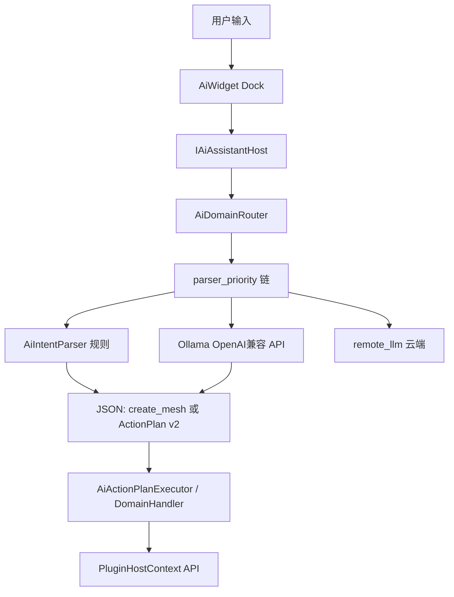

# CloudSimAiSDK 开发指南

## 1. 定位

| 组件 | 说明 |
|------|------|
| **CloudSimAiSDK.dll** | 稳定 ABI：接口、DTO、领域 ID |
| **CloudSimPluginHost**（编入 `Widget.dll`） | `AiAssistantHostImpl`、规则/本地/远程解析、执行器 |
| **AiWidget.dll** | AI 助手 Dock UI，经 `IAiAssistantHost` 调用宿主 |
| **tools/ai-training/** | 离线训练与 `ai_config` 说明（不在 exe 内执行训练） |

宿主通过 `IPluginHostContext::aiAssistantHost()` 获取助手（**PluginHost 版本 ≥ 1.3.0**）。

---

## 2. 架构与数据流



**解析顺序**（`domains[].parser_priority` 或全局 `parser_priority`）：

1. **rules** — 零模型，适合「生成/创建 + 长方体/圆柱 + 尺寸」
2. **local** — `domains[].base_url` + `domains[].model`（默认 Ollama）
3. **remote** — `remote_llm`（可选）

---

## 3. 核心接口

| 头文件 | 说明 |
|--------|------|
| `IAiAssistantHost.h` | `parseUserTextAsync`、`executeActionPlan`、`loadConfig` / `saveConfig` |
| `IAiDomainHandler.h` / `IAiDomainRegistry` | 分域注册、`validateOutput`、`execute` |
| `ICloudSimAiPlugin.h` | 外部 AI 插件（`capabilities: ai-assistant`） |
| `AiConfigDto.h` | 与 `ai_config.json` 对应 |
| `AiDomainTypes.h` | `AiDomainIds::*`、`AiDomainOutputKind` |

---

## 4. 配置大模型（运行时）

### 4.1 配置文件位置

- 路径：**与 `CloudSim.exe` 同目录** 的 `ai_config.json`
- 模板：[`src/App/CloudSim/ai_config.defaults.json`](../App/CloudSim/ai_config.defaults.json)
- 字段详解：[`tools/ai-training/CONFIGURATION.md`](../../tools/ai-training/CONFIGURATION.md)

### 4.2 快速开始（8GB 显存 + Ollama）

1. **部署 Ollama**（推荐 `D:\Project\VSprogram\Ollama`，见该目录 `README.md`）
2. **拉取模型**：`qwen2.5:3b`、`qwen2.5vl:3b`
3. **确认 API**：`http://127.0.0.1:11434/v1`（`status-ollama.ps1`）
4. **启动 CloudSim**：首次运行生成 `ai_config.json`（或使用模板）
5. **AI 助手**：领域选「创建网格」或「自动」，例如  
   - `生成长方体`（无尺寸 → 默认 100×100×100 mm，走 **rules**）  
   - `生成长方体，长宽高为100,100,200`（带尺寸，走 **rules**）  
   - `生成大一点的圆柱`（口语 → **local** 专模，可选 `cloudsim-mesh:3b`）

### 4.3 分域专模（domains[]）

每个业务场景独立配置 **模型名** 与 **解析链**：

```json
{
  "id": "mesh.create",
  "base_url": "http://127.0.0.1:11434/v1",
  "model": "qwen2.5:3b",
  "parser_priority": ["rules", "local"]
}
```

更换自训练模型时，只需把 `model` 改为 `ollama create` 的名称（见下文训练章节）。

### 4.4 UI 设置对话框

AiWidget **设置** 可编辑 `remote_llm`（云端 API）。分域 `domains[]` 建议直接编辑 `ai_config.json`。

### 4.5 环境变量（Ollama）

| 变量 | 推荐值 |
|------|--------|
| `OLLAMA_MODELS` | `D:\Project\VSprogram\Ollama\models` |
| `OLLAMA_MAX_LOADED_MODELS` | `1`（8GB 显存） |

---

## 5. 训练大模型（离线）

训练 **不在 CloudSim 内执行**，统一在仓库外完成：

**[`tools/ai-training/README.md`](../../tools/ai-training/README.md)**

摘要步骤：

| 步骤 | 内容 |
|------|------|
| 1 | 在 `tools/ai-training/domains/<id>/dataset.jsonl` 编写样本 |
| 2 | 用 LLaMA-Factory 等对基座做 QLoRA（mesh → Qwen2.5-3B；识别 → Qwen2.5-VL-3B） |
| 3 | `ollama create <name> -f Modelfile` 注册到 Ollama |
| 4 | `ai_config.json` → `domains[].model = "<name>"` |
| 5 | CloudSim 验证 |

**训练集是否删除？** 不要删除 `tools/ai-training/domains/<id>/dataset.jsonl`（版本化金标，便于复训与 `build_dataset.py` 校验）。仅清理训练机上的 `saves/`、临时 GGUF 等产物。详见 [`tools/ai-training/README.md`](../../tools/ai-training/README.md) §2.1。

**mesh.create 缺省尺寸：** 运行时由 `AiMeshDefaults` + `ai_config.json` 的 `mesh_create_defaults` 补全；训练样本中「无尺寸」句的 `output` 须写出完整 `dimensions_mm`（与默认表一致）。专模部署见 [`domains/mesh.create/README.md`](../../tools/ai-training/domains/mesh.create/README.md)。

数据集 `output` 格式：

- **mesh.create**：`{"version":1,"action":"create_mesh","primitive":"box","dimensions_mm":{...}}`
- **geometry.recognize**：`{"primitive":"box","label":"...",...}`

---

## 6. 功能模块接模（四步）

新业务能力按 **新 Domain** 扩展，勿把无关任务塞进 `mesh.create` 专模。

| 步骤 | 交付物 |
|------|--------|
| 1 | `domain_id` + 在 ApiCatalog 为 API 标注 `"domains":["xxx"]` |
| 2 | 实现 `IAiDomainHandler`：`validateOutput` + `execute` |
| 3 | `domainRegistry()->registerDomain(...)`（宿主启动或 `ICloudSimAiPlugin::initializeAi`） |
| 4 | `tools/ai-training/domains/<id>/` 训练 + `ai_config.domains[]` |

**输出类型：**

- 编排类（创建、导入）→ `AiDomainOutputKind::ActionPlan` → `AiActionPlanExecutor`
- 识别类 → `StructuredJson` → 专用 Handler

### 内置 Domain

| domain_id | 模型（默认） | 输出 |
|-----------|--------------|------|
| `mesh.create` | qwen2.5:3b | ActionPlan / create_mesh v1 |
| `mesh.compose` | qwen2.5:3b | ActionPlan v2（`steps[]` + `booleanMesh`） |
| `geometry.recognize` | qwen2.5vl:3b | StructuredJson → 可转 ActionPlan |
| `trajectory.feature` | qwen2.5:3b（建议） | StructuredJson：`selectedCandidateIds` + `features[]` + `suggestedPipelineTemplate` |

**geometry.recognize 运行时数据流（V1）：**

1. AI 面板选「几何识别」→ `AiAssistantCoordinator` 经 `IPluginHostContext::captureActiveViewportPng` 截取活动文档 OSG 视口（768 边长 PNG）。
2. `AiInferenceRequest.imagePng` 送入 `AiLlmClient`（OpenAI 兼容 vision API）。
3. 解析成功后在对话区展示 `primitive` / `label` / `dimensions_mm` / `confidence`，**不自动改场景**。
4. 用户点「创建基本体」→ `executeDomainOutput(geometry.recognize, …)` → `GeometryRecognizeDomainHandler` → `createPrimitiveMesh`。
5. 无视口或 `imagePng` 为空时 fail-fast，提示打开含 3D 视口的文档。

训练集生成：`python tools/ai-training/scripts/gen_geometry_recognize_dataset.py`（默认每类 15 条，共 60 PNG + `dataset.jsonl`）。校验：`python tools/ai-training/scripts/build_dataset.py geometry.recognize`。

**trajectory.feature 运行时（V1）：**

1. 用户在 AI 面板选「轨迹特征」；**须**在轨迹生成页 combo 已选 STEP 工件。
2. `AiAssistantCoordinator::prepareTrajectoryFeatureRequest` 注入 `catalogFullUtf8` / `catalogSliceUtf8`；轨迹页自动 `ensureFeatureCatalogEnumerated`。
3. 解析链 `["rules","local"]`（可选 `remote`）：rules 走 `parseTrajectoryFeatureRequest`；LLM user 消息含 catalog 切片 JSON。
4. 成功 → 3D **全部**候选编号高亮（`showAiFeatureCandidatePreview`）+ Dock「确认并离散」。叠加坐标：`buildPreviewOverlayJson` → `feature_pick_transform::stepModelPointToWorldMm`（与 BREP 拾取同规则：pick alias + `skipInnerModelCenterRebase`）。
5. 用户「选 1 和 3」→ `filterCatalogSliceByCandidateIds` → 3D **仅**选中项高亮；可多次调整编号。
6. 「确认并离散」→ `commitAiTrajectoryFeatures` → `discretizeFeature` + 默认工艺 pipeline 写入 `TrajectoryEditSession`。
7. catalog 为空或 LLM 未收到 catalog 时，Coordinator **一次** rules 自动重试。

**详细架构、状态机、源文件索引：** [`docs/trajectory_feature_ai.md`](../../docs/trajectory_feature_ai.md)

**trajectory.feature 契约示例：**

```json
{
  "version": 1,
  "featureAxis": "line",
  "selectedCandidateIds": ["edge_3"],
  "features": [
    { "kind": "EdgeChain", "featureId": "edge_3", "refs": { "edgeIndices": [3] }, "discretize": { "stepMm": 5 } }
  ],
  "suggestedPipelineTemplate": "weld_default"
}
```

LLM grounding：`catalogSliceUtf8` 中 `displayIndex` / `candidateId` / `summary`。规则回退：`AiTrajectoryFeatureCatalog::tryParseTrajectoryFeatureRules`（内部 `suggestFeaturesFromCatalog`）。

宿主 API：`createPrimitiveMesh`（可选返回 `backendId`）、`booleanMesh`（CGAL 差/并/交）。

---

## 7. 外部 AI 插件

- 接口：`ICloudSimPlugin` + `ICloudSimAiPlugin`（见 `ICloudSimAiPlugin.h`）
- 清单：`capabilities: ["ai-assistant"]`，`minHostVersion: "1.3.0"`，`minAiSdkVersion: "1.0.0"`
- 参考实现：`src/Plugins/HelloAiPlugin/`（未编入 `CloudSim.sln`，需单独打开 vcxproj 构建）

---

## 8. 调试与常见问题

| 现象 | 原因 / 处理 |
|------|-------------|
| 轨迹特征编号/红边相对模型偏移 | 须用当前 `feature_pick_transform`（`resolvePickScopeBackendId` + `backendSkipsInnerModelCenterRebase`）；BREP 装配子件无 Geode 时 alias 须指向 `importParent`；见 [`RobotWidget/DEVELOPER_GUIDE.md`](../../UI/RobotWidget/DEVELOPER_GUIDE.md) §CAD 轨迹生成 |
| 输入后完全无反应 | 旧版未绑定 `IAiAssistantHost`；需 `loadPlugins` 后 `refreshAiAssistantHost` |
| 闲聊崩溃 | 已修复悬空指针与跨线程 UI；请用最新 `Widget.dll` |
| 创建句无模型仍可用 | `rules` 解析成功，不访问 Ollama |
| LLM 超时 | 检查 Ollama 是否运行、`base_url`、防火墙 |
| 执行失败 | 看助手与 RunInfo 报错；JSON 须符合 schema |

**日志：** `%LOCALAPPDATA%\Ollama\logs\`（Ollama）、CloudSim 运行输出页。

---

## 9. 文档索引

| 文档 | 内容 |
|------|------|
| [`tools/ai-training/CONFIGURATION.md`](../../tools/ai-training/CONFIGURATION.md) | `ai_config.json` 全字段 |
| [`tools/ai-training/README.md`](../../tools/ai-training/README.md) | 训练、LLaMA-Factory、Ollama 导出 |
| [`ARCHITECTURE_SUMMARY.md`](../../ARCHITECTURE_SUMMARY.md) §6.1.1 | 产品级流程说明 |
| [`docs/trajectory_feature_ai.md`](../../docs/trajectory_feature_ai.md) | AI 轨迹特征端到端、状态机、验收 |
| [`CloudSimPluginHost/DEVELOPER_GUIDE.md`](../../UI/CloudSimPluginHost/DEVELOPER_GUIDE.md) | 宿主 API 与插件 |
