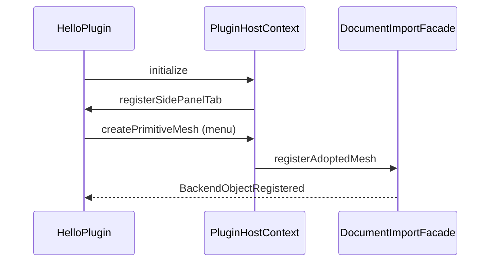

# HelloPlugin 示例

官方最小插件，演示 **仅链接 `CloudSimPluginSDK.dll`** 时如何扩展 UI 并创建网格。

## 构建与部署

| 项 | 说明 |
|----|------|
| 工程 | `HelloPlugin.vcxproj`（x64，v142，Qt 5.14.2） |
| 链接 | `CloudSimPluginSDK.lib`（**不要**链接 `Widget` / `CloudSimHost`） |
| 部署 | `bin/x64(d)/plugins/com.cloudsim.hello/plugin.json` + `HelloPlugin.dll` |

清单见 [`plugin.json`](plugin.json)：`minHostVersion` 须 ≤ 宿主 `hostVersion()`。

## 运行时行为

| 步骤 | 代码位置 |
|------|----------|
| 侧栏页签 | `HelloDockWidget` + `registerSidePanelTab` |
| 活动文档对象数 | `IPluginDocument::backendObjectCount()` |
| 菜单创建立方体 | `Tools → Hello → Insert Test Box` → `createPrimitiveMesh` |
| 文档切换刷新 | `onActiveDocumentChanged` → `refreshBackendCount` |
| 退出 | `shutdown` → `unregisterSidePanelTab` |

`createPrimitiveMesh` 在宿主内转为 `DocumentImportFacade::registerAdoptedMesh`（注册 Data + 加载 OSG + 刷新后端树）。

## 扩展自己的插件

1. 复制本目录或从 [`CloudSimPluginSDK/DEVELOPER_GUIDE.md`](../CloudSimPluginSDK/DEVELOPER_GUIDE.md) 的 `ICloudSimPlugin` 模板开始。
2. 重命名 `plugin.json` 的 `id` / `library`。
3. 重 CPU：用 `IPluginHostContext::enqueueJob`，在 `onFinished`（UI 线程）调 SDK API。
4. 导入文件：用 `importFileIntoActiveDocument(pathUtf8, isPointCloud)`。
5. 宿主实现说明：[`CloudSimPluginHost/DEVELOPER_GUIDE.md`](../../UI/CloudSimPluginHost/DEVELOPER_GUIDE.md)。

## 相关文档

- SDK 契约：[`../CloudSimPluginSDK/DEVELOPER_GUIDE.md`](../CloudSimPluginSDK/DEVELOPER_GUIDE.md)
- 架构 §10：[`../../ARCHITECTURE_SUMMARY.md`](../../ARCHITECTURE_SUMMARY.md)
